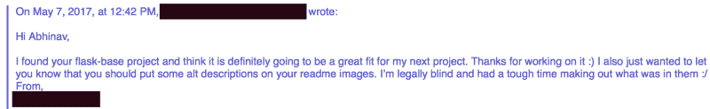
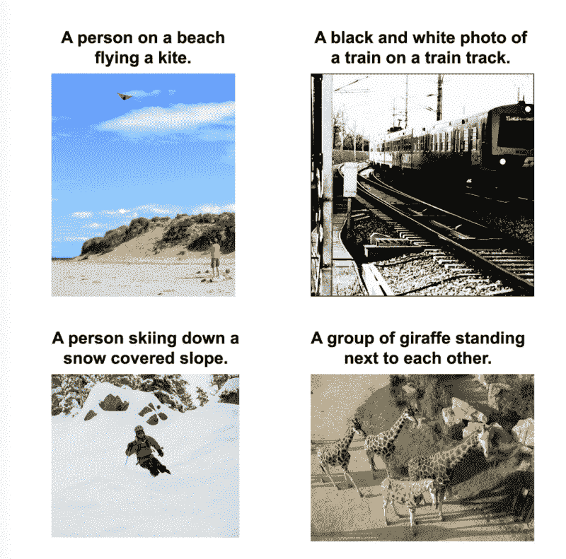
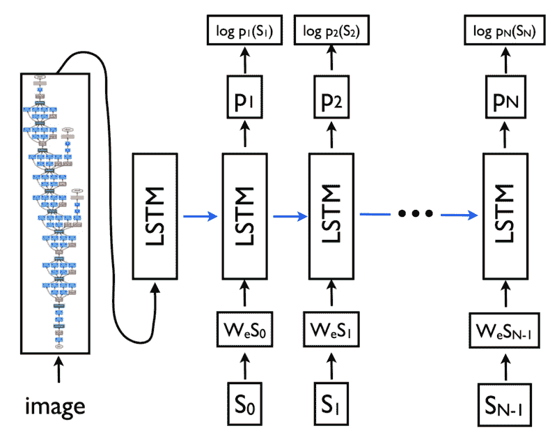
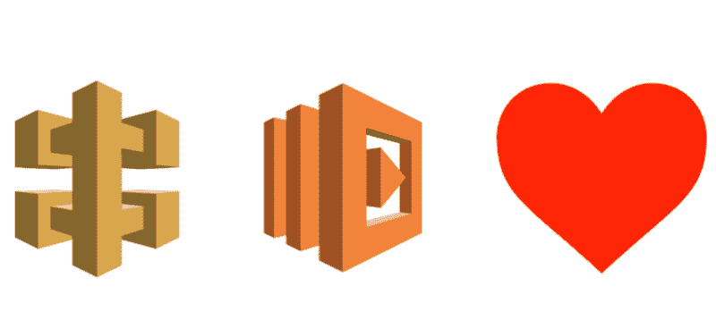
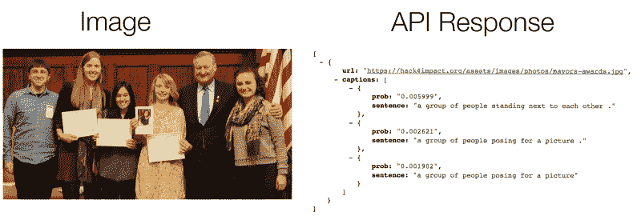
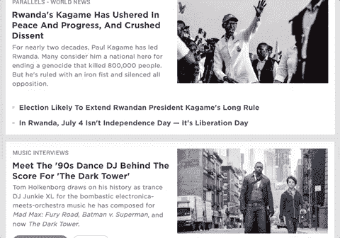
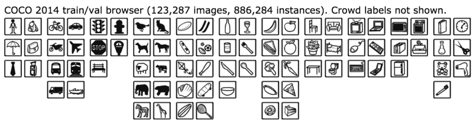

# 用人工智能让网络更易访问

> 原文：<https://www.freecodecamp.org/news/making-the-web-more-accessible-with-ai-84598eebabdb/>

大多数人认为互联网是一个充满文本、图像和视频的地方。但是对于视力受损的人来说，互联网是完全不同的东西。

屏幕阅读器，即读取网页上的文本和元数据的工具，是有限的。它们只显示网页的一个方面，即网站上的文字。一些开发人员确实给他们的图片添加了描述性的标题，但是绝大多数都没有。

根据世界卫生组织的数据，世界上大约有 2 . 85 亿人有视力障碍。仅在美国，就有 810 万使用互联网的人患有视觉障碍。

于是，我做了一个工具，借助人工智能的力量，帮助视障人士“看见”互联网。我把它命名为 Auto Alt Text。这是一个 Chrome 扩展，用户只需右击图片就可以获得图片的描述。这是它的第一次扩展。

看看下面的视频，看看它是如何工作的。

您也可以通过在此下载[来尝试自动替换文本。](http://www.abhinavsuri.com/aat/)

### 为什么我做了自动修改文本

我曾经是那些不给网页图片添加描述的开发者之一。易接近性对我来说总是第二个想法。直到我收到以下关于我的一个项目的邮件。

Email Text: “Hi Abhinav, I found your flask-base project and think it is definitely going to be a great fit for my next project. Thanks for working on it. I also just wanted to let you know that you should put some alt descriptions on your readme images. I’m legally blind and had a tough time making out what was in them :/ From REDACTED”

在那之前，我把可访问性放在我的任务清单的底部。这是事后的想法。但是这封邮件给我敲响了警钟。许多人需要辅助功能来使用 web、应用程序、项目等。

> “网络上充斥着缺少、不正确或糟糕的替代文本的图像”——web aim(犹他州立大学残疾人中心)

### 人工智能拯救世界

有很多方法可以给图片添加说明。然而，大多数都有这些缺点:

*   他们没有反应，需要很长时间来返回一个标题。
*   它们是半自动的。他们依靠人类手动给图像添加说明。
*   创建和维护它们的成本很高。

通过创建神经网络，可以解决这些问题。

我最近开始钻研机器学习和人工智能。那是我偶然发现 Tensorflow 的时候。TensorFlow 是一个帮助机器学习的开源库。Tensorflow 允许开发人员构建健壮的模型，这些模型可以完成从对象检测到图像识别的各种任务。

偶然看到了一篇论文《Vinyals， [Toshev](https://arxiv.org/find/cs/1/au:+Toshev_A/0/1/0/all/0/1) ， [Bengio](https://arxiv.org/find/cs/1/au:+Bengio_S/0/1/0/all/0/1) ，[尔汗](https://arxiv.org/find/cs/1/au:+Erhan_D/0/1/0/all/0/1) (2016)叫做“[展示与讲述:2015 年 MSCOCO 图像字幕挑战赛的经验教训](https://arxiv.org/abs/1609.06647)”。这些研究人员创建了一个神经网络，以语义的方式描述图像的内容。

Examples of images and their resulting alt text descriptions — im2txt in action — from the [im2txt Github Repository](https://github.com/tensorflow/models/tree/master/im2txt)

### im2txt 的技术细节

该模型的机制是详细的。但它基本上是一种编码器-解码器方案。首先，将图像通过一个名为 Inception v3 的深度复杂神经网络，该网络对图像进行分类。

接下来，编码图像通过 LSTM(长短期记忆)传送，这是一种专门对序列/时间敏感信息进行建模的神经网络。

然后，LSTM 通过一套词汇，创造一个句子来描述图像。它通过计算一组词汇中的每个单词在句子中出现的可能性来做到这一点。然后，它根据第一个单词计算第二个单词的概率。这种情况一直持续到最有可能的字符是句号。这表示标题的结尾。

An overview of the structure of the neural network (from the [im2txt Github repository](https://github.com/tensorflow/models/tree/master/im2txt))

根据 Github 知识库，在特斯拉 k20m GPU 上训练这个神经网络需要一到两周的时间(对于笔记本电脑上的标准 CPU 来说可能要多得多)。幸运的是，Tensorflow 社区的一名成员提供了一个经过训练的模型供公众下载。

### 开箱即用的问题+ Lambda

当我运行这个模型时，我设法让它和 Bazel 一起工作。Bazel 是一个将 Tensorflow 模型预打包到脚本中的工具(还有其他用途)。然而，获得一幅图像的结果需要 15 秒。这是我在命令行上运行它的时候！解决这个问题的唯一方法是将张量流图保存在内存中。然而，这需要应用程序全天候运行。

我想把这个模型放在 AWS Elastic Beanstalk 上，那里的处理时间是按小时分配的，但是让一个应用程序一直运行并不理想(字幕软件的第三个缺点)。所以，我决定转投 AWS Lamdba。

AWS Lambda 是一项以极低的成本提供无服务器计算的服务。它在使用时按秒计费。

AWS Lambda 是这样工作的:你的应用程序从用户那里得到一个请求，然后 AWS Lambda 激活你的应用程序的一个图像。然后，它提供一个响应，并停用该图像。如果您同时有多个请求，它会自我升级以管理多个请求。

此外，只要在一小时内有多个请求，它就会保持您的应用程序处于激活状态。这项服务非常适合我的用例。

AWS API Gateway + AWS = heart ([src](https://cdn-media-1.freecodecamp.org/images/1*SzOPXTf_YQNtFejG0e4HPg.png))

AWS Lambda 的问题是我必须为 im2txt 模型创建一个 API。AWS Lamdba 对可以作为函数加载的应用程序有内存限制。当您上传包含应用程序代码和依赖项的. zip 文件时，该文件不能超过 250 MB。这个限制是个问题，因为我的 im2txt 型号超过了 180 MB。使它能够运行的依赖项超过 350 MB。AWS Lambda 上的总存储限制是 512 MB。我的申请超过了这个限额。大约是 530 MB。

为了减小项目的规模，我重新配置了 im2txt 以接受一个精简的模型。这将大小减少到 120 MB。然后我发现了 [Lambda-packs](https://github.com/ryfeus/lambda-packs) ，它包含了所有依赖项的最小化版本，但是使用了早期版本的 Python 和 Tensorflow。在降级 Python 3.6 语法和 Tensorflow 1.2 代码后，我终于有了一个 480 MB 的包，刚好低于 512 MB 的限制。

为了保持快速响应，我创建了一个 CloudWatch 函数来保持 AWS Lambda 实例和应用程序处于活动状态。我添加了一些辅助函数来处理非 JPG 格式的图像。我终于有了一个可用的 API。这些减少导致了极快的响应时间。大多数情况下不到五秒钟。

Image with likely probabilities of what is in the image according to the API

此外，AWS Lambda 便宜得令人难以置信。目前，我每个月可以免费分析 60，952 张图像。并且每个额外的图像花费 0.0001094 美元(对于下一个 60，952 个图像的**大约是 6.67 美元)。**

有关 API 的更多详情，请点击[此处](https://github.com/abhisuri97/auto-alt-text-lambda-api)。

剩下的就是将它打包到 Chrome 扩展中，以便于最终用户使用。这并不太具有挑战性。它涉及到对我的 API 端点的一个简单的 AJAX 请求。

Auto Alt Text Chrome Extension in action

### 结果

Im2txt 在包含人物、风景和任何出现在通用对象上下文(COCO)数据集中的对象的图像上表现良好。COCO 中的图像示例如下图所示。

Categories of images in the COCO dataset

上述模型限制了标题的范围。但它确实涵盖了脸书和 Reddit 等社交媒体网站上的大多数图片。

然而，它通常不能为包含文本的图像添加标题。这是因为 COCO 数据集不包含这样的图片。我尝试使用 Tesseract 来完成这项任务，但是结果并不准确，而且耗时太长(每张图片超过 10 秒)。我目前正试图在 Tensorflow 中实现王、吴、科茨和 Nget 的论文中讨论的想法，以捕捉包含文本的图像。

### 外卖食品

每周都有关于人工智能奇迹的新故事被写出来。但是，重要的是要看到这些工具如何在研究之外使用，以便它们能够帮助人们。总的来说，我喜欢用 im2txt 深入 Tensorflow，并应用我所学到的知识来帮助解决现实世界的问题。希望这个工具将是第一个帮助视障人士看到更好的互联网的工具。

### 链接

*   跟我来。我大多在[媒体](https://medium.com/@abhisuri97)上发表。如果你喜欢这篇文章，如果你能关注我，我将不胜感激。:)在接下来的几个月里，我将发布更多“如何”使用 AI/Tensorflow 解决现实世界问题的指南。在不久的将来，我也会发布 JavaScript 教程。
*   要查看 Chrome 扩展，[点击这里](http://abhinavsuri.com/aat)。
*   要查看 Auto Alt Text Lambda API Github 知识库，[点击这里](http://github.com/abhisuri97/auto-alt-text-lambda-api)。