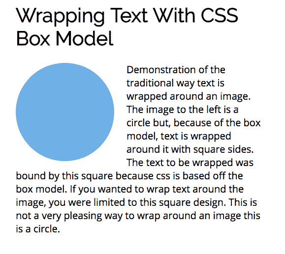
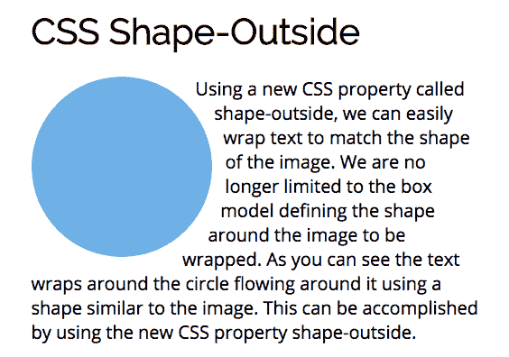
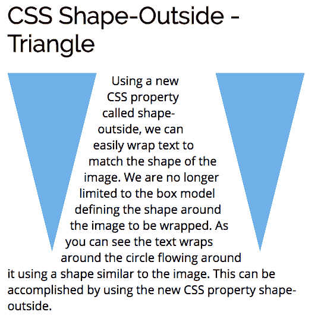

# 用 CSS 形状跳出框框思考——外部

> 原文：<https://www.freecodecamp.org/news/mastering-css-series-shape-outside-44d626270b25/>

CSS 是基于盒子模型的。如果您的图像是一个要让文本环绕的圆，文本将环绕图像的边界框。



### 形状-外部

一个名为 shape-outside 的新 CSS 属性允许您根据图像的形状换行。



### 什么是外形

Shape-outside 是一个新的 CSS 属性，它改变被包装的项目的形状。shape-outside 允许我们调整内容以适应图像，而不是局限于图像周围的矩形边界框。

MDN 是这样描述外形的:

> **shape-outside** [CSS](https://developer.mozilla.org/en-US/docs/Web/CSS) 属性使用 shape 值来定义浮动的浮动区域，并将导致内嵌内容环绕该形状，而不是浮动的边界框。

该描述中最重要的一点是，这个新属性适用于使用浮点的图像。CSS shape-outside 属性控制文本如何环绕任何浮动图像。被换行的文本可以是圆形、椭圆形、矩形或多边形。

### 使用形状-外部

shape-outside 属性采用“基本形状”并对其应用形状函数。shape 函数用于改变形状浮动区域的形状。CSS shape-outside 属性提供了创建这些形状函数的功能:

*   圆
*   椭圆
*   多边形
*   矩形
*   全球资源定位器(Uniform Resource Locator)

可以用这些值来定位图像。这些值被附加到末尾:

*   边距框
*   填充盒
*   边框

图像必须具有内在尺寸。您必须设置元素的高度和宽度。shape 函数将使用它来创建一个在图像周围环绕文本时使用的坐标系。

### 圆

Circle()是 shape-outside 提供的功能值之一。circle()的完整符号是 ***circle(r 在 cx cy)*** 其中 r 是圆的半径，cx 和 cy 是圆心的坐标。如果忽略它们，图像的中心将被用作默认值。

下面是一个在圆上使用 shape-outside 的示例:


```
.circle {    height: 200px;    width: 200px;    border-radius: 50%;    background-color: #7db9e8;    margin: 0 25px 5px 0;    float: left;    -webkit-shape-outside: circle();    shape-outside: circle();}
```

### 椭圆

椭圆是圆形的变体，其中项目在水平轴或垂直轴上被拉长。椭圆()的完整符号是 ***椭圆(rx ry at cx cy)*** 其中 rx 和 ry 是椭圆的半径，cx 和 cy 是椭圆中心的坐标。

以下是在椭圆上使用形状外部的示例:


```
.ellipse {    width: 100px;    height: 200px;    border-radius: 50%;    background-color: #7db9e8;    margin: 0 25px 5px 0;    float: left;    -webkit-shape-outside: ellipse(50px 100px at 50% 50%);    shape-outside: ellipse(50px 100px at 50% 50%);}
```

### 多边形

多边形功能提供了无限范围的形状。polygon()的完整符号是 ***polygon(x1 y1，x2 y2，…)*** ，其中每一对指定多边形顶点的 x-y 坐标。要使用 polygon()函数，您必须指定至少 3 对顶点。

多边形与裁剪路径一起使用。clip-path CSS 属性创建一个剪辑区域，定义应该显示元素的哪一部分。区域内的任何内容都将显示，而区域外的内容都将隐藏。

下面是一个使用 shape-outside 创建两个三角形形状以及文本在它们之间流动的示例:



```
.leftTriangle {    width: 150px;    height: 300px;    background-color: #7db9e8;    margin: 0 25px 5px 0;    float: left;    -webkit-clip-path: polygon(0% 0%, 100% 0%, 50% 100%);    clip-path: polygon(0% 0%, 100% 0%, 50% 100%);    -webkit-shape-outside: polygon(0% 0%, 100% 0%, 50% 100%);    shape-outside: polygon(0% 0%, 100% 0%, 50% 100%);}.rightTriangle {    width: 150px;    height: 300px;    background-color: #7db9e8;    margin: 0 0 5px 25px;    float: right;    -webkit-clip-path: polygon(0% 0%, 100% 0%, 50% 100%);    clip-path: polygon(0% 0%, 100% 0%, 50% 100%);    -webkit-shape-outside: polygon(0% 0%, 100% 0%, 50% 100%);    shape-outside: polygon(0% 0%, 100% 0%, 50% 100%);}
```

### 浏览器支持

CSS shape-outside 主要由 Chrome、Opera 和 Safari 支持。


### 获取代码

所有例子的代码都可以在 [my github repo here](https://github.com/ratracegrad/mastering-css-series-shape-outside) 中找到。

### 更多文章

感谢阅读我的文章。如果你喜欢，请点击下面的拍手图标，这样其他人就会找到这篇文章。以下是我的一些文章，你可能会感兴趣:

[这里有 5 种布局，你可以用 FlexBox](https://medium.com/@ratracegrad/here-are-5-layouts-that-you-can-make-with-flexbox-6ca1e941f33d)
[在 JavaScript 中广度优先搜索](https://medium.com/@ratracegrad/breadth-first-search-in-javascript-e655cd824fa4)
[在 JavaScript 中实例化模式](https://medium.com/dailyjs/instantiation-patterns-in-javascript-8fdcf69e8f9b)