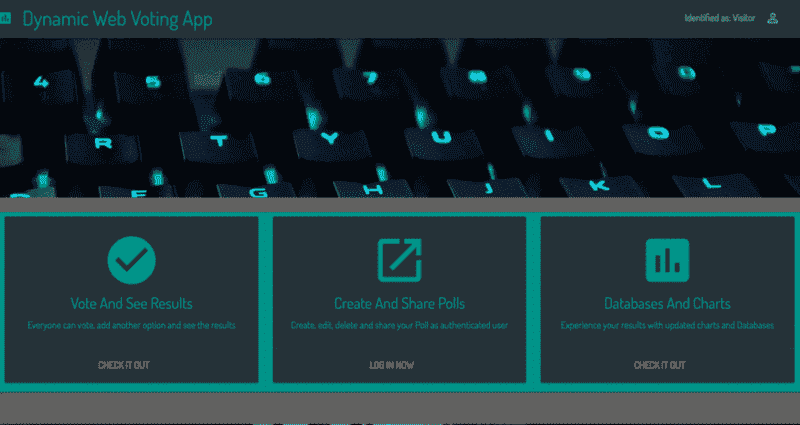

# 如何构建 freeCodeCamp 投票应用项目——深入教程

> 原文：<https://www.freecodecamp.org/news/building-the-free-codecamp-voting-app-1a6fdce1f4a8/>

丹尼尔·多伊奇

# 如何构建 freeCodeCamp 投票应用项目——深入教程


[Photo by Johannes Plenio on Unsplash](https://unsplash.com/photos/OwMTchwUTNw)

freeCodeCamp 上的投票应用程序挑战是课程中第一个让我印象深刻的 freeCodeCamp 项目。我只是不能像其他挑战一样轻松完成。构建它需要这么多概念的知识。

我没有找到任何教程或例子用最新的工具来打破这个挑战。所以我决定记录我建造它的过程。

在本教程中，将使用:

*   MongoDB
*   表达
*   反应+还原
*   节点. js

也被称为“MERN 烟囱”。



Functionality of the app

> “我不怕一次练一万次的人，但我怕一次练一万次的人。”

> *—李小龙*

### 这篇文章是关于什么的

我将描述为 [freeCodeCamp challenge](https://www.freecodecamp.com/challenges/build-a-voting-app) 构建投票应用程序的过程。

这不是构建应用程序的优化示例。我欢迎任何形式的反馈。我仍然是一个初学者，也留下了一些东西开放。

这不是作为教程设计的！这只是我在构建应用程序时写的一个文档。

### 结构

我将这篇文章分成后端、前端、数据可视化和部署过程几个部分。该项目将在 GitHub 上以开源代码的形式提供。这是您可以跟进提交和最终结果的地方。

### 发展环境

*   普通的 JavaScript 代码
*   [Node.js](https://nodejs.org/en/)
*   [快递](https://expressjs.com/) (JS 框架)
*   [MongoDB](https://mlab.com/) (数据库)
*   [纱线](https://yarnpkg.com/en/)(包装管理)
*   [Visual Studio](https://code.visualstudio.com/) 代码作为编辑器
*   [邮递员](https://www.getpostman.com/)(测试 API)
*   Robomongo / Robo 3T (使用 MongoDB 工作更快)

### 软件包/功能/依赖性

#### 一般

*   ( [ES 6](http://es6-features.org/) (JS 脚本语言规范))
*   带有 Airbnb 扩展的 eslint (用于编写更高质量的代码)
*   [nodemon](https://github.com/remy/nodemon) (发生变化时重启服务器)
*   [巴别塔](https://babeljs.io/) (javascript 编译器)
*   [网络包](https://webpack.github.io/)(模块捆绑器/构建器)
*   [dotenv](https://www.npmjs.com/package/dotenv) (用于配置环境变量)
*   [shortid](https://github.com/dylang/shortid) (随机 id 生成器)

### 后端

*   [Node.js](https://nodejs.org/) (服务器端 js 运行环境)
*   MongoDB (基于文档的数据库)
*   [connect-mongo](https://github.com/jdesboeufs/connect-mongo) (用于在 MongoDB 中存储会话)
*   [主体解析器](https://github.com/expressjs/body-parser)(用于解析传入的请求)
*   [express](http://expressjs.com/de/) (使应用程序运行)
*   [mongose](http://mongoosejs.com/docs/)(简化与 MongoDB 交互的对象数据建模)
*   [摩根](https://www.npmjs.com/package/morgan) (HTTP 请求记录器中间件)
*   [passport](http://passportjs.org/)(node . js 的认证中间件)

### 前端

*   [反应](https://facebook.github.io/react/) (JS 框架)
*   [Redux](http://redux.js.org/docs/introduction/)(React 的状态管理)
*   [还原 Thunk](http://redux.js.org/docs/introduction/) (异步还原)
*   [物化 CSS](http://materializecss.com/) (材质设计框架)
*   [反应路由器](https://github.com/ReactTraining/react-router)(前端路由)

### 形象化

*   [React 谷歌图表](https://www.npmjs.com/package/react-google-charts)(谷歌图表的 React 包装器)
*   [谷歌图表](https://developers.google.com/chart/)(用于可视化数据)

### 部署/开发运维

*   Heroku (在云中运行应用的平台即服务)
*   (单元)测试:在这个应用程序中没有实现(但通常应该实现)

### 重要的事情先来

首先，我将设置我的环境:

*   为版本控制添加 [Git](https://git-scm.com/)
*   用 [yarn init](https://yarnpkg.com/lang/en/docs/cli/init/) 创建您的包管理
*   添加 [express](http://expressjs.com/en/starter/installing.html) 进行快速的 web 开发
*   添加 [nodemon](https://nodemon.io/) 包，用于在发生变化时重启服务器
*   为您的 [eslint](https://eslint.org/) 配置添加 eslint.rc
*   添加[巴别塔](https://babeljs.io/)和相应的编译 JS 的插件

作为附加集成，我将使用:

*   [Travis CI](https://travis-ci.org/) (用于持续集成)
*   [代码环境](https://github.com/codeclimate/codeclimate)(代码质量)
*   [可断言的](https://assertible.com/)(监控 Web 服务，尤其是检查部署——质量保证)

这是我在设置完成后在 GitHub 上的提交。

### 后端

对我来说，后端是最难的。那就是我要开始的地方。

#### 设置包、中间件和 Mongoose

我将使用:

*   [主体解析器](https://github.com/expressjs/body-parser)用于解析请求主体
*   [morgan](https://www.npmjs.com/package/morgan) 用于注销 HTTP 请求
*   [压缩](https://www.npmjs.com/package/compression)用于压缩响应体
*   [头盔](https://www.npmjs.com/package/helmet)用于设置 HTTP 头的基本安全
*   用于异步数据库连接的对象建模工具

#### 后续步骤:

*   创建一个**常量**文件来设置您不同的环境变量和相应的设置
*   创建一个 **middlewar** e 文件，将中间件传递到你的应用程序中，并区分不同的环境。在这里使用 **bodyparser** 和 **morgan** 包。
*   创建一个**数据库**文件来设置 mongoDB 连接
*   模块化你的代码，外包你的常量，中间件和数据库连接。这是为了保存较小的文件。
*   导入你的 **app.js** 文件中的所有内容，传入`middleware`函数，用一个简单的`http`请求测试你的设置

这是我在设置后在 GitHub 上提交的内容。

#### 设置您的路线

重温用户故事，并相应地规划您的路线。

遵循[积垢方法](https://en.wikipedia.org/wiki/Create,_read,_update_and_delete):

作为未经验证的用户，我希望:

*   查看所有投票(R)
*   参见个人调查(R)
*   对可用的投票进行投票(C)

作为经过身份验证的用户，我希望

*   查看和阅读所有投票(R)
*   参见个人调查(R)
*   对可用的投票进行投票(C)
*   创建新的投票(C)
*   创建新的选项和投票(C)
*   删除投票(D)

因此:

*   将[错误处理设置为中间件](http://expressjs.com/en/guide/error-handling.html)
*   设置您的[路由器对象](http://expressjs.com/en/4x/api.html#router)
*   用 JSON 对象创建您的 GET、POST、DELETE [routes](https://expressjs.com/en/guide/routing.html) 和 response
*   用[邮递员](https://www.getpostman.com/docs/postman/sending_api_requests/requests)测试设置的路线(所有路线都应该有状态码 200)
*   [将您的路线](http://expressjs.com/en/guide/using-middleware.html)连接到您的中间件和 app.js

#### 设置 Mongoose 和您的模式，并将所有内容连接到您的路线

在设置模式时，要考虑如何组织将要存储在数据库中的文档。在这个例子中，我们需要存储用户的身份验证过程和答案。

对于民意测验，我们需要:

1.  这个问题
2.  答案和投票

*   创建您的[mongose](http://mongoosejs.com/docs/guide.html)模式和模型
*   连接到 [mlab](https://mlab.com/) 以更好地监控您的数据库操作

请注意，MLab 创建“系统集合”当创建新的轮询时，他们在 postman 中抛出“重复键错误索引 dup key: { : null }”错误。直到现在我还没有找到解决方案，但是删除所有收藏让我们可以重新开始。

*   使用 [dotenv](https://www.npmjs.com/package/dotenv) 包在环境中存储您的凭证并添加。环境文件到。gitignore(如果你让你的项目开源)
*   将您的路由与您的 mongoose 模型连接起来，以处理 MongoDB 中的文档

如果你被卡住了，一定要阅读[文档](http://mongoosejs.com/docs/models.html) 。当你没有用 mongoose 和 MongoDB 做过很多的时候，这一部分是相当难的！

[下面是经过这些步骤](https://github.com/DDCreationStudios/votingApp/tree/5dcd7359d2cb1b31e28a08869461b927094550c0)后我在 Github 上提交的内容。

#### 使用 Twitter 建立认证和授权

我想使用 twitter 登录作为一个 [OAuth](https://oauth.net/) 提供者进行身份验证。它提供了更好的用户体验，我也开始探索 OAuth。

OAuth 是一个标准协议，允许用户授权 API 访问 web 和桌面或移动应用程序。一旦授权了访问，授权的应用程序就可以代表用户使用 API。

当然，我找到了关于如何在 Nodejs 中设置认证过程的文章。在我的应用程序中没有正确实现它，花了我一整天的时间后，我决定直接进入护照的[文档！](http://passportjs.org/docs)

我喜欢他们放在那里的名言:

"尽管身份验证很复杂，但代码不必复杂."

再次提醒⭐:阅读文档！

*   在 [twitter 应用](https://apps.twitter.com/)上注册您的应用，并正确设置。确定访问级别和回调 URL
*   将 [passport](http://passportjs.org/) 、 [passport-twitter](https://www.npmjs.com/package/passport-twitter) 和 [express-session](https://www.npmjs.com/package/express-session) 软件包添加到您的应用程序中
*   为 Twitter 创建一个定义 passport 策略的文件
*   为了支持登录会话，passport 必须序列化和反序列化用户
*   将 passport 传递到 passport 配置，并将 passport.initialize 和 passport.session 作为中间件连接到您的应用程序。在此之前使用快速会话！
*   为验证和回拨设置路由

完成这些步骤后，在 Github 上查看我的提交。

之后，将认证过程连接到您的数据库

⭐提示:在你的回拨和测试中总是使用`http://127.0.0.1:3000/`而不是`http://localhost:3000/`，因为它解决了很多问题，这些问题可能会在使用 passport-twitter 时出现。？

*   为用户创建一个 mongoose 模式，以便在数据库中跟踪他们
*   实现 twitter 策略时，填充 passport.js 文件的回调函数。为用户筛选数据库，如果用户不存在，则创建一个新的数据库
*   使用 [connect-mongo](https://www.npmjs.com/package/connect-mongo) 包创建一个 mongoStore 并将您的会话存储在 MongoDB 中
*   创建一个函数来测试用户是否通过了身份验证。当提供足够的授权时，在您期望的路线中实现它

实现可能如下所示:

```
passport.use(		new Strategy(constants.TWITTER_STRATEGY, (req, token, tokenSecret, profile, cb) => {  process.nextTick(() => {    if (!req.user) {      User.findOne({ 'twitter.id': profile.id }, (err, user) => {        if (err) return cb(err);        if (user) {          if (!user.twitter.token) {            user.twitter.token = token;            user.twitter.username = profile.username;            user.twitter.displayName = profile.displayName;            user.save(() => {              if (err) return cb(err);              return cb(null, user);            });          }          return cb(null, user);        }
```

```
 // if no user is found create one        const newUser = new User();
```

```
 newUser.twitter.id = profile.id;        newUser.twitter.token = token;        newUser.twitter.username = profile.username;        newUser.twitter.displayName = profile.displayName;
```

```
 newUser.save(() => {          if (err) return cb(err);          return cb(null, newUser);        });      });    } else {					// when user already exists and is logged in      const user = req.user;
```

```
 user.twitter.id = profile.id;      user.twitter.token = token;      user.twitter.username = profile.username;      user.twitter.displayName = profile.displayName;
```

```
 user.save((err) => {        if (err) return cb(err);        return cb(null, user);      });    }  });}),	);
```

之后，你的 Twitter 认证和授权就完成了。

[下面是经过这些步骤](https://github.com/DDCreationStudios/votingApp/tree/cb96c8b2062f5c634efcba2b258e3ad054799c48)后我在 Github 上提交的内容。

#### 建立本地身份验证和授权

下一步是本地认证。实际上没什么大不了的，因为我们已经设置好了环境。

*   通过定义电子邮件和密码来更新本地用户模式
*   添加用于保护密码的 [bcrypt-nodejs](https://www.npmjs.com/package/bcrypt-nodejs) 包
*   将散列和验证口令方法添加到您的方案中
*   定义路线。这个过程总是澄清我实际上想要实现什么

我有一个主要的问题，我只能解决后，许多小时的搜索。以下是来自[文档](http://passportjs.org/docs/configure)的示例:

```
app.get('/login', function(req, res, next) {  passport.authenticate('local', function(err, user, info) {    if (err) { return next(err); }    if (!user) { return res.redirect('/login'); }    req.logIn(user, function(err) {      if (err) { return next(err); }      return res.redirect('/users/' + user.username);    });  })(req, res, next);});
```

在回调函数中传递身份验证为显示错误提供了足够的灵活性。但是用`logIn()`显式创建会话非常重要！

*   确保区分注册和登录的路径！
*   我安装 EJS 作为查看引擎，实际上能够测试我的注册和登录正确和有效
*   创建一个注销路由，这会破坏您的会话

我在一个错误上花了很多时间，所以我想在这里显示它:MongooseError:对路径“_id”处的值“favicon.ico”的 ObjectId 转换失败

我通过检查所有有重大错误的中间件和路由解决了这个问题。原来在开发工作的时候设置路由到('/:pID ')并不好。

在后端设置完成后，在 [GitHub](https://github.com/DDCreationStudios/votingApp/tree/30e9627ba3ac2c6b45c64bf2bad4df5726e15a67) 上查看我的提交。

当然，在这一点上，后端并不完美。但它足够稳定，可以进入下一步，即前端。

要做的事情:

*   使用 [joi](https://www.npmjs.com/package/joi) 进行验证
*   编写单元测试

### 前端

#### 三思而后行！

首先想想你想要创造什么。画出一些草图来想象你想要建造的东西。

然后考虑合适的框架。我会选择 [React.js](https://facebook.github.io/react/tutorial/tutorial.html) 和状态管理库 [Redux](http://redux.js.org/) 。这个应用程序的大小不**不**一定需要使用 Redux。

我想把它建成单页体验。我想有可扩展性，我喜欢练习使用 Redux。所以，很适合。

开始计划一切[思考一切](https://facebook.github.io/react/docs/thinking-in-react.html)。

#### Babel 和 Webpack 的必要设置

重要的是要认识到 [Babel](https://babeljs.io/) 和 [Webpack](https://webpack.github.io/) 并不太复杂，你自己就能设置好。这两者都有很多教程，你可以自己轻松完成。

*   为 React 和 ES2015 添加 Babel:
    将 Babel-preset-React Babel-preset-es 2015 添加到您的开发依赖项中，以将 JSX 编译为 JS 并拥有所有 ES6 功能。
*   更新你的**。babelrc** 文件
*   更新你的 **webpack 配置**并添加 [react-hot-loader](https://www.npmjs.com/package/react-hot-loader) 包

首先，我想在没有后端的情况下构建我的前端，以将整个前端与后端连接在一起。这是因为现在我不知道我的 Redux 实现会是什么样子。所以逐步连接到后端是没有效率的。

*   将您当前的 **app.js** 重组到自己的文件夹中
*   创建一个新的 app.js 作为入口点，并提供用于呈现简单页面的基本设置代码
*   让设置工作起来。安装 react-router、webpack-dev-server 以及 react 和 react-dom 包
*   在 dev-server 端口上打开一个页面应该会显示您的 react 组件

[下面是经过这些步骤](https://github.com/DDCreationStudios/votingApp/tree/9ed98937551ad5eb3208be392040b39c35d4d231)后我在 Github 上提交的内容。

#### 结构组件

我在一张纸上勾画了所有的东西，得出的结论是，我需要构建 14 个组件:

*   承载一切的应用组件
*   头球
*   页脚
*   侧边栏
*   注册、登录和社交媒体组件
*   主屏幕
*   所有民意测验的列表
*   单个投票的显示
*   投票及其答案的组成部分
*   列表中的答案
*   图表
*   404 页

该布局是一个开始，应该提供一个概述。当应用程序发展时，调整组件结构是非常自然的。

#### 设计和构建组件

*   我布置了所有的组件，并用[具体化](http://materializecss.com/)来设计它们。Materialize 是一个响应式设计框架。
*   记住，用 React 设计样式比设计普通 HTML 元素更复杂。为了简单起见，我用组件本身的内联样式修复了所有东西。

提示:对于 100vh 的主要内容，在 div 上使用这种内嵌样式。它非常适合 Materialize flexbox:

```
style={{  display: 'flex',  minHeight: '100vh',  flexDirection: 'column',}}
```

*   当你构建组件时，你会感觉到你需要如何用 React 和 Redux 来构建你的状态管理

在组件构建和样式化之后，查看我在 GitHub 上的提交

*   现在，我们必须设置 React 路由器，以获得应用程序的基本功能和感觉
*   在您的 webpack dev 服务器上启用`historyApiFallback: true`,以允许 react 路由器的正确路由
*   向组件添加状态及其管理
*   认识到 Redux 可能是一个好的下一步

**以下是我在整个过程中不得不经历的痛苦经历:**

*   要访问对象属性，请使用括号而不是点符号。比如:JavaScript `answers = answers.concat(this.refs[temp].value)`
*   从鸭子那里进口所有的东西。否则它将不起作用
*   我经常读到**而不是**使用映射函数的索引作为组件的键值。但是，当使用`onChange`渲染并生成唯一键时，输入失去焦点，无法正常工作。例如:`(const answerList = this.state.answers.map((answer, ind) => { return (<div className=”input-field col s10" key={` ind} >
*   当你迭代一个对象数组并想改变一个对象的属性时，你必须返回一个对象。比如:`return{ answer: answ.answer, votes: 0};`
    我花了 4 个小时才明白？

Redux 的[原则](http://redux.js.org/docs/introduction/ThreePrinciples.html)是:

*   真理的单一来源
*   状态为只读
*   变化是由纯函数产生的

请记住，当本地状态不被其他组件使用时，它不需要参与 Redux。

*   添加[反应-还原](https://github.com/reactjs/react-redux)和[还原](https://github.com/reactjs/redux)包
*   利用 [ducks 结构](https://github.com/erikras/ducks-modular-redux)更好地管理 redux 文件
*   在 Redux 中创建一个商店，并将您的渲染应用程序包装在 react-redux 的一个`Provider`标签中
*   用`connect`将状态连接到应用程序
*   添加 [Redux DevTool](https://github.com/zalmoxisus/redux-devtools-extension) 以加快调试速度

现在状态可以通过 Redux 获得，是时候创建事件处理程序并正确地呈现一切了。现在你也应该验证你的`propTypes`。

#### 形象化

显示我在以下选项中选择的结果:

*   [充值](http://recharts.org/#/en-US/examples/SimpleAreaChart)
*   [胜利](http://formidable.com/open-source/victory/docs)
*   [做出反应](http://uber.github.io/react-vis/#/)
*   [反应 3](http://www.reactd3.org/docs/basic/#area)
*   [React-Google-Charts](https://github.com/RakanNimer/react-google-charts)

在浏览了所有文件并尝试了一些东西后，我最终选择了 React-Google-Charts。Google 提供了许多选项，React 包装器使得在 React 应用程序中实现起来很容易。

使用 React 包装器，这一步非常简单快捷。

```
const resultChart = (props) => {  basic = [['Answer', 'Votes']];  (() => props.poll.answers.map(ans => basic.push([ans.answer, ans.votes])))();  return (    <Chart      chartType="PieChart"      data={basic}      options={{        title: `${props.poll.question}`,        pieSliceText: 'label',        slices: {          1: { offset: 0.1 },          2: { offset: 0.1 },          3: { offset: 0.1 },          4: { offset: 0.1 },        },        is3D: true,        backgroundColor: '#616161',      }}      graph_id="PieChart"      width="100%"      height="400px"      legend_toggle    />  );};
```

### 使用 React 路由器将前端连接到快速后端

#### 呈现客户端和服务器端

由于这是我的第一个真正的全栈应用，连接前端和后端对我来说是一个谜。我找到了一个很好的答案来回答我关于堆栈溢出的问题。

总结并引用 [Stijn](https://stackoverflow.com/users/286685/stijn-de-witt) 的回答:

> “使用 React-Router 提供的客户端路由，事情就没那么简单了。首先，客户机还没有加载任何 JS 代码。所以第一个请求总是发送给服务器。这将返回一个页面，其中包含加载 React 和 React 路由器等所需的脚本标签。只有当这些脚本加载后，第 2 阶段才开始。在第二阶段，当用户点击“关于我们”的导航链接时，URL 只在本地更改为[http://example.com/about](http://example.com/about)(通过历史 API 实现)，但不会向服务器发出请求。相反，React Router 在客户端做它的事情，确定要渲染哪个 React 视图并渲染它。”

要阅读他的更多评论，请点击[此处](https://stackoverflow.com/questions/27928372/react-router-urls-dont-work-when-refreshing-or-writting-manually)。

最后，我采用了无所不包的解决方案:参见我的 [routes.js 文件](https://github.com/DDCreationStudios/votingApp/blob/master/src/serverSideES6/routes.js)。

```
//routes.jsrouter.get('/*', (req, res) => {  const options = {    root: `${__dirname}/../../public/`,    dotfiles: 'deny',  };  res.sendFile('index.html', options);});
```

它实现起来简单快捷，并且涵盖了基本问题。

#### 一起供应一切

要理解这一点，最好的方法是看一看我的 [package.json 文件](https://github.com/DDCreationStudios/votingApp/blob/master/package.json)。

剧本说:

```
"scripts": {		"start": "node src/serverSide/server.js",		"serve": "babel-node src/serverSideES6/server.js",		"dev": "npm-run-all --parallel dev:*",		"dev:client": "webpack-dev-server --hot",		"dev:server": "nodemon src/serverSide/server.js",		"build": "npm-run-all --parallel build:*",		"build:client": "webpack --progress",		"build:server": "babel src/serverSideES6 --out-dir src/serverSide"	},
```

`build`脚本在客户端和服务器端构建文件。

*   它将我所有的 ES6 node.js 代码编译成 ES5，这样 Heroku 也可以阅读
*   Webpack 启动客户端的绑定和传输，比如从 ES6 到 ES5，从 JSX 到 JavaScript。

`dev`脚本服务于开发环境和(热)重载中的一切。当改变代码库时，一切都尽可能的快速和流畅。

`start`脚本实际上启动的是后端服务器，后端服务器也消耗构建和捆绑的前端 HTML、CSS、JavaScript，呈现整个应用。

### 部署

对于部署应用程序，Heroku 再次被证明是正确的选择。

使用[Heroku CLI](https://devcenter.heroku.com/articles/heroku-cli),`Heroku logs`命令很有帮助。我总是无法在平台上设置我的应用程序。但是在解决了日志显示的所有错误之后，事情就变得非常容易了。

始终重要:

*   请注意，没有安装 devDependencies
*   使用适当的构建包。在本例中，它是针对 Node.js 的
*   让`start`编写脚本或在您的 Procfile 中定义一个脚本
*   确保从正确的存储库中推出正确的分支

### 结论

正如你所看到的，随着应用程序的进展，我的这篇文章的文档越来越差。这是因为我完全被 Redux 淹没了。我还兼职做了其他项目，所以没能跟上进度。

但是不用担心！我试图尽可能清晰地命名我的提交。因此您可以遍历我的存储库中的所有提交以获取详细信息。见[此处提交](https://github.com/DDCreationStudios/votingApp/commits/master)。

如果您有任何问题，请随时提问:)

*   Github 上的存储库可从[这里](https://github.com/DDCreationStudios/votingApp)获得。
*   结果的现场版本可在[这里](https://ddcs-votingapp.herokuapp.com/)获得。
*   知识和数字可在[这里](https://github.com/DDCreationStudios/Writing/blob/master/articles/LearningsFirstFullStack.md)获得。

非常非常感谢 Edo Rivai，他一路上给了我非常宝贵的建议。:)

感谢阅读我的文章！欢迎留下任何反馈！