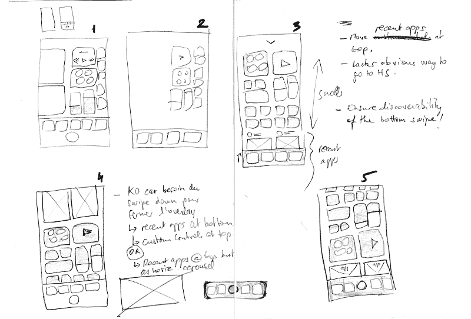
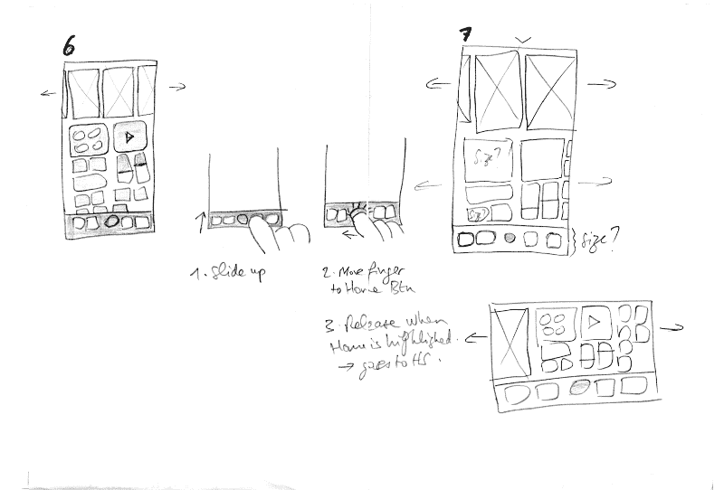
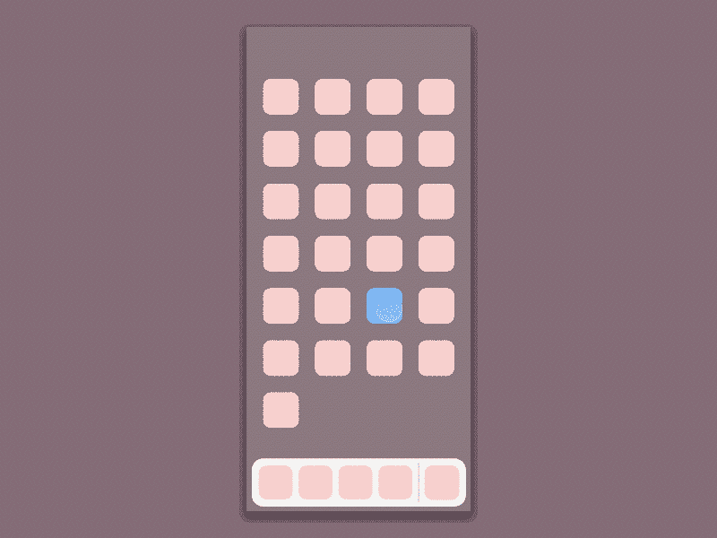
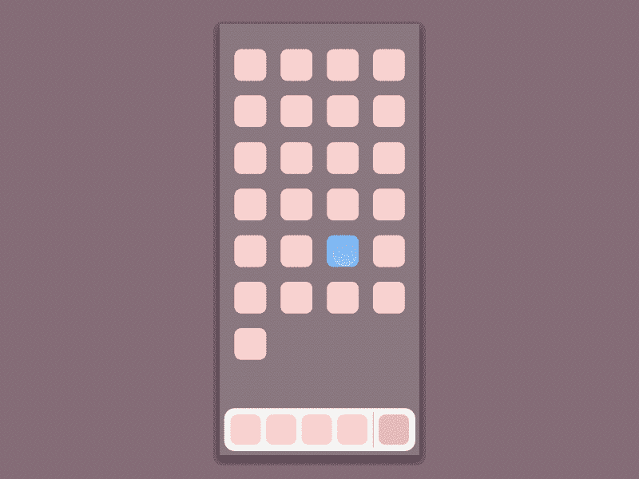
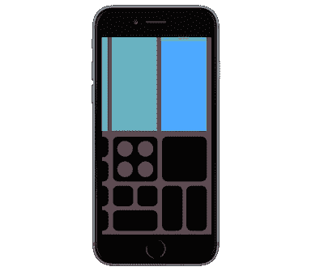

# 无家可归的 iPhone(第二部分)

> 原文：<https://www.freecodecamp.org/news/homeless-iphone-part-2-1f7b3acc8a6c/>

法布里斯·迪布瓦

# 无家可归的 iPhone(第二部分)

*停顿。倒带。深入设计流程。*

两周前，我发表了一篇关于 iPhone 可能完全没有 Home 键的文章。

在 iPad 上使用 iOS 11，你可以享受全新的应用切换器。作为一个小小的设计挑战，我研究了这个用户界面如何在即将到来的“iPhone 8”上工作，以及它是否能迎合 Home 键的缺失。

今天，我暂停了探索，我将带您了解设计流程。我们将详细回顾我的草图，看看它们揭示了什么思路(*哎哟！*)，看看您可以下载并尝试的几个原型变体。

> 以过程为导向，而不是以产品为导向，是设计师最重要也是最难发展的技能。

> 马修·弗雷德里克

下面的草图和原型是按照的原样提供的*，为了这篇文章，它们根本没有被修改。我附上了我的大型草图板的原始扫描，所以这篇文章可能最好在桌面或平板电脑上浏览。*

### 草图

我总是保留我的草图和笔记。它们有助于以慢动作回顾头脑中发生的事情，评估推理，并重新审视被遗忘在路边的萌发中的想法。

对于这个项目，我用了两张 A3 纸。让我们来评论一下关键屏幕:

> ***1。*** ***试图强行适应 iPad 的设计。*** *在第一次尝试中，所有内容都在一个水平滚动视图上。而且还有 Home 键！错误的开始。*

> ***2。*** ***再次尝试。*** *但是急功近利显然是行不通的。我的比例完全不现实。缺乏纪律性。*

> ***3。更现实的比例*** *。我终于承认这是一部很长的手机(6/13 的比例)。我需要我的想象力。整个视图现在垂直滚动，应用程序在两列上。这里发生了一个意外:我的注意力现在转移到了 iPhone 的控制中心(我可能正在我的 iOS 11 手机上检查，作为草图的模型)。我被误导了，在顶部加了一个小 v 形符号，意思是“向下滑动关闭”。*

Sheet 1 of 2

> ***4。* *潜在的冲突。*** *因为我现在错误地认为 UI 可以向下滑动，我担心这会干扰我的垂直滚动。我在边注中记录了这一点:“KO，因为滑动需要关闭覆盖”。我交换东西，把应用程序移到顶部，好像这样会有帮助，但最终还是播下了另一个想法的种子:“最近的应用程序@ top，但作为 horiz。旋转木马”。*

> ***5。* *最后一击垂直卷轴。*** *在这里，我想我是在寻求确认垂直方法是有缺陷的...但是当我注意到一个新的问题时，我的思维又分叉了！控件和最近的应用争夺可见性:滚动查看一个，另一个被推出边界。它们是同一根带子的一部分。在这一点上，我决定尝试解耦它们。*

Sheet 2 of 2

> ***6。最近的应用程序是水平旋转木马。*** *这个对于一个 app 切换器来说看起来比较熟悉。但是控件仍然是垂直滚动的——那么这作为一个整体是如何工作的呢？感觉不对。在 6 点和 7 点之间，我似乎又心不在焉了，但是让我们跳过它。*

> ***7。两个平行的滚动视图。*** *控制组和应用程序转盘现在可以自由移动，不会相互碰撞。空间均分。我用“大小？”来注释一些元素:我能负担得起真实设备上布局吗？知道的方法只有一个:增加保真度。但总的来说，我觉得我已经有了一个可行的解决方案。*

### 观察

我不陈述我的目标。这很遗憾，因为像“让新的 iPad 切换器适应 iPhone 8”这样简单的事情(即使是显而易见的)会让我更快地关注实际问题。

我脑子里没有一个非常清晰的逻辑。混淆的证据:UI 是一个可以向下滑动的覆盖层，我移除的 Home 按钮由于某种原因又被带了回来(不要问！).

我似乎主要关心的是布局问题。显然，我不太担心如何访问主屏幕。然而，这在我的实验中非常关键！我确实在第三步留下了一个害羞的痕迹:“缺乏明显的方式去 HS”，然后到处贴一个 Home 键。这很尴尬(鉴于这个实验是关于无按钮的！)——我可能意识到，在某些时候，我需要找到空白的空间，这样背景就可以被点击，就像在 iPad 切换器上一样，但我不会发誓。Home 键看起来更像是一个机械应用的修复标签，我还不想处理它。

> 面向过程意味着:[长长的列表，包括:]在概念尺度和细节尺度之间流畅地工作，看看两者如何相互影响。

> 马修·弗雷德里克

我的画和字看起来很糟糕。但不知何故这是积极的。在画这些草图的过程中，我从来没有想过以后会分享它们；此刻，审美要求的缺失实际上*加强了*的聚焦。

**便笺帮助我了解接下来的步骤**。勾画、评估、记录问题，并尝试在未来的迭代中解决它们。任何变化都会带来新的问题，我越早捕捉到越好。很容易发现和忘记。我以后会更系统地做笔记。

### 样机研究

如果你直接在 Mac 或 iPhone 上使用[原理](http://principleformac.com/index.html)，你可以尝试下面的原型。点击电影字幕下载原理。prd 文件。要了解更多，请查看[原则的文档](http://principleformac.com/docs.html#running-on-device)，以及我在帖子末尾的提示。

[Download v8](https://www.dropbox.com/s/i8lsat5mq5w9x8i/homeless%20v8.prd?dl=1)

早期版本(v8 以上)的特点是顶部有人字形，底部有一个不显眼的 Home 键。轻按 v 形图标会重新打开当前的应用程序(它还能做什么？)但点击应用程序 miniature 也是如此。

所以事后看来，这种基于人字形的互动看起来很傻。请注意它触发的动画:虽然它做了正确的事情(放大应用程序正确地表示将其带到前台的动作)，但它与 chevron 对象本身是断开的。一方面，chevron 正在做你想做的事情(关闭 switcher 并返回到应用程序)，但另一方面，它并没有*而不是*像你预期的那样运行(向下滑动)。原型法瞬间将矛盾困在了这里。我应该更早发现这个缺陷，但是没关系——在我的生活中有很多事情我应该更早去做。

[Download v11](https://www.dropbox.com/s/6dsveqoqusqam8g/homeless%20v11.prd?dl=1)

山形图标不见了(上面的 v11 ),但我现在用一个主屏幕模型进行实验(就像 iOS 10 的 switcher)。这对于主屏幕用例来说是有效的，但对于右撇子来说，它将之前的应用程序(绿色)推得太左了。这又是一个重复:Home 键变得多余，但如果我去掉它，用户就只能依靠微型屏幕来进入主屏幕，这对左撇子来说太右了！他们可以滚动，但在这种特殊情况下，我当然不希望他们必须这样做。

还有另一个方面:这个模型与我的目标不一致，只需在背景上轻轻一点就可以带你回家。这是整体连贯性的关键，也是新 iOS 11 切换器之美的核心。为什么？因为**切换器*后面的模糊背景是*主屏幕。**当你可以直接与主屏幕*互动时，任何访问主屏幕的特定启示(如主屏幕按钮或我的迷你图)都是多余的(更不用说是不连贯的)。深度是 iOS 的核心设计原则之一——清晰和尊重——苹果在这一点上做得很好。*

Main mental model layers in iOS 11

[Download v14](https://www.dropbox.com/s/9p5zon3u8kfkjru/homeless%20v14.prd?dl=1)

在上面最后的 v14 迭代中，我清理并更严格地与 iPad 切换器对齐。那是我在[第一部](https://medium.freecodecamp.org/homeless-iphone-20c154fabbf7)中呈现的版本。进一步的改进可以是扩大底部的空白区域，例如通过将控制中心网格限制为 3 行。

马修·弗雷德里克的《我在建筑学校学到的 101 件事》中的最后一句话:

> 正确地获得对设计过程的控制往往会让人感觉自己正在失去对设计过程的控制[……]接受不确定性。认识到伴随大部分过程的失落感是正常的。

在我的旅程中，我几次偏离了最初的目标，偶然瞥见了不同的可能性。有些可能值得以后重温，有些让我看到了新的陷阱。流浪不是浪费，而是探索的本质。同时，一个人不可能永远不停地打开盒子，添加待办事项；同样重要的是，在进行过程中，交付合理稳定且可展示的解决方案。挑战在于在广度和深度之间取得平衡。

#### **提示——如果你尝试原型**

*   交互仅限于:向上滑动，水平滚动，点击蓝色应用程序缩略图，点击切换器的背景。在主屏幕中，仅点击蓝色图标。
*   我在上一篇文章中描述的中间停靠状态不被我在这里分享的原型所支持。为了创建停靠状态电影，我做了一个临时的修改。
*   原型是为“iPhone 8”本身设计的，375 * 812 磅(比 iPhone 6/7 高 145 磅)。因此，如果你的测试设备，比如我的，是 6/7 系列，Principle 将用户界面缩小一点，以适应你的显示器:所有的东西看起来都比它应该的要小一点。由于 6/7 的底部区域，位置也有点高(在未来的边对边显示器上没有这样的下巴)。
*   然而，如果你在 6/ 7 上打开这张图片，你会对预期的“iPhone 8”感觉有更好的了解。想象一下手机更高，你可以在任何地方点击底部。您可能需要先将图像保存到您的照片图库。它应该充满整个屏幕，看起来像这样:

