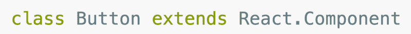
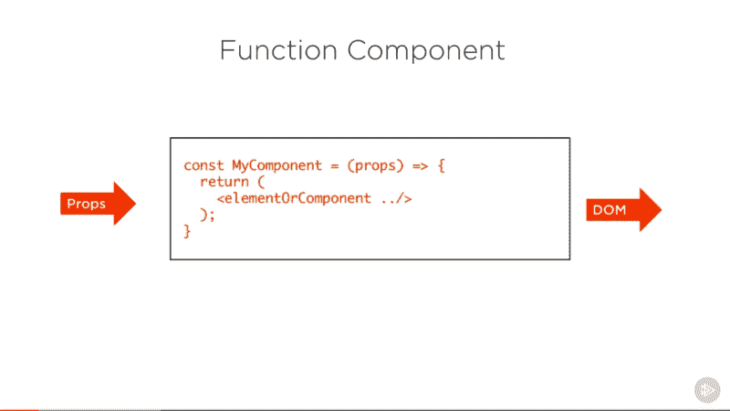
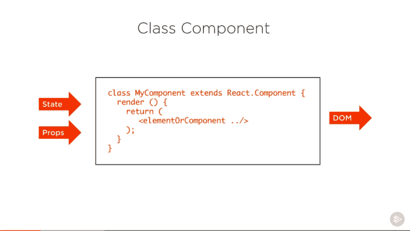
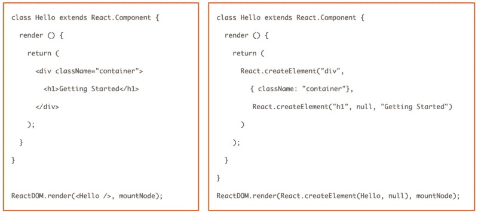
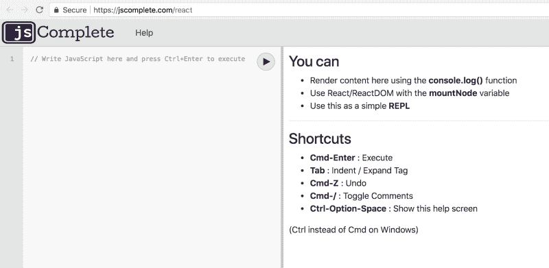
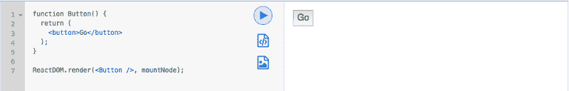
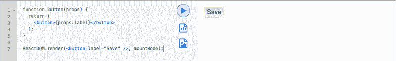
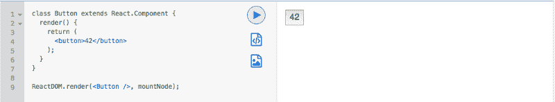
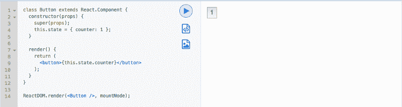
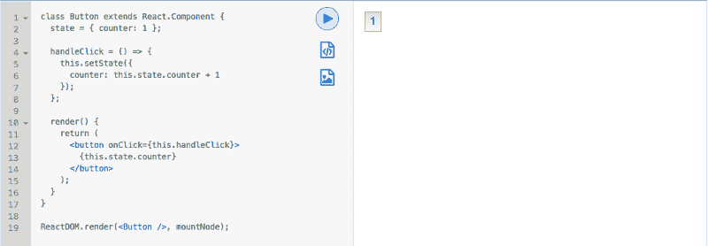

# 如何编写您的第一个 React.js 组件

> 原文：<https://www.freecodecamp.org/news/how-to-write-your-first-react-js-component-d728d759cabc/>

#### React 的函数和类组件、道具、状态和事件处理程序



> **更新:**这篇文章现在是我的书《React.js Beyond The Basics》的一部分。

> 阅读此内容的更新版本以及更多关于在[**【jscomplete.com/react-beyond-basics】**](https://jscomplete.com/g/first-component)*做出反应。*

React.js 中需要理解的最重要的概念是组件。React 组件可以是两种类型之一。它可以是一个**函数**组件，也可以是一个**类**组件。有时候你会听到不同的术语来描述这两种类型，比如**无状态**和**有状态**。功能组件也经常与**表象**概念相关联。在本文中，我将它们称为函数组件和类组件。

功能组件是反应组件的最简单形式。这是一个具有简单契约的简单函数:



Screenshot captured from my Pluralsight course — [React.js: Getting Started](https://www.pluralsight.com/courses/react-js-getting-started)

函数组件接收一个属性对象，该对象通常被命名为 **props。**它返回看起来像 HTML 的东西，但实际上是一种特殊的 JavaScript 语法，叫做 [JSX](https://facebook.github.io/react/docs/introducing-jsx.html) 。

一个**类组件**是定义一个 React 组件的更有特色的方式。它也像一个接收 props 的函数，但是该函数也将私有内部状态视为控制返回的 JSX 的附加输入。



Screenshot captured from my Pluralsight course — [React.js: Getting Started](https://www.pluralsight.com/courses/react-js-getting-started)

这种私有的内部状态赋予了 React 的**反应**本性。当类组件的状态改变时，React 将在浏览器中重新呈现该组件。

状态和道具对象有一个重要的区别。在类组件内部，状态对象可以改变，而 Props 对象表示固定值。类组件只能更改其内部状态，而不能更改其属性。这是 React 中需要理解的核心思想，本文将提供一个例子。

让我们看一个组件的实际例子。非常简单的一个，没有任何输入，在一个`div`输出中有一个简单的`h1`。



Screenshot captured from my Pluralsight course — [React.js: Getting Started](https://www.pluralsight.com/courses/react-js-getting-started)

在左侧，组件是用特殊的 JSX 语法编写的。

JSX 允许我们用非常接近我们习惯的 HTML 的语法来描述我们的用户界面。但是，它是可选的。React 可以在没有 JSX 的情况下使用，你可以在右边看到。事实上，React 只是将你在左边看到的 JSX 编译成你在右边看到的纯 JavaScript。然后它在浏览器中使用编译好的 JavaScript。

右边的`React.createElement`调用是文档对象模型的 JavaScript 表示( [DOM](https://developer.mozilla.org/en-US/docs/Web/API/Document_Object_Model) )。React 有效地将其转换为在浏览器中执行的 DOM 操作。

### 让我们编写一个 React 组件。

对于本文中的例子，我将使用 jsComplete 的 [React Playground](https://jscomplete.com/react) 。这是一个工具，你可以在浏览器中测试你的 JavaScript 和反应代码。不需要安装或配置任何东西。



该工具有一个简单的双面板界面。左侧面板是编辑器，您可以在其中编写 JavaScript 和 React 代码。React 和 ReactDOM 的最新版本都已经预装在那里了。编辑也理解 JSX 扩展和 JavaScript 中所有的现代特性。这将允许我们专注于 React API 本身，而不是配置和编译 React 应用程序。

右边的面板是预览面板。编辑器中有一个预定义的`mountNode`元素。当您执行 JavaScript 代码时，您在`mountNode`元素中放置的任何内容都会显示在预览面板中。预览面板还会显示执行代码时遇到的任何错误。操场也是一个简单的 JavaScript *REPL* (运行、评估、打印、循环)，你可以在这里测试快速的 JavaScript 函数和表达式。要随时执行代码，请按`CTRL+Enter`。

例如，在 REPL 尝试以下方法:

```
mountNode.innerHTML = 'Hello!!';
```

或者简单的 REPL 模式

```
3 == '3'
```

要创建 React 组件，请定义一个新函数。让我们让这个函数返回一个 HTML 按钮元素:

```
function Button() {  return (    <button>Go</button>  );}
```

我们在这里返回的看起来像 HTML，但记住它不是。它将被编译成 JavaScript。当我们在 JSX 使用这个按钮元素时，浏览器看到的实际 JavaScript 是对`React.createElement` 函数的调用:

```
function Button() {  return (    React.createElement("button", null, "Go")  );}
```

虽然您可以在没有 JSX 的情况下以这种方式使用 React，但是编码和维护起来会困难得多。所以，让我们继续关注 JSX。

上面的函数是一个完整且非常简单的 React 组件。让我们使用它！

我们通过将组件安装在浏览器中来使用它。为此设计的函数是`ReactDOM.render`，它接受两个参数:

*   第一个是要呈现的组件，在我们的例子中是`Button`。
*   第二个参数是应该在其中呈现该组件的元素。在 REPL 的环境中，我们可以使用特殊的`mountNode`变量。

```
ReactDOM.render(<Button />, mountNode);
```



[https://jscomplete.com/repl?j=Skl5GngO-](https://jscomplete.com/repl?j=Skl5GngO-)

本文中的所有代码示例在屏幕截图标题中都有一个链接，您可以在 jsComplete REPL 网站上编辑示例。

React 函数组件接收第一个参数`props`对象。这个参数允许我们使组件可重用。例如，我们可以传递一个`label`属性给`Button`组件，而不是硬编码上面按钮的“Go”标签，就像我们对常规 HTML 元素所做的那样:

```
ReactDOM.render(<Button label="Save" />, mountNode);
```

然后我们可以在组件内部用一个花括号来访问这个属性。

```
function Button(props) {  return (    <button>{props.label}</button>  );}
```

`props`参数是一个对象，它保存了组件呈现时传递给它的所有值。



[https://jscomplete.com/repl?j=ByQm4nl_Z](https://jscomplete.com/repl?j=ByQm4nl_Z)

### 使组件具有交互性

我们有一个按钮元素，它是通过 React 组件呈现的。

现在让我们给这个到目前为止很无聊的例子增加一些交互性。让我们让按钮元素在每次点击时增加一个计数器值，并将该值显示为按钮标签本身。因此，这个按钮的标签将从数字 1 开始，当用户单击该按钮时，它的标签将变为 2、3、4 等等。

因为这是需要在组件呈现输出中反映的东西，所以它属于组件的状态。我们需要组件在每次计数器改变时重新呈现自己。我们不能在这里使用属性，因为组件属性不能更改。通过使用特殊的 React 状态对象，我们将利用 React 的**反应**性质，我们将无需担心**如何**对浏览器进行更改。React 将为我们做这件事。

但是，我们的按钮组件目前是一个函数组件。函数组件不能有状态，所以我们需要先把这个组件升级为类组件。

这个很简单。我们首先定义一个扩展`React.Component`的类

```
class Button extends React.Component { }
```

在那个类中，我们定义了一个`render`函数，它返回组件的 JSX；我们例子中的 HTML 按钮。

```
render() {  return (    <button>1</button>  );}
```

这是多一点的代码，但是我们现在可以在按钮组件上使用私有状态了！



[https://jscomplete.com/repl?j=BJCWI2gd-](https://jscomplete.com/repl?j=BJCWI2gd-)

要使用一个状态对象，我们首先需要初始化它。state 对象是一个简单的实例属性，所以我们可以在`Button`类的构造函数中初始化它。我们只需定义普通的构造函数(它在 React 中接收一个`props`对象)并调用`super`方法来实现组件的继承。

```
constructor(props) {  super(props);  this.state = { counter: 1 };}
```

之后，我们将`this.state`初始化为我们想要的。这个状态对象的关键字是状态的各种元素。对于我们的例子，我们需要一个从 1 开始的`counter`状态。

在 render 函数中，因为我们可以在花括号中编写任何 JavaScript 表达式，所以我们可以读取新的`counter` state 元素的值，该元素是我们使用`this.state.counter`在 state 上初始化的。

```
render() {  return (    <button>{this.state.counter}</button>  );}
```

“`this`”关键字指的是我们交给`ReactDOM`的组件实例。



[https://jscomplete.com/repl?j=SJfwu2xuZ](https://jscomplete.com/repl?j=SJfwu2xuZ)

您可以尝试更改计数器状态，看看按钮将如何呈现您在状态中输入的值。

还有另一种更短的语法来定义初始状态，即简单地使用一个类属性，而不调用构造函数:

```
class Button extends React.Component {  state = { counter: 1 };    render() {    return (      <button>{this.state.counter}</button>    );  }}
```

这还不是官方 JavaScript 语言的一部分，但很快就会了。这种语法在 jsComplele REPL 游乐场有效，因为该工具使用 Babel 将其转换为浏览器能够理解的支持的 JavaScript。

当你配置自己的 React 应用程序时，你必须使用类似 Babel 的东西将 JSX 编译成 JavaScript。包含和使用 JavaScript 特性是一件轻而易举的事情，这些特性正在成为该语言的正式组成部分。

在迄今为止的`Button`示例中，我们有一个状态对象和一个 HTML 按钮元素，该元素显示我们在状态中初始化的计数器值。现在我们需要在单击按钮时更改该值。我们需要在那个按钮上定义一个点击处理程序。

React 附带了易于使用的规范化事件。在这种情况下，我们需要`onClick`事件，它是在 HTML 按钮元素本身上定义的:

```
function F() {}
```

```
<button onClick={F} />
```

与使用字符串的 DOM 事件处理程序不同，React 事件处理程序使用实际的 JavaScript 函数。这个函数可以是一个全局函数(如上面的`F`)，也可以是一个内嵌函数:

```
<button onClick={() => {}} />
```

然而，标准的做法是在类组件本身上定义一个函数。让我们称它为`handleClick`，我们可以在组件上将它定义为一个实例属性:

```
class Button extends React.Component {  state = { counter: 1 };    handleClick = () => {    console.log('Button is clicked!!');  };    render() {    return (      <button onClick={this.handleClick}>        {this.state.counter}      </button>    );  }}
```

我们使用现代的类字段语法，这允许我们使用绑定到组件实例的箭头函数。现在将作为这个类的原型函数。在`handleClick`中，关键字“`this`指的是我们在 DOM 中挂载的组件实例。

`handleClick` 的工作很简单:使用`this.state.counter`从状态对象中读取当前计数器值。然后增加该值，并用新增加的值更新组件状态。

我们可以使用 React 的内置`setState`方法来更新组件状态，该方法在每个类组件实例上都可用。



[https://jscomplete.com/repl?j=Sy-u46l_Z](https://jscomplete.com/repl?j=Sy-u46l_Z)

该按钮现在将增加其标签每点击一次。

这既简单又强大！我们为`onClick`方法定义了一个事件处理器。每当用户点击按钮时，就会执行`handleClick`功能。该函数读取计数器值的当前状态，将其递增，然后将状态设置为新的递增值。React 会处理这些更改后所需的所有渲染，因此您不必担心这一点。

注意，我们没有直接更新状态对象。当我们想要更新状态中的任何元素时，我们必须使用 React 的`setState`方法。例如，您不能这样做:

```
// WRONG:this.state.counter = this.state.counter + 1;
```

React 的`setState`方法是一个异步方法，它调度更新。为了提高性能，多个`setState`调用可能会被批量处理。由于我们在`handleClick`函数中读写状态对象，我们可能会遇到竞争情况。一般的经验法则是，每当您需要使用来自当前状态的值来更新状态时，使用`setState`方法的另一个契约。它接收一个函数引用而不是一个对象作为它的第一个参数:

```
this.setState((prevState) => {});
```

这个函数接收一个`prevState`对象，我们可以放心地使用它，而不用担心竞态条件。该函数返回我们希望 React 用来设置状态的对象。我们上面的`counter`值示例变成了:

```
this.setState((prevState) => ({  counter: prevState.counter + 1 }));
```

如果你的更新依赖于当前状态，你只需要使用第二种语法`setState`。然而，养成总是使用第二个函数参数语法的习惯可能是个好主意。

以下是最终代码:

```
class Button extends React.Component {  state = { counter: 1 };    handleClick = () => {    this.setState((prevState) => ({      counter: prevState.counter + 1     }));  };    render() {    return (      <button onClick={this.handleClick}>        {this.state.counter}      </button>    );  }}
```

```
ReactDOM.render(<Button />, mountNode);
```

[测试一下](https://jscomplete.com/repl?j=rJgDsTgdb)如果你有任何问题，请在下面的评论中告诉我。

> 这篇文章是我的 Pluralsight 课程的一部分的书面报告— [React.js:入门](https://www.pluralsight.com/courses/react-js-getting-started)。我在那里用视频格式报道了类似的内容。

学习 React 还是 Node？签出我的图书:

*   [通过构建游戏学习 react . js](http://amzn.to/2peYJZj)
*   [Node.js 超越基础](http://amzn.to/2FYfYru)