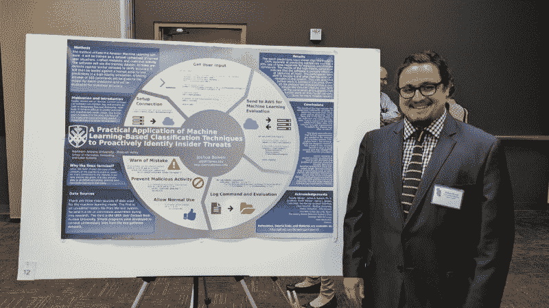

# 想学点什么？研究它并展示你的作品。

> 原文：<https://www.freecodecamp.org/news/want-to-learn-something-research-it-and-present-your-work-d4151e929d06/>

乔希·鲍文

# 想学点什么？研究它并展示你的作品。



Me and my poster at the Arizona Nevada Academy of Science meeting.

当我在学习一些东西的时候，我最终会到达一个平台。很难战胜这种感觉。我发现研究并展示研究成果有助于我摆脱困境。

要做到这一点，你不必是学生或教授。我鼓励每个人都尝试一下。就像在 GitHub 上发布你的代码增加了开源一样，展示(和发布)你的研究增加了科学知识。

### 创建项目

我在 2017 年 1 月开始了这个项目，以了解更多关于机器学习和网络安全的知识。这两个话题我都读过，但从未应用过。由于我不知道这两个领域的研究现状，我决定解决一个网络安全方面的问题。

经过一番筛选，我找到了 2009 年的一份政府报告。它描述了当前的问题和需要更多研究的领域。我被关于内部威胁的部分吸引住了，所以我决定将机器学习应用于内部威胁。

我心想——这能有多难？

我对这个项目很感兴趣，但还没有读过这方面的任何论文。我开始想办法评估普通人和怀有恶意的内部人员如何使用电脑。因为我的笔记本电脑运行 Ubuntu，我经常在终端中，所以想到了查看命令的想法。

我决定在命令发生时捕捉它们，进行评估，并试图阻止恶意和错误的命令。我不知道自己会陷入什么样的境地。我写了一份摘要(这里有)然后开始工作。

### 这项研究

一个月后，我做了一些(最少的)初步研究。然后，我向亚利桑那/内华达科学院提交了我的摘要。既然他们接受了，我似乎就走对了路。

我并不急于完成任何事情。我还有好几个月的时间才开始演讲！这是一种糟糕的心态。当我的海报被接受时，我只有五个星期的准备时间。我赶紧收集了一批合理的研究资料，以此为基础。

令我惊讶的是，我发现不少论文都试图解决这个问题。事实上，有人尝试了我在 1999 年选择的相同方法，几年后他们的研究被证明是无效的！我怎么能继续下去？

我继续阅读我积累的一堆论文。然后我突然意识到，没有人真正把这些东西应用到现实生活中。这就是我的与众不同之处:实际应用。

### 数据

在我开始写代码之前，我需要我的机器学习模型的数据。我自己有大约 60，000 个命令。zsh_history 文件，但这还不够。它也没有包含许多错误，也没有恶意行为。

我决定向商家征集他们的日志——也许我能得到足够的信息。然后我想到检查是否有人已经收集了任何命令的数据库。

事实证明，普渡大学在几年间收集了大量 UNIX 命令的数据集。加州大学欧文分校拯救了它。我在做生意。

我的历史文件和 UNIX 数据都有我需要删除的不必要的部分。所以我写了一些 Python 来处理，因为我不想手工翻 10 万+行。首先是我的历史档案。不太难。

```
# Examples of what I'm dealing with: 1474850643:0;ls: 1474851038:0;cd# Examine each line and write to outputfor line in file:    before, sep, after = line.rpartition(";")    output.write(after.rstrip())
```

困难的部分是处理普渡大学的数据。它充满了像 EOF、SOF、参数表示、标志和管道之类的东西，都在单独的行上。

我必须弄清楚这些是如何组合在一起的，这样我就不会对我的模型胡言乱语了。我想出了一堆杂乱的嵌套语句，将近 50 行长。

我从未对自己写的代码感到如此兴奋和失望。这么乱，很难骄傲。但我花了这么多时间在它上面，我很欣慰有一些工作。

这两个程序都以 CSV 格式保存了所有内容，便于上传到亚马逊的 S3 服务。从那里，它被导入到机器学习模型并被评估。

### 软件

现在我已经处理了数据，我终于可以开始编写演示程序了。会有多难呢？

我还有不到三周的时间。从亚马逊的机器学习 API 发送和接收数据非常容易。根据这些答复进行评估也不太困难。我甚至知道如何处理恶意和错误的命令。

但是我不知道如何在命令执行之前捕捉用户输入的内容。我阅读了 Python 文档并尝试了示例。我搜遍了互联网，甚至翻遍了我从一个简陋的包里得到的 Linux 电子书。没什么。我花了几乎一半的时间走在一条不知通向何处的路上。

我最终放弃了，并在 Stack Overflow 上发帖，寻求一位大师指引我正确的方向。我感谢伊恩的回应。尽管这不是我想要的答案，但却是我需要的答案:

> 好的，听起来会很有用。那么，为什么您决定不只是做一些像 while(input = raw _ input(" user:")):# ML code if its all good:subprocess(input . split())else:# shut it down

> 伊恩·哈维——3 月 21 日下午 4:30

我只剩下一个多星期了。我运行了它，并编写了一个简单的程序来创建一个假的提示，读取输入，并评估命令。你可以在这里找到完整的节目。

这个程序有一个大问题。即使我通过了`KeyboardInterrupt`和`SystemExit` , `Ctrl + C`会允许任何人绕过这个程序。

另一个大问题是许多命令不起作用，比如`cd`。这很糟糕，但我在树莓 Pi 上设置了它，并邀请了一些黑客来尝试一下。不用说我的节目没持续多久。

### 海报

你知道设计学术海报的标准是 Power Point 吗？我简直不敢相信。不幸的是，没有其他选择。谁为学术海报建 [Prezi](https://prezi.com/) 谁就有我的钱。

我最终找到了一张用于数学研究的漂亮的 SVG 海报，并把它转换成了我的项目。起初，这是辉煌的。我习惯于在风景中，当我估量事物时，不必担心规模。缺点是我不得不一个接一个地删除所有的数学符号。

为海报写内容是一个挑战。我很难用语言表达我的想法。我前几稿都写错了。我也没有意识到我需要多大的字体才能让它在几英尺外清晰可见。

我需要一些东西让我的海报与众不同。我想过把内部威胁或者机器学习作为概念来解释。最后，我决定尝试解释演示软件，让每个人都能理解。我写了简单的标题，并用一些字体很棒的图标来说明这一点。

后来，我意识到仍然有太多的空白空间。我为每个部分添加了代码片段。直到后来，我才意识到这可能有助于为我的观众揭开代码的神秘面纱。他们大多是理科学生和教授，但不是计算机科学。

### 演示文稿

我对展示我的海报感到紧张。我担心人们会问关于机器学习的复杂问题。或者他们会因为这个项目“不成功”而对我进行评判。

我错了。与我交谈过的每个人都对这个项目的失败感兴趣并理解。有些人甚至认为这个设计不错。没有人问我担心的复杂的技术问题。

但是我应该先练习一下——我没有一个非常简洁的五分钟演讲准备好。

### 最后的想法

那么，我从这个项目中学到了什么？我们需要更多公开的数据。机器学习模型是倾斜的，因为我的大部分数据都属于正常类别。企业应在违规后发布清理过的日志。然后，这些数据可以帮助开发能够有效阻止类似攻击的模型。

除非我找到一种方法，在用户输入命令的同时允许终端正常工作，否则这种方法不会真正起作用。我需要考虑自定义命令、别名以及构成某人“正常”行为的因素。增加诸如打字速度和访问数据等变量也会有所帮助。

我计划继续做这个项目，因为我相信它是可行的。

我鼓励你们所有人去追求自己的想法，接受项目去学习新事物，并且永不放弃。

如果你喜欢这篇文章，给我一些掌声，让更多的人看到它。我写关于机器学习、网络安全、物联网和学习编码的文章。在 [twitter](http://twitter.com/_josh) 或我的[网站](http://joshuabowen.info)上找到我。