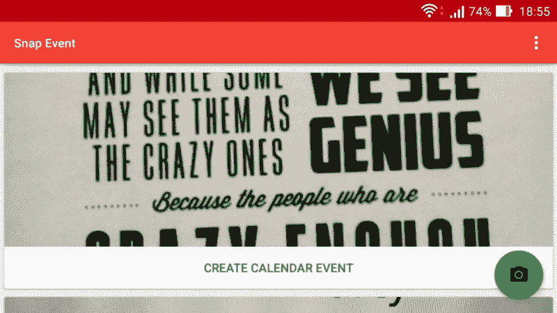

# 快照事件:你现在如何通过拍照来创建日历事件

> 原文：<https://www.freecodecamp.org/news/snap-events-how-you-can-now-create-calendar-events-just-by-taking-a-picture-af21f3bfaeef/>

阿琼·克里希纳·巴布

# 快照事件:你现在如何通过拍照来创建日历事件

谷歌刚刚在他们的 Play Store 发布了我的第一个 Android 应用程序 [Snap Event](https://play.google.com/store/apps/details?id=io.github.arjunkrishnababu96.snapevent) 。快照事件从事件海报的照片创建日历事件。

这款应用并不完美，但它很实用，证明了这个想法是可行的。

这篇文章是我如何构建和发布这个应用程序的综述。

### 动机

人们说学习一门新的编程语言或框架的最好方法是用它做一个项目。当然，无论你想学什么，你都需要熟悉一些基础知识。但是过了这个阶段，项目就是要走的路。

这款应用的开发背后有三个推动因素:

1.  我两年前学习 Android 的尝试失败了。我想再试一次。
2.  我心中已经有了一个项目的想法。
3.  我的一位教授要求我们每人开发一款安卓应用。我们会因此获得荣誉。

每当我看到某个活动的海报，比如音乐会或会议，我都会拍下它的照片，以记录下海报上的确切内容。我认识的大多数人都这样做。我搜索了一下，但是找不到一个可以把海报图片转换成日历事件的应用。这令人惊讶。或者可能是我搜索得不够好。

因此，我和我的朋友亚历山大“亚历克斯”卡贝莱因决定开发这个应用程序。

### 应用程序开发

从他们的海报中创建日历活动归结为三件事:

1.  从图像中检测文本。
2.  理解检测到的文本。
3.  创建日历事件。

我们的重点是尽早发布一个可用的应用程序，然后消除它的缺点。因此，我们在设计阶段做了一些妥协。毕竟，这应该是一次学习经历。我们没有从这个应用程序赚钱的意图。

#### 从图像中检测文本

虽然回想起来第二步更难，但如果我们没有从图像中检测到文本，我们的项目可能会马上被搁置。我对计算机视觉一无所知。Alex 对 OpenCV 有些熟悉，但是我们没有足够的时间来开发我们自己的图像识别模型。

根据我在互联网上读到的内容，我知道一些现成的图像识别库和服务。特别是，我们考虑的三种服务是:

1.  [亚马逊索赔](https://aws.amazon.com/rekognition/)
2.  [谷歌云视觉](https://cloud.google.com/vision/)
3.  [谷歌移动视觉](https://developers.google.com/vision/)

没过多久，我们就瞄准了[谷歌移动视觉:](https://developers.google.com/vision/)

*   Amazon Rekognition 应该非常擅长检测图像中的对象。但是我们不知道它对文本的处理效果如何。
*   Cloud Vision 能够检测文本，但它不是免费的(尽管价格便宜)。
*   移动视觉能够免费检测文本，并且可能与 Android 配合良好。

所以我们选择了移动视觉。

接下来，我们希望确保移动视觉检测到的文本令我们满意。我们不想在最后一刻发现移动视觉是否无法胜任这项任务。为此，我们构建了一个小的玩具应用程序，从我们硬编码到应用程序中的图像中检测文本。你可以在这里找到它。

原型运行良好，我们决定继续开发主应用程序。

捕捉图像并保存在手机上比我想象的要容易。然而，我想在垂直滚动的卡片中显示应用程序拍摄的所有图像。这是我遇到的第一个主要问题:

*   高分辨率图像占用大量内存，导致滚动抖动。尽管使用了`[RecyclerView](https://developer.android.com/guide/topics/ui/layout/recyclerview.html)`。
*   将图片放在卡片中央比我想象的要难。你必须摆弄一个`[Bitmap](https://developer.android.com/reference/android/graphics/Bitmap.html)`物体，并进行重要的数学计算。

Android 文档(确切地说是这个页面)指引我找到了这两个问题的解决方案。有一个名为 [Glide](https://github.com/bumptech/glide) 的库，它可以处理将多个图像拖入你的应用程序的复杂性。它还能处理一些烦人的事情，比如将你的图像正确地放在你的`ImageView`中心。

Glide 的文档可以做得更好。我不得不求助于第三方网站来找出某些用例。说到这里，你可能想读一下[这篇关于 Glide 的精彩介绍。](https://inthecheesefactory.com/blog/get-to-know-glide-recommended-by-google/en)

#### 使用移动视觉的文本识别

移动视觉支持:

1.  [人脸检测](https://developers.google.com/vision/face-detection-concepts)
2.  [条码检测](https://developers.google.com/vision/android/barcodes-overview)
3.  [文字检测](https://developers.google.com/vision/text-overview)，这正是我们想要的。

这个图书馆能够为我们提供我们想要的任何格式的文本。它可以是整块的文本、线条、单词等等。我们的攻击计划是提取海报中的每一行文字，然后找出每一行的意思。

关于使用移动视觉进行文本检测，我注意到了以下几点:

*   它不能很好地处理手写文本。
*   提取的文本行并不总是按照从上到下的顺序。
*   对于多次运行的同一图像，检测到的文本有时会有所不同，这是一种意外的不确定性行为。
*   当使用`.jpg`格式的图像时，它偶尔会崩溃。我求助于使用`.png`格式。
*   使用`ARGV_8888`方法在内存中存储像素。我花了几个小时才弄明白为什么我的应用程序总是崩溃。我的应用程序的一部分默认使用的是`RGB_565`，另一部分期待的是`ARGV_8888`中的图像。请参见[这一](https://developer.android.com/reference/android/graphics/Bitmap.Config.html)页面，了解这些配置的更多含义。

#### 理解课文

Alex 和我的结论是，对于任何日历事件，三个关键信息是:

*   日程安排
*   标题
*   位置

日期的问题在于，在世界的不同地方，它们有不同的书写方式。例如，“05–07–2017”在美国是 5 月 7 日，在几乎所有其他国家都是 7 月 5 日。奇怪的想法，包括用户地理位置的技巧，闪过我的脑海，但感觉不对劲。况且在美国这种世界各地的人都在场的国家，这种想法也不是万无一失的。

由于这些复杂性，我们决定仅在月份被完整书写时进行推断，例如“一月”(或其缩写形式“一月”)。虽然不总是正确的，但可以有把握地假设日期和年份与月份在同一行。

我们检测事件标题和位置的方法太糟糕了，我不想谈论它。对于给定的一行文本，我没有可靠的策略来最终确定它是事件标题、位置还是其他信息。

为了弥补这一点，我们将检测到的每一行文本都转储到日历事件的描述字段中。

#### 创建日历事件

大计划中的一件小事。

Android 将所有日历事件存储到一个名为[日历提供商的中央存储库中。](https://developer.android.com/guide/topics/providers/calendar-provider.html)这就是为什么你使用*任何*日历应用创建的日历事件会出现在你安装的任何其他日历应用上。可以这样想——你手机里的所有媒体文件都会在你安装的任何媒体播放器上显示。

一旦创建日历事件所需的所有信息都准备好了，就可以开始创建日历事件了。

我们选择打开包含活动信息的日历应用程序，让用户有机会在保存活动之前查看活动。否则，它会在后台自动创建日历事件。

### 谷歌 Play 商店出版

像谷歌的大多数其他东西一样，发布一个 Android 应用程序的步骤是有据可查的。一旦我觉得准备好启动应用程序，我就按照官方的[启动清单。](https://developer.android.com/distribute/best-practices/launch/launch-checklist.html)

尽管这不是一个快速的过程。他们花了 24 个小时来验证我的一次性注册费 25 美元，在我点击按钮推出并发布应用程序后，又过了 6 个小时我的应用程序才出现在 Google Play 商店。

### 我从开发这个应用程序中学到了什么

*   基本的 Android 编程。我现在有信心通读文档(以及其他资源)来找出如何把事情做好。现在我可以在未来创建更复杂的 Android 应用程序。
*   如何实际发布 Android 应用程序？
*   如何使用 Glide 库高效显示多幅图像？
*   如何设置和使用谷歌的移动视觉库？

### 缺点

我已经在上面的[应用程序开发](https://arjunkrishnababu96.github.io/Introducing-SnapEvent/#app-development)部分介绍了这个应用程序的许多缺点。但是我将在这里总结这些问题:

*   只有完整地写出日期，才会进行日期检测。在现实世界中，日期并不总是完整地写出来。这严重限制了应用程序的可用性。
*   如果日期检测包含像“st”、“nd”、“rd”或“th”这样的序号后缀，则检测失败但是，这可以很快修复。
*   事件标题和位置检测还不完善。我正在考虑使用机器学习模型来完成这项任务，但这还很遥远。
*   这些图像被保存到手机上，使用了一个可怕的策略，我很惭愧在这里提到。尽管它运行得很完美。只有通读源代码，这一点才会显而易见。
*   可以提高用户体验。

### 下一步怎么样

我会修复我在[缺点部分](https://arjunkrishnababu96.github.io/Introducing-SnapEvent/#shortcomings)提到的相对简单的东西。但是由于我下面提到的原因，我可能不会继续这个项目了。

#### 谷歌镜头

谷歌在 2017 年谷歌输入/输出大会上宣布了一系列令人兴奋的东西，其中包括谷歌镜头。Google Lens 做的正是我们的应用程序所做的(还有一堆其他很酷的东西)。谷歌镜头做得相当好，比我通过 Snap Event 创建的要好得多。

我很高兴也很兴奋谷歌做到了这一点。至少我希望它更加可靠和有用。

### 获取快照事件

*   如前所述， [Snap Event 现已在 Google Play 上推出。](https://play.google.com/store/apps/details?id=io.github.arjunkrishnababu96.snapevent)
*   该应用的源代码可在 GitHub 上获得。

你可以在我的博客上了解更多我的项目[。](https://arjunkrishnababu96.github.io/Introducing-SnapEvent/)