# 从 AngularJS 迁移到 React —如何衡量性能提升？

> 原文：<https://www.freecodecamp.org/news/measuring-performance-gains-angularjs-to-react-with-redux-or-mobx-fb221517455/>

作者古普塔·哥鲁达

# 从 AngularJS 迁移到 React —如何衡量性能提升？

您是否正在考虑迁移一个大型 AngularJS 单页面应用程序来应对？如果是这样，您可能想知道使用 React 会获得什么样的性能提升，以及代码会如何变化(使用状态管理库 Redux 或 Mobx)。

在这篇文章中，我将试着回答其中的一些问题，并给你大量的数据，你可以用这些数据做出更明智的决定。

首先，我将回顾使用 AngularJS、React/Redux 和 React/Mobx 实现的各种 UI 场景的性能和内存配置文件。我们将从脚本执行时间、每秒帧数和每个场景的 usedJSHeapSize 等方面比较这些框架的性能。

我提供了测试页面和源代码的链接，因此您可以尝试这些场景，并可以查看代码，以了解 React(使用 Redux 或 Mobx)将带来的结构。

### 性能测试设置

为了评估 AngularJS 和 React 的性能，我创建了一个基准应用程序，一个股票行情仪表板。这个应用程序显示了一个股票列表，并且有一些自动化 UI 测试操作的控件。对于每只股票，该应用程序显示股票代码、公司名称、行业名称、当前价格、成交量和简单移动平均线(10 天、50 天和 200 天)，以及显示价格上涨还是下跌的可视化指示器。测试数据集由 5000 个股票报价机组成，在页面加载期间通过脚本标签加载。

我使用 AngularJS、React/Redux 和 React/Mobx 创建了这个应用程序的三个版本。这使我们能够轻松地跨框架比较每个场景的性能指标。

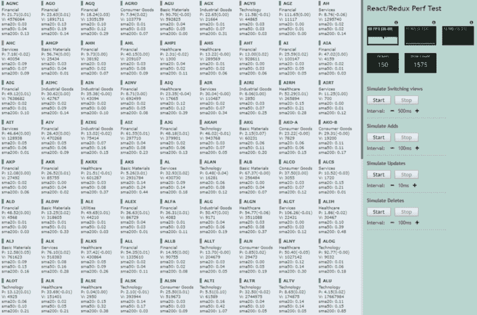

Performance test page

#### 测试场景

*   **切换视图**
    我们浏览 5000 个股票报价机的列表，每 0.5 秒显示 150 个报价机。该场景测量当可见集合数据模型改变时框架更新视图的速度。
    *真实世界用例:路线变更、列表视图翻页、虚拟滚动等等。*
*   **添加跑马灯**
    我们每 100 毫秒向可见集合添加 50 个跑马灯，直到我们显示 5000 个跑马灯的整个集合。这个场景衡量框架创建新项目的速度。显示 5000 个滚动条并不现实，但是我们可以想象每个框架崩溃的极限。
    *真实世界用例:Pinterest 风格的无限滚动，当用户滚动时，新的 UI 元素被添加到 DOM 中。*
*   **快速更新价格/交易量**
    我们渲染 1500 个报价机，并开始每 10 毫秒更新一次随机报价机的价格/交易量数据。这个场景测量框架将部分更新应用到 UI 的速度。
    *真实世界用例:更新存在指示器、赞、转发、鼓掌、股票价格等等。*
*   **移除滚动条**
    我们将首先添加所有 5000 个滚动条，然后每 100 毫秒从可见集合中移除 50 个滚动条。

#### 测试页面和源代码的链接

所有示例都是用 Typescript 编写的，编译/捆绑是使用 Webpack 完成的。源 URL 的 Readme 页面列出了构建和运行应用程序的说明。

*   angular js—[https://guptag . github . io/js-frameworks/angular js/examples/angular js-perf-test/index . html](https://guptag.github.io/js-frameworks/AngularJS/examples/angularjs-perf-test/index.html)([来源](https://github.com/guptag/js-frameworks/tree/master/AngularJS/examples/angularjs-perf-test)
*   react/Redux—[https://Gupta g . github . io/js-frameworks/Redux/examples/Redux-perf-test/index . html](https://guptag.github.io/js-frameworks/Redux/examples/redux-perf-test/index.html)
    ([来源](https://github.com/guptag/js-frameworks/tree/master/Redux/examples/redux-perf-test))
*   react/Mobx—[https://guptag . github . io/js-frameworks/Mobx/examples/Mobx-perf-test/index . html](https://guptag.github.io/js-frameworks/Mobx/examples/mobx-perf-test/index.html)
    ([来源](https://github.com/guptag/js-frameworks/tree/master/Mobx/examples/mobx-perf-test))

### 在我们开始之前…

*   以下所有指标都是在 Win10/英特尔至强 E5 @ 2.4GHz、6 核、32GB、带有 Chrome browser v60 的台式机上测量的。数字会在不同的机器/浏览器上改变。
*   要查看测试页面上准确的堆内存数据，请打开带有'*-enable-precise-memory-info*'标志的 Chrome。
*   React 是一个库，而不是像 AngularJS 那样的成熟框架。在这篇文章中，为了简单起见，我使用了框架这个术语。
*   测试页面将实时 JavaScript 堆大小显示为内存。
    关于 javascript 堆大小:在 Chrome TaskManager 中，

> 在 Chrome TaskManager 中，“*内存一栏代表原生内存。DOM 节点存储在本机内存中。如果这个值增加，DOM 节点就会被创建。JavaScript 内存列表示 JS 堆。该列包含两个值。您感兴趣的值是实时数字(括号中的数字)。实时数字表示页面上可访问的对象使用了多少内存。如果这个数字在增加，要么是新的对象正在被创建，要么是现有的对象正在增长*。[来自凯斯·巴斯奎斯的《修复内存问题》](https://developers.google.com/web/tools/chrome-devtools/memory-problems/)

*   大约每秒帧数:

> 今天，大多数设备每秒钟刷新屏幕 60 次。如果有动画或过渡正在运行，或者用户正在滚动页面，浏览器需要匹配设备的刷新率，并为每次屏幕刷新提供一个新的图片或帧。这些帧中的每一帧的预算都刚刚超过 16 毫秒(1 秒/60 = 16.66 毫秒)。然而，在现实中，浏览器有内务工作要做，所以你所有的工作需要在 10 毫秒内完成。当你不能满足这个预算，帧速率下降，内容在屏幕上抖动。这通常被称为 jank，它会对用户体验产生负面影响。 [出自保罗·路易斯的渲染表演](https://developers.google.com/web/fundamentals/performance/rendering/)

### DOM - AngularJS 组件与 React 组件

AngularJS 指令(或组件)在模板周围创建了一个额外的包装元素。对于简单的观点来说，这不是问题。然而，在包含大量指令的复杂视图中(尤其是当它们在 ng-repeat 中重复出现时)，所有额外的元素加起来会形成 DOM 树的总大小，这可能会影响内存、选择器性能等。

尽管您可以设置“replace=true”属性来禁止呈现包装器元素，但这会导致一系列问题，并且[当前被标记为不推荐使用的](https://github.com/angular/angular.js/commit/eec6394a342fb92fba5270eee11c83f1d895e9fb)。

下面是 AngularJS 中 ticker 组件的呈现 HTML:

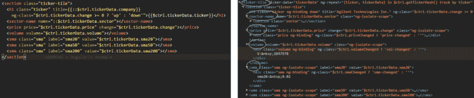

AngularJS directive/component (left side), Rendered HTML (right side) - Wrapper element is created for each child directive.

下面是 React 中类似 ticker 组件的 HTML 呈现:

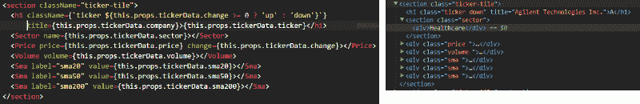

React component (left side), Rendered HTML (right side) - No wrapper elements created for child components

在我们的具体示例中，与 React 相比，AngularJS 创建了额外的 1400 个 DOM 节点来呈现相同数量的 ticker(200)。

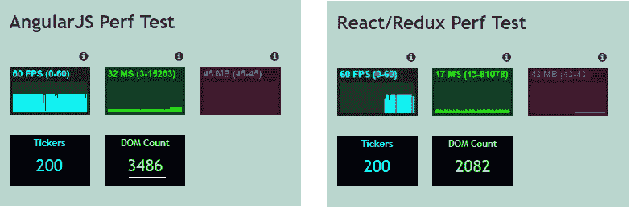

DOM count — AngularJS vs. React

### 场景 1 —切换视图

我们浏览 5000 个滚动条的列表，每 0.5 秒显示 150 个滚动条。

下图描绘了 Chrome 性能时间表中每次刷新的脚本执行时间。AngularJS 删除现有的 150 个跑马灯并显示新的跑马灯始终需要 200 毫秒以上。而 React/Redux 在 90-100 毫秒内完成了同样的工作(是 ng1 的一半时间)。React/Mobx 版本比 Redux 版本花费的时间稍多，但也相差不远。

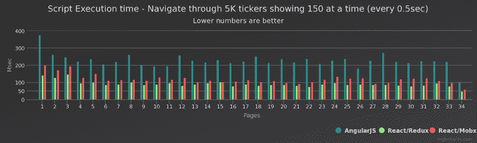

Script execution time comparison (AngularJS vs. React/Redux vs. React/Mobx) — Replacing 150 tickers every 0.5 sec

下图显示了刷新时的每秒帧数(fps)。Redux 和 Mobx 版本保持在 45fps 左右，而 AngularJS 在整个运行过程中保持在 30 fps 左右。

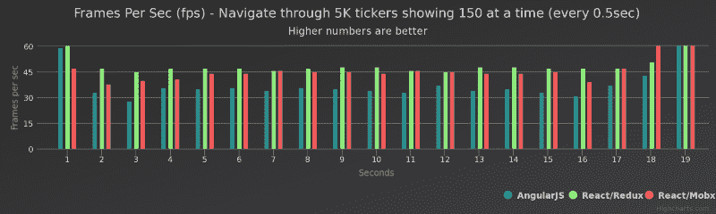

#### **内存& GC 暂停**

下图显示了刷新期间测量的 JavaScript 堆大小(' usedJSHeapSize ')。AngularJS 和 Mobx 版本都显示了内存消耗的阶梯模式，这表明 Chrome 启动了 GC 来回收内存。Redux 版本在整个运行过程中与它的低内存配置文件超级一致。

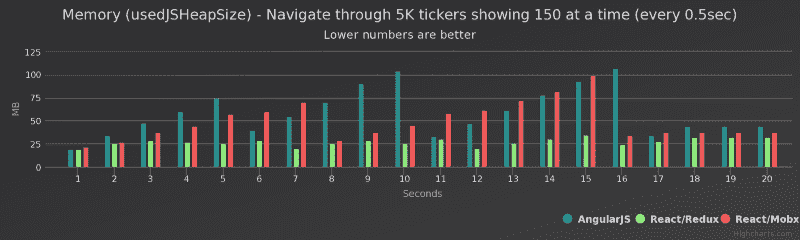

让我们仔细看看所有这三个版本的时间线配置文件。

AngularJS 的执行在 ticker 列表刷新时导致了几次 GC 暂停。 [V8 试图通过在空闲时间的未使用块中安排 GC 暂停来隐藏 GC 暂停，以提高 UI 响应能力](https://v8project.blogspot.com/2015/08/getting-garbage-collection-for-free.html)。与这种理想行为相反，GC 暂停发生在脚本执行期间，会增加总的执行时间。

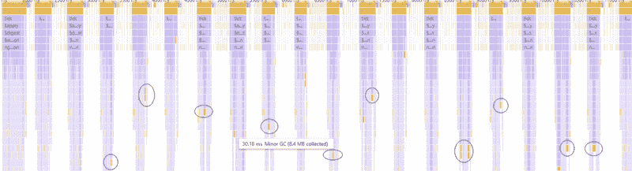

AngularJS emitted lot of GC events as the ticker list is refreshed with 150 new items

Redux 性能配置文件显示在脚本执行期间没有任何 GC 暂停。

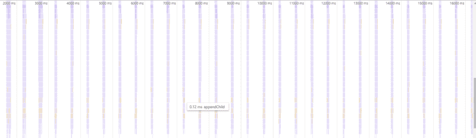

React/Redux — No GC pauses

Mobx 配置文件显示 GC 暂停很少，但不如 AngularJS 版本多。

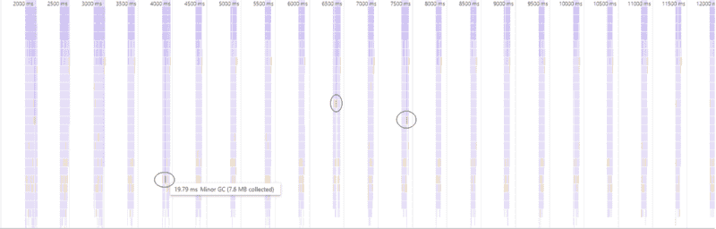

React/Mobx — Few GC pauses but not as many as AngularJS version

### 场景 2 —添加报价机

我们将每 100 毫秒向可见集合添加 50 个滚动条，直到我们显示所有滚动条。显示所有 5000 个 tickers 的结果并不现实，但是看看每个框架如何处理它会很有趣。

下图描绘了 Chrome 性能时间表中的脚本执行时间。在 AngularJS 的例子中，随着越来越多的滚动条被添加到页面中，脚本执行时间线性增加。与其他版本相比，AngularJS 从一开始就花了更多的时间来添加新的代码。

有趣的是，Redux 和 Mobx 版本显示出令人印象深刻的性能，即使是在页面上有数千个滚动条的图表右侧。与 AngularJS 的脏检查相比，React 的虚拟 DOM diffing 算法正在显示其优势。

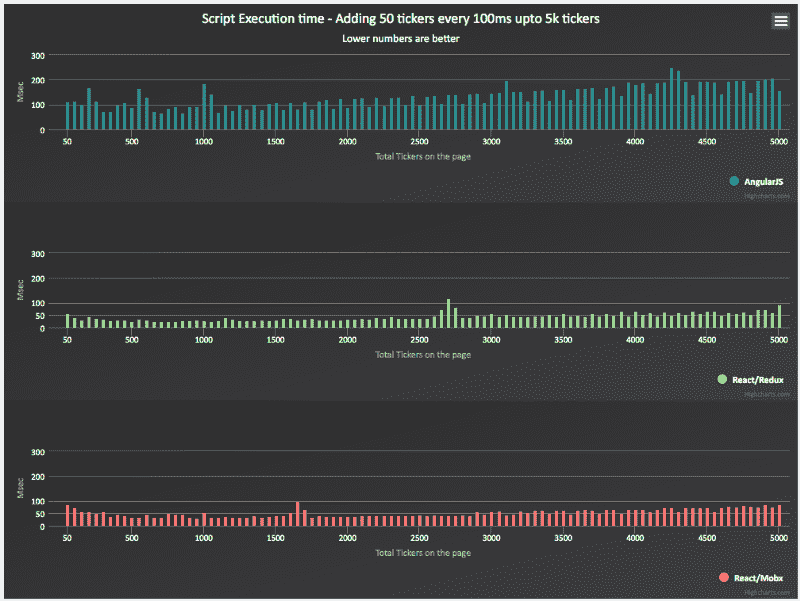

Adding Tickers — Script execution time comparison

对于 AngularJS，添加新项目会导致浏览器从一开始就出现抖动(红色条)，每秒帧数从早期的 60 帧下降，并且在整个添加操作期间从未恢复(绿色区域)。

AngularJS — Add tickers timeline

Redux 在早期创造了 jank 一次，但这一切都很清楚，直到我们越过添加新 tickers 的中点。在添加操作之间，FPS 也很好地恢复到了 60。

Redux-Add Tickers timeline

Mobx 给 jank 造成的伤害是 Redux 的几倍，但远不及 AngularJS。

Mobx — Add tickers timeline

#### **记忆& GC 事件**

在整个运行过程中，Redux 消耗了大约一半的堆大小。Mobx 介于两者之间。

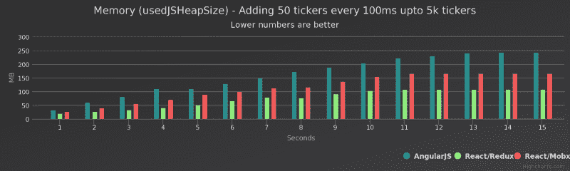

Adding Tickers — Memory Comparison

添加新的 tickers 也触发了 AngularJS 的一些 GC 暂停(几乎每个添加操作都会触发一次)。Redux 总体上触发的 GC 暂停更少。随着我们向列表中添加越来越多的 tickers，Mobx 开始触发更多的 GC 暂停。

Adding Tickers — AngularJS GC events (partial timeline)

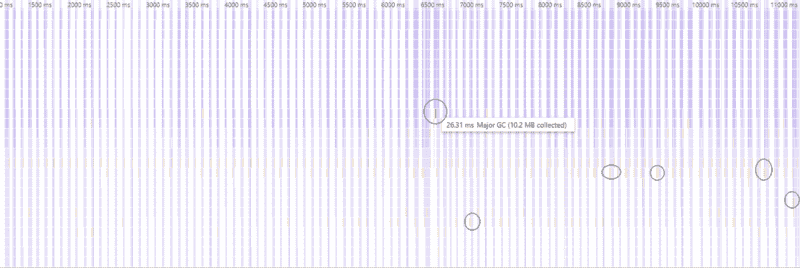

Adding Tickers — React/Redux GC events (partial timeline)

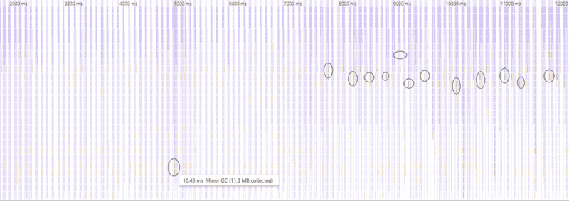

Adding Tickers — Mobx GC events (partial timeline)

### 场景 3 —快速更新价格/数量

这是实时应用程序中最常见的场景。一旦呈现了视图，就会有一连串的更新通过 web 套接字、xhr 调用等进入应用程序。想象一下存在更新、股票价格变化、喜欢/转发/鼓掌计数变化等用例。让我们看看每个框架在这个场景中的表现。

以下所有指标都是在页面上有 1500 个分笔成交点并且价格/交易量每 10 毫秒发生变化的情况下得出的。

AngularJS 再次努力跟上快速连续发生的更新。每次更新的脚本执行大约需要 35 毫秒。Redux 用了 6 毫秒来更新视图。Mobx 大放异彩，2ms 内更新视图。Mobx 的派生图根据哪个可观察对象的状态发生变化，准确地知道要更新哪个组件。

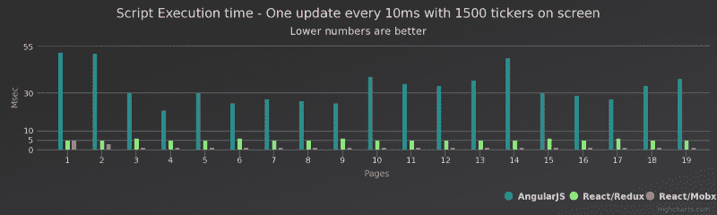

Updates — Script execution comparison

下面是显示每个版本的脚本执行的时间线配置文件。

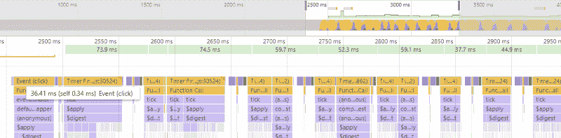

AngularJS — Updates to Price/Volume

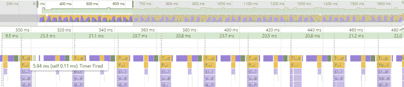

Redux — Updates to Price/Volume

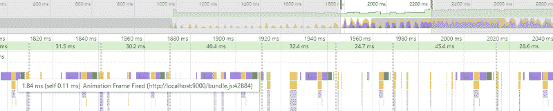

Mobx — Updates to price/volume

Redux 和 Mobx 的 FPS 一直保持在 60，而 AngularJS 的 FPS 徘徊在 30 以下。

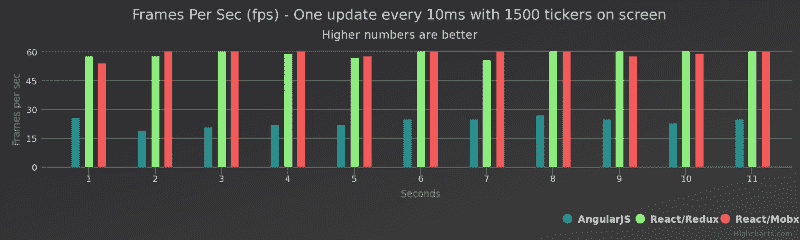

Updates to Price/Volume — Frames Per Second

### 场景 4 —删除报价机

我们会将所有 5000 个 ticker 添加到页面中，并开始每隔 100 毫秒从可见集合中移除 50 个 ticker。

下图显示了初始删除迭代的性能概况。与 React 版本相比，AngularJS 几乎慢了 4 倍。Redux 和 Mobx 在最初的迭代中花费了更多的时间，但是每次删除操作花费了 50-70 毫秒。

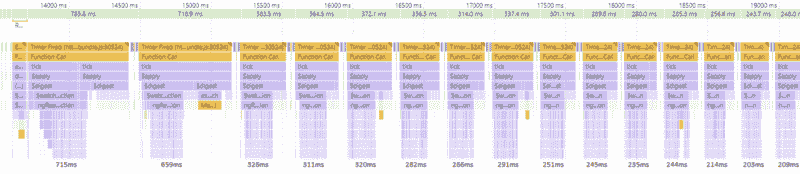

AngularJS — Deleting 50 tickers from 5000 tickers every 100ms (initial iterations)

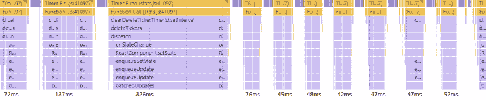

Redux — Deleting 50 tickers from 5000 tickers every 100ms (initial iterations)

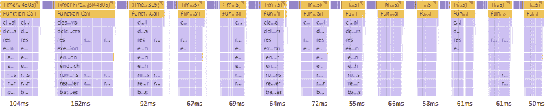

Mobx — Deleting 50 tickers from 5ooo tickers every 100ms (initial iterations)

从上述所有测试中可以清楚地看出，与 AngularJS 相比，React 的性能有了显著提高。

随着应用程序变得越来越大，视图变得越来越复杂，框架的运行时配置文件开始以各种方式不同。我们的目标是复制我们的目标场景，测量性能/内存影响，并查看每个框架的优缺点。

即使有了最具性能的框架，我们仍然需要应用许多规则并遵循正确的模式来使应用程序具有可伸缩性和高性能。

我在另一篇文章中回顾了 Redux 和 Mobx 的核心概念、优点和缺陷。

感谢阅读。希望这对你有帮助。

附注:感谢[希亚姆·阿迦拉普](https://www.freecodecamp.org/news/measuring-performance-gains-angularjs-to-react-with-redux-or-mobx-fb221517455/undefined)和[亚当·卡尔](https://www.freecodecamp.org/news/measuring-performance-gains-angularjs-to-react-with-redux-or-mobx-fb221517455/undefined)审阅本文。