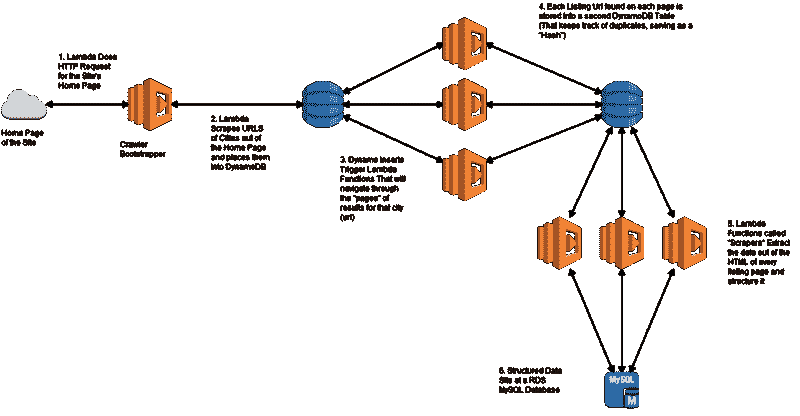

# 我如何构建一个无服务器网络爬虫来大规模挖掘温哥华房地产数据

> 原文：<https://www.freecodecamp.org/news/how-to-build-a-scalable-crawler-on-the-cloud-that-can-mine-thousands-of-data-points-costing-less-a9825331eef5/>

作者:马塞洛·林斯

# 我如何构建一个无服务器网络爬虫来大规模挖掘温哥华房地产数据

我最近从巴西里约热内卢搬到了加拿大温哥华。除了美丽的风景，首先映入你眼帘的是租金。温哥华目前是世界上生活成本最高的五大城市之一。一处房产的租赁价格表明了实际拥有和抵押同一处房产的[成本有多高。](https://betterdwelling.com/canadian-real-estate-prices-will-drop-or-rents-will-soar-show-oecd-numbers/)

我决定开始一个副业项目，可以挖掘相当数量的房屋列表并处理数据。我想对温哥华目前的房地产市场提出自己的结论。在网上的这些列表网站上有一堆格式良好的数据，为什么不去获取呢？这个项目就是这样诞生的。

这篇文章将带你了解我在完全不使用服务器的情况下构建的第一个爬虫的架构、成本、优缺点等等。它 100%生活在云上，只使用 AWS(亚马逊网络服务)。

### 等等，你说“没有服务器”？

果不其然，你在云上运行的所有东西最终都会由服务器进行备份。我所说的“无服务器”是指您不必亲自维护任何服务器或虚拟机。

诀窍是围绕云原生服务构建你的架构，比如 [AWS Lambda](https://aws.amazon.com/lambda/) 、 [DynamoDB](https://aws.amazon.com/dynamodb/) 、 [RDS MySQL](https://aws.amazon.com/rds/mysql/) 和 [Cloudwatch](https://aws.amazon.com/cloudwatch/) 。然后用巧妙的方式让他们一起工作。

我们可以开始了吗？

### 项目架构

如果您不熟悉这些服务，我将为您总结如下:

*   [AWS Lambda](https://aws.amazon.com/lambda/) :
    运行在云上的短命函数
    每当这些函数被调用或触发时，它们就会旋转起来，运行您写入其中的代码，并在运行完成后立即关闭。你只需要为每个函数实际执行的时间付费。
*   [DynamoDB](https://aws.amazon.com/dynamodb/) :
    完全托管在云上的 NoSQL 数据库
    你可以向它提供 JSON 记录，它们将存储在一个你不必维护的服务器上。您可以在几秒钟内扩展您的读写吞吐量。截至 2017 年初，他们开始支持一种 [TTL](https://aws.amazon.com/about-aws/whats-new/2017/02/amazon-dynamodb-now-supports-automatic-item-expiration-with-time-to-live-ttl/) (生存时间)机制。这允许您的对象在达到 TTL 后被自动删除。
*   [RDS MySQL](https://aws.amazon.com/rds/) :
    云上完全托管的 RDS(关系数据库服务)MySQL 数据库
    扩展或缩减，按需备份。我们最近宣布了一个新的[开始和停止](https://aws.amazon.com/about-aws/whats-new/2017/06/amazon-rds-supports-stopping-and-starting-of-database-instances/)功能。它允许您将实例连续停止 7 天。您只是为实例量付费，而不是为其实例小时数付费。
*   [CloudWatch](https://aws.amazon.com/cloudwatch/) :
    监控并记录你在云上的资源
    你可以从每一年开始免费获得这个。log”消息直接记录到 CloudWatch 流中。

### 投影玻璃

开始这个项目时，我心中有几个目标。然后我开始边走边即兴创作。对我来说，理想的项目应该是:

*   完全由云上的 AWS 管理，不需要服务器
*   具有弹性，可根据负载上下伸缩
*   能够处理成千上万的列表
*   不贵

### 成本细目

这个项目可以依赖 Lambda 和 CloudWatch。它们是免费的，除非你不停地运行它。然后账单就来了。

对于 DynamoDB 和 RDS MySQL 的存储层，你每月将支付不到 3 美元。您可以连续停止 RDS 数据库长达 7 天。当您不使用 DynamoDB 表时，您可以将它们缩小到 1 个读+ 1 个写单元。

这使你的总费用估计为每月 2.40 美元。查看[我的文档](https://github.com/MarcelloLins/ServerlessCrawler-VancouverRealState/wiki)以获得更详细的分类。

### 旅程

从开始到结束，整个项目花了我大约 19 个小时的工作。根据您之前对 AWS 和 Python 的了解，您的收获可能会有所不同。我对两者都很熟悉，但对迪纳摩和拉姆达服务不熟悉。

Lambda 函数的设置需要时间来适应。当谈到可用性和指标时，它肯定比不上其他 AWS 服务。

一旦你习惯了整个 Lambda 开发的舞蹈:`edit Python files locally` - & g `t; create a .zip pack`年龄`-> uploa` d 那取代你的 Lambda Functi `on -> Save`和测试，它会变得更好。

与 CloudWatch 的集成绝对是加分项。它是免费的，当你试图理解为什么你的 lambda 在 HTTP 请求后失败，或者在你忘记缩进的另一个循环中失败时，它会派上用场。

利用[环境变量](http://docs.aws.amazon.com/lambda/latest/dg/env_variables.html)，调整函数资源和超时，以及启用和禁用测试的触发器，这些工作都非常顺利，并且融合得非常好。它不需要您重新部署您的功能。此外，我注意到 Lambda 函数的旋转速度很快，几乎没有明显的延迟。我假设他们在引擎盖下使用某种智能缓存的 [ECS](https://aws.amazon.com/ecs/) ，但我不知道。

设置 DynamoDB 表再简单不过了。我们说的是一个提示设置，你只需要填写两个框，你的表名和你的表的分区键。为每个表配置 TTL 工作正常。但是你不能经常做和撤销它。它会阻止你打开和关闭它，因为它会删除你的记录，而不收取这些操作的费用。出于测试目的，在每个表上手动插入 dynamoDB 记录可以很好地工作。每次插入或批处理触发 lambda 函数时几乎没有延迟。用读写单元上下调整每个表的容量轻而易举。它允许您调整它们，只有几秒钟的延迟，以应用新的配置。

开始配置 RDS MySQL 肯定比 Lambda 容易，但比 DynamoDB 步骤更多。你也有更多的选择。您可以选择实例类型、卷大小和类型、冗余、维护窗口和备份保留期。一旦你设置好了，10 分钟后你就有了闪亮的 MySQL 实例，准备好了。

在设置和测试阶段结束后，当清单进入 MySQL 时，我有一个沉思的时刻。在拍摄过程中，我可以坐下来，放松一下，喝杯啤酒。或者三瓶啤酒。打个盹？*这东西慢！*

### 毛边

表演从来不是我的目标。修补现有的技术，并建立一些很酷的东西。但没想到会这么慢。最终，它能够每 6 小时捕获大约 11000 个列表，也就是说大约每 2 秒钟一个列表。我写过分布式爬虫，速度比这个快 30 倍。不过，它们可能没有那么令人兴奋。

每个页面的 HTTP 请求平均需要 0.7 到 1.1 秒返回。考虑到启动每个 lambda 容器所需的时间，加上通过网络连接到 MySQL 并插入每条记录，您有 2 秒钟的时间。每个 lambda 接收 5 个 DynamoDB 记录的批或流。对于解析 lambdas，每个 lambda 函数的平均寿命约为 7 秒。

可以做的一些优化是并行执行每个批处理的 HTTP 请求，并在 MySQL 中执行批处理插入。

说到并行性，对我来说最冷的一桶水是 Lambda 不能很好地水平扩展。在我的脑海中，每一个插入到 Dynamo 中的流都会立即触发一个 lambda 函数来处理它。这意味着 Lambda 将永远追上 Dynamo 的插入速度。所以我会有几十个 Lambda 函数在任何给定的时间运行，全部并行，非常漂亮。**我错了** *。*

实际情况是，Lambda 有一个并发执行的限制[和 DynamoDB 表有多少个碎片有关。因为我的表只有一个碎片，所以只有一个 Lambda 函数一直在运行。发生的情况是，尽管 dynamoDB 表的插入需要几分钟，Lambda 的第二层被缓慢地一个接一个地触发。有一个内部队列存储我的 dynamo 流，并通过序列化我的执行而不是并行化它们来馈送给 Lambda。](http://docs.aws.amazon.com/lambda/latest/dg/concurrent-executions.html)

DynamoDB 表内容的每一个变化都会触发您的 Lambda 函数。问题是，这些更改可能不仅仅是插入，还包括更新，并且当 TTL 收集器开始清除您的 set-to-expire 记录时，会触发一些删除。幸运的是，每个 DynamoDB 流包含流中每个记录的一个属性，您可以用它来判断该对象是被插入、更新还是删除了。我收到了所有东西，因为没有办法设置 Lambda，只能处理插入。

### 利弊

**优点**:

*   便宜的
*   完全托管/无服务器
*   尖端技术
*   灵活的基础设施
*   如果你发现了一个 bug，你可以立即修改你的 lambdas 来修复每一个后续批次

**缺点:**

*   慢的
*   一旦开始，你就不能暂停它并从它离开的地方重新开始
*   到目前为止只可能调整(代码方面的变化)
*   测试特定的部分需要你不断地禁用和启用 Lambda 触发器

### 定论

尽管最初很有吸引力，但对于需要性能和灵活性来轻松改变架构和调整比正在运行的代码更多的东西，我不会推荐这种架构。但是，这种设置是便宜的，对于一些小的东西，它工作得很好。这可能不是最容易设置的，但是一旦你过了这一关，维护就几乎为零。

我很高兴写下这些，并把所有这些碎片粘在一起，建造这个小弗兰肯斯坦。我会再做一次。我仍然检查了这个项目的所有初始目标，但是，是的，性能可以更好。

最后，通过多次运行这个过程，我成功下载了超过 40k 个清单的数据。有了这些，我计划编写代码来处理这些数据，但是，现在，这仍然是一个 WIP。

如果你能走到这一步，我只能感谢你。我整理了一份指南，告诉你如何[建立自己的 AWS 账户](https://github.com/MarcelloLins/ServerlessCrawler-VancouverRealState/wiki/How-do-I-set-this-up-On-My-Own-AWS-Account%3F)。既然代码是[开源](https://github.com/MarcelloLins/ServerlessCrawler-VancouverRealState)反正就去黑吧！

如果你想查看的话，代码在 GitHub 上是公开的。最初的文章发表在我的博客上[。如果你想看看我还在做什么就过来看看。](https://techflow.me/)

如果您有任何问题或只是想聊天，请随时通过我的[个人页面](http://about.me/marcellolins)联系我。

下次再见:)