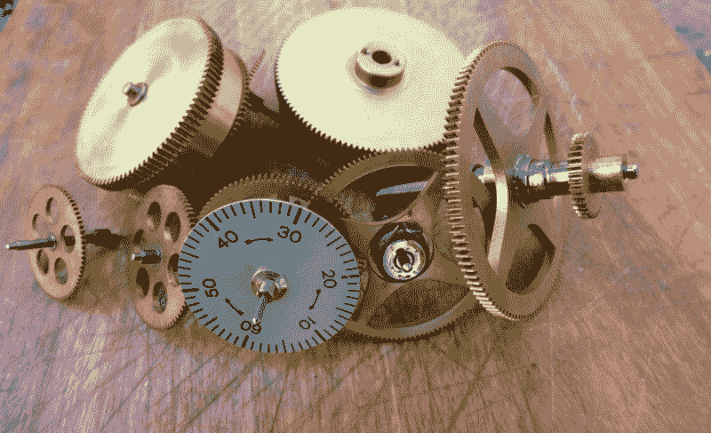
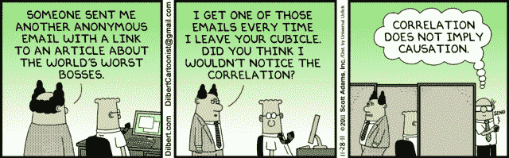
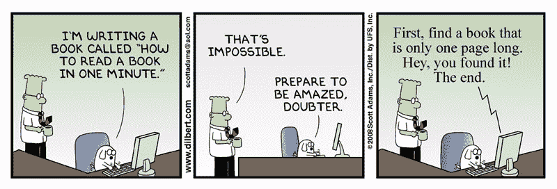
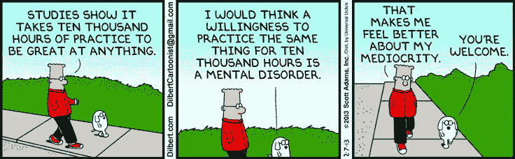
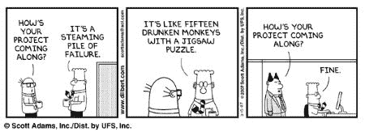
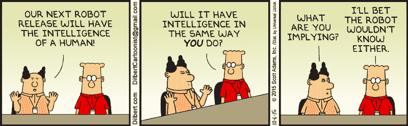

# 机器如何学习:实用指南

> 原文：<https://www.freecodecamp.org/news/how-machines-learn-a-practical-guide-203aae23cafb/>

依卡林维尔

# 机器如何学习:实用指南

您可能已经从垃圾邮件过滤、光学字符识别和计算机视觉等有趣的应用中听说过机器学习。

开始使用机器学习是一个漫长的过程，需要浏览多种资源。有给新手的书、学术论文、指导练习和独立项目。在所有这些选项中，很容易忘记你需要学习什么。

因此，在今天的帖子中，我将列出七个步骤(和 50 多种资源)，可以帮助你开始进入这个令人兴奋的计算机科学领域，并逐渐成为机器学习英雄。

请注意，这个资源列表并不详尽，只是为了帮助您入门。周围还有很多资源。

### 1.获取必要的背景知识

你可能还记得 DataCamp 的 [Learn Data Science](https://www.datacamp.com/community/tutorials/learn-data-science-infographic) 信息图，数学和统计学是启动机器学习(ML)的关键。基础可能看起来很简单，因为它只有三个主题。但是不要忘记，这实际上是三个广泛的话题。

这里有两件事需要牢记在心:

*   首先，你肯定想要一些进一步的指导，告诉你到底需要做些什么来开始。
*   第二，这些是你进一步学习的基础。不要害怕慢慢来。获取知识，你将在此基础上建立一切。

第一点很简单:覆盖线性代数和统计是个好主意。这两个是人们应该理解的最起码的东西。但是当你这么做的时候，你也应该试着涵盖一些主题，比如最优化和高等微积分。当你深入了解 ML 时，它们会派上用场。

如果您是从零开始，这里有一些关于从哪里开始的提示:

*   [可汗学院](http://www.khanacademy.org/)是初学者的好资源。考虑学习线性代数和微积分课程。
*   去[麻省理工学院开放课件](https://ocw.mit.edu/index.htm)上[线性代数](https://ocw.mit.edu/courses/mathematics/18-06-linear-algebra-spring-2010/)课程。
*   参加[这门课程](https://www.coursera.org/learn/basic-statistics),学习描述统计学、概率论和推断统计学的介绍。

Statistics is one of the keys to learning ML

如果你更喜欢书，可以考虑以下几点:

*   **线性代数及其应用**
*   **[*应用线性代数*](https://www.amazon.com/Applied-Linear-Algebra-3rd-Noble/dp/0130412600) ，**
*   **[*3000 线性代数解题*](https://www.amazon.de/Solved-Problems-Linear-Algebra-Schaums/dp/0070380236) *，***
*   **[麻省理工学院在线教科书](https://ocw.mit.edu/courses/online-textbooks/)**

**然而，在大多数情况下，你将开始了解一些关于统计和数学的知识。或者也许你已经浏览了上面列出的所有理论资源。**

**在这些情况下，诚实地回顾和评估你的知识是一个好主意。你有什么需要改进的地方吗，或者你现在还不错吗？**

**如果您已经准备好了，那么是时候继续使用 R 或 Python 应用所有知识了。一般来说，选择一种语言并开始使用它是一个好主意。稍后，您仍然可以将其他编程语言添加到您的技能集中。**

**为什么所有这些编程知识都是必要的？**

**嗯，你会看到上面列出的课程(或者你在学校或大学学过的课程)会给你提供一个更理论化(而不是应用化)的数学和统计学主题的介绍。然而，ML 是非常实用的，你需要能够应用你所学的所有主题。因此，再复习一遍这些材料是个好主意，但这次要以应用的方式。**

**如果你想掌握 R 和 Python 的基础，可以考虑以下课程:**

*   **DataCamp 的 Python 或 R 入门课程:[数据科学 Python 入门](https://www.datacamp.com/courses/intro-to-python-for-data-science)或[R 编程入门](https://www.datacamp.com/courses/free-introduction-to-r)。**
*   **Edx 的 Python 和 R 入门课程:[数据科学 Python 入门](https://www.edx.org/course/introduction-python-data-science-microsoft-dat208x-5)和[数据科学 R 入门](https://www.edx.org/course/introduction-r-data-science-microsoft-dat204x-4)。**
*   **还有许多其他的免费课程。查看 [Coursera](http://www.coursera.org/) 或 [Codeacademy](https://www.codecademy.com/) 了解更多信息。**

**当你确定了基础知识后，查看 DataCamp 的博客 [40+ Python 统计数据科学资源](https://www.datacamp.com/community/tutorials/python-statistics-data-science)。这篇文章提供了 40 多个关于统计学主题的资源，你需要知道这些资源来开始学习数据科学(也包括 ML)。**

**另外，一定要看看[这个关于向量和数组的科学教程](https://www.datacamp.com/community/tutorials/python-scipy-tutorial)和[这个关于 Python 科学计算的研讨会](http://www.math.pitt.edu/~siam/workshops/python10/python.pdf)。**

**要实际操作 Python 和微积分，您可以查看 [SymPy 包](http://docs.sympy.org/latest/tutorial/calculus.html)。**

### **2.不要害怕投资 ML 的“理论”**

**许多人不努力去阅读更多的理论材料，因为它“枯燥”或“无聊”但是从长远来看，研究理论并真正投入时间是必要的，也是无价的。你将更好地理解机器学习的新进展，并且你将能够链接回你的背景知识。这将帮助你保持动力。**

**此外，这个理论不需要很无聊。正如你在介绍中读到的，有很多材料会让你更容易进入其中。**

**书籍是吸收理论知识的最佳途径之一。他们迫使你偶尔停下来思考一下。当然，读书是一件非常静态的事情，它可能不符合你的学习风格。尽管如此，试试下面的书，看看它是否适合你:**

*   **[*机器学习教材*](http://www.cs.cmu.edu/~tom/mlbook.html) ，作者汤姆·米切尔可能很旧，但它是黄金。这本书详细解释了机器学习中最重要的主题，并循序渐进。**
*   ***机器学习:使数据有意义的算法的艺术和科学*(你可以在这里看到本书的幻灯片):这本书对初学者来说非常棒。讨论了许多现实生活中的应用，这可能是汤姆·米切尔的书中所没有的。**
*   **[*机器学习的向往*](http://www.mlyearning.org/) :吴恩达的这本书还没有完成，但对于学习 ML 的人来说，它一定是一个极好的参考。**
*   **Jurg Nievergelt 和 Klaus Hinrichs 的 [*算法和数据结构*](https://www.amazon.com/Algorithms-Data-Structures-Applications-Practitioner/dp/0134894286)**
*   **也可以看看马修诺斯的 [*大众数据挖掘*](https://www.amazon.com/Data-Mining-Masses-Matthew-North/dp/0615684378) 。你会发现这本书会引导你理解一些最难的话题。**
*   **[*机器学习简介*](http://alex.smola.org/drafts/thebook.pdf)Alex Smola 和 S.V.N. Vishwanathan。**

**

Take your time to read books and to study the material covered in them** 

**对于那些通过看和听来学习的人来说，视频/mooc 非常棒。有很多 MOOCs 和视频，但也很难在所有这些材料中找到自己的路。以下是一些最著名的例子:**

*   **这个著名的机器学习 MOOC ，由吴恩达教授，向你介绍机器学习和理论。不要担心——它解释得很清楚，并且一步一步来，所以对初学者来说是极好的。**
*   **麻省理工学院开放课件 6034 课程的[播放列表:已经有点高级了。在开始这个系列之前，你肯定需要一些关于 ML 理论的前期工作，但是你不会后悔的。](https://youtu.be/TjZBTDzGeGg?list=PLnvKubj2-I2LhIibS8TOGC42xsD3-liux)**

**在这一点上，对你来说，重要的是回顾一下单独的技术，并掌握全局。这从理解关键概念开始:有监督和无监督学习的区别，分类和回归，等等。手工(书面)练习可以派上用场。它们可以帮助你理解算法是如何工作的，以及你应该如何去做。你会在大学的课程中找到这些书面练习。看看波特兰州立大学的这个 ML 课程吧。**

### **3.动手实践**

**通过阅读和观看了解理论和理解算法都是好的。但是你也需要超越这个阶段，开始做一些练习。你将学习实现这些算法并应用你所学的理论。**

**首先，您可以通过教程了解 Python 和 r 中的机器学习基础知识。当然，最好的方法是通过交互式教程:**

*   **在[Python Machine Learning:Scikit-Learn 教程](https://www.datacamp.com/community/tutorials/machine-learning-python)中，你会了解到更多关于知名算法 KMeans 和支持向量机(SVM)用 sci kit-Learn 构造模型的知识。**
*   **[面向初学者的 R 中的机器学习](https://www.datacamp.com/community/tutorials/machine-learning-in-r)通过 class 和 caret 包向您介绍 R 中的 ML。**
*   **[Keras 教程:Python 中的深度学习涵盖了](https://www.datacamp.com/community/tutorials/deep-learning-python)如何为分类和回归任务构建多层感知器(MLP)，循序渐进。**

**另外，请查看以下教程，这些教程是静态的，需要您在 IDE 中工作:**

*   **[Python 中的机器学习，循序渐进](http://machinelearningmastery.com/machine-learning-in-python-step-by-step/):用 Scikit-Learn 的循序渐进教程。**
*   **[用 Keras 一步一步地用 Python 开发你的第一个神经网络](http://machinelearningmastery.com/tutorial-first-neural-network-python-keras/):通过本教程，学习如何用 Keras 开发你的第一个神经网络。**
*   **还有很多可以考虑，但是[机器学习大师](http://www.machinelearningmastery.com/)的教程都很不错。**

**除了教程，还有课程。参加课程会帮助你专注地应用你所学的概念。有经验的教练会帮助你。下面是一些 Python 和 ML 的互动课程:**

*   **[sci kit-learn 的监督学习](https://www.datacamp.com/courses/supervised-learning-with-scikit-learn):您将学习如何构建预测模型，调整其参数，并预测它们对未知数据的执行情况。同时使用真实世界的数据集。您将使用 Scikit-Learn 来完成此操作。**
*   **[Python 中的无监督学习](https://www.datacamp.com/courses/unsupervised-learning-in-python):向您展示如何从无标签数据集中聚类、转换、可视化和提取洞察力。在课程结束时，您将构建一个推荐系统。**
*   **[Python 中的深度学习](https://www.datacamp.com/courses/deep-learning-in-python):您将获得如何使用 Keras 2.0 深度学习的实践知识，Keras 2.0 是 Python 中深度学习的最新版本。**
*   **[Python 中的应用机器学习](https://www.coursera.org/learn/python-machine-learning):向学习者介绍应用 ML，更侧重于技术和方法，而不是这些方法背后的统计数据。**

**

After the theory, take your time to apply the knowledge you have gained.** 

**对于那些用 R 学习 ML 的人，也有这些互动课程:**

*   **[机器学习简介](https://www.datacamp.com/courses/introduction-to-machine-learning-with-r)让你对该学科最常见的技术和应用有一个大致的了解。您将更深入地了解不同 ML 模型的评估和培训。课程的其余部分着重介绍三个最基本的 ML 任务:分类、回归和聚类。**
*   **[R:无监督学习](https://www.datacamp.com/courses/unsupervised-learning-in-r)从 ML 的角度提供了 R 中聚类和降维的基本介绍。这可以让你尽快从数据中获得洞察力。**
*   **[实用机器学习](https://www.coursera.org/learn/practical-machine-learning)涵盖了构建和应用预测函数的基本组件，重点是实际应用。**

**最后，也有一些书以一种非常实用的方式讲述了 ML 的主题。如果你想在文本和 IDE 的帮助下学习，看看这些书:**

*   **[*Python 机器学习书籍*](https://github.com/rasbt/python-machine-learning-book) 塞巴斯蒂安·拉什卡著**
*   **人工神经网络和深度学习简介:Python 应用实践指南**
*   **[*机器学习与 R*](https://books.google.be/books/about/Machine_Learning_with_R.html?id=ZQu8AQAAQBAJ&source=kp_cover&redir_esc=y) 作者布雷特·兰茨**

### **4.实践**

**实践甚至比亲自动手和用 Python 修改材料更重要。这一步对我来说可能是最难的一步。当你做了一些练习后，看看其他人是如何实现 ML 算法的。然后，开始你自己的项目，展示你对 ML 算法和理论的理解。**

**最直接的方法之一是把练习看得稍微大一点。你想做一个更大的练习，这需要你做更多的数据清理和特征工程。**

*   **从 [Kaggle](http://www.kaggle.com/) 开始。如果你需要额外的帮助来克服所谓的“数据恐惧”，请查看关于机器学习的 [Kaggle Python 教程](https://www.datacamp.com/community/open-courses/kaggle-python-tutorial-on-machine-learning)和关于机器学习的 [Kaggle R 教程](https://www.datacamp.com/community/open-courses/kaggle-tutorial-on-machine-learing-the-sinking-of-the-titanic)。这些会让你很快跟上速度。**
*   **之后，你也可以开始自己做挑战。查看这些网站，在那里你可以找到大量的 ML 数据集: [UCI 机器学习库](http://archive.ics.uci.edu/ml/)、[机器学习公共数据集](http://homepages.inf.ed.ac.uk/rbf/IAPR/researchers/MLPAGES/mldat.htm)和 [data.world](https://data.world/) 。**

****提示**:不要忘了在你练习的时候有现成的资源可以帮你——看看这些[数据科学小抄](https://www.datacamp.com/community/data-science-cheatsheets)。**

**

Practice makes perfect.** 

### **5.项目**

**做小练习是有好处的。但是最后，你会想要做一个项目，在这个项目中你可以展示你对你一直在使用的 ML 算法的理解。**

**最好的练习是实现你自己的 ML 算法。在接下来的几页中，你可以了解到更多关于你为什么要做这个练习以及你能从中学到什么的信息:**

*   **[为什么有很多像 tensorflow 这样的高级 API 可用，还需要手动实现机器学习算法？](https://www.quora.com/Why-is-there-a-need-to-manually-implement-machine-learning-algorithms-when-there-are-many-advanced-APIs-like-tensorflow-available)**
*   **[为什么要从零开始实现机器学习算法？](http://www.kdnuggets.com/2016/05/implement-machine-learning-algorithms-scratch.html)**
*   **[我在 Python 中从零开始实现分类器所学到的东西](http://www.jeannicholashould.com/what-i-learned-implementing-a-classifier-from-scratch.html)**

**接下来，您可以查看以下帖子和资源库。他们会从其他人那里给你一些启发，并展示他们是如何实现 ML 算法的。**

*   **[如何实现机器学习算法](http://machinelearningmastery.com/how-to-implement-a-machine-learning-algorithm/)**
*   **[ML 从零开始](https://github.com/eriklindernoren/ML-From-Scratch)**
*   **[机器学习算法从零开始](https://github.com/madhug-nadig/Machine-Learning-Algorithms-from-Scratch)**

**

Projects can be hard at start, but they’ll increase your understanding even more.** 

### **6.不要停下来**

**学习 ML 是一件永远不应该停止的事情。正如许多人会证实的那样，总有新的东西要学——即使你已经在这个领域工作了十年。**

**比如现在很流行的 **ML** **趋势**比如深度学习。你也可以把注意力放在其他目前不重要但将来可能会有的话题上。如果你想知道更多，看看这个[有趣的问题和答案](https://www.quora.com/Should-I-quit-machine-learning)。**

**当你担心掌握基础知识时，论文可能不是你首先想到的。但是它们是你了解最新研究的途径。论文不是为那些刚刚起步的人准备的。对于那些更高级的人来说，它们绝对是一个很好的选择。**

*   **[关于机器学习和深度学习的最近 20 篇研究论文](http://www.kdnuggets.com/2017/04/top-20-papers-machine-learning.html)**
*   **[机器学习研究杂志](http://www.jmlr.org/)**
*   **[牛逼的深度学习论文](https://github.com/terryum/awesome-deep-learning-papers)**
*   **[关于机器学习，有哪些最好的研究论文/书籍？](https://www.quora.com/What-are-some-of-the-best-research-papers-books-for-Machine-learning)**

****其他技术**也是要考虑的。但是当你刚刚开始的时候，不要担心他们。例如，您可以专注于将 Python 或 R(取决于您已经知道哪一个)添加到您的技能集。你可以浏览这个帖子，找到有趣的资源。**

**如果你也想转向大数据，你可以考虑看看 Spark。以下是一些有趣的资源:**

*   **[用 sparklyr 介绍 R 中的 Spark](https://www.datacamp.com/courses/introduction-to-spark-in-r-using-sparklyr)**
*   **[数据科学与工程与 Spark](https://www.edx.org/xseries/data-science-engineering-apache-spark)**
*   **[Apache Spark 简介](https://www.edx.org/course/introduction-apache-spark-uc-berkeleyx-cs105x)**
*   **[使用 Apache Spark 的分布式机器学习](https://www.edx.org/course/distributed-machine-learning-apache-uc-berkeleyx-cs120x)**
*   **[使用 Apache Spark 进行大数据分析](https://www.edx.org/course/big-data-analysis-apache-spark-uc-berkeleyx-cs110x)**
*   **[Python 中的 Apache Spark:初学者指南](https://www.datacamp.com/community/tutorials/apache-spark-python)**
*   **[PySpark RDD 小抄](https://www.datacamp.com/community/blog/pyspark-cheat-sheet-python)**
*   **[PySpark SQL 备忘单](https://www.datacamp.com/community/blog/pyspark-sql-cheat-sheet)。**

**其他编程语言，如 Java、JavaScript、C 和 C++在 ML 中越来越重要。从长远来看，你可以考虑将这些语言中的一种添加到你的待办事项列表中。你可以用这些博客文章来指导你的选择:**

*   **[机器学习和数据科学最流行的编程语言](https://fossbytes.com/popular-top-programming-languages-machine-learning-data-science/)**
*   **[机器学习和数据科学最流行的语言是…](http://www.kdnuggets.com/2017/01/most-popular-language-machine-learning-data-science.html)**

**

You’re never done learning.** 

### **7.利用现有的所有材料**

**机器学习是一个很难的话题，在某些时候会让你失去动力。或者你觉得你需要改变。在这种情况下，记住你可以依靠很多材料。查看以下资源:**

****播客**。继续您的 ML 之旅并了解该领域最新发展的绝佳资源:**

*   **[数据帧](https://www.datacamp.com/community/podcast)**
*   **[说话的机器](http://www.thetalkingmachines.com/)**
*   **[数据怀疑论者](https://dataskeptic.com/)**
*   **[线性题外话](http://lineardigressions.com/)**
*   **[本周在机器学习& AI](https://twimlai.com/)**
*   **[学习机 101](http://www.learningmachines101.com/)**

**当然，还有很多播客，但是这个列表只是让你开始！**

****文档和包源代码**是深入 ML 算法实现的两种方式。查看其中的一些存储库:**

*   **[Scikit- Learn](https://github.com/scikit-learn/scikit-learn) :知名 Python ML 包**
*   **[Keras](http://www.github.com/fchollet/keras):Python 的深度学习包**
*   **[caret](http://topepo/caret) :非常流行的用于分类和回归训练的 R 包**

**可视化是了解 ML 理论的最新、最时尚的方式之一。它们对初学者来说很棒，但对更高级的学习者来说也很有趣。下面的可视化将激发你的兴趣，并帮助你更好地理解 ML 的工作原理:**

*   **[机器学习的可视化介绍](http://www.r2d3.us/visual-intro-to-machine-learning-part-1/)**
*   **[提取](http://distill.pub/)让 ML 研究清晰、动态、生动。**
*   **[tensor flow——神经网络游乐场](http://playground.tensorflow.org/)如果你想尝试一下神经网络架构。**
*   **更多在此:[机器学习算法最好的可视化有哪些？](https://www.quora.com/What-are-the-best-visualizations-of-machine-learning-algorithms)**

**

Some variety in your learning can and will motivate you even more.** 

### **你现在可以开始了**

**现在就看你的了。学习 ML 是一个持续的过程，所以越早开始越好。现在，您已经拥有了开始工作的所有工具。祝你好运，一定要让我们知道你的进展。**

***这篇文章基于我对 Quora 问题[的回答，一个初学者如何开始学习机器学习](https://www.quora.com/How-does-a-total-beginner-start-to-learn-machine-learning/answer/Karlijn-Willems-1)。***