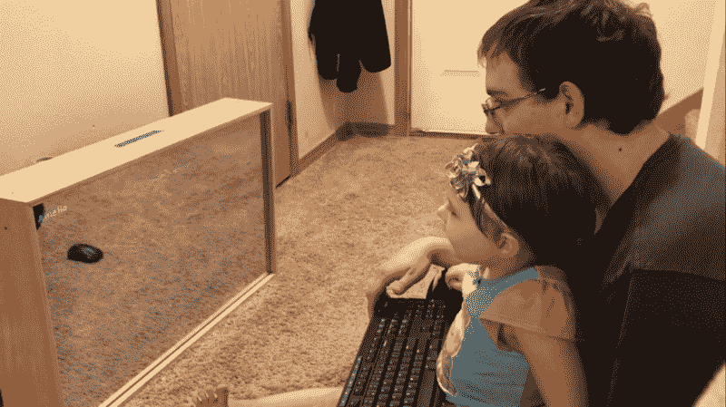
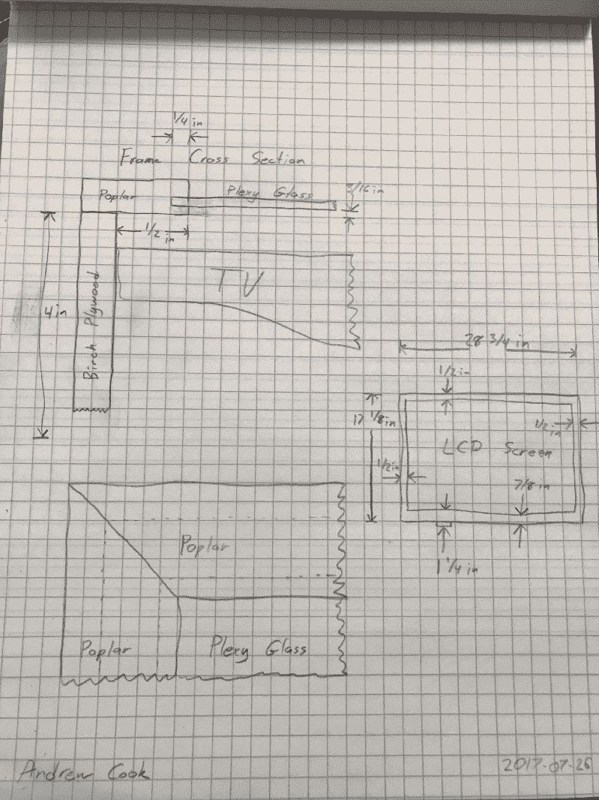
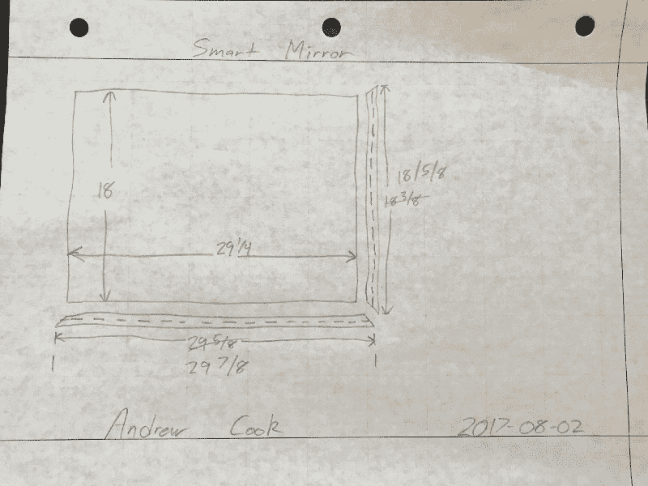
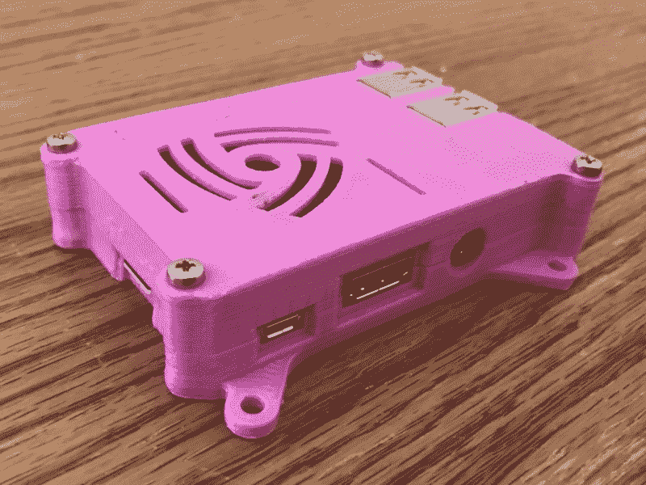
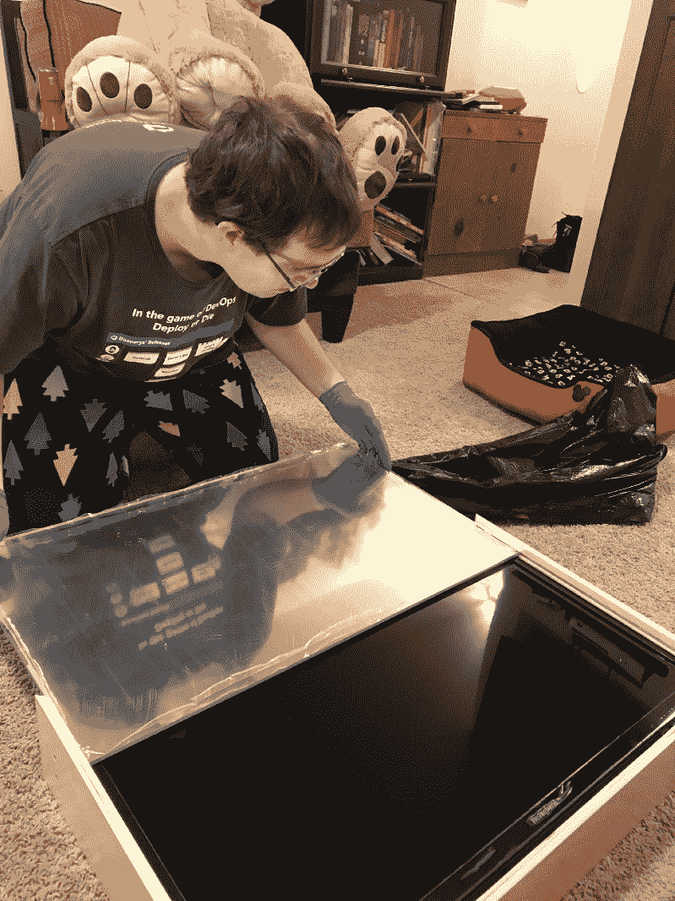
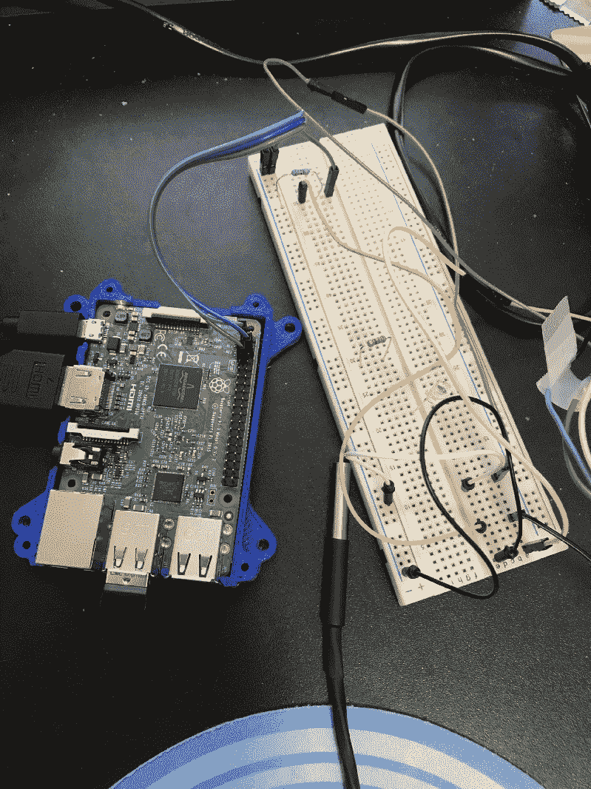

# 在女儿和她爷爷的帮助下，我如何打造智能镜子

> 原文：<https://www.freecodecamp.org/news/crafting-a-smart-mirror-with-my-dad-and-daughter-c3bdd151fefd/>

通过用 Cookie 编码

# 在女儿和她爷爷的帮助下，我如何打造智能镜子

这个月，我和爸爸、女儿一起制作了一面智能镜子。这个项目跨越了三代人。

这个想法始于几年前智能镜子的新奇。但是在我投入时间和金钱去做之前，我需要一个实际的理由去做。最近，这个理由出现了。

在我们的厨房里有一块白板，我们在上面列出了一周的晚餐计划，我想升级一下。我在当地的技术会议上提交了一份智能镜子的演示想法。我的智能镜子演示被[选中](https://seattle.codecamp.us/Session/Details/217)。这加快了我的时间线。

Programming the Smart Mirror with my Daughter

我需要帮助设计智能镜架

因为我生活在数字世界，设计生活在云端的软件。我爸爸是一名机械工程师，他生活在物理世界中，设计我们每天穿过云层的飞机。一天晚上和我爸爸聊天时，他建议先画一些镜子的草图。

Initial Design of Smart Mirror

在与我父亲进行了几次交谈和几次设计修改后，我们决定为框架设计一个简单的盒子。我爸爸比我更懂木工，他给了我一些建议。

比如用橱柜的抽屉来装框架的侧面，因为它们已经有了一个凹槽来装玻璃。使用[法国楔子](https://en.wikipedia.org/wiki/French_cleat)将镜子固定在墙上。这也使得它可以很容易地移动。

Revised Design of the Smart Mirror

我的妻子是这一努力的巨大支持者。她帮忙整理了几十台电视机，寻找合适的价格和功能。尺寸必须足够大，适合我们的厨房，但也不能大到让运输变得麻烦。最后，她从百思买买到了一台电视机，里面有我想要的所有东西。最棒的是它正在打折。

智能镜子最引人注目的部分是反光镜。大多数家用镜子是由玻璃制成的。但使用玻璃的最大缺点是它易碎，不便于运输。我选择了塑料，因为它更轻、更透明、更耐用。

很高兴与专家交谈，我住在西雅图，那里有一家很棒的当地塑料供应商。他们非常优秀，能够帮助我选择正确的塑料。他们建议使用丙烯酸树脂，我们甚至用他们的样品测试了我得到的镜面薄膜。这并不是他们提供塑料的第一面智能镜子，所以我知道我是对的。

决定在哪里组装框架时，选择很简单。我爸爸有一个新的车间和我们需要的所有工具，我有一个车库和一个工具箱。一旦我得到了木材、丙烯酸树脂和镜面胶片，我就去我爸爸的车间组装画框。

我以为要花 4-5 个小时。但是组装这面镜子花了大约 15 个小时。这可能是因为我们在制作镜子时改进了设计。也可能是因为我问了很多问题，比如为什么用胶水粘这个而不用螺丝拧那个。或者是因为和我爸玩得开心。回想起来，这是上述所有因素的结合。

在三天的时间里，我们切割、粘合、钉钉子，并用螺丝将框架固定在一起。它可以放电视、丙烯酸镜子和树莓派。

使用了几个电动工具，包括台锯、剁锯和射钉枪，所以我女儿没有帮忙。但当丙烯酸镜被插入时，她能够帮助完成最后的组装。她甚至能在最后组装时用电钻拧上盖子。

My Daughter using a Power Drill to Screw in the Top of the Mirror

随着所有木工工作的完成，我和女儿开始把所有的东西连接在一起。因为粉红色是她最喜欢的颜色，很明显，唯一的选择是 3D 打印粉红色的树莓派外壳。

我们把树莓派放进粉红色的盒子里，然后用粘性 Velcro 把它贴在电视背面。

通过使用 Velcro，可以断开树莓 Pi。因此，我可以展示将镜子变成智能镜子的计算机的大小。

3D Printed Pink Raspberry Pi Case

现代电视通常都有一个 USB 接口，我妻子找到的那台确实有一个。我在电视的 USB 端口上测试了它，它能够为树莓派提供足够的电力。这意味着电视电源线是我唯一需要插入墙上插座的电缆。

然后，我们将 USB 和 HDMI 电缆插入树莓 Pi 和电视，我们准备好了。

通过车载 WiFi，我可以将智能镜子连接到互联网，无需任何其他电线。当断电时，它仍将作为传统的非智能镜子工作。

My Daughter and I Connecting all the Wires on the Back of the Smart Mirror

当你 4 岁的时候，在键盘上打字和编码很酷。我们会看到她 14 岁时的感受。

我女儿在智能镜子的软件部分得到了很多帮助。因为她的拼写能力以她的名字结尾，所以她能够输入，并且当她在智能镜子上看到它时非常兴奋。

为了让她的名字出现，我们使用了 HTML。为了保持简单，通过 Chrome，全屏`F11`，一个带有内联样式的静态 HTML 页面，是我们所要做的一切。背景需要尽可能暗，以减少穿过镜子的光线。

当屏幕关闭或完全变黑时，它就像一面普通的镜子。文本和图形需要尽可能明亮地显示出来，将其转化为智能镜子。在我的镜子上，我能找到一个透明度为 5%的胶片。

Installing the Acrylic Mirror into the Frame

回顾我的镜子，下次我会做一些不同的事情。首先，我会买一台更薄的电视机。现在镜架有 4.5 英寸深，深到足以让你注意到，但又不会深到令人生厌。

接下来，我会订购已经安装了镜膜的丙烯酸树脂。我爸爸和我能够在 20 分钟内安装薄膜，但这导致了几个小气泡。很可能是因为薄膜和丙烯酸树脂之间有一些小灰尘。

此外，我会添加一个更风格化的前面。如果你看看我的智能镜子的角落，你会看到所有的胶合板层。这可以用一些漂亮的木头隐藏起来，看起来更像一个相框。

最后，我要在电视和亚克力之间加一个小间隙。目前，丙烯酸正在帮助支撑电视。这是对丙烯酸施加压力，使其轻微弯曲。这导致镜子轻微变形。

制作智能镜子是一次很棒的体验，如果您有任何问题，请[联系](https://codingwithcookie.com/contact/)。

我女儿和我正在做的下一个项目是在厨房里安装一些传感器来跟踪冰箱和冰柜的温度。我希望让她更多地参与到这个项目和未来的项目中来，因为她很乐意帮助和连接试验板上的传感器。

一旦我和她完成了这个故事，我期待着与你们分享。

