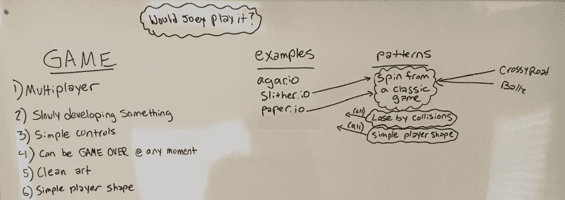
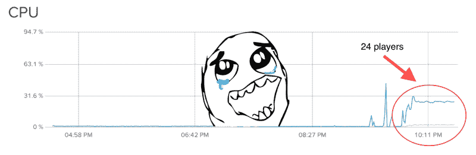

# 一个尴尬的故事:为什么我的服务器只能处理 10 个玩家

> 原文：<https://www.freecodecamp.org/news/an-embarrassing-tale-why-my-server-could-only-handle-10-players-3b83b6fa8136/>

杰森·奇特拉

# 一个尴尬的故事:为什么我的服务器只能处理 10 个玩家

更令人尴尬的是，我曾一度相信每台服务器有 10 名玩家是正常的。

这一切都始于夏初的一个想法。我站在我的房间里，试图想出一个 io 游戏来制作(我决定如果我要制作一个游戏，我约束自己制作一个 io 游戏，以最大限度地发挥病毒潜力——这是一件事，我发誓)。

于是，我开始分析是什么造就了某些 io 游戏(agar.io，slither.io 等。)上瘾。我发现了这些游戏之间的比较和相似之处，如下图所示:

“Would Joey play it?” -> Joey is my little brother in middle school. Writing this question on the board forced me to always make a decision with the end users (users of the Joey type) in mind. Smart huh.

最后，经过更多的头脑风暴，我登陆了 [knckout.io](http://knckout.io) 。这是游戏的名字。试着留在地图上，把其他人赶走。我喜欢它。简单的控制，清晰的目标，和一个美丽的游戏机制。

在设计出我想要的游戏外观和感觉后，我开始工作。我每天结束暑期实习回家，健身，然后编码。

我首先让球员按照我想要的方式移动。然后我负责推进。然后是碰撞。最后，游戏全部完成，准备接受公众的检验。至少我是这样认为的…

上周末(大约一周前)，我兴奋不已，准备向世界展示我的成果。所以我上网找到了一个叫做“playmygame”的小网站我写了一个简短的总结，然后[发布了](https://www.reddit.com/r/playmygame/comments/6tr4o2/knckoutio/)(附:在帖子的评论中，你可以清楚地看到我在强调我的服务器的能力)。我耐心等待，然后万岁！一个玩家加入了。

我们在游戏中互相攻击。与此同时，我很紧张，担心这个玩家在想什么。在这个球员失去了他们所有的生命，并被踢出我们所在的比赛后，我等着看他们是否会回来。他们做到了！但是更好的是:玩家将他们的名字设置为“ilikethisgame”我睁大了眼睛，肾上腺素激增！我是世界上最幸福的男孩。

很快其他玩家也加入进来，一些人在 Reddit 帖子上留下了评论。更多的玩家说他们喜欢这个游戏！我欣喜若狂。然后我检查了一下我的服务器(8 月 15 日)…

From a 1 GB, 1 vCPU Digital Ocean NYC server running Ubuntu NodeJS 6.9.5 on 14.04

感觉就像有人把我打得喘不过气来。这是真的吗？我心想，这一定是假的。只有两个游戏，服务器很难处理它们。

我开始思考我的代码哪里出错了。我认为碰撞检测肯定是瓶颈。但是我已经在使用四叉树来帮助减少碰撞检测次数。

我不得不做一些脏活，所以我安装了一个新的数字海洋服务器作为我的开发服务器。然后我暂时完全禁用碰撞检测，发现问题仍然存在。

好吧，如果碰撞检测不是问题所在，那么还会有什么问题呢？

我想到了每秒钟我从服务器向每个客户端发送了多少信息。我有一个广播功能，每 22 毫秒向每个客户端发送一次游戏状态。在这个函数中，我不必要地在一个`allPlayers`属性中过滤掉了给定客户端的本地播放器，只是将本地播放器放在它自己的属性中。因此，我不仅将一个 for 循环(过滤)放在另一个 for 循环(每个客户端的广播)中，还为每个客户端定制了由这个广播函数发送的数据。

这种定制是不必要的。我应该能够把游戏的状态发送给每个人，不需要定制。每个人都应该获得相同的数据(数据不应该针对特定的客户)。这一定是 CPU 被消耗的地方。所以我优化了这个函数，将它推送到 dev 服务器，并检查了 CPU 图。没有修复。

由于我的无知，我开始说服自己每台核心服务器有 10-20 个玩家是好的。那么，我是如何得出这样的结论的呢？好吧，我对自己技术能力的极度自信显然蒙蔽了我的双眼。我偶然发现了一个[帖子](https://news.ycombinator.com/item?id=13266692)，agar.io 的开发者说他的 1 核服务器可以处理大约 190 个玩家。我很快振作起来。

我列出的下一个罪魁祸首是:socket.io。我使用 socket.io 来管理客户端和服务器之间的实时通信。我以前听说过 socket.io 不像其他替代产品那样轻量级。

过去，如果想异步发送消息，就必须实现某种黑客技术:长轮询或 flash sockets。这是因为并非所有的浏览器都支持 websockets。但是现在大多数浏览器都提供原生支持。但是为了让 socket.io 建立连接，它首先使用提到的可用方法之一，然后如果客户端支持更好的方法，就升级连接。尽管 websockets 已经得到了广泛的支持。这种方法以牺牲 CPU 和内存为代价。但是没有我想的那么多…

我跳到网上，天真地在谷歌上输入“socket io cpu 问题”。前几个结果的标题分别为“ [Node.js —如何调试 Node + Socket.io CPU 问题—服务器故障](https://serverfault.com/questions/498707/how-to-debug-node-socket-io-cpu-issues)”和“ [Node.js — Socket.io 节点服务器使用高 cpu —堆栈溢出](https://stackoverflow.com/questions/8687434/socket-io-node-server-using-high-cpu?rq=1)”我的眼睛亮了。我确信这是我的问题的罪魁祸首。但是我点击了第一篇文章，作者提到他正在处理大约 1500 个并发套接字连接。我不是数学专业的，但是 20 个玩家明显少于 1500 个玩家。

为了方便起见，我将我的服务器端节点应用程序切换为使用[微型 websockets](https://github.com/uNetworking/uWebSockets) ，然后将客户端节点应用程序切换为使用本地 websocket 支持，就在浏览器内部。我将更改推送到开发服务器，并检查 CPU 图表。没有修复。

我的士气空前低落。每当我不得不检查该死的 CPU 图表时，我就开始畏缩。我以为我永远也不会让那条蓝线停止从我身边跑开。这是我唯一一次感到完全没有能力处理一些技术任务。但是后来发生了…

我坐在 CPU 图表前沉浸在我的痛苦中，这时我注意到了一些事情。不管有多少完整的游戏在运行，也不管它们开始的时间有多近。CPU 以恒定的速度稳步增长。我从来没有在这里呆足够长的时间来观察这一点。内存泄漏！

我一行一行地扫描我的代码，寻找 bug(我应该在一开始就这么做)。就在那里。

在我的游戏中，事件是一个捕捉玩家死亡、助推和碰撞等信息的对象。因此，每当这些事情发生时，就会产生一个事件。

我有一个循环，遍历每个事件并更新它。它每 16 毫秒调用一次。在一个事件完成它的职责后，它应该被删除。关键词:“理应如此。”

答对了。我的内存越积越多，不必要的循环次数也越来越多。我插入一行代码，瞧！

well i’ll be

大大松了一口气。

我的下一个任务是看看一台服务器现在可以流畅地支持多少游戏(每场游戏 4 个玩家)。(我知道它至少有 12 个游戏，但我还没有尝试更多)。现在我知道了事件的数量对 CPU 有很大的影响…当所有玩家每秒都在触发助推、碰撞和死亡事件时，生产中会发生什么？我的测试没有考虑到这一点。

此外，在这个帖子像病毒一样传播开来之后，我的游戏也跟着传播开来，我将需要快速扩展可用服务器的数量。我会在以后的文章中把它作为主题:“knckout.io 如何发展到数百万玩家。”请关注我这里的更新。:)