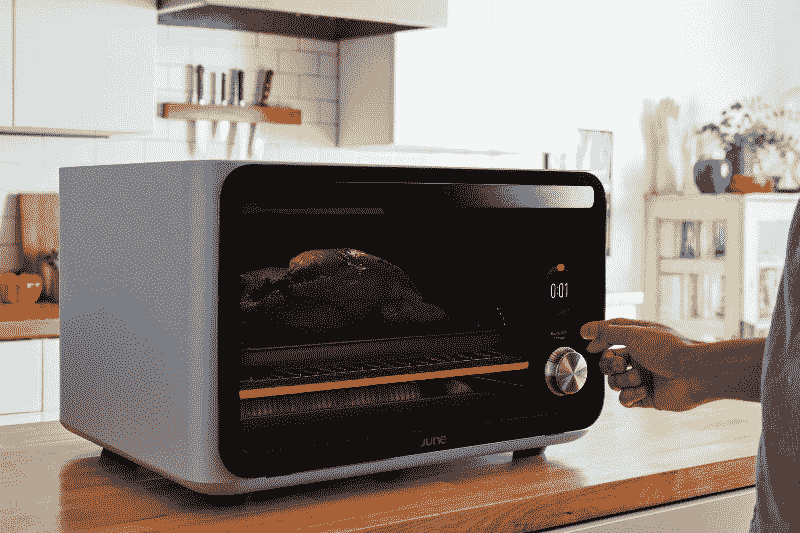
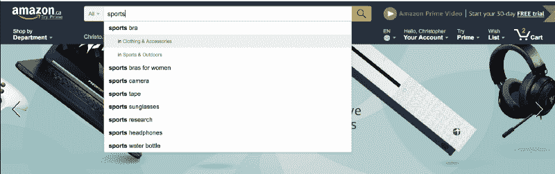
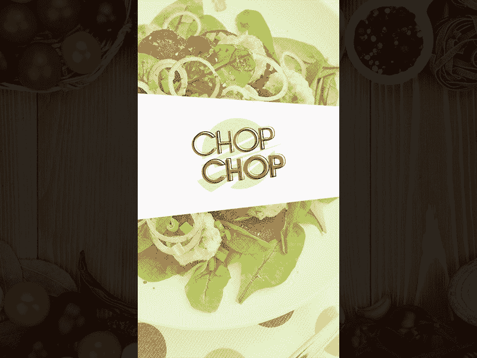

# 想成为最好的设计师？为你不知道的东西设计。

> 原文：<https://www.freecodecamp.org/news/want-to-be-the-best-designer-design-for-what-you-dont-know-fa0a8ba753c/>

作者:李宇春

# 想成为最好的设计师？为你不知道的东西设计。

He doesn’t know exactly what his users are thinking, and that’s OK.The best designers design for what they don’t know

想象一下乔恩。乔恩是一家初创公司的第一个采用者，该公司试图设计一种更好的用烤面包机烤鲑鱼的方法。他很聪明，35 岁，是一名职业人士。他晚上回复工作邮件，和两个小女儿一起看《爱探险的朵拉》。

现在，作为一名为这家初创公司工作的设计师，你的任务很简单:让他的三文鱼烧烤体验超乎寻常。你是做什么的？

### 两种设计方法

对于设计师来说，第一个答案通常是直接投入进去做研究。这不是错误的答案！采访乔恩。问问他对三文鱼的喜好。他喜欢煮得过熟还是欠熟？他晚餐喜欢烤多大的菲力牛排？他的家人多久吃一次鲑鱼？他的女儿们抱怨过三文鱼太厚、太薄、太咸或太淡吗？

所有好问题，所有好见解。但是在设计者的决策过程中有一个关键的结合点。一旦他或她掌握了要做的工作的知识和背景，问题就是:

我是否对用户有足够的了解，从而能够给出我认为理想的体验？

#### 1.规定性方法

很多时候设计师都会回答是。结果是一个烤面包机 ***如此完美地适应一个特定的用例*** 以至于用户需求的任何偏差都会导致灾难性的失败。乔恩说他想要稍微煮过头的鲑鱼，因为他的女儿们害怕生肉！

然后他和妻子单独度过了一个约会之夜。他发现咀嚼两个小时的三文鱼橡胶并不能让他度过一个美好的夜晚。即使搭配上好的夏敦埃酒。

当然，任何头脑正常的设计师都会意识到用户对不同的情况有不同的偏好。设计师永远不会设计一个试图规定“最佳”工艺的烤面包机。

然而，这就是他们所做的——提示 1500 美元的烤箱。该产品也存在许多技术问题。但是我认为最大的问题很简单:设计师认为他们知道*到底*用户想要什么。

> “自动化但令人分心。自负而平庸。自信却又错误。”—麦智信，快公司

#### 是用户的错！

你*可以*说这几乎是用户的错。乔恩*说*他想要稍微煮老一点的，所以他就点了这个。然而，乔恩发现他说了一些他后来意识到不是故意的话。用户不是无所不知的。他们能够也将会强调那些根本不真实的事情，甚至是关于他们自己的习惯。

不仅如此，随着你和越来越多的人交谈，在很多情况下，他们要做的工作会有所不同。做出明确的声明，说明性的方法是最好的。但是你最好确信你真的对他们的需求有足够的洞察力。

The June. It knows what kind of food is in it, and also how you like it cooked.Designers are proud people

问题是，如果用户不能使用它，他们就不会使用。如果你让你的用户阅读 500 页的烤面包机使用手册，他们可能会选择不买，因为太难理解了。那么是谁的损失呢？

有时候，我们都需要一点现实检查。设计师需要承认他们不知道的东西(很多)，并将其标记为要减轻的风险。

一旦你认为一个假设有风险，你就可以围绕它进行设计。危险在于“相当确定”和填补空白。但是有时候并没有什么建议你真的应该去填满它们。

这就是为什么 Eric Ries(精益创业公司)喜欢测试和衡量用户的行为，看看他们是否想要什么，而不是询问。

当用例清晰时，我们可以为这些人定制一个优化的特定流程。我们确信我们知道这些病例是什么，以及它们代表了多少人口。否则，还有另一种方法。

#### 2.平台方法

在经济学 101 课程中，有一个被称为价格歧视的概念。听起来很复杂，其实不然。它真正的意思是，如果公司向客户收取他们愿意支付的最高价格，他们就能赚到最多的钱。当然，做这件事有各种各样的方法。汽车销售员使用一级价格歧视。他们和你讨价还价，直到双方都同意一个价格，脸红了。在这种情况下，销售员算出了你愿意支付的最高价格。然后他给了你一个很好的报价来匹配。

一级价格歧视有个问题。它依赖于公司对客户愿意支付的确切价格的了解。如果他们不知道会怎么样？这就是二级和三级歧视的由来。

公司可能会把价格定得太高，从而失去你这个客户(总共获得 0 美元)。或者，他们可以推出不同种类的优惠，让*用户*决定他们想要什么。例如，航空公司有一种预感，有一群用户更有钱，愿意为更好的座位花更多的钱。因此，他们提供商务舱。

突然间，客户可以**自行选择**适合他们的产品。以卫生纸的销售为例。查敏知道*到底*不同的人需要多少卫生纸吗？没有。但是他们有 6 个装的，12 个装的，有时候甚至有 48 个装的(我最喜欢)。无论他们的客户属于哪一类，他们都有适合他们的东西。

#### 不知道用户想要什么？没问题。

听起来熟悉吗？关键是设计师要承认他们不知道的事情。因为一旦你这样做了，你就可以围绕它进行设计。

典型的例子:搜索结果。仔细想想，这种设计模式真的很普遍。搜索的本质是我们对用户想要什么有一个大概的了解，但没有具体的了解。所以聪明的设计师应该使用平台方法。提供一个用户可以自行选择的实用床。去任何电子商务网站，测试他们的搜索。

Amazon.com’s homepage search tries to suggest categoriesMany products will not only provide a platform approach for you. They also try to figure out as much about you as fast as possible. Once they know your preferences, based on your behavior, *then* they can prescribe a specific experience tailored to you.

还记得采访用户的陷阱吗？行动胜于言语。有什么比给他多种选择更好的方法来知道乔恩是否真的想要他的三文鱼煮过头？在他的烤三文鱼之旅中，尽早推动他自我选择他想要的选项。然后，一旦他对自己进行了分类，就开出解决方案。

#### 一个警告

烤箱的例子是一个非常明显的例子。一个普通的烤箱给了我们所有想要的烹饪选择。设计师们意识到他们不知道我们何时需要哪一个。

我们对此一笑置之，认为这是一个业余的错误，但我怎么强调这种判断观点出现的频率都不为过。

几年前，我设计了一个应用程序，帮助食品店的顾客决定要买什么。用户所要做的就是选择偏好，比如他们想吃多少餐，喜欢什么菜系。然后，应用程序会吐出一组配料相似的食谱，告诉你每种要买多少。理论上听起来很棒。你甚至可以滑动来替换列表上的食谱，新食谱仍然会共享相同的成分，以便高效购物。

但是，这款应用程序的规范性太强了。我一直致力于为理想的用户设计理想的体验。但是我忽略了我进行的所有用户访谈中的差异程度。

A good effort but an ultimately flawed design

因此，我设计了一个不灵活的系统。用户会玩得很开心，直到他们的计划发生了一些小的偏差。这将使应用程序很难使用。

例如，在一个用户找到了他们这周想做的 5 道菜之后，一个朋友可能会打电话邀请他们在周三出去吃饭。用户将不得不从头开始这个过程。这并不是我在初步用户访谈中发现的。

#### 设计师们，当心自动化时代

如果你阅读今天的科技头条，你可能会遇到像“机器学习”、“人工智能”和“机器人”这样的热门术语。科技是无比强大的。每个人都兴奋地想着能给人们的生活带来的所有价值。

当工程师和商业人士对自动化生活的惊人方式趋之若鹜时，设计师需要发出谨慎的声音。我们真的知道用户到底想要什么，以至于我们可以自动化它吗？或者平台方法更好，让用户自己选择他们想要的价值，然后我们从那里得到它？很容易陷入像机器学习这种强有力的武器扔来扔去却不知道指向哪里的陷阱。在一个可能的场景中，我们最终会在应该留给用户的事情上浪费时间、金钱和人力。

不管怎样，我总是更喜欢煎鲑鱼。

如果你喜欢这篇文章，如果你点击下面的鼓掌按钮，我会非常感激。关注我，了解更多关于设计、生活和创业的想法。记住，48 包的卫生纸永远是最划算的。

如果我今天没有用完你的设计阅读配额，看看[“所有设计领域共有的 3 个原则](https://medium.muz.li/the-3-principles-that-all-fields-of-design-have-in-common-b1e9b879fa59?gi=8602831b5754)”。