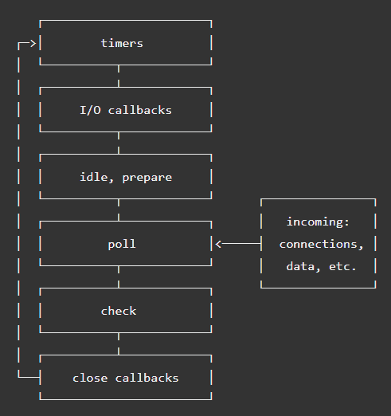

# 在 Node.js 事件循环中穿行

> 原文：<https://www.freecodecamp.org/news/walking-inside-nodejs-event-loop-85caeca391a9/>

作者:Oluwaseun Omoyajowo

# 在 Node.js 事件循环中穿行


NodeJS 事件循环可能是 node 中最容易被误解的概念之一。不幸的是，网上的大多数文章都没有帮助。直到几天前，由于丹尼尔·可汗的文章，我对事件循环的工作原理也有了错误的认识。丹尼尔强调了其中的一些误解，并解释了现实。我将在下面指出最受欢迎的，之后你可以仔细阅读丹尼尔的[文章](https://medium.com/the-node-js-collection/what-you-should-know-to-really-understand-the-node-js-event-loop-and-its-metrics-c4907b19da4c)，并阅读全文。

"*事件循环在用户代码中的单独线程中运行。一个主线程运行用户的 JavaScript 代码(userland 代码),另一个运行事件循环。每次发生异步操作时，主线程将把工作移交给事件循环线程，一旦完成，事件循环线程将 ping 主线程以执行回调。*”—这是错误的

这基本上是我自己对事件循环的想法，所以我决定做一些研究并深入下去。在这篇文章中，我将用一个普通的例子来解释一切是如何发生的。

首先，创建一个 JavaScript 文件，用你喜欢的名字保存，我的名字是“index.js”。在文件中键入或复制并粘贴以下代码。

```
const fs = require('fs');
```

```
const setTimeOutlogger = ()=>{    console.log('setTimeout logger');}const setImmediateLogger = ()=>{    console.log('setImmediate logger');}
```

```
//For timeout setTimeout(setTimeOutlogger, 1000);
```

```
//File I/O operationfs.readFile('test.txt', 'utf-8',(data)=>{    console.log('Reading data 1');});fs.readFile('test.txt', 'utf-8',(data)=>{    console.log('Reading data 2');});fs.readFile('test.txt', 'utf-8',(data)=>{    console.log('Reading data 3');});fs.readFile('test.txt', 'utf-8',(data)=>{    console.log('Reading data 4');});fs.readFile('test.txt', 'utf-8',(data)=>{    console.log('Reading data 5');});
```

```
//For setImmediatesetImmediate(setImmediateLogger);setImmediate(setImmediateLogger);setImmediate(setImmediateLogger);
```

创建一个文本文件。txt '放在同一个目录下，用你喜欢的任何名字保存它。我的是' test.txt '。在这个文件里输入你喜欢的任何东西。

在运行 JavaScript 文件之前，如果您能够猜出控制台输出的顺序，那么请竖起大拇指。我自己的输出:

```
setImmediate loggersetImmediate loggersetImmediate loggerReading data 1Reading data 2Reading data 3Reading data 4Reading data 5setTimeout logger
```

您的文件可能会有所不同，这取决于您正在读取的文件的大小以及。txt '文件。

那么，当您运行代码时，事件循环中发生了什么？

当 Node.js 启动时，它初始化事件循环，处理所提供的可能进行异步 API 调用的输入脚本，然后开始处理事件循环。只有一个线程，那就是运行事件循环的线程。事件循环以循环顺序工作，具有不同的阶段。事件循环的操作顺序如下所示。



事件循环中有六个阶段，但其中一个在内部工作。下面是 Node.js [doc](https://nodejs.org/en/docs/guides/event-loop-timers-and-nexttick/) 中每个阶段的概述。

*   计时器:这个阶段执行由`setTimeout()`和`setInterval()`安排的回调。
*   I/O 回调:执行几乎所有的回调，除了关闭回调、计时器调度的回调和`setImmediate()`。
*   空闲，准备:仅在内部使用。
*   轮询:检索新的 I/O 事件；节点将在适当的时候阻塞这里。
*   检查:`setImmediate()`回调在此被调用，关闭回调:如`socket.on(‘close’)`。

### 倍

从我们的例子来看，我们在调用`timeOutLogger`函数之前将`setTimeout`设为 1s。这是事件循环的第一阶段(不完全是第一阶段，但从我们的例子来看是第一阶段)。计时器设置执行回调的阈值。

值得注意的是，每个阶段都有一个要执行的先入先出(FIFO)回调队列。

### I/O 回调

这个阶段执行系统错误回调，比如传输控制协议(TCP)套接字连接错误`ECONNREFUSED.` 虽然这个阶段被称为 I/O 回调，但是要理解正常的 I/O 操作回调是在轮询阶段执行的。接下来我将深入探讨这个问题。在我们的例子中，这里没有回调排队。

### 投票

这个阶段是大部分工作完成的地方。在 Node.js 文档中，轮询阶段主要做两件事:

*   为超过阈值的计时器执行脚本
*   处理轮询队列中的事件

按照我们在这个阶段的例子，目前有一个空队列，因为`fs.readFile`还没有完成。等待时，先前设置的计时器`**1s**`阈值尚未到期。事件循环在检查阶段检查由`setImmediate()`排队的回调。我们的例子中有三个回调被`setImmediate()`排队。事件循环进入检查阶段。

### 支票

在检查阶段，事件循环执行队列中的所有回调，因此在我们的示例中是控制台输出顺序。

在执行检查队列中的所有回调并且没有达到计时器阈值之后。但是在轮询阶段已经有来自 fs.readFile **的排队回调。**事件循环执行所有回调(事件循环阻塞)，直到最大值或队列再次为空。事情是这样的，在执行回调时，计时器阈值可能会过期。随着新的计时器回调准备好执行，计时器将不得不等待轮询回调执行，从而导致额外的延迟。这就是为什么不要在回调函数中做太多事情是明智的原因之一。在执行轮询队列回调后，事件循环立即返回计时器以执行回调。

**注意:**为了防止轮询阶段耗尽事件循环， [libuv](http://libuv.org/) 在停止轮询更多事件之前也有一个硬最大值(取决于系统)。

### 结论

虽然在事件循环的幕后仍有许多事情在进行，但我希望能够让您对 Node.js 事件循环的内部有一个大致的了解。如果你有任何问题或想作出更正，请写在回复中。我会尽快回答或者更新文章。

感谢阅读。我是 Oluwaseun Omoyajowo，自由全栈 web 开发人员。取得联系！[推特](https://twitter.com/flickzcode) [领英](https://www.linkedin.com/in/oluwaseun-omoyajowo-641358110/?lipi=urn%3Ali%3Apage%3Ad_flagship3_notifications%3BESCtLB7XS8aBHaL2eaiW0g%3D%3D&licu=urn%3Ali%3Acontrol%3Ad_flagship3_notifications-nav.settings_view_profile) [Github](https://github.com/flickz) [脸书](https://facebook.com/sheaflickz)