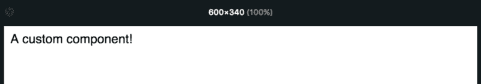
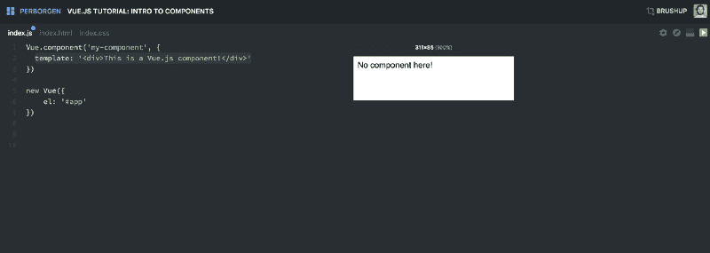
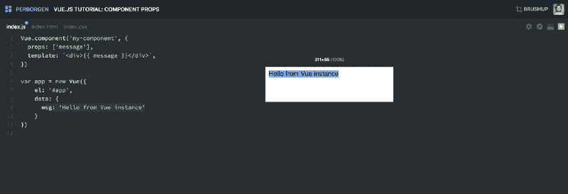
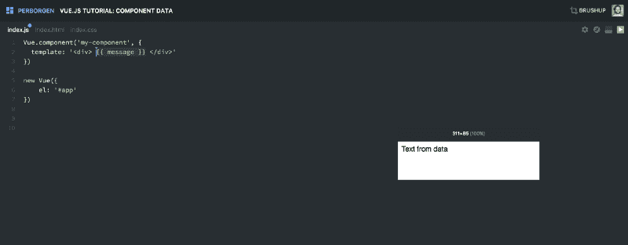

# Vue 组件:交互式 Vue JS 教程

> 原文：<https://www.freecodecamp.org/news/vue-js-components-an-interactive-guide-1b8149ecc254/>

在我之前的教程中，我们学习了 Vue.js 的基础知识:Vue 实例，模板语法，数据对象，指令，方法等等。这足以开始创建非常基本的 Vue 示例。

> **注:**如果你有兴趣观看我所有的 Vue 截屏，请查看[这个播放列表](https://scrimba.com/playlist/playlist-38?utm_source=freecodecamp.org&utm_medium=referral&utm_campaign=vue_components_tutorial)。

但是如果你想用 Vue 构建合适的应用，你需要了解组件。这是图书馆最强大的功能之一。


组件使您的代码更具可重用性，标记更具可读性。

它们可以让你创建定制的 HTML 元素，这些元素的行为完全符合你的要求。要创建 Vue.js 组件，请执行以下操作:

```
Vue.component('my-component', {
  template: '<div>A custom component!</div>'
})

new Vue({
    el: '#app'
})
```

`template key`是为组件编写标记的地方。在同一个对象中，您稍后将添加更多的功能。您通过在 HTML 中添加`<my-component></my-co`组件>来创建组件的**实例**:

```
<div id="app">
      <my-component></my-component>
</div>
```

这将导致页面上呈现以下内容:



这里有一个解释相同概念的 Scrimba 截屏。它是交互式的，所以你可以随时暂停截屏和编辑代码。



### 小道具

上面的组件没起多大作用。为了让它更容易使用，让我们给它添加一些道具:

```
Vue.component('my-component', {
  props: ['message'],
  template: `<div>{{ message }}</div>`,
})
```

Props 将使您能够将数据从组件外部传递到组件实例中。或者更准确地说，把数据从父母那里传下来。

`my-component`有一个叫做`message`的道具，它会渲染出来。当我们在 DOM 中创建这个组件的新实例时，将定义`message`的值。我们可以创造尽可能多的`my-component`，并给他们每个人不同的道具。因此，我们将能够重用我们的代码。

要将数据作为`message`道具向下传递，只需执行以下操作:

```
<div id="app">
      <my-component message="Hello from Vue.js!"></my-component>
</div>
```

现在，**vue . js 你好！**会呈现在页面上。

但是这仍然是一个非常静态的解决方案，因为我们已经在 HTML 中硬编码了 prop 的值。更好的解决方案是将这个值绑定到数据源。然后，我们可以在以后根据自己的意愿改变它，比如基于用户交互或 API 的响应。

让我们将它绑定到 Vue 实例上的数据对象。首先，我们将创建数据对象。

```
var app = new Vue({
    el: '#app',
    data: {
      msg: 'Hello from the Vue instance'
    }
})
```

为了将`my-component`中的道具绑定到我们的 Vue 实例中的`msg`,我们将使用我们在上一篇文章中学到的`v-bind`指令:

```
<div id="app">
      <my-component v-bind:message="msg"></my-component>
</div>
```

现在，我们可以通过`app.msg = 'Some new data'`改变数据，Vue 会用新数据更新 DOM。

> ***提示:*** *你可以从`v-bind:message` 中去掉`v-bind`，而使用`:message`的简写。*

这里有一个 [Scrimba 截屏](https://scrimba.com/casts/caPgLTP?utm_source=freecodecamp.org&utm_medium=referral&utm_campaign=vue_components_tutorial)解释这个概念:



但是如果您希望您的组件能够改变它的`message`呢？只要`message`是一个道具，这就不会发生，因为你不应该在一个组件中改变一个道具。如果你尝试，Vue 会在控制台给你一个警告。

### 数据

所以我们需要另一种方式来处理组件内部的数据。这就是`data`函数发挥作用的地方。它将允许你的组件处理内部状态，你可以改变你想要的。

组件`data`填充了与 Vue 实例中的`data`对象相同的角色。它们都是存放可变数据的地方。但是，组件`data`是**函数**，而不是**对象**。

让我们直接进入代码，让它不那么抽象。

```
Vue.component('my-component', {
  template: '<div> {{ message }} </div>',
  data: function() {
    return {
      message: 'Hello from Vue data!'
    }
  }
})
```

这里有一个解释这个概念的 Scrimba 截屏。



也就这样了！当然，关于 Vue 组件还有很多东西需要学习。但是这应该足够让你自己开始玩了。

如果你学到了一些关于 Vue 的新知识，我建议你也把这些知识传授给其他人。这是最好的学习方式之一，也是像 [freeCodeCamp](https://www.freecodecamp.com/) 这样的社区蓬勃发展的原因。

所以，继续写一篇关于你所学到的东西的文章吧！