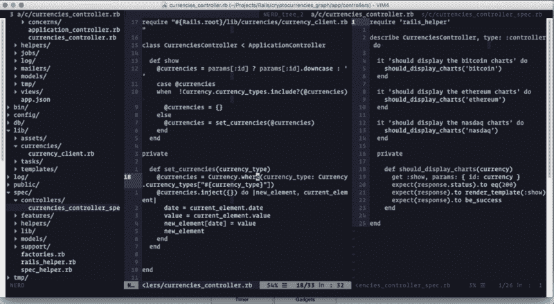
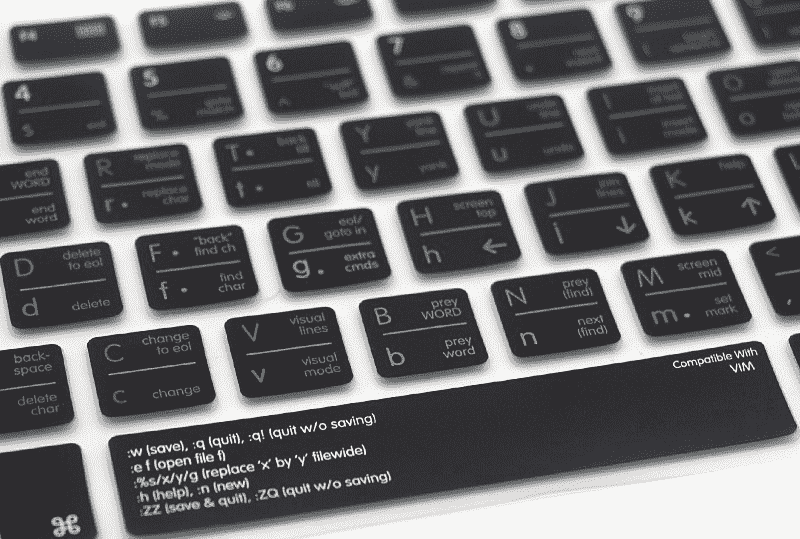
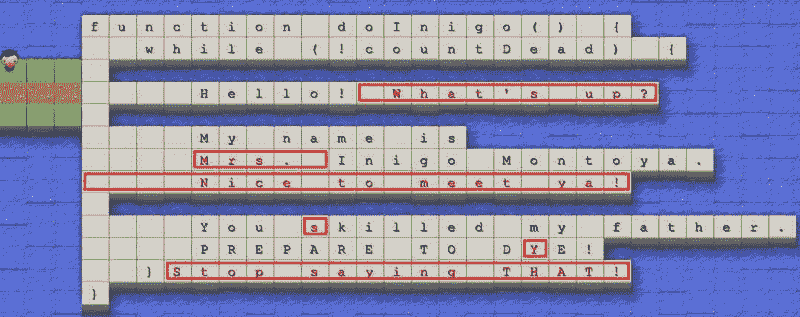
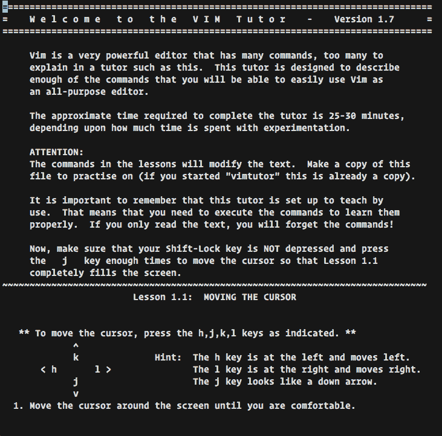
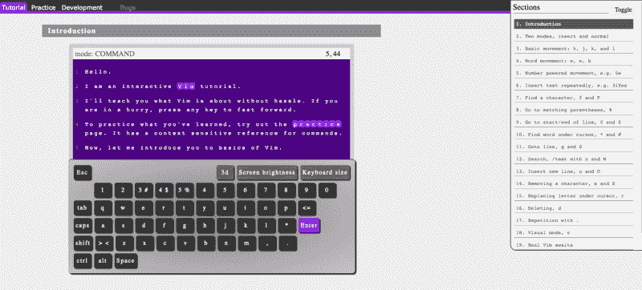
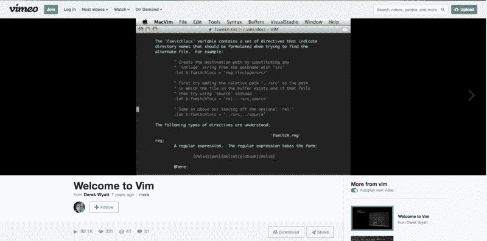
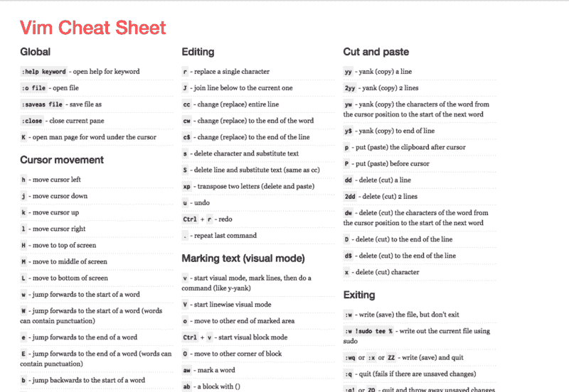

# Vim 没那么可怕。这里有 5 个免费资源，你可以用来学习它。

> 原文：<https://www.freecodecamp.org/news/vim-isnt-that-scary-here-are-5-free-resources-you-can-use-to-learn-it-ab78f5726f8d/>

未知的事物可能会令人恐惧。未知通常伴随着一种抵抗。Vim 也不例外。然而，尽管一个 StackOverflow 问题询问如何退出它已经被浏览了[超过一百万次](https://stackoverflow.blog/2017/05/23/stack-overflow-helping-one-million-developers-exit-vim/)，Vim 仍然是[全世界开发者使用最多的编辑器之一](https://insights.stackoverflow.com/survey/2017#technology-most-popular-developer-environments-by-occupation)。

This is a view from this [open source](https://github.com/fatosmorina/cryptocurrencies_graphs) project that displays cryptocurrencies values like Bitcoin, Ethereum and Nasdaq

许多不使用 Vim 的人习惯了其他编辑器，认为他们不需要切换到它。他们不想离开自己的舒适区。他们认为 Vim 花费了太多的时间和精力来学习，而且它毕竟没有产生太大的影响。

通过花时间阅读这篇文章，您已经表明您已经对 Vim 有了某种兴趣。在我们看到一些让你更容易学习 Vim 的资源之前，让我们看看为什么我们应该考虑使用这个 80 年代的文本编辑器。

### 为什么首先要学习 Vim？

Image: [http://amzn.to/2umsBaY](http://amzn.to/2umsBaY)

> “使用 Vim 是我在编程生涯中做出的最佳选择之一。”——[卢卡斯阿曼](https://stackoverflow.com/users/6726/lucas-oman)

你可能需要一些理由来知道为什么学习 Vim 是值得努力的，这是合理的。毕竟可能会影响到你的整个工作流程。甚至开始学习一些看起来不适合自己的东西，看起来都是不合理的。

几乎所有 thoughtbot 公司的人都在使用 Vim，这是湾区最受推荐的公司之一。知道这一点可能会让你开始学习它。除此之外，还有其他值得一提的原因。我们开始吧。

#### 这就像玩游戏一样

当你想开始玩一个游戏的时候，你不会因为它难而退缩。你实际上有动力去玩它，因为它给了你快乐。用 Vim 开发类似。当你开始看到它是快速和直观的，你可能会开始享受这种体验。一旦你学会了一些更高级的命令来提高你的工作效率，你甚至会对它更加着迷。

#### 不需要鼠标

您有许多快捷方式来浏览代码和文件，这实际上可以帮助您摆脱使用鼠标的需要。因此，您不需要将手指从键盘上拿开，这样可以加快编码速度。

换句话说，您可以像打字一样快地在 Vim 中编码。它很快。甚至 Vim 这个词也意味着**能量**和**热情**。

#### 许多强大的命令

您可以使用的命令列表相当长。你不需要学习每一个，你只需要在开始时学习几个，然后在进行中尝试学习新的。你可能会学到一些新的和重要的东西，即使是在你的第一课之后很多年。

#### 高度可定制

您可以根据自己的喜好使用和更改一些配置。有数百种配色方案可供下载。而且，你可以使用大量的插件来增强你的编辑器，让它像现代的 ide 一样强大。

#### 它以文本为中心

现代 ide 有很多内置特性。它们通常带有许多按钮和丰富的用户界面，使您更容易使用其中的所有功能。另一方面，Vim 通常以文本为中心。这使你更容易只关注代码，并摆脱其他与代码无关的分散注意力的图标和选项。

#### 它存在于每一台 Linux 机器中

绝大多数服务器使用 Linux 作为操作系统。当您熟悉了 Vim 的基础知识后，您可能会对部署和服务器维护感到满意。

这些并不是 Vim 需要您关注的唯一原因。但它们代表了一些最重要的。如果他们能引起你的共鸣，那么你可以给学习 Vim 一个机会。

### 学习 Vim 的 5 个免费在线资源

这里有一些资源，你可以用来帮助你的学习之旅。不要假装一下子就学会了与 Vim 相关的一切。有些人已经使用 Vim 20 年了，他们还在学习与之相关的新事物。

#### VimTutor

如果您使用的是基于 Unix 的机器，您可以在 shell 中键入 **vimtutor** 。如果你在 Windows 上，你可以在这里看到一些打开它的答案[。](https://superuser.com/questions/270938/how-to-run-vimtutor-on-windows)

你会有一个很好的教程，可以帮助你在几分钟内学会 Vim 的基础知识。等你看完了，你就已经明白为什么 Vim 这么神奇了。

#### [OpenVim](http://www.openvim.com/tutorial.html)

这是一个交互式教程，您可以使用它来深入了解 Vim 的基础知识。你也可以用它来测试你现有的 Vim 技能。

#### [维姆历险记](http://vim-adventures.com/)

如果你喜欢边玩游戏边学习，那么这个资源可能对你很有价值。在这个游戏中，您可以学习使用 Vim 命令进行导航，这对您在迷宫中导航至关重要。您可以随时键入`:help`获得任何提示。

#### [Vim 的基础知识](https://vimeo.com/album/2838732)

德里克·怀亚特准备了一个相册，里面有 13 段他教 Vim 的视频。这些视频已经看过几千次了，对于你学习 Vim 的基础知识是非常有价值的资源。如果你还在怀疑是否应该学习 Vim，那么这些视频可以给你更多学习的理由。

#### [Vim 备忘单](https://vim.rtorr.com/)

打印这张小抄，放在你的桌子旁边。时不时地，花几秒钟浏览一下列表，试着从中使用一些东西。这样你可以随时记住新的命令，也可以巩固你已经掌握的命令。

### 结论

如果你是 Vim 的新手，那么最好不要立即在你的工作项目中使用它，因为你可能会感到沮丧，并且再也不会使用它。你应该一开始就在你的兼职项目中使用它，只有当你非常适应的时候才开始在你的全职工作中使用它。

尝试在你的副业项目中使用 Vim 几天，看看效果如何。如果你喜欢使用它，那么你可以坚持使用它。

我是一名充满激情的软件工程师，目前是一群热衷于开发 web 和移动应用程序的开发人员的团队领导，他们大多使用 Ruby on Rails 和 React JS。

*我是[开源爱好者](https://github.com/fatosmorina)，也是[博主](http://fatosmorina.com)。*

我目前正在寻找一份远程工作。请[联系我](mailto:fatosi.morina@gmail.com)寻找新的机会。