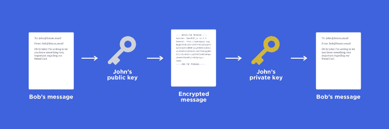

# 使用 OpenPGP 处理前端加密

> 原文：<https://www.freecodecamp.org/news/handling-front-end-encryption-using-openpgp-3b0462bf5876/>

作者 Mateja Trifunovski

# 使用 OpenPGP 处理前端加密



Public-key cryptography

在一个隐私不断被侵犯的世界里，人们往往会开始关心它。私人消息平台变得越来越流行。他们应该担心，因为隐私确实很重要。

本文将讨论电子邮件的端到端加密。我的经验来自于构建一个名为 [**柠檬邮箱**](https://lemon.email/) 的去中心化端到端加密邮件系统。电子邮件加密可以应用于几乎任何系统，使用相同或相似的加密算法。

### 那么什么是前端加密呢？

基本思想是，为了保持数据的私密性，我们需要使数据对可能的入侵者不可读。最好的方法是在源端，也就是在客户端对其进行加密。我们需要确保，即使数据在去往服务器或数据库的途中被拦截，也不可能区分那段数据是什么。

### 那么我们该怎么做呢？

我们将使用一个名为[公钥加密](https://en.wikipedia.org/wiki/Public-key_cryptography)的加密系统，也称为非对称加密。对于实际实现，我们将使用一个开源库 [OpenPGP.js](https://github.com/openpgpjs/openpgpjs) 。实现将非常简单，由于简单，省略了任何后端代码。

#### 生成密钥

第一步是生成我们的私钥和公钥，我们将使用它们来加密/解密我们的电子邮件。在下面的代码片段中，我们添加了一些选项，比如密钥有多长。密钥的长度将决定密钥的强度以及生成密钥的时间。我们还添加了一个用户指定的**密码短语**，用于锁定私钥。

```
let keyOptions = {
    numBits: 2048,
    passphrase: "secret-passphrase"
    //you would get the passphrase from an input field normally
};

let user = {};

openpgp.generateKey(keyOptions)
    .then((key) => {
        user.privateKey = key.privateKeyArmored;
        user.publicKey = key.publicKeyArmored;
    });
```

密码短语非常重要，因为没有它就不能使用私钥。这是防止其他人使用私钥的唯一方法。这很有用，因为我们通常将我们的私钥存储在持久存储中，比如数据库，在那里有人可以看到它。密码应该只在客户端用户的记忆中被记住。

#### 加密邮件

创建密钥后，为了让用户交换消息，我们至少需要两个用户。为了简单起见，让我们假设另一个用户在某个地方创建了他的密钥，现在我们有两个用户。

在这个场景中，名为 Bob 的用户正在向 John 发送消息。如果我们希望只有约翰能够阅读消息，我们得到约翰的**公钥**并用它来加密整个消息。稍后，约翰将能够使用他的**私钥阅读该消息。**

```
// Bob{} (User 1), John{} (User 2)
const email = {
    subject: "Hello John, I'm Bob!",
    body: "Secret message"
}

const options = {
    data: JSON.stringify(email),
    // Here we use John's public key for encryption
    publicKeys:  openpgp.key.readArmored(John.publicKey).keys
};

let messageForJohn = "";
openpgp.encrypt(options)
    .then((cipherText)=>{
         messageForJohn = cipherText.data;
    });
```

变量`messageForJohn`保存电子邮件的加密值，现在看起来像下面的代码片段。

```
-----BEGIN PGP MESSAGE-----
Version: OpenPGP.js v2.5.4
Comment: http://openpgpjs.org

0mgBCFDGPx2Bz+cETU+PtCjKSzgB+U4pVvEakBlEdBHFnccqfSBI8+A1DCns
s1cOKrMtJ5SfZaYSlxdO+982UqgH8NEV5/+ZLn8OCx+/ppff4EIuN0ZuN4ps
LkbeHL93oA8Ja/rKGJp+kg==
=bf0/
-----END PGP MESSAGE-----
```

#### **解密消息**

现在我们已经加密了消息的内容，我们应该解密它，这样 John 就可以最终看到他的消息了。现在我们只需要约翰的**密码短语**(“约翰密码短语”)和他的**私钥**。

```
// John {} (User 2) 
let privateKey = openpgp.key.readArmored(John.privateKey).keys[0];

if (privateKey.decrypt("john-passphrase")) {
    openpgp.decrypt({
        privateKey: privateKey,
        message: openpgp.message.readArmored(messageForJohn)
    })
    .then((decryptedData) => {
        decryptedData = JSON.parse(decryptedData.data);
        console.log(decryptedData);
    })
}
```

约翰的信息已被解密，他现在可以阅读了。如果一切顺利，它应该是这样的。

```
{
  "subject": "Hello John, I'm Bob!",
  "body": "Secret message"
}
```

#### 进一步的步骤

这是两个用户如何进行私密通信的简单演示。可以根据自己的意愿进行扩展。尝试将公钥和私钥存储在数据库中，并创建一个登录系统，要求用户输入一个密码短语以及通常的用户名和密码。你也可以尝试使用其他的加密库，比如 [crypto-js](https://github.com/brix/crypto-js) ，只是玩玩它！

### 警告

一开始，你可能会想，“为什么不是所有东西都加密了？”嗯，加密也有一些缺点。

像浏览器这样的客户端变得越来越高效。由于只有一个主线程，当执行密集的工作(如生成密钥或解密大数据)时，屏幕可能会冻结。当然，随着网络工作者和未来的性能更新，这可能会成为一个标准。

此外，像搜索这样的一些功能可能会变得相当棘手，因为你不能轻松地搜索加密数据。但是有了像 [IndexedDB](https://developer.mozilla.org/en-US/docs/Web/API/IndexedDB_API) 这样的新技术，我们甚至可能很快看到完全前端搜索。

### **结论**

我举了一个例子，展示了在这个 [Github 链接](https://github.com/Matko95/front-end-encryption-example)的虚拟邮件的基本加密。因此，您可以随意查看代码并使用它！