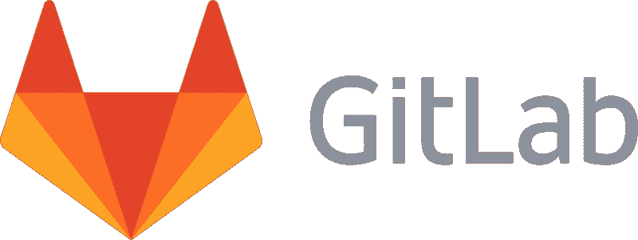
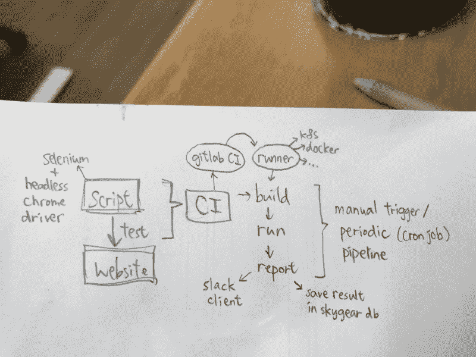
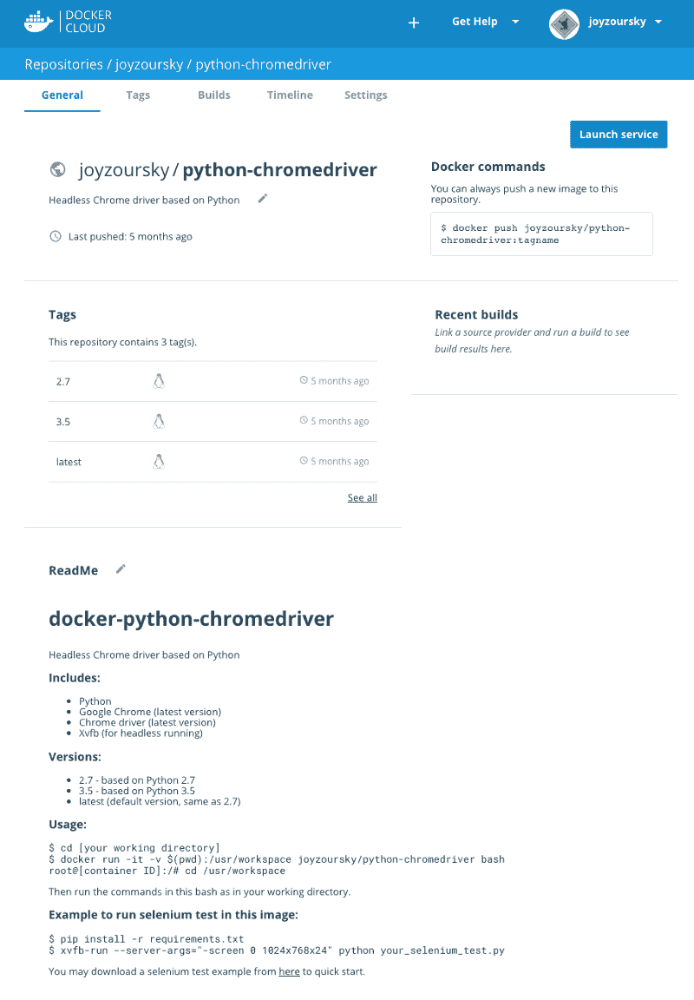
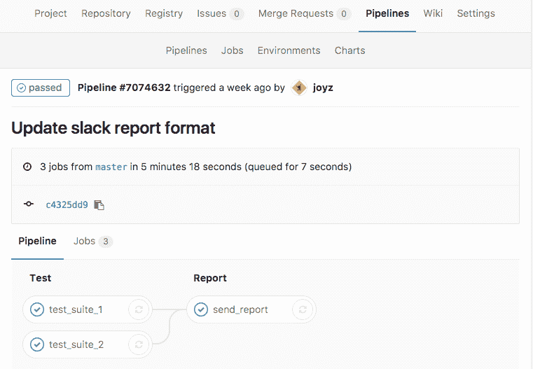
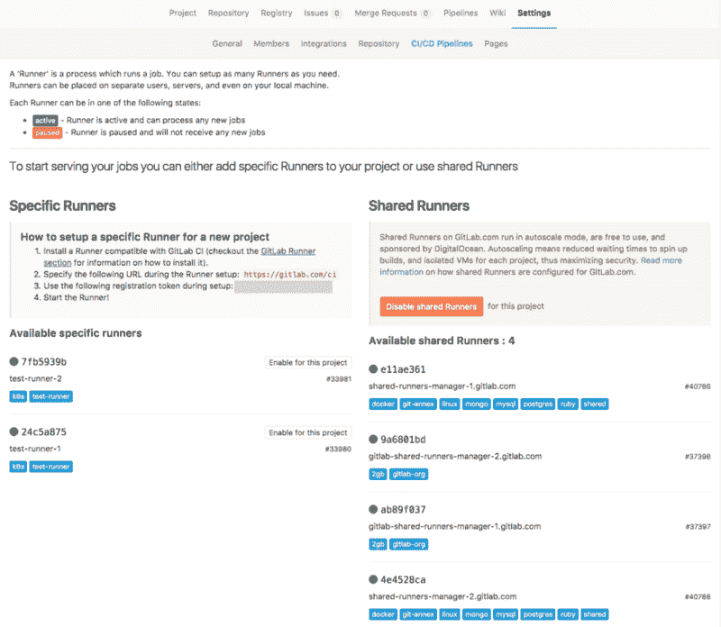
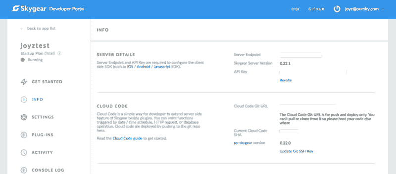
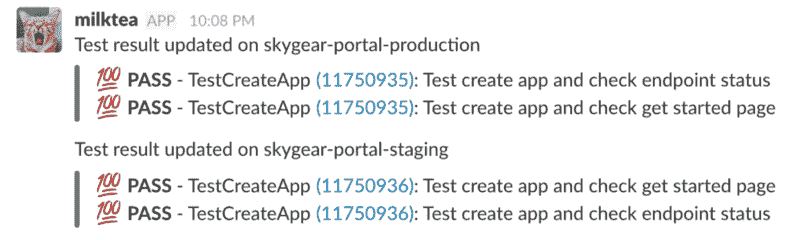

# 系统地捕获 bug:如何用 4 个步骤构建 GitLab CI 测试管道

> 原文：<https://www.freecodecamp.org/news/4-steps-to-build-an-automated-testing-pipeline-with-gitlab-ci-24ccab95535e/>

作者 Joyz

# 系统地捕获 bug:如何用 4 个步骤构建 GitLab CI 测试管道



GitLab logo via [Wikipedia](https://id.wikipedia.org/wiki/Berkas:GitLab_Logo.png)

你的第一个应用程序在发布的当天就大受欢迎。但是一个星期后，你意识到它没有保留。你会发现这是因为每当用户点击“发送”按钮时，他们的评论就会被发布两次。

这个 bug 很小，但是它扼杀了你的动力。不过没关系。对于你的第二个应用程序，你和你的搭档会更仔细地检查。你们两个日日夜夜点击，点击，点击你的应用程序，以防止类似的小错误再次发生。

对于一个应用程序来说，这是可以的。但是一年后，你有一家公司在不同的平台上开发了 7 款应用，包括 web、iOS 和 Android。现在，您的团队在任何应用程序发布之前都会进行代码审查。在发货之前，你要对应用程序进行测试并点击。但是你的噩梦又回来了:用户放弃了这个应用，这一次是因为当他们输入表情符号时，他们的帖子显示了奇怪的字符。发布后，您最终会获得 1 星评级。

有三种类型的产品制造公司:那些不测试的，那些测试的，和那些快速、准确和频繁测试的。

具有持续集成(CI)的自动化测试系统只是一个梦想吗？CI 似乎是一个“不错的东西”，尤其是因为运行测试和生成报告的服务，如[酱实验室](https://saucelabs.com/)、[浏览器堆栈](https://www.browserstack.com/)、[测试完成](https://support.smartbear.com/testcomplete/)都很昂贵。好消息是，有许多免费的流行工具，你可以混合搭配来建立一个免费的自动化测试系统。作为一名 QA 测试人员，我想出了一个免费的测试管道设置，所以我分享它来节省你的时间和金钱。

为什么我的公司想要建立一个自动化系统？以下是一些原因:

*   我们讨厌容易出现人为错误的手工重复性工作。
*   我们想要一个更平滑的过程(当有代码更新时测试它)，并减少等待时间。
*   我们想安排好测试时间，并让它们在控制之下。

### 设置您的 UI 测试

这篇文章介绍了一个实用的管道设置，它可以自动地、连续地运行基于 web 的测试。后面的部分可能有点技术，但它很有趣的建设！

我用这些免费的开源工具建立了整个系统:

*   [Selenium](http://www.seleniumhq.org/) —编写脚本并自动化浏览器来执行测试
*   [Docker](https://www.docker.com/) —为测试环境构建一个映像并快速交付
*   [Gitlab CI](https://about.gitlab.com/gitlab-ci/) —在代码更新时触发、构建和运行测试
*   [Skygear](https://skygear.io/) —保存测试结果，以便按需报告



Setting up takes 4 steps. Here we go!

### 步骤 1:编写脚本并在本地运行

首先，我们编写测试脚本，让我们最初的手动测试自动运行。Selenium 是一个众所周知的 web 自动化工具。它支持不同的客户端语言，包括 Java、Ruby、Python 等。

这是一个用 Python 在网站上点击按钮的例子。

> 更新:增加了 Chrome 官方无头模式的用法(详情[此处](https://medium.com/@joyzoursky/recent-updates-6264d1e5d42f))。

有了基本单元测试模型的想法，我们可以很容易地识别脚本中的这三个主要组件:

*   建立
*   运行测试用例
*   拆毁

在这个脚本中，它将分别运行`test_case_1`和`test_case_2`，在测试前运行`setUp`，在测试后运行`tearDown`。在这个例子中，我们使用 [unittest](https://docs.python.org/3/library/unittest.html) 作为我们的测试框架。随便用你喜欢的，比如 Python 里的 [pytest](http://doc.pytest.org/en/latest/) 或者 [nose](http://nose.readthedocs.io/en/latest/) 。

你可以添加更多的测试用例，比如填写表单和点击元素，这取决于你网站的界面。

### 步骤 2:用您的测试环境构建一个映像

试运行需要一个干净的环境。为了创造一个干净的环境，我们绝对不希望每次都设置一个真实的机器，然后等待几个小时来安装所有需要的软件。容器的概念很有帮助。

Docker 帮助您将测试环境构建成一个映像。该映像包括需要像虚拟机一样在该容器上预安装和运行的所有软件。使用 Docker，您可以创建一个新的容器，并在每次想要从默认环境重新开始时提取相同的映像。

为了使用 Selenium Python 客户机执行我们的测试，我们希望我们的映像预安装以下内容:

*   计算机编程语言
*   谷歌浏览器
*   铬驱动程序
*   [Xvfb](https://en.wikipedia.org/wiki/Xvfb)

Xvfb 是一个虚拟显示服务器，帮助你在无头模式下启动浏览器。有必要在容器中运行 UI 测试。它不能连接到显示器输出来直观地显示浏览器。

然后，我们还将在容器内部安装 Selenium 包。并非所有项目都需要相同的包列表。

我们创建一个 [Dockerfile](https://docs.docker.com/engine/reference/builder/) ，构建映像并上传到我们的 [Docker Cloud](https://cloud.docker.com/) 。



你可以通过这个[链接](https://hub.docker.com/r/joyzoursky/python-chromedriver/)找到这个图像，或者直接用这个命令拉这个图像:

```
docker pull joyzoursky/python-chromedriver:3.6-xvfb
```

然后，您将有一个准备好执行 UI 测试的环境。

> 更新:添加了用 Xvfb 构建的新 Docker 图像，已弃用(详情[此处](https://medium.com/@joyzoursky/recent-updates-6264d1e5d42f))。

### 步骤 3:设置 GitLab CI

[GitLab](https://about.gitlab.com/) 提供 CI/CD 管道特性，持续构建和运行您的项目。设置类似于其他 CI 工具，如 [Travis CI](https://travis-ci.org/) 或 [Jenkins。这需要一个`.gitlab-ci.yml`文件来配置你的构建过程。](https://jenkins.io/)

看一下这个例子:

> 更新:添加了 Xvfb 已弃用的示例(详情[此处](https://medium.com/@joyzoursky/recent-updates-6264d1e5d42f))。

当新代码被推送到资源库时，GitLab 会从根目录中寻找`.gitlab-ci.yml`，并根据您的设置触发一个构建。

在这个脚本中，它从第一行的`joyzoursky/python-chromedriver:3.6-xvfb`中提取环境图像。然后安装所需的包，比如 Selenium，设置所需的变量，然后开始这个过程。

注意，在这个例子中，构建过程有两个阶段:`test`和`report`。在每个阶段中，该阶段的作业将并发运行**。**如果测试可以同步运行，您可以在同一个阶段定义测试。

请转到管道页面，在此处查看流程和完成情况:



那么我们实际上在哪里运行我们的测试呢？

GitLab 托管了一些免费的共享跑步者。通过查看构建日志，我们可以在前几行中找到容器信息:

```
Running with gitlab-ci-multi-runner 1.10.4 (b32125f)Using Docker executor with image joyzoursky/python-chromedriver:3.5 ...Pulling docker image joyzoursky/python-chromedriver:3.5 ...Running on runner-4e4528ca-project-2749300-concurrent-0 via runner-4e4528ca-machine-1489737516-5e0de836-digital-ocean-4gb...
```

它显示了运行在[数字海洋](https://www.digitalocean.com/)上的集装箱名称。

当然，您也可以创建您的特定运行程序，在您的自托管机器上运行测试。GitLab 支持不同平台上的跑步者，包括 [Docker](https://www.docker.com/) 和 [Kubernetes](https://kubernetes.io/) 。但是，由于 GitLab 是一个新平台，它经历了许多更新。因此，特定的转轮有时可能会在它们过时时断裂。在配置设置时，您应该始终参考[官方资料库](https://gitlab.com/gitlab-org/gitlab-ci-multi-runner/tree/master)。



### 步骤 4:定期运行和报告

您可能希望定期运行测试。您可以通过设置 [cron 作业](https://en.wikipedia.org/wiki/Cron)来实现这一点，但是您可能不希望设置服务器只是为了运行一行 cron 作业。我公司的开源无服务器后端是 [Skygear](http://skygear.io) 。我们可以用它来用 [@every](https://docs.skygear.io/guides/cloud-function/scheduled-tasks/python/) 装饰器编写一个简单的云代码函数，并按时间间隔触发测试管道。



[Skygear](https://skygear.io/)’s developer portal. Look for your Cloud Code Git URL.

*   登录您的 [Skygear 门户网站](https://portal.skygear.io)
*   找到您的云代码 Git URL
*   克隆快速启动代码
*   编辑以添加下面的一小段代码
*   推送代码，cron 作业将每小时触发一次测试

> 更新:使用 GitLab 10.0 管道调度器代替 cron 作业(详情[此处](https://medium.com/@joyzoursky/recent-updates-6264d1e5d42f))。

假设您已经编写了一些代码来生成测试报告。你愿意每小时接收和阅读测试报告吗？当然不是。所以，我们还链接了 [Skygear 的免费云 DB](https://docs.skygear.io/guides/cloud-db/basics/js/) 服务来存储测试结果。系统仅在测试用例从通过变为未通过或未通过时发送警报。这种通知方法可能会根据项目需要而有所不同。

为了从 Skygear 数据库中保存和检索数据，我们可以使用现有的 SDK。或者，如果您是 Python 用户，您可以使用这个小的 [Python DB 客户端](https://github.com/skygear-demo/python-db-client)来帮助编写您的数据处理程序。我们使用它来保存每个测试用例之后的测试结果，并在运行所有测试套件之后检索报告。

最后，我们可以按需发送测试结果警报。

附注:我们使用 [Slack](https://slack.com/) [实时消息 API](https://api.slack.com/rtm) 进行报告，因此我们可以在相应的项目通道中接收通知。



### 结论

现在，每当生产分支上有代码更新时，这个自动化的 UI 测试就会被触发，并且测试会自动完成。失败的结果将被推回到我们的 Slack 通道，以通知我们的开发人员。

建立一个免费的自动化 UI 测试的最大障碍可能是研究工具，如果你还不是一个专业的 QA 测试人员的话。由于 QA 是我的全职工作，我希望分享我们升级后的 UI 测试堆栈也能帮你腾出时间！

如果您觉得这很有用，请单击？这样其他人也可以看到它。谢谢大家！