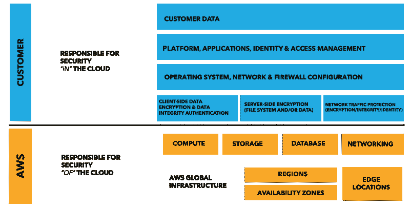
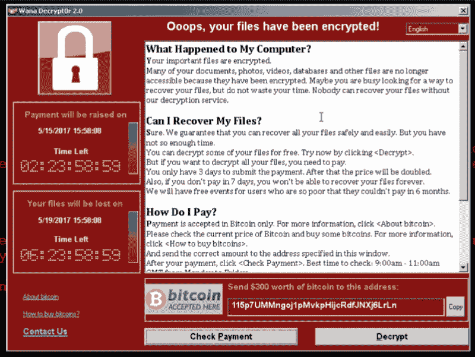
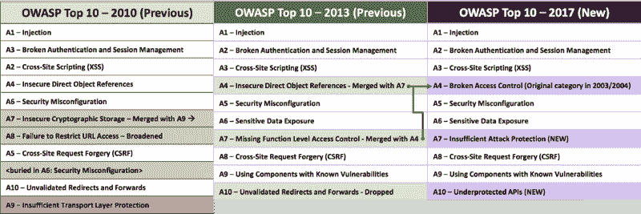
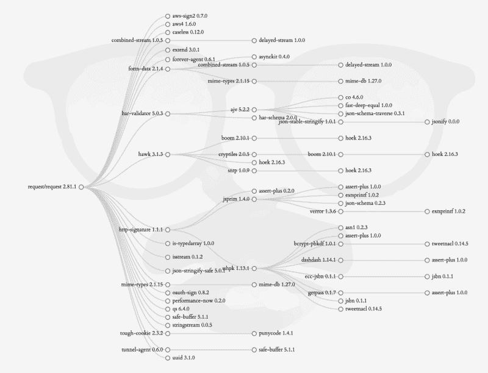
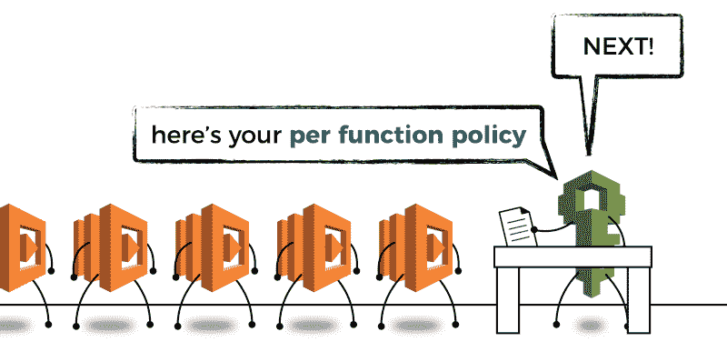
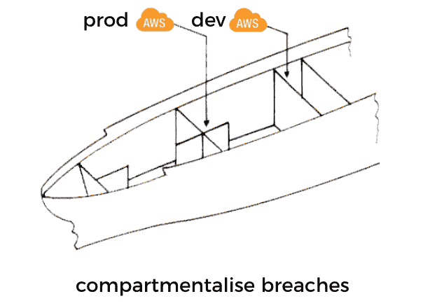
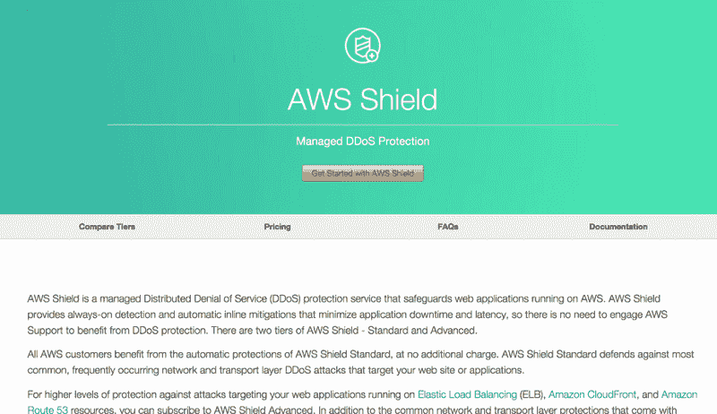
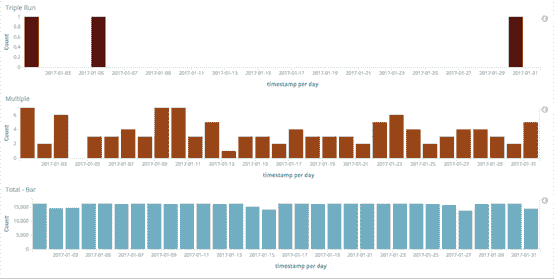
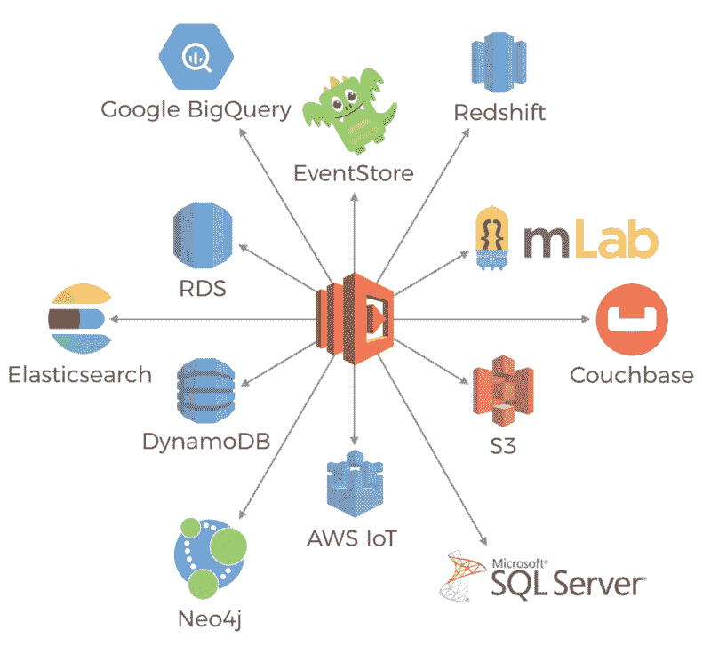

# 无服务器安全面临的多种威胁，以及我们应该如何应对它们

> 原文：<https://www.freecodecamp.org/news/the-many-faced-threats-to-serverless-security-and-how-we-should-address-them-c0d24dc43a66/>

作者:崔琰

# 无服务器安全面临的多种威胁，以及我们应该如何应对它们

对无服务器应用安全的威胁有多种形式。有些是我们以前面对过的老对手。有些是新的。有些在没有服务器的世界里采用了新的形式。

随着我们采用更低成本的服务器，我们将更多的运营责任推给了我们的云提供商。有了 AWS Lambda，您不再需要配置 ami、修补操作系统和安装监控主机。AWS 会为您处理好这一切。

这对长期以来一直是 AWS 云安全基石的 [**共享责任模型**](https://aws.amazon.com/compliance/shared-responsibility-model/) 意味着什么？

### 针对操作系统攻击的防护

AWS 接管维护主机操作系统的责任，将其作为核心业务的一部分。这减轻了您应用所有最新安全补丁程序的繁重任务。这是我们大多数人做得不够好的事情，因为这不是我们的主要关注点。

通过这样做，它可以保护我们免受操作系统中已知漏洞的攻击，并防止诸如 [Wan naCry](https://en.wikipedia.org/wiki/WannaCry_ransomware_attack) 之类的攻击。

通过从图片中移除长期存在的服务器，我们也消除了长期存在于我们环境中的复杂服务器所带来的威胁。

Wan­naCry hap­pened because the MS17–017 secu­ri­ty patch was not applied to the affect­ed hosts.

然而，修补我们的应用程序并解决代码和依赖关系中存在的漏洞仍然是我们的责任。

### OWASP 前 10 名仍然和以前一样重要

Aside from a few reclas­si­fi­ca­tions, the OWASP top 10 list has large­ly stayed the same in 7 years.

对 2017 年 OWASP 十大威胁的一瞥显示了我们熟悉的威胁。七年后，注入攻击、身份验证漏洞和跨站点脚本攻击(XSS)仍然占据榜首。

#### A9 —具有已知漏洞的组件

当 [Snyk](https://snyk.io/) 的人查看 2016 年 1792 个数据泄露事件的数据集时，他们发现前 50 个 **数据泄露事件** 中的[12 个是由使用具有已知漏洞的组件的应用程序引起的。](https://snyk.io/blog/owasp-top-10-breaches)

此外，【Alexa 排名前 5000 的网址中有 77%包含至少一个漏洞库。当你了解到一些最流行的前端 js 框架作品——例如 [jQuery](https://snyk.io/vuln/npm:jquery) 、 [Angu lar](https://snyk.io/vuln/npm:angular) 和[React](https://snyk.io/vuln/npm:react)——都有众所周知的漏洞时，这并没有听起来那么令人吃惊。它强调了不断更新和修补您的依赖项的需要。

与操作系统补丁不同，操作系统补丁是独立、可信且易于应用的。对第三方依赖关系的安全性更新通常包含需要集成和测试的特性和 API 更改。这使得我们作为开发者的生活变得困难。这是我们随着时间的推移发布新功能时必须做的另一件事。

此外，还有过渡依赖的问题。如果这些暂时的依赖关系是脆弱的，那么你通过你的直接依赖关系也是脆弱的。

[https://david-dm.org/request/request?view=tree](https://david-dm.org/request/request?view=tree)

在我们的依赖中发现潜在的弱点是一项艰苦的工作，需要不断的努力。这就是为什么像 Snyk 这样的服务如此有用。它甚至还带有一个内置的[与羊 da](https://snyk.io/docs/aws-lambda) 的集成！

#### 对 NPM 出版商的攻击

What if the author/publisher of your 3rd party dependency is not who you think they are?

去年，一个安全的猎人获得了 NPM 14%的直接销售权。受影响包龄列表也包括一些大牌:`debug`、`request`、`react`、`co`、`express`、`moment`、`gulp`、`mongoose`、`mysql`、`bower`、`browserify`、`electron`、`jasmine`、`cheerio`、`modernizr`、`redux`等等。总的来说，这些包龄占从 NPM 月卸货总数的 20%。

让那件事过一会儿再说。

他有没有用索菲斯的方法来拯救 NPM 的安全？

不，这是暴力和使用已知的 T2 账号和凭证的组合，这些账号和凭证是从包括 Github 在内的许多来源泄露的。换句话说，任何人都可以用很少的研究就完成这些。

当如此多的人对获得他们的 NPM 账户表现出如此傲慢的态度时，很难不对这些包装时代的作者感到失望。

> 662 个用户有密码`123456`，174 个— `123`，124 个— `password`。

> 1409 个用户(1%)使用他们的用户名作为他们的密码，以其原始形式，没有任何修改。

> 11%的用户重复使用他们泄露的密码:10.6%直接重复使用，0.7%稍加修改。

正如我在关于服务器不安全的演讲中所说的，你可以通过添加几行代码来窃取临时 AWS 补丁。

想象一下，在一个场景中，一个攻击者可以获得 14%的 NPM 包的推送权。他可以给所有这些包发布补丁更新，然后大规模窃取 AWS 的补丁。

风险很高，这可能是我们在无服务器世界面临的最大安全威胁。此外，它还会影响在 EC2 或容器中运行的应用程序。

包装管理的问题和风险不是 Node.js 生态系统特有的。我职业生涯的大部分时间都在和。Net 和现在的 Scala，打包管理在任何地方都是一个挑战。**我们需要软件包作者对他们账户的安全性进行尽职调查**。

#### A1 —注射和 A3 — XSS

在没有服务器的世界中，SQL 注入和其他形式的注入攻击仍然是可能的。跨站点脚本(XSS)攻击也是如此。

即使你使用的是 NoSQL 数据库，你也可能无法免受攻击。例如，Mon goDB 通过它的查询 API 暴露了许多攻击媒介。

DynamoDB 更加严格的 API 使得注入攻击更加困难。但是你仍然对其他形式的剥削敞开大门。例如，XSS 和泄露的机密允许攻击者访问 DynamoDB 表。

然而，你应该总是存储用户输入，以及你的 Lamb 函数的输出。

#### A6 —敏感数据暴露

除了服务器之外，当您迁移到服务器时，web 框架也是多余的。这些网络框架作品已经为我们服务了很多年。但他们也给了我们一把上了膛的枪，我们可以用它打自己的脚。

特洛伊·亨特 [恶魔战略](https://skillsmatter.com/skillscasts/9954-london-dot-net-june-meetup)我们如何通过打开目录列表选项来不经意地暴露各种各样的敏感数据。从包含 cre den tials(在 35:28)的 web.config 到 SQL 备份文件(在 1:17:28)！

有了 API Gate way T1 和 T2 Lamb da T3，像这样的展会就很不一样了。因为直接列举已经成为一种“特性”，你必须实现你自己。它迫使你做出明智的决定，什么时候支持目录列表，答案很可能是 *nev er* 。

### InternationalAssociationofMachinists 国际机械师协会

如果你的功能被破坏了，下一道防线就是限制被破坏的功能能做什么。

这就是为什么在配置 Lamb 任务时，您需要应用**最小特权原则**。

在[无服务器](https://serverless.com/framework/)框架中，默认行为是对服务中的所有功能使用相同的 IAM 角色。

然而，`serverless.yml`规格允许你为每个功能指定一个[不同的角色。但是它包含了更多的开发工作，增加了足够的摩擦力，几乎没有人会这样做。](https://serverless.com/framework/docs/providers/aws/guide/iam/#custom-iam-roles-for-each-function)

谢天谢地， *Guy Lichtman* 为*无服务器*框架创建了一个插件，名为[无服务器-角色-功能](https://github.com/functionalone/serverless-iam-roles-per-function)。这个插件使得应用每个函数的 IAM 角色更加容易。按照 Github 页面上的说明，自己尝试一下。

You should apply per-func­tion IAM poli­cies.

#### IAM 策略没有 Lambda 版本

Lamb da 和 IAM 配置的一个简短说明是，IAM 里坡系统不具备 Lamb da 功能。

如果您有相同功能的多个版本在使用中(每个版本都有不同的别名)，那么在 ic 中添加或删除每个版本就成了问题:

*   向新版本添加权限允许旧版本获得比他们所需更多的访问权限
*   从新版本中删除每个错误会破坏仍然需要这些错误的旧版本

在 1.0 之前，这是*无服务器*框架的常见问题，因为它使用别名来实现阶段。从 1.0 开始，这不再是一个问题，因为每个阶段都部署为 sep a rate 函数。例如:

*   `service-function-dev`
*   `service-function-staging`
*   `service-function-prod`

这意味着在任何时刻，每个功能只有一个版本是活动的。除非你在[金丝雀部署](https://aws.amazon.com/blogs/compute/implementing-canary-deployments-of-aws-lambda-functions-with-alias-traffic-shifting/)期间使用别名。

帐户 **级别隔离**也可以帮助解决添加/删除权限的问题。这种隔离还有助于**划分安全漏洞。例如，非生产帐户中的受损功能不能用于获取生产数据的访问权限。**

We can apply the same idea of bulk­heads (which has been pop­u­larised in the microser­vices world by Michael Nygard’s “Release It”) and com­part­men­talize secu­ri­ty breach­es at an account lev­el.

#### 删除未使用的功能

服务器平价的一个好处是，当功能不被使用时，你不用为它们付费。

另一方面，你没有动力删除不用的功能，因为它们不会让你付出任何代价。然而，这些功能仍然作为攻击面存在。它们也比主动功能更危险，因为它们不太容易更新和修补。随着时间的推移，这些未使用的功能会成为已知漏洞的温床，攻击者可以利用这些漏洞。

Lambda 的文档也将此列为最佳实践之一。

> 删除不再使用的旧功能。

### 拒绝服务攻击的变化

有了 AWS Lamb da，您更有可能摆脱拒绝服务(DoS)攻击。然而，积极地扩展你的无服务器架构来对抗暴力的 DoS 攻击有一个重要的意义，那就是我不能浪费成本。

没有人会发起针对无服务器应用程序的 DoS 攻击**拒绝攻击(DoW)** 攻击！

> "但是你可以查到当前合同的数量，对吗？"

当然，你最终会遇到一个 DoS 问题…这是一个双输的局面。

当然还有 [AWS 盾](https://aws.amazon.com/shield/)。只需支付固定费用，AWS Shield Advanced 就能在发生 DoS 攻击时为您提供支付保护。但是在撰写本文时，这种保护不包括额外的费用。

For a month­ly flat fee, AWS Shield Advanced gives you cost pro­tec­tion in the event of a DoS attack, but that pro­tec­tion does not cov­er Lamb­da yet.

此外，Lamb da 有一个至少一次的参与策略。[据 Sun Gard](https://blog.sungardas.com/CTOLabs/2017/06/run-lambda-run/) 的人说，这可能导致多达三次(成功)的牵连。从文章来看，多重参与的报道率极低，为 0.02%。但是，如果该速率与负载相关联，就有可能在 DoS 攻击期间以高得多的速率自我牺牲。

Tak­en from the “Run, Lamb­da, Run” arti­cle men­tioned above.

此外，您需要了解一个[异步时钟源](http://docs.aws.amazon.com/lambda/latest/dg/invoking-lambda-function.html)的调用如何导致 Lamb da [重试失败。例如，S3、SNS、SES 和云观察事件。](http://docs.aws.amazon.com/lambda/latest/dg/retries-on-errors.html)

官方说法是，这些请求在发送到指定的死信队列(DLQ)之前会重试两次，如果配置了死信队列的话。然而，Ops Ge nie 的一项[分析](https://engineering.opsgenie.com/aws-lambda-performance-series-part-2-an-analysis-on-async-lambda-fail-retry-behaviour-and-dead-b84620af406)显示，在将邀请发送到 DLQ 之前，重试的次数最多可达 6 次。

如果 DoS 攻击者能够触发失败的异步调用，那么他们可以**扩大他们攻击的影响**。

例如，如果您的应用程序允许客户端将文件更新到 S3 进行处理。然后，攻击者可以通过上传大量无效文件来拒绝您，这将导致您的功能出错并重试。

所有这些都增加了在 DoS 攻击中 Lamb da 调用的实际数量爆炸的可能性。正如我们所讨论的，虽然你的基础设施也许能够应对攻击，但你的墙壁能伸展到同样的程度吗？你应该允许吗？

### 保护外部数据

Just a hand­ful of the places you could be stor­ing state out­side of your state­less Lamb­da func­tion.

由于 Lamb 函数的短暂性质，您的所有函数都有可能是无状态的。状态比以往任何时候都存储在外部系统中，我们需要保护它们的静态**和动态**。****

****通过 HTTPS 对所有 AWS 服务进行尼姆认证，并且对每个请求进行签名和授权。大量 AWS 服务也为您的静态数据提供服务器端加密。比如， [S3](http://amzn.to/1N3Twb8) ， [RDS](http://docs.aws.amazon.com/AmazonRDS/latest/UserGuide/Overview.Encryption.html) 和[kines streams](http://amzn.to/2tgvFR2)跃然脑海。Lamb da 还内置了与 KMS 的集成，用于加密环境变量。****

****最近 DynamoDB 也宣布了对静态加密的支持。****

****当在不提供内置加密的服务/数据库中存储敏感数据时，需要应用相同的策略。在数据泄露的情况下，它为您的用户数据提供了另一层保护。****

****我们欠用户太多了。****

****在与服务(外部和内部)之间传输数据时，使用安全传输。如果你用 API Gate way 和 Lamb da 构建 API，那么默认情况下你会被迫使用 HTTPS，这是一件好事。然而，API Gate way 端点总是公共的，您需要采取必要的措施来保护对内部 API 的访问。****

****你应该使用 [IAM 角色](http://docs.aws.amazon.com/apigateway/latest/developerguide/permissions.html)来保护内部 API。它给你[细粒度的控制](http://docs.aws.amazon.com/apigateway/latest/developerguide/api-gateway-iam-policy-examples-for-api-execution.html)谁可以在哪些资源上调用哪些动作。使用 IAM 角色还可以使您避免类似这样的 awk ward 会话:****

****今天是 X 的最后一天，他可能把我们的 API 密匙放在了他的笔记本电脑上，以防万一，我们是否应该轮换 API 密匙呢****

*****“嗯..那要做很多工作，X 是值得信任的，他不会做任何事情。”*****

*****“好吧……如果你这么说的话……(秘密祈祷 X 不要丢掉他的笔记本电脑或者对公司怀恨在心)”*****

****对于 tu nate ly，这可以使用`Serverless`框架[轻松配置](https://serverless.com/framework/docs/providers/aws/events/apigateway#http-endpoints-with-aws_iam-authorizers)。****

### ****泄露的凭据****

****

Don’t become an unwill­ing bit­coin min­er.**** 

****互联网上充斥着开发商的错误故事，在他们泄露的信用额度被用于开采比特币后，他们获得了巨额账单。对于每一个这样的故事，更多的人受到影响，但选择保持沉默。出于同样的原因，许多安全漏洞没有公开披露，因为公司不想丢面子。****

****即使在我的小社交圈里，我也知道两个这样的事件。它们都没有公开，都导致了价值超过 10 万美元的损坏。就时间而言，在这两种情况下，双方都同意承担费用。****

****AWS 会扫描公共 Github repos 以查找活动的 AWS 信用记录，并尝试在可能时尽快提醒您。但是，即使你的记录被公开了一小会儿，它也可能逃脱不了攻击者的密切关注。另外，它们仍然存在于 Git commit his try 中，除非您也重写 his try。如果你的凭证进入了公共领域，那么最好尽快取消凭证。****

****防止 AWS 严重泄漏的一个好方法是使用 Git 预装配钩，如本文所述。****

****据我所知，攻击者最有可能在圣保罗和东京地区发起 EC2 实例。您可以使用 CloudWatch 事件模式和 Lambda 在您不使用的区域有 EC2 API 调用时提醒您。这样，当您的凭据被泄露时，您至少可以更快地做出反应。****

### ****结论****

****在这篇文章中，我们研究了我们的无服务器应用面临的一些安全威胁。其中许多威胁与困扰软件业多年的威胁相同。所有 OWASP 十大攻击仍然适用于我们，包括 SQL、NoSQL 和其他形式的攻击。****

****AWS 泄漏仍然是一个主要问题，可能会影响任何使用 AWS 的机构。虽然有不少公开报道的事故，但我强烈地感觉到实际的事故数量要高得多。****

****我们仍然有责任保护用户静态和动态数据的安全。API 网关总是可以公开访问的，所以我们需要采取必要的措施来保护对我们内部 API 的访问，最好是使用 IAM 角色。IAM 提供了对谁可以调用 API 资源上的哪些操作的细粒度控制，并且当员工来来去去时，可以很容易地管理访问。****

****从积极的方面来说，让 AWS 接管主机操作系统的安全责任给我们带来了许多安全优势:****

*   ****防止操作系统攻击，因为 AWS 可以更好地修补操作系统中的已知漏洞****
*   ****主机操作系统是昙花一现，这意味着没有长寿的商用服务器****

****有了 API Gateway 和 Lambda，你不再需要 web 框架来创建 API。没有 web 框架，就没有简单的方法来支持目录列表。但是，这是一件好事，因为它使一个目录列出了一个简明的设计决策。不会再因为错误配置而意外暴露敏感数据。****

****在无服务器的世界里，DoS 攻击已经采取了一种新的形式。虽然你能够摆脱攻击，但它仍然会伤害你。在 DoS 攻击中产生的羔羊损失是由 *AWS 盾高级*覆盖的**而不是** **。******

****与此同时，AWS Lamb da 出现了一些新的攻击面:****

*   ****功能经常被忽略。一个复杂的功能可能比其他功能造成更多的伤害。****
*   ****未使用的功能通常会被搁置很长时间，因为没有成本损失。但是攻击者可以利用它们。它们也更可能包含已知的漏洞，因为它们没有被主动维护。****

****最重要的是，对我来说最大的威胁是对作者本身的攻击。许多作者不认真对待他们的帐户的安全性。这不仅危及他们自己，也危及依赖他们的尼姆社会的其他成员。很难防范这样的攻击，并且侵蚀任何软件生态系统最强大的一面——它背后的尼姆社区。****

****人们再次被证明是安全链条中最薄弱的一环。****