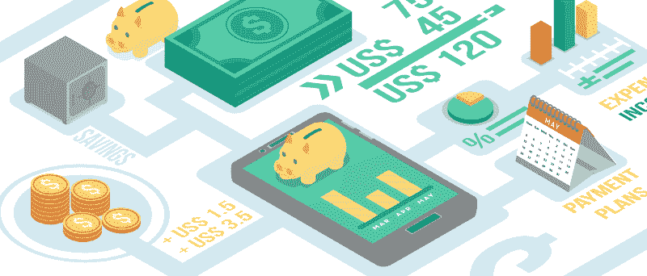
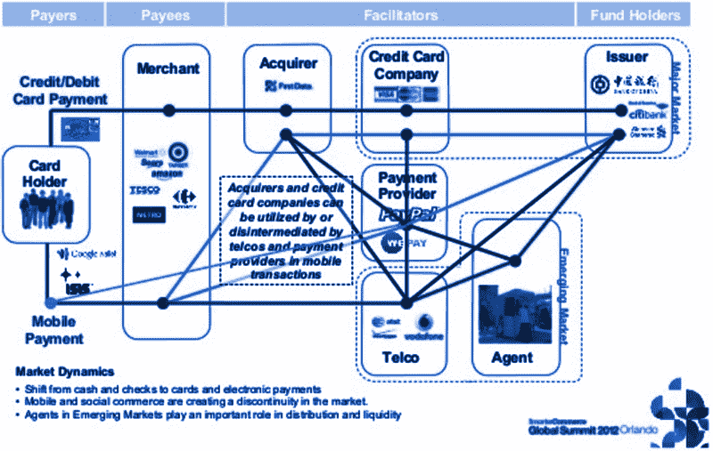
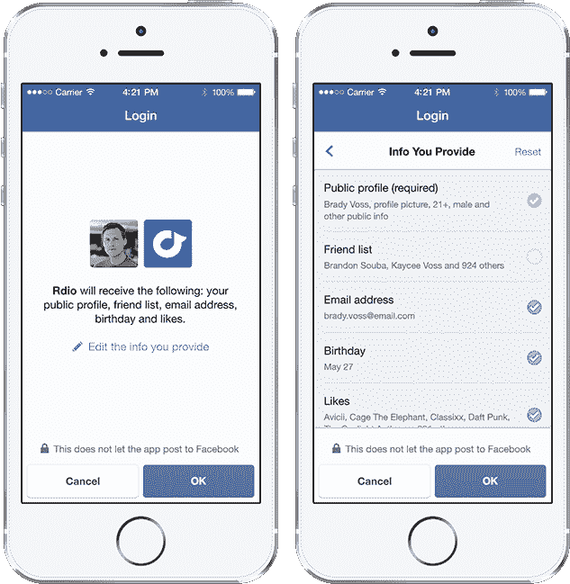
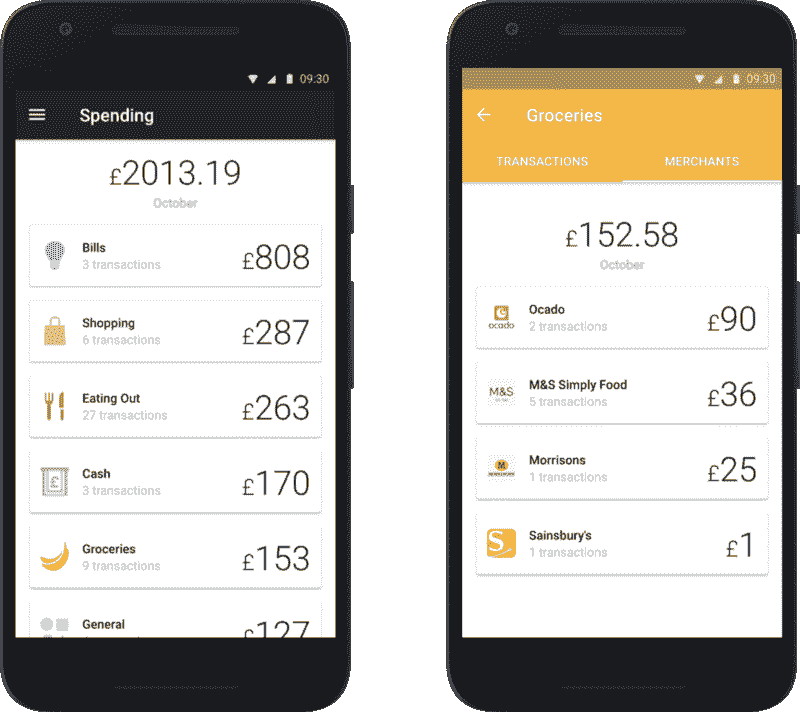
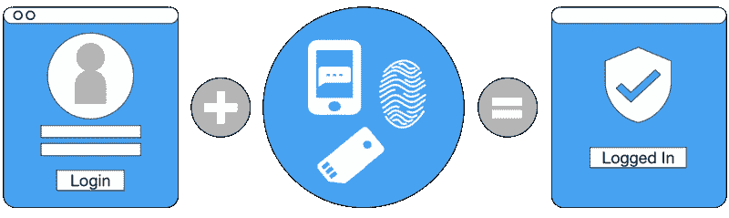

# 欧洲对开放银行的推动是如何迫使银行应用程序提高其 UX 的

> 原文：<https://www.freecodecamp.org/news/sick-of-your-banks-lame-app-open-banking-promises-more-9770cad2448c/>

迈克尔·加德纳

# 欧洲对开放银行的推动是如何迫使银行应用程序提高其 UX 的

Image Credit: [Tech in Asia](https://www.techinasia.com)

您对网上银行账户的看法和互动方式即将改变。这是因为欧洲正在迫使金融市场发生变化。

数字化转型是这十年的事情。“数字颠覆”、希望成为行业“X 的优步”的创业公司以及“移动优先”都不是新趋势。但银行业一直没有跟上时代的步伐。

新企业已经开始进军欧洲银行业市场。然而，由于监管和消费者的惰性，进展缓慢。尽管专注于最佳客户体验的公司表现优于市场。

2018 年银行业的变革步伐将会加快。一些新的法律开始生效。

### 为什么事情会发生变化？

欧洲政府已经认定“传统”银行缺乏竞争力且速度缓慢。新银行发现很难打入市场。为了解决这个问题，他们制定了一些新的法律。这项新立法将迫使所有银行在客户要求时共享更多的数字信息。

Open Banking Model. Image Credit: [XMLdation](https://www.xmldation.com/en/2016/rapid-development-tools-for-api-and-json-flows-becoming-competitive-assets-to-meet-psd2/)

如上图所示，当前的核心银行服务将增加一个新的数字接口。这被称为 API，或应用程序编程接口。它将允许第三方“fintech”(金融科技)应用和服务直接从你的银行获取信息。它还会在顶部添加一个新的工具层。这些金融科技应用程序可能由你的银行提供，也可能由外部公司提供。

所有这些变化必须在 2018 年 1 月前成为法律。

除了欧洲的立法( [PSD2](https://ec.europa.eu/info/law/payment-services-psd-2-directive-eu-2015-2366_en) )，英国也有自己的版本([开放银行](https://www.openbanking.org.uk/))。因此，这一变化将影响英国，而不考虑英国退出欧盟。

### 会有什么不同？

这篇文章将关注三个最大、最广泛的变化，以及它们将如何影响消费者。我还将对每个变化进行更深入的研究。在那里，我将讨论可能的副作用以及商机。

### 直接银行账户付款

#### 它们是什么？

现在，如果你在网上购物，你最有可能选择用借记卡支付。商家(如亚马逊)有收单机构(如 WorldPay)与你的借记卡提供商(如 Visa)协调。然后他们会从你的银行账户中提款(例如巴克莱)。这是很多公司——他们都在获得报酬。

The current payment model. Image Credit: [Mark Sherman, IBM](https://www.slideshare.net/msherman1001/mobile-money-p)

这个想法是，作为消费者，你可以直接从你的银行(巴克莱银行)向商家(亚马逊)进行银行转账。

#### **它如何影响你，消费者**

将来，你不用输入你所有的信用卡信息，而是授权亚马逊访问你的银行账户。用户体验就像今天用你的脸书账户登录其他网站一样。第一次，它会带你到你的银行的网站，并要求你确认你的授权。在此之后，许可应该保持有效，直到你撤销它，所以你只需点击和购买。

Login with Facebook example. Image Credit: [Facebook](https://newsroom.fb.com/news/2014/04/f8-introducing-anonymous-login-and-an-updated-facebook-login/)That’s going to be a bit easier than entering your card details every time. But if you have your card details saved somewhere, it’s not going to make a huge difference for your ease of purchase.

看看这种变化如何影响所有其他扮演中间人角色的公司，将是一件有趣的事情。那当然会对你产生间接影响。但很难说具体是什么。亚马逊的成本应该会下降。他们会把节省下来的钱转给你，还是会鼓励你用对他们来说最便宜的方式付款？

### 所有金融机构之间的信息共享

#### **什么事？**

目前，在网上获取银行信息的唯一方法是登录网站。或者也许他们有一个笨拙移植的移动网站，包装成一个“应用程序”。如果你想让其他组织看到你的银行账户，你必须给他们你的登录信息。这违反了银行的条款和条件，并会在欺诈或滥用的情况下导致各种问题。

#### **它如何影响你**

根据新法规，银行必须为第三方访问您的银行信息提供安全的方式。你将能够把你所有的信息集中在一个地方，并看到你所有银行、账户和卡的“实际”余额。此外，您将能够在有用的服务中使用这些信息。

例如，一些新的“挑战者银行”如 [Monzo](https://monzo.com/blog/2016/11/14/spending-android/) 或 [Starling](https://www.starlingbank.com/spending-insights-feature/) 可以显示你的支出明细。他们可以按类别(如餐馆)，然后按商店(如 Nandos)，然后按交易。他们甚至会告诉你昨晚你买酒的那家酒吧的位置。

Monzo Spending Breakdown. Image Credit: [Monzo](https://monzo.com/blog/2016/11/14/spending-android/)

现在想象一下，如果你不必转换往来账户，或者等待银行推出类似的产品。你只需插入一个服务程序，它会从你所有的账户和信用卡中为你整理信息。经过这些改变，这应该是可能的，甚至是简单的。

这种类型的信息有许多可能的应用。一些例子包括:个性化信贷或预算建议；更容易[储蓄](https://withplum.com/about/)；更容易的经常账户转换(基于自动化、个性化的建议)；更好的贷款或信贷条件(换取更多获取您的信息进行承保)；更容易的个人纳税申报，或小企业会计；您可以在所有卡和账户上使用的第三方欺诈检测服务；更简单、更便宜的国际转账；这样的例子不胜枚举。

让我们看一个例子，说明银行改善客户服务和透明度可能带来的意想不到的副作用。这里有一个很棒的故事讲的是 Monzo 如何在一个顾客被偷的包被拿走的当晚帮助他拿回了包。甚至还附赠了一瓶杰克·丹尼尔的酒。

### 在线支付的强身份认证

#### **什么事？**

认证是银行或支付提供商如何知道你是你所说的那个人。考虑到他们能够分享多少你的财务信息，他们安全使用这些信息是至关重要的。这就是身份验证的用武之地。新法规将在许多领域要求多因素身份认证。这将包括每一笔超过30 欧元的网上购物。

有三种公认的身份验证方法:

*   您知道的信息(如密码或 PIN 码)
*   您拥有的东西(例如电话号码、应用程序或物理加密狗)
*   您的身份(如指纹或面部识别等生物特征)

同时使用这些方法中的一种以上是“双因素”或“多因素”身份认证。

Multi-factor Authentication. Image Credit: [NIST](https://www.nist.gov/itl/tig/back-basics-multi-factor-authentication)Multi factor authentication is already common when creating new payees in your online bank account. You may have used a card reader, dongle or automated confirmation telephone call. However, this is often an awkward or off-putting user experience. The user must shift their attention away from the website, and it’s especially annoying if the user needs a physical object for the confirmation.

#### **它如何影响你**

2016 年欧洲网上零售平均交易额为[【85.63】美元](https://www.retailmenot.com/corp/static/filer_public/86/ed/86ed38d1-9cb9-461c-a683-ab8e7b4e1ffc/online_retailing_in_europe_us_and_canada.pdf)。这意味着您的大多数在线支付将需要多因素身份认证。

对于消费者来说，网上购物可能会变得更加困难。因此，对于在线零售商来说，在支付路径中采用灵活的多因素身份认证方法将变得至关重要。

### 总结:

> "在英国的金融服务中，开放银行业务明确提出了以客户为中心的理念."— [斯特林银行](https://www.starlingbank.com/open-banking/)

开放银行业将加快金融和银行业的变革步伐。这将为新的和改进的客户体验打开大门——也许还有授权方面的一些不好的体验。

作为一名网络消费者，你应该留意一些新的金融服务和个性化建议平台。注意新的支付方式，以及对现有支付方式的新的安全检查。期待从您的银行服务中获得更多(银行可能不再直接提供这些服务)。

对于金融行业的企业和任何接受在线支付的人来说，机会和风险并存。这些将在接下来的深度潜水中进一步强调。至关重要的是，企业要了解这些变化如何影响每个客户的体验，以便能够将其纳入服务设计。如果你想和一些客户体验设计和实施方面的专家交谈，[在 DMI](http://dminc.com/) 给我们写信。

### 进一步阅读

*   [https://www . openbanking . org . uk/about/the-initiative-open-banking/](https://www.openbanking.org.uk/about/the-initiative-open-banking/)
*   [https://www . starling bank . com/explaining-PSD 2-without-tlas-tough/](https://www.starlingbank.com/explaining-psd2-without-tlas-tough/)
*   [https://www.starlingbank.com/open-banking/](https://www.starlingbank.com/open-banking/)
*   [https://transferwise.com/gb/blog/what-is-psd2](https://transferwise.com/gb/blog/what-is-psd2)
*   [http://www . experian . co . uk/blogs/latest-thinking/PSD 2-and-open-banking/](http://www.experian.co.uk/blogs/latest-thinking/psd2-and-open-banking/)
*   [https://www . fine xtra . com/blog posting/13651/angst-over-the-ebas-PSD 2-two-factor-authentic ation-directive](https://www.finextra.com/blogposting/13651/angst-over-the-ebas-psd2-two-factor-authentication-directive)
*   [https://theodi . org/blog/comment-banking-Uber-moment-continued-action](https://theodi.org/blog/comment-banking-uber-moment-continued-action)
*   [https://www . home . Barclays/content/dam/Barclays public/docs/Citizenship/Research/Open % 20 banking % 20A % 20 consumer % 20 perspective % 20 faith % 20 Reynolds % 20 January % 202017 . pdf](https://www.home.barclays/content/dam/barclayspublic/docs/Citizenship/Research/Open%20Banking%20A%20Consumer%20Perspective%20Faith%20Reynolds%20January%202017.pdf)