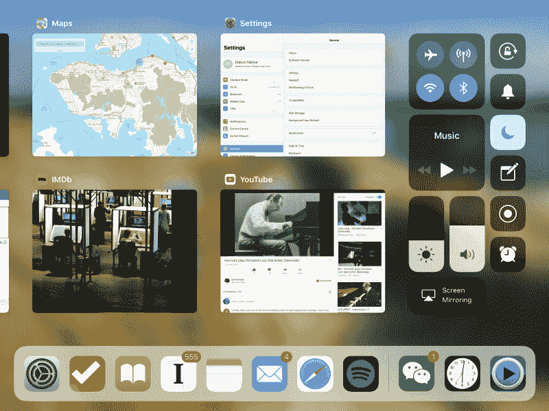
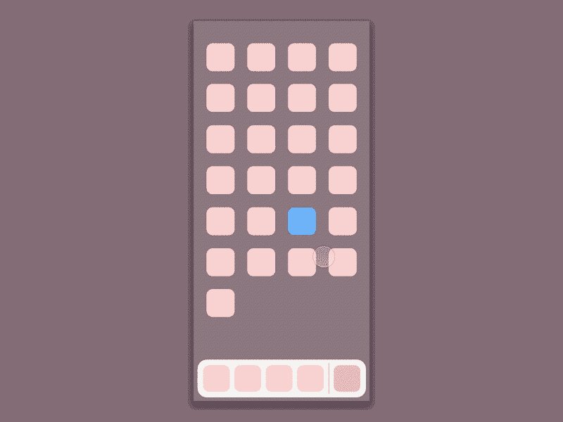
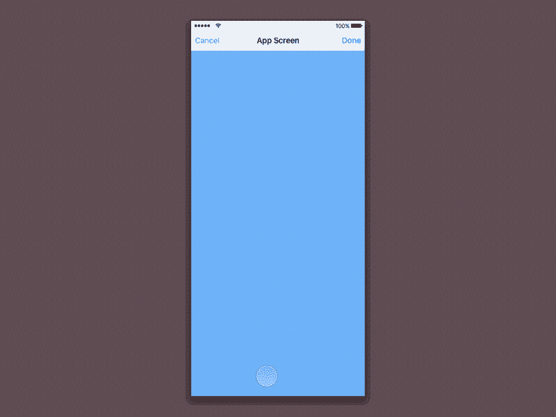
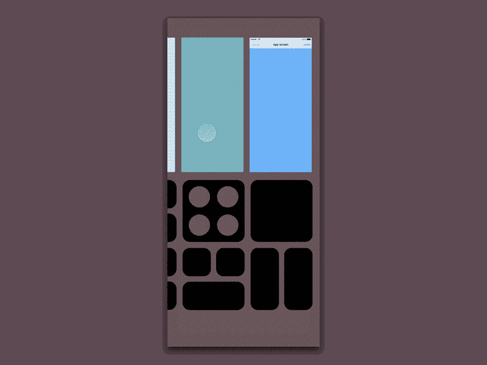
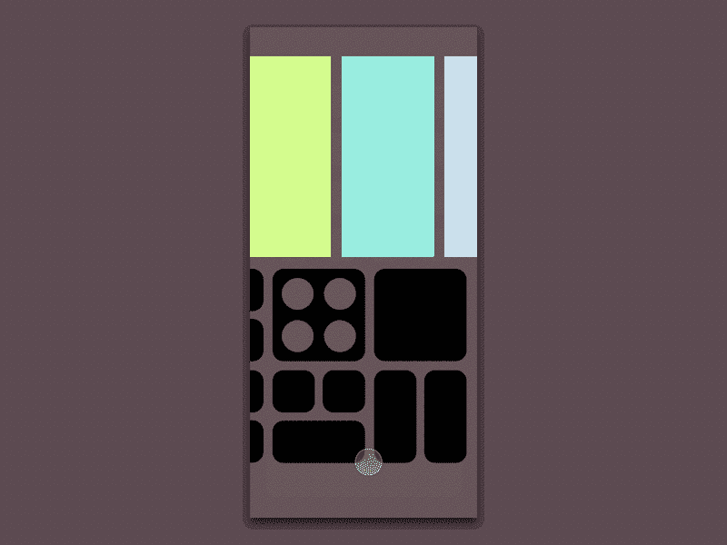
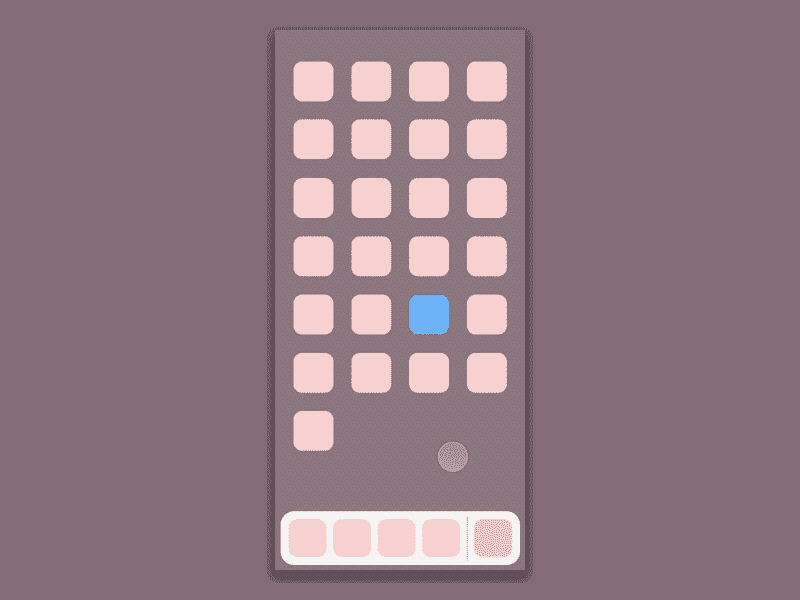
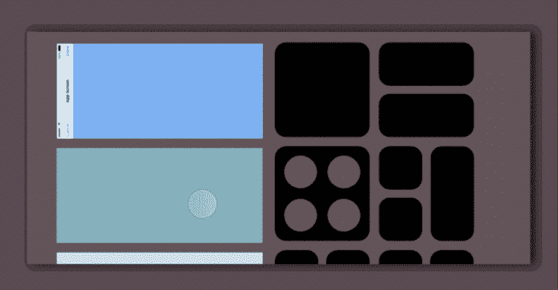

# 无家可归 iPhone

> 原文：<https://www.freecodecamp.org/news/homeless-iphone-20c154fabbf7/>

法布里斯·迪布瓦

# 无家可归 iPhone

所以，显然下一代 iPhone 不会有实体 Home 键。已经有很多关于这对用户意味着什么的猜测。设备的底部区域，对于某些来说是[，将用于托管导航栏项目，以及一个虚拟的 Home 按钮。](http://www.allenpike.com/2017/developing-for-iphone-pro/)

本文描述了另一种可能性。

最近在一些泄露的代码中的一些发现可能会使我下面要写的内容无效，但无论如何。

> **8 月 28 日更新** : [这个故事的第二部](https://medium.com/@fab.dubois/homeless-iphone-part-2-1f7b3acc8a6c)现已上线。

### 为什么是 Home 键？

要解决设计问题，最好从正确的问题开始。我们使用 Home 键有两个主要原因:

*   去一个我们可以选择另一个应用程序的地方
*   “关闭”当前应用程序，因为我们已经完成了

当然，其他几个功能也依赖于当前的 Home 键(Siri 用户，开枪吧！)但是现在，请允许我简化一下，并假设可以为每种边缘情况找到一种替代方案。

当我在 iPad 上尝试第一个 iOS 11 测试版时，最打动我的是新的应用切换器。从底部边缘滑动不仅可以像以前的 iOS 版本一样显示控制中心；现在它带有最喜欢的应用程序 dock 和应用程序切换器，都在同一个屏幕上。

The new app switcher on iPad (as of iOS 11 Beta 5)

从那里，有趣的是注意到在模糊的背景上点击任何地方都会立刻把你带回主屏幕。过了一会儿，我意识到我不再那么频繁地按 Home 键了。我最喜欢的应用程序的 dock，以及最近的应用程序列表，似乎足以让我继续我的工作流程——至少在大多数时候。我潜意识里想要“关闭”当前应用的需求似乎也实现了。

我开始怀疑这个只需简单滑动就能触发的新界面是否会成为苹果永远取代 Home 键的秘密武器。

如何将它应用到 iPhone 上？这就是我想做的。

### 这个概念

How the new iPad app switcher could work on iPhone

就是这样。让我们将电影分解成单独的片段来讨论不同的状态。

#### **停靠状态**

Dock is your level-1 cache

在 iPad 和 macOS 上，最喜欢的应用程序栏被称为 Dock，可以显示在任何应用程序的顶部(单独显示，无需转换到完整的应用程序切换器)。甚至可能有空间在它的右边部分包括一个额外的建议。这是您切换到下一个应用程序的一级缓存。

#### **App 切换器状态**

App switcher is your level-2 cache, plus system controls

二级缓存，如果你继续向上滑动就可以进入。我给它起了个二级缓存的绰号，因为它提供的应用程序比 dock 多，但还是比主屏幕少。在这里，当前应用程序已被暂时“搁置”。这是关键。当我们关闭一个应用程序时，这基本上就是我们的想法。我想大多数人现在都意识到这个应用程序没有被关闭，它只是被停了下来。这个概念与 iPad 一致(我真的没有发明什么)，除了 iPhone 版本由于延长的显示比例将使用两个单独的行。

#### **关闭应用切换器**

Dismiss the app switcher by tapping empty areas (for instance the bottom, here)

这里的设计依赖于一个共同的反射:如果我们在一个视图中找不到我们要找的东西，我们倾向于寻找一种方法来逃离这个视图。如果我们找不到任何具体的逃生启示，那么我们倾向于挖掘我们能找到的地方！我承认，我可能过于简单化了。但是过度简化通常比过度复杂更容易控制。

同样，这也是 iPad 实现的功能。然而，为了确保底部有一个舒适的解散区，dock 不会持续处于应用程序切换器状态(在 iPad 上它会持续，因为有足够的空间容纳它)。虽然我对这方面不太满意，但它值得改进。

#### **打开一个应用**

一旦应用程序打开，dock 就会消失，这样应用程序就可以充分利用可用空间，这在即将推出的 iPhone 上显然是巨大的；但是正如你所看到的，它被稍微延迟了一下。这是为了提高应用程序切换器的可发现性。也许是过度杀戮，也许不是。

现在让我们讨论问题和优点。

### *问题*

可发现性，以及两步到主屏幕，可能在很多人眼里还是个问题。我个人觉得它使用起来出奇的流畅，在一个真实的设备上尝试和调整了原型，但我知道乍一看它可能没有说服力。

如何访问其他 Home reliant 功能？人们强烈希望触控 ID 能被更好的认证方法取代，比如先进的人脸识别技术。我还没有想通所有需要的解决办法——那是一份全职工作——的确，那是有问题的。辅助功能，Siri，截图:有人知道吗？

最近的应用轮播不如现有的好:它更小。控制中心也没有现有的好:它很容易需要滚动。这就是简化的代价。

提议的方法可能会让那些期待底部有某种丰富功能栏的人失望，可能会像 Macbook 的 Touch Bar 一样，或者苹果希望在我们拇指下带来的其他深层功能。但是 iPhone 不是已经成了 Touch Bar *了吗？应用程序总是能够使用屏幕底部来提供上下文相关的功能。至于系统功能，它们有一个合理的位置:控制中心。所以是的，这里提出的解决方案是关于简化(至少在心智模型方面)，而不是关于增加功能。*

### *优势*

第一，完全没有 Home 键*的优雅。*这比虚拟化更引人注目、更纯粹。完全移除按钮将是最大的改进。

基于覆盖的解决方案，如虚拟按钮，也有自己的问题:如何确保按钮与其背后的应用程序视图形成良好的对比？如何管理与 app 的触摸冲突？我们能移动它吗？等等。彻底摆脱掉这些顾虑。

这里使用的比喻更符合手机中真正发生的事情:当你‘关闭’一个应用程序时，真正发生的是你在后台推送它。这正是新的应用切换器用户界面所显示的。字面意思:*你可以看到并感觉到你在后台推送应用。*

对 app UI 层面没有影响。应用程序仍然不知道任何按钮或任何传闻中的功能栏，因此不需要以任何方式调整它们的行为或布局。当一个应用程序被放到前台时，整个楼层都是它的了。

软件复杂度保持较低。同样，我的实验只是重复使用了他们已经为 iPad 制作的东西。我们不是在谈论专为新 iPhone 制造的另一种机制。对于用户来说，这也保证了一定程度的熟悉。

这种设计在景观方面的效果出人意料地好。布局不会自动旋转或重新配置。只有每个单独的项目会旋转 90 度。想想相机 UI，什么旋转什么不旋转，马上就明白我的意思了。新的控制中心网格看起来足够灵活，可以满足项目旋转的需要。由于我们仍然从底部向上滑动，dock 仍然会显示在底部，但由于如此巨大的宽度，我想它可以提供许多额外的应用程序建议。

In landscape everything would scroll vertically. And you’d enjoy a comfortable dismiss area right under your right thumb.

### 摘要

要点是，iOS 11 中用于 iPad 的新应用切换器可能比我们想象的更智能。毕竟，他们有可能不是专门为 iPad 设计的。如果经过完美的调整，它会成为切换上下文的一种令人信服的方式，并可以被视为当前应用程序和主屏幕之间的有效缓存。

而且，多巧啊，它不依赖 Home 键。

我写这篇文章的目的不是为了推测；我真的不关心苹果如何处理物理 Home 键的移除，我相信它会很好。周围的一些猜测也有好的地方，以他们自己的方式。我刚刚在这里看到一个非常有趣和不可抗拒的设计练习。

对于根据原则制作的原型，我使用了真实的比例，包括显示器([预期 375 * 812 pt 分辨率](https://daringfireball.net/2017/08/d22_display_conjecture))和控制中心项目等已知组件。

多亏了[弗雷德·贾梅](https://www.freecodecamp.org/news/homeless-iphone-20c154fabbf7/undefined)，这篇文章也有了中文。

您可能还想阅读关于设计流程的第二部分。