# 我如何编程我的第一个亚马逊 Alexa 技能，并赢得了一个免费的回声点

> 原文：<https://www.freecodecamp.org/news/how-to-use-your-tech-skill-to-create-alexa-skills-a3e9f210a952/>

罗莉·皮尔森

# 我如何编程我的第一个亚马逊 Alexa 技能，并赢得了一个免费的回声点


Echo dot

我开始学习编码已经一年了。我对编码产生了兴趣，因为我渴望在美丽、时尚和奢华的生活世界中与他人共事。我想用动画元素和其他数字媒体创建令人惊叹的网站。

我从一个在线课程开始，一个月后，我发现了 freeCodeCamp。那时学习编码变得更加令人兴奋和有洞察力。

您可以与其他程序员进行实时交流，帮助您应对交互式挑战。他们为进一步学习提供反馈和参考。这帮助我增强了信心，提高了编码技能。

6 月初，一位朋友告诉我一个名为“用亚马逊 Alexa 打造语音体验”的在线网络研讨会网上研讨会的想法增加了我的好奇心，因为当时我只看过商业广告，但没有使用过支持 Alexa 的产品。我报了名，被迷住了。

网上研讨会结束时，与会者会收到促销信息。如果你在 30 天内创造了一项技能并将其发表，你就有资格赢得一个免费的回声点。我不知道我是否有足够的知识来取得成功，但我决定试着去学习。

创建我的第一个应用程序的想法令人兴奋。就在那一刻，我的 Alexa 学习经历开始了。


Amazon Alexa Enabled Devices

### **什么是 Alexa，它是如何工作的？**

Alexa 是一种基于云的语音服务，为家庭中的数百万次语音体验提供动力。Alexa powers 的设备包括亚马逊 Echo、Echo Dot、亚马逊 Tap 和亚马逊 Fire TV。

一个技能是 Alexa 的语音驱动应用程序。

Alexa 提供“技能”，允许用户与设备进行交互。技能可以被创造出来做很多事情。他们可以回答问题，玩小游戏，播放音乐，设置闹钟，讲笑话等等。

Alexa 技能工具包(ASK)是一个工具、API、文档、代码样本和带有 GitHub 链接的模板的集合。ASK 帮助开发人员为支持 Alexa 的设备创造技能。

一个 Alexa 技能有两个主要组成部分:技能服务和技能界面。

你的代码是在 Node.js 中为生活在云中的 Skill 服务编写的( [Amazon AWS，Lambda](https://aws.amazon.com/) ，一个 HTTPS 服务)。它从支持 Alexa 的设备接收指令，以确定采取哪些行动来响应用户请求。

技能服务实现定义技能行为方式的事件处理程序。当用户对着支持 Alexa 的设备说话时，该事件被触发。

然后，使用技能开发人员门户配置技能界面。该接口处理用户的话语来触发技能服务处理的事件。在这个区域中，您可以决定如何称呼您的技能，这样用户就可以通过名称来调用它。这也是您定义技能交互模型的地方。这是因为它知道如何听用户说的话，并用想要的信息来回应。

正是这两个因素的相互作用使这项技能发挥了作用。

亚马逊团队提供了三个技能模板的链接。这些模板非常有助于您入门，并学习 Alexa 如何交互和响应。

*   **事实技能模板**
    创建类似当天的“事实”或“笑话”的东西。
*   **决策树模板**
    创建简单的冒险游戏和测验
*   **如何模板**
    以类似的循序渐进的过程创建类似食谱内容的技能。

加上更多可用的中级和高级模板。

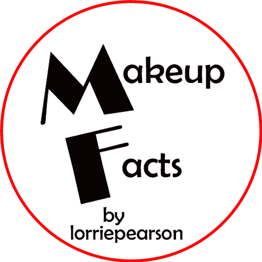

My first published Alexa Skill, Makeup Facts

我现在有三个公布的技能，[化妆事实](https://www.amazon.com/Lorriep-design-studio-makeup-facts/dp/B071XC158S/ref=sr_1_1?s=digital-skills&ie=UTF8&qid=1501898705&sr=1-1&keywords=makeup+facts)，[时尚事实](https://www.amazon.com/Lorriep-design-studio-fashion-facts/dp/B073JY3H83/ref=sr_1_1?s=digital-skills&ie=UTF8&qid=1501898748&sr=1-1&keywords=fashion+facts)，[女生可以码](https://www.amazon.com/Lorriep-design-studio-Girls-Code/dp/B07487QL3J/ref=sr_1_14?s=digital-skills&ie=UTF8&qid=1501898636&sr=1-14&keywords=lifestyle)。我是一名自由化妆师和时尚造型师，决定从我最了解的开始。

为了创建这些“事实技能”,我复习了关于创建技能的主题和信息。然后，我创建了我的事实列表，这些事实将被集成到事实技能模板中。所有的技能都在几天内被接受并发表。

### **我如何创造我的第一个技能**

前往[亚马逊开发者门户](https://developer.amazon.com/)登录，点击屏幕顶部的 Alexa。

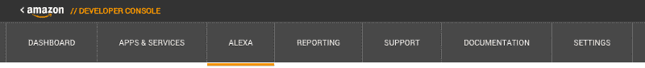

Amazon Developer Console

在 Alexa 页面上，选择 Alexa 技能工具包的“入门”。

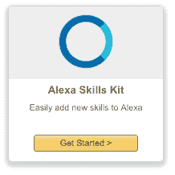

Alexa Skills Kit get started button

在下一页..选择“添加新技能”


from Amazon Alexa Skill Kit Tutorial

然后填写**信息**页面。

技能类型:**自定义**

语言:**英语**

名称:**化妆事实**

调用名称:(你的用户需要说什么来启动技能)**虚构事实**

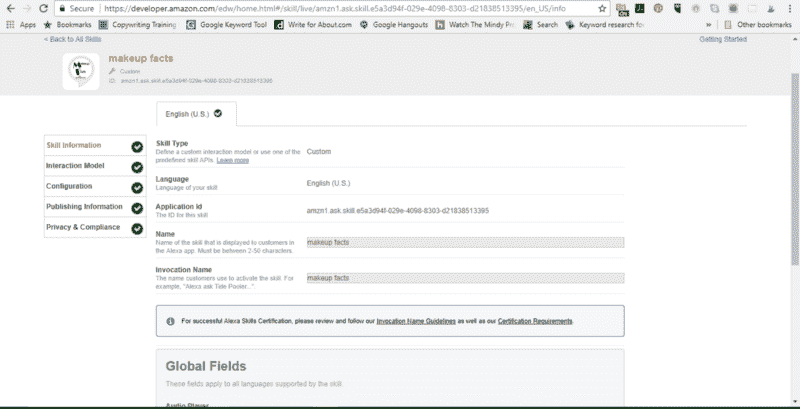

my Skill information page

点击下一步进入**交互模型**页面。这是你创造**意图**或者用户会要求 Alexa 做什么的地方。然后创造**话语**或者用户询问 Alexa 你创造的技能的可能方式。我发现这个 [GitHub 库](https://github.com/Lorrie01/alexacourse/tree/master/1_spaceGeek/speechAssets)很有帮助。样本包括:给我一个事实，告诉我一个事实。

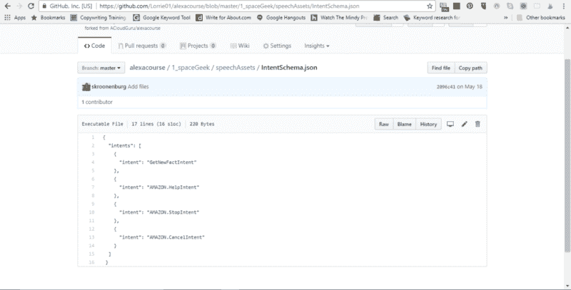

from Alexacourse GitHub

我的**意图**在**互动模式**中为**化妆事实**

```
{ “intents”: [ { “intent”: “GetNewFactIntent” }, { “intent”: “AMAZON.HelpIntent” }, { “intent”: “AMAZON.StopIntent” }, { “intent”: “AMAZON.CancelIntent” } ] }
```

我的**言论**在**互动模式**中为**捏造事实。**

```
GetNewFactIntent a factGetNewFactIntent tell me a factGetNewFactIntent tell me a makeup factGetNewFactIntent give me a factGetNewFactIntent give me a makeup factGetNewFactIntent tell me triviaGetNewFactIntent give me triviaGetNewFactIntent give me some informationGetNewFactIntent tell me somethingGetNewFactIntent give me something
```

现在是时候设置 Lambda 了。前往[https://aws.amazon.com/](https://aws.amazon.com/)并登录控制台。然后去**服务-λ**。

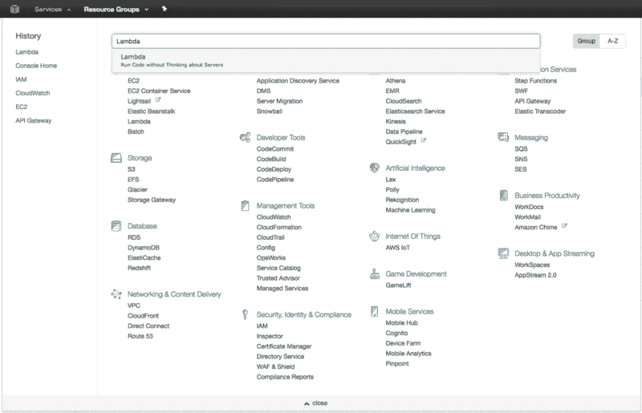

from Amazon Alexa Skill Kit Tutorial

在你页面的右上角，确保你的 **AWS 地区**是 **N. Virginia** 。


from Amazon Alexa Skill Kit Tutorial

然后单击蓝色按钮创建 Lamda 函数。

选择看起来像这样的蓝图:

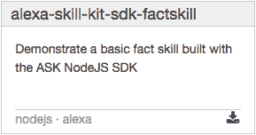

from Amazon Alexa Skill Kit Tutorial

配置您的触发器。确保在下拉菜单中选择 **Alexa 技能工具包**。

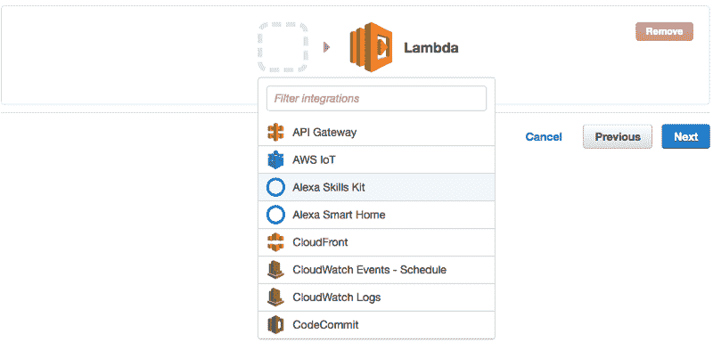

from Amazon Alexa Skill Kit Tutorial

配置您的功能。确保你的函数名是用骆驼背写的。您可以将描述留空，但是您是在 Node.js 中构建它的。

添加您更新的代码。

有一个 [AlexaSkill.js](https://github.com/Lorrie01/alexacourse/tree/master/1_spaceGeek/src) 文件是用特定的事件处理程序写的。它指定输出、提示和语音。还有一个 Index.js 文件，您可以定制它来满足您的技能需求。

```
Girls Can Code (index.js)
```

```
‘use strict’;var Alexa = require(‘alexa-sdk’);
```

```
var APP_ID = “amzn1.ask.skill.1f2c85a9-b1b6–49a8-b94d-8a795d545d98”;
```

```
var SKILL_NAME = “Girls Can Code”;var GET_FACT_MESSAGE = “Here’s your fact: “;var HELP_MESSAGE = “You can say tell me a code fact, or, you can say exit… What can I help you with?”;var HELP_REPROMPT = “What can I help you with?”;var STOP_MESSAGE = “Goodbye!”;
```

```
var data = [ “Coding is awesome.”, “You can create tools that will change the world.”, “Coding is creative.”, “Coding is like solving a puzzle.”, “Coding work can be done remotely”, “Learning code is empowering.”, “Technology and coding help create the future.”, “Girls who can code have the edge”, “Anyone can code. You’ll discover something new.”, “Coding promotes critical thinking”, “Women make great coders”, “Girls who code are role models for all women.”, “Girls who code know that technology is not just for boys.”, “Jobs in tech are in demand.”, “Coding is the language of the 21st century”, “Girls who code help close the gender gap.”, “Coding can be done anywhere, anytime”, “Working in tech can be a very lucrative career choice”, “Coding is not just about building robots and website, you learn to create things that don’t exist”, “A girl who codes could create the next new social media app”, “A girl with tech skills can change the ways businesses communicate”, “Girls who code love to learn.”];
```

```
exports.handler = function(event, context, callback) { var alexa = Alexa.handler(event, context); alexa.APP_ID = APP_ID; alexa.registerHandlers(handlers); alexa.execute();};
```

```
var handlers = { ‘LaunchRequest’: function () { this.emit(‘GetNewFactIntent’); }, ‘GetNewFactIntent’: function () { var factArr = data; var factIndex = Math.floor(Math.random() * factArr.length); var randomFact = factArr[factIndex]; var speechOutput = GET_FACT_MESSAGE + randomFact; this.emit(‘:tellWithCard’, speechOutput, SKILL_NAME, randomFact) }, ‘AMAZON.HelpIntent’: function () { var speechOutput = HELP_MESSAGE; var reprompt = HELP_REPROMPT; this.emit(‘:ask’, speechOutput, reprompt); }, ‘AMAZON.CancelIntent’: function () { this.emit(‘:tell’, STOP_MESSAGE); }, ‘AMAZON.StopIntent’: function () { this.emit(‘:tell’, STOP_MESSAGE); }};
```

用以上两个文件创建一个压缩文件，并将 zipfile 上传到 Lambda。

跳过高级设置。

复制屏幕右上角的 ARN 号。

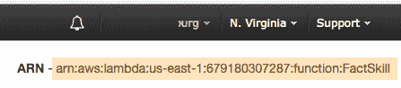

from Amazon Alexa Skill Kit Tutorial

返回到**亚马逊开发者**页面。选择你的技能并点击左侧工具条菜单中的**配置**标签。

选择**AWSλ**选项。勾选**北美**框。粘贴您从 Lambda 仪表盘中复制的 **arn#** 。

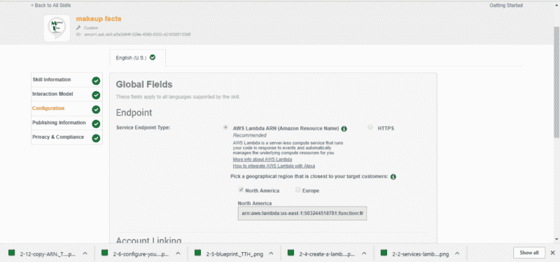

my configuration page

测试你的技能。如有必要，请对其进行更新，使其正常工作。这个 [GitHub 库](https://github.com/Lorrie01/alexacourse/tree/master/1_spaceGeek/src)为您提供了创建事实技能的示例代码。检查它，克隆它，更新它来写你自己的。

你可以在开发者控制台、Lambda 函数、Echo 和 Echoism.io 测试你的代码。

输入您的发布和隐私信息。

祝贺..您已准备好提交认证。

亚马逊开发团队需要几天时间来回复。如果你的技能被认可，那么一切都正常，所有的信息都是符合标准的。你的技能将被认证和出版，并提供给其他人使用。

如果没有，您将收到反馈和建议，了解如何解决任何问题，以便重新提交。

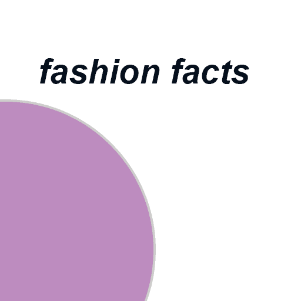

My 2nd published Alexa Skill, Fashion Facts

### **我学到了什么**

*   熟悉 JavaScript 和 Node.js 会有所帮助。
*   您将需要一个 AWS(亚马逊网络服务)帐户和一个亚马逊开发者帐户来完成和提交技能。
*   回顾那些你不能使用的，会与 Alexa 的反应相冲突的词语。
*   听听你技能的预演。了解你的信息流非常有帮助。
*   与在屏幕上阅读相比，创建由最终用户语音激活的东西是非常不同的。
*   在写技能的时候，假设你是最终用户。它帮助我理解了用户会如何向 Alexa 询问信息。
*   如果你的技能没有被接受，查看 Alexa 技能团队的反馈。它们提供了大量的信息，可以帮助你准备好技能认证。
*   如果你对你现有的一项技能进行改进，改进后的技能也要经历同样的过程。
*   你需要一个图标或图像来显示你的技能。
*   一旦你的技能被接受和认证，它就在亚马逊上直播。

我目前正在研究两项技能。一个使用“决策树模板”，另一个使用“如何模板”。这些构建起来有点复杂，但我相信很快就会发布。

我也有我的免费回声点。与这个设备的互动给了我发展更多技能的想法。

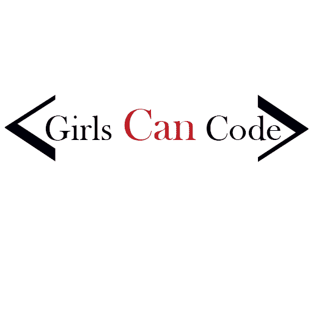

My 3rd published Alexa Skill, Girls Can Code