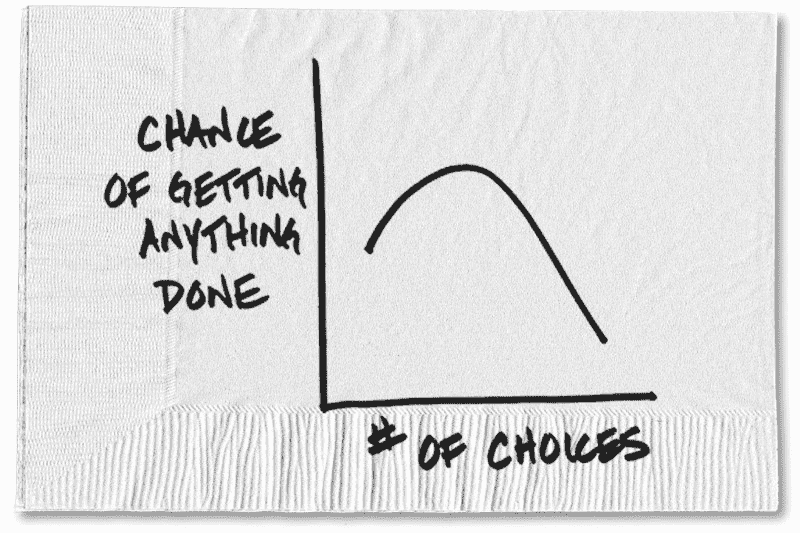
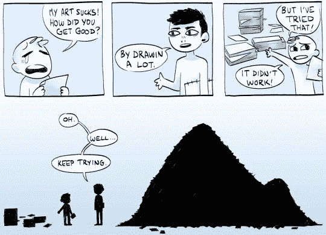

# 当有成千上万的在线课程时，如何保持理智并学习编码

> 原文：<https://www.freecodecamp.org/news/how-to-stay-sane-and-learn-to-code-when-there-are-thousands-of-online-courses-e28183bce636/>

特拉维斯·陈

# 当有成千上万的在线课程时，如何保持理智并学习编码

Graph by [Carl Richards](https://www.nytimes.com/2014/01/21/your-money/the-trap-of-too-many-choices.html)

我们生活在信息时代。我们能想到的任何信息都唾手可得。虽然这很好，但它会导致太多的选择。如果你是一个初学编程的人，你可能会在这么多的在线课程中做出选择。

如果你去 Udemy 网站搜索[“网络开发”](https://www.udemy.com/courses/search/?q=web%20development&src=sac&kw=web%20devel)，你会看到几乎有**1000**门课程可供选择。

请记住，这只是一个平台！还有 Udacity Nanodegrees、Treehouse、Pluralsight、Lynda……不胜枚举。这就是选择太多的陷阱。

### 学习 web 开发很难

学习 web 开发很难。这是一个快速发展的领域，总有新的东西要学。

对于初学者来说，在选择学习资源时，心理负担会增加，并且可能会害怕错过。那么你应该选择哪门课程呢？你应该参加柯尔特·斯蒂尔的网页开发者训练营，还是罗伯·帕西瓦尔的网页开发者课程？或者每月订阅树屋怎么样？

答案是:**没关系，随便挑一个，致力于它。**

我见过无数的[人](https://medium.com/career-change-coder/begin-fail-begin-again-the-process-that-drives-me-5ffb44361f39)(很抱歉特意揭穿你杰里米，你的是我最近读过的！)被许多教授相同概念的课程所困扰。

一般来说，在同一个概念上做很多课程都不是很好的利用你的时间。例如，如果你已经意识到老师的教学风格不适合你，你应该选择另一个(感谢 DJ Khaled)。

但是，如果你发现自己大部分时间都在跟着老师的话点头，那可能是时候停止观看了。和在不同大学上多门生物入门课是一回事。

### 为什么会这样？

根据我的观察，在如何有效地研究和学习 web 开发方面有一点脱节。它不像你最可能习惯的典型学习单元，在那里你记笔记和记忆概念。Web 开发是一门手艺。就像画画或创作音乐一样，它需要练习。

via [Scotchi](http://scotchi.deviantart.com/art/keep-tryin-690533685)

如果你在学习课程时没有主动地举例说明你最近学到的东西，很可能你会浪费时间。你将经历更多的课程，这些课程教授你已经学过的相同的内容。

记录你看课程的时间和你实际花在编码上的时间也是一个好主意。

### 结束语:做所有的事情

归结起来就是实践，通过编写自己的代码片段来应用你所学到的东西。

作为一名开发人员，需要解决很多问题。如果你从头开始练习制定解决方案的过程，你的知识和技能会随着时间自然增长。因此，我特别喜欢 [freeCodeCamp](https://www.freecodecamp.org/) 和他们基于项目的课程。

如果你曾经碰壁，不要害怕伸出手问社区，我们都希望你成功。

[如何把自己从编码教程的窠臼中挖出来](https://medium.freecodecamp.org/how-to-dig-yourself-out-of-the-coding-tutorial-rut-7d3b2232f234)启发了这篇帖子。

这里有一个[视频](https://www.youtube.com/watch?v=RDyg_41QF1w)值得你花时间看。艾德·希兰谈到了同样适用于编程的实践。