# 统计推断摊牌:常客 VS Bayesian s

> 原文：<https://www.freecodecamp.org/news/statistical-inference-showdown-the-frequentists-vs-the-bayesians-4c1c986f25de/>

作者:基里尔·杜波维科夫

# 统计推断摊牌:常客 VS Bayesian s

Photo credit to [SCOTT KING](http://www.scottking.info/blog/author/scott-king/ "Posts by Scott King")

### 推理

统计推断是一个非常重要的主题，为现代机器学习和深度学习算法提供了动力。这篇文章将帮助你熟悉构成推理的概念和数学。

想象一下，我们想用一枚不公平的硬币来欺骗一些朋友。我们有 10 枚硬币，想要判断其中是否有一枚是不公平的——这意味着它出现正面的机会多于反面，反之亦然。

所以我们拿起每枚硬币，扔几次——比如 100 次——然后记录结果。事情是这样的，我们现在有了每枚硬币真实分布(样本)的一个测量子集。我们已经考虑了我们拇指的状况，并得出结论，收集更多的数据将是非常乏味的。

知道真实分布的参数是不常见的。通常，我们希望从样本中推断出真实的总体参数。

所以现在我们想估计硬币正面落地的概率。我们对**样本均值**感兴趣。

到现在为止，你可能会想，“只要数人头数，然后除以已经尝试过的总次数就行了！”是的，这是找到一枚不公平硬币的方法，但是如果我们一开始就不知道，我们怎么能得出这个公式呢？

### 频繁推理

回想一下，掷硬币最好用伯努利分布来建模，所以我们确信它很好地代表了我们的数据。伯努利分布的概率质量函数(PMF)如下所示:

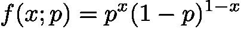

*x* 是一个随机变量，表示对掷硬币的观察(假设 1 表示正面，0 表示反面)，而 *p* 是一个参数——正面概率。我们将所有可能的参数称为 *θ* 到*。*这个函数表示根据我们选择的分布规律， *x* 的每个值的概率。

当 *x* 等于 1 时，我们得到*f(1；p) = p，*而当它为零时*f(0；p) = 1-p.* 因此，伯努利分布回答了这样一个问题:我们有多大可能得到一个正面朝上的硬币，硬币落在正面的概率为 *p？*’。实际上，它是[离散概率分布](https://www.khanacademy.org/math/ap-statistics/random-variables-ap/discrete-random-variables/v/discrete-probability-distribution)的最简单的例子之一。

因此，我们对从数据中确定参数 *p* 感兴趣。一个经常性的统计学家可能会建议使用最大似然估计(MLE)程序。该方法采用在给定数据集 *D* 的情况下最大化参数可能性的方法:

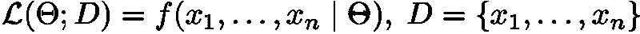

这意味着**似然性**被定义为给定模型参数的数据的概率。为了最大化这个概率，我们需要找到参数来帮助我们的模型尽可能接近地匹配数据。难道**看起来不像学**吗？最大似然法是让监督学习起作用的方法之一。

现在让我们假设我们所做的所有观察都是独立的。这意味着上述表达式中的联合概率可以通过[概率的基本规则](http://ais.informatik.uni-freiburg.de/teaching/ss10/robotics/etc/probability-rules.pdf)简化为乘积:

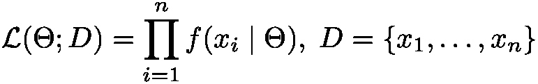

现在进入主要部分:我们如何最大化一个似然函数？我们求助微积分，针对模型参数 *θ* 对似然函数求导，设置为 0，求解方程。有一个巧妙的技巧可以让微分在大多数时候变得容易得多——对数不会改变函数的极值(最小值和最大值)。

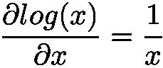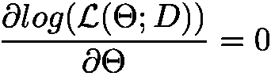

最大似然估计非常重要，几乎每个机器学习算法都是如此。这是一种最流行的用数学方法来描述学习过程的方法。

现在让我们应用我们所学的知识，玩我们的硬币。我们已经做了 *n* 次独立的伯努利试验来评估我们硬币的公平性。因此，所有概率都可以相乘，似然函数将如下所示:

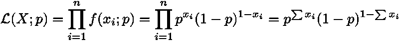

对上面的表达式求导就不好了。所以，我们需要找到对数可能性:

那看起来更容易。继续讨论差异化

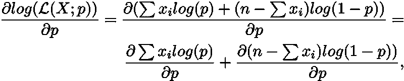

这里我们用标准的 d(f + g) = df + dg 来分割导数。接下来，我们将常数移出并区分对数:

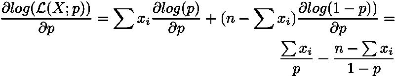

由于符号翻转，最后一步可能看起来很有趣。原因是 *log(1-p)* 实际上是两个函数的组合，这里我们必须使用链式法则:

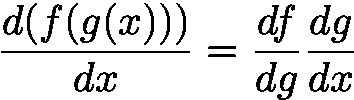

By the way, try to get familiar with the chain rule. It is a very useful tool. And it has vast importance in neural networks.

瞧，我们完成了对数似然法！现在我们即将找到伯努利分布均值的最大似然统计量。最后一步是解方程:

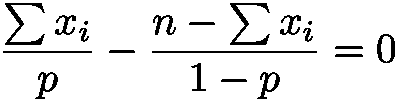

将所有内容乘以 *p(1-p)* 并扩展括号，我们得到

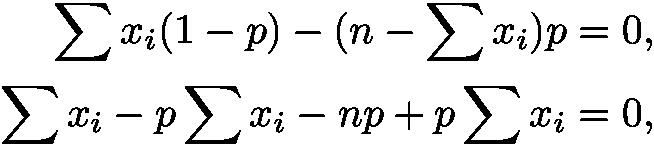

取消术语并重新排列:

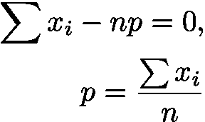

那么，这里就是我们的直观公式的推导？。 *Y* 你现在可以玩伯努利分布及其均值的最大似然估计，如下图所示

> 祝贺你的最大似然估计新技能！或者只是为了刷新你现有的知识。

### 贝叶斯推理

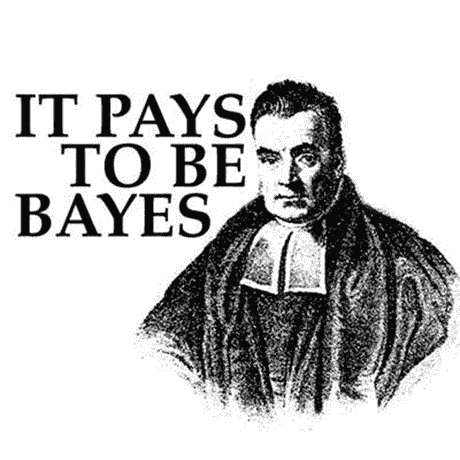

回想一下，还有另一种研究概率的方法。贝叶斯统计有自己的方法做概率推断。我们要找出给定样本下参数θ的概率分布—*P(θ| D)*。但是怎么才能推断出这个概率呢？贝叶斯定理来拯救:

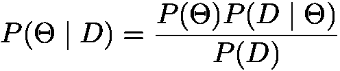

*   P(θ) 被称为先验分布，它包含了我们在看到任何数据之前对参数可能是什么的信念。陈述先验信念的能力是最大似然和贝叶斯推理的主要区别之一。然而，这也是对贝叶斯方法的主要批评点。如果我们对感兴趣的问题一无所知，我们如何陈述先验分布呢？如果我们选择了不好的先验呢？
*   *P(D | θ)* 是一个似然，我们在极大似然估计中遇到过
*   *P(D)* 称为证据或边际可能性

*P(D)* 也被称为**归一化常数**，因为它确保我们得到的结果是有效的概率分布。如果我们把 *P(D)* 改写为

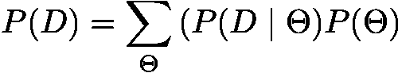

我们会看到它类似于贝叶斯定理中的分子，但是求和涉及所有可能的参数 *θ* 。这样我们得到两样东西:

*   输出总是在*【0，1】域内的有效概率分布。*
*   当我们试图计算 *P(D)* 时的主要困难，因为这需要对所有可能的参数进行积分或求和。这在大部分真题中是不可能的。

但是边际可能性 *P(D)* 会使所有贝叶斯理论都不切实际吗？答案是不完全是。在大多数情况下，我们会使用两个选项中的一个来解决这个问题。

第一个是以某种方式近似 *P(D)* 。这可以通过使用各种采样方法来实现，如重要性采样或吉布斯采样，或者一种称为变分推断的技术(顺便说一下，这是一个很酷的名字？).

第二是让它完全脱离等式。让我们更详细地探讨这种方法。如果我们集中精力寻找一个最可能的参数组合(那是最好的一个)会怎么样？这个过程被称为最大后验估计(MAP)。

上面的等式意味着我们想要找到 **arg max** 内的表达式取其最大值的*θ*—**max**imum 的 *arg* ument。这里要注意的主要事情是 *P(D)* 与参数无关，可以从 **arg max** 中排除:

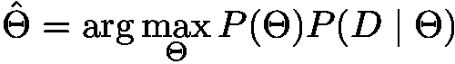

换句话说， *P(D)* 相对于模型参数将总是恒定的，并且其导数将等于 *1* 。

这一事实应用如此广泛，以至于经常看到贝叶斯定理被写成这样:

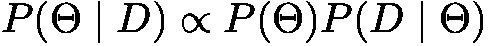

上面表达式中的有线不完全无穷大符号表示“与常数成比例”或“等于常数”。

因此，我们已经移除了地图中计算量最大的部分。这是有意义的，因为我们基本上从概率分布中丢弃了所有可能的参数值，而只是撇去了最好的最可能的一个。

### 最大似然法和地图之间的联系

现在考虑当我们假设先验是均匀的(一个恒定的概率)时会发生什么。

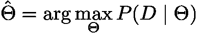

我们已经将常数 *C* 从 **arg max** 中移除，因为它不会像证据那样影响结果。对于最大似然估计来说，它看起来确实很相似！最后，频率主义者和贝叶斯推理之间的数学差距并没有那么大。

我们也可以从另一边搭建桥梁，通过贝叶斯眼镜查看最大似然估计。具体来说，可以证明贝叶斯先验与正则化项有着密切的联系。但是这个话题值得另一篇文章来讨论(更多细节见这个[所以问题](https://stats.stackexchange.com/questions/163388/l2-regularization-is-equivalent-to-gaussian-prior)和 [ESLR 的书](https://web.stanford.edu/~hastie/Papers/ESLII.pdf))。

### 结论

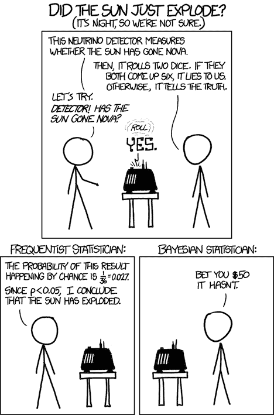

XKCD comic on Frequentist vs Bayesian

这些差异初看起来可能很微妙，但它们开创了统计学的两个流派。频率主义者和贝叶斯方法不仅在数学处理上不同，而且在统计学基本概念的哲学观点上也不同。

如果你戴上一顶贝叶斯帽，你会把未知数看作概率分布，把数据看作非随机的固定观察值。你结合先前的信念对你观察到的事件做出推论。

作为一个频率主义者，你相信我们所寻求的未知事物只有一个真实的值，而这些数据是随机的和不完整的。Frequentist 从未知总体中随机抽取数据，并使用该样本对未知参数的真实值进行推断。

最后，贝叶斯方法和频率主义方法各有优缺点。双方都有解决对方几乎能解决的任何问题的工具。就像不同的编程语言一样，它们应该被认为是同等强大的工具，可能更适合某个特定的问题，而在另一个问题上有所欠缺。使用它们，明智地使用它们，不要陷入两个统计学家阵营之间的圣战！

学到了什么？单击？说“谢谢！”并帮助他人找到这篇文章。

