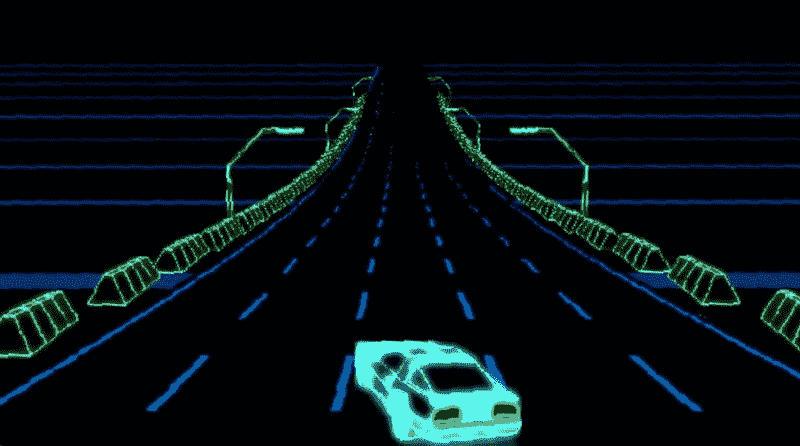
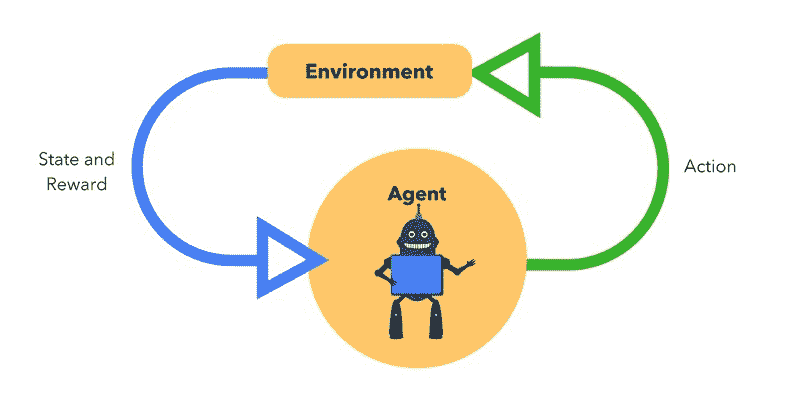
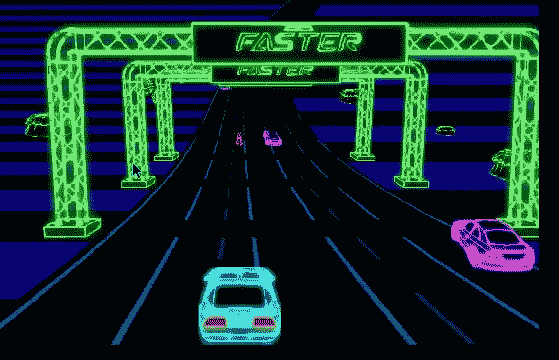
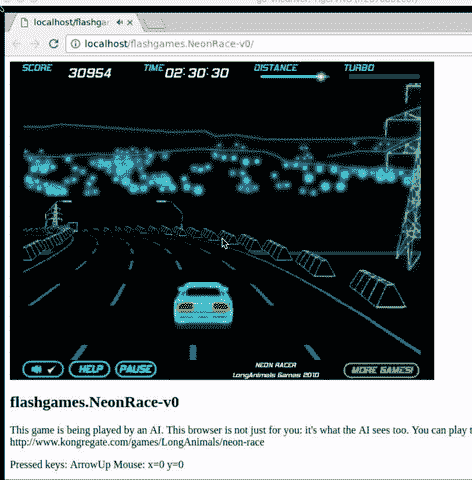
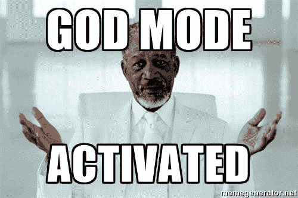

# 第 22 天:如何使用 OpenAI Gym 和 Universe 构建一个人工智能游戏机器人

> 原文：<https://www.freecodecamp.org/news/how-to-build-an-ai-game-bot-using-openai-gym-and-universe-f2eb9bfbb40a/>

作者:Harini Janakiraman

# 第 22 天:如何使用 OpenAI Gym 和 Universe 构建一个人工智能游戏机器人



Neon Race Flash Game Environment of Universe

面对现实吧，AI 无处不在。一场关于人工智能未来的对决正在埃隆·马斯克和马克·扎克伯格之间展开。有些人将其妖魔化。一些乌托邦式的观点认为，人工智能在帮助人类方面几乎可以像上帝一样。无论你的观点倾向于哪一方，AI 都会在这里。

> “有了人工智能，我们在召唤恶魔。”——埃隆·马斯克

> "害怕杀手机器人的出现就像担心火星上人口过剩一样."—吴恩达

如果你很想一头扎进去摆弄人工智能，那么游戏是一个很好的起点。它们一直是人工智能的首选测试平台。但是在开始之前，先回顾一下游戏编程的历史。

### 游戏编程的历史

游戏程序员过去常常使用启发式的 if-then-else 类型的决策来进行有根据的猜测。我们在最早的街机视频游戏中看到了这一点，如 Pong 和 PacMan。这种趋势在很长一段时间内都是常态。但是游戏开发者只能预测这么多场景和边缘情况，这样你的 bot 才不会绕圈运行！

然后，游戏开发者试图模仿人类玩游戏的方式，并在游戏机器人中模拟人类智能。

DeepMind 的团队通过对智能进行概括和建模来解决任何 Atari 游戏。游戏机器人使用深度学习神经网络，这些网络没有特定于游戏的知识。他们根据他们在屏幕上看到的像素和他们对游戏控制的了解来击败游戏。然而，DeepMind 的部分内容仍然没有开源，因为谷歌用它来击败竞争对手。

### AI 的民主化

为了避免将人工智能不可思议的力量集中在少数人手里，埃隆·马斯克创立了 OpenAI。它试图通过让所有人都能使用人工智能来实现人工智能的民主化。今天我们将探索 OpenAI 健身房和最近发布的宇宙，它是建立在健身房之上的。

OpenAI Gym 提供了一个简单的界面，用于与任意动态环境进行交互和管理。 [OpenAI Universe](https://universe.openai.com/) 是一个让你构建并测试机器人的平台。

有成千上万种环境。它们从经典的雅达利游戏、《我的世界》和侠盗猎车手，到可以治愈癌症的蛋白质折叠模拟。只需几行 Python 代码，您就可以创建一个 bot 并在任何环境中运行它。这太棒了，不能不试试！

### 项目(1 小时)

我们将建造一个使用“强化学习”技术的人工智能游戏机器人。稍后我会解释的。它将自动对抗并击败雅达利游戏 Neon Race Car(你可以选择任何你想要的游戏)。我们将使用 OpenAI 的健身房和宇宙库来构建这个游戏机器人。

#### 步骤 1:安装

确保您安装了 Python，或者使用自制软件安装它。可以下载专门的 Python IDE，比如 PyCharm 或者 iPython notebook。我喜欢保持简单，使用崇高。最后，使用 pip 安装 Gym、Universe 和其他所需的库。

```
// Install python using brewbrew install python3// Install the required OpenAI librariespip3 install gympip3 install numpy incrementalbrew install golang libjpeg-turbo pip install universe
```

宇宙(环境)中的一切都像 Docker 中的容器一样运行。如果您还没有 Docker，请从[这里](https://docs.docker.com/docker-for-mac/)安装并运行 Docker。

#### 第二步:编写游戏机器人代码

游戏机器人是用 Python 编码的，所以我们从导入唯一需要的两个依赖项开始:Gym 和 Universe。

```
import gymimport universe
```

对于这个游戏机器人，我们用我小时候最喜欢的游戏《霓虹赛车》作为测试环境。你可以从[这里](https://universe.openai.com/envs)找到一个其他环境/游戏的完整列表。

Universe 允许您并行运行任意多的环境。但是对于这个项目，我们将只使用一个。

```
env = gym.make(‘flashgames.NeonRace-v0’)env.configure(remotes=1) # creates a local docker container
```

#### **强化学习**

现在我们添加使用强化学习技术的游戏机器人逻辑。这个技术观察游戏之前的状态和奖励(比如屏幕上看到的像素或者游戏分数)。然后，它会提出一个对环境执行的操作。

目标是使它的下一次观察更好(在我们的例子中——最大化游戏分数)。这个动作由代理(游戏机器人)选择和执行，目的是最大化分数。然后应用到环境中。环境根据行动是否有益(是否赢得了游戏)来记录结果状态和奖励。).



现在，我们可以检索使用 env.reset()方法初始化的每个环境的观察列表。

```
observation_n = env.reset()
```

这里的观察是特定于环境的对象。它代表观察到的内容，如屏幕上的原始像素数据或游戏状态/分数。

下一步是使用一个无限循环创建一个游戏代理，它根据观察结果不断地执行一些动作。在我们的 bot 中，让我们定义一个重复按向上箭头的单一动作(傻 bot！随意把它演化成一个复杂的……)。这里的操作由事件类型(KeyEvent)、控制键(向上箭头)定义，并为代理看到的所有观察设置为 true。

```
while True:action_n = [[('KeyEvent', 'ArrowUp', True)] for ob in observation_n]
```

然后我们使用`env.step()`方法来使用动作向前移动一个时间步长。这是强化学习的一个非常基本的实现。

```
 observation_n, reward_n, done_n, info = env.step(action_n)
```

这里的 step 方法返回四个变量:

1.  `observation_n`:对环境的观察
2.  你的行为是否有益:+1/-1
3.  `done_n`:表示游戏是否结束:是/否
4.  `info`:用于调试目的的附加信息，例如性能和延迟

您可以在训练机器人的所有环境中同时运行此操作。使用 env.render()方法启动 bot。

```
env.render()
```

现在你已经有了准备与环境竞争的游戏机器人。这个基本机器人的完整代码以及一个高级版本可以在我的 Github repo [这里](https://github.com/harinij/100DaysOfCode/tree/master/Day%20022%20-%20AI%20GameBot%20using%20Universe)找到。

#### **第三步:运行游戏机器人**

现在是有趣的部分:确保 Docker 正在运行，并运行机器人。看看它是如何打败其他车的，还是没能打败其他车。如果失败了，继续调整你的机器人，让它打败智能！

```
python gamebot.py
```



Crash and burrrn! #Basic

继续修补人工智能，最终你可以解锁上帝模式！#100DaysOfCode



如果你喜欢这个，请鼓掌？s o 其他人也能看到！在 Twitter 上关注我@ [H **ariniLabs**](https://twitter.com/harinilabs) 或 M [**edium**](https://medium.com/@harinilabs) 获取其他故事的最新消息或只是打个招呼:

*PS:注册我的简讯 [**这里**](http://harinilabs.com/womenintech.html) 成为第一个获得新鲜新内容的人，它充满了来自# [**WomenInTech**](http://harinilabs.com/womenintech.html) 的灵感，是的男人也可以注册！*