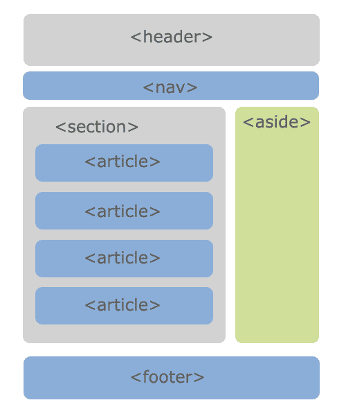
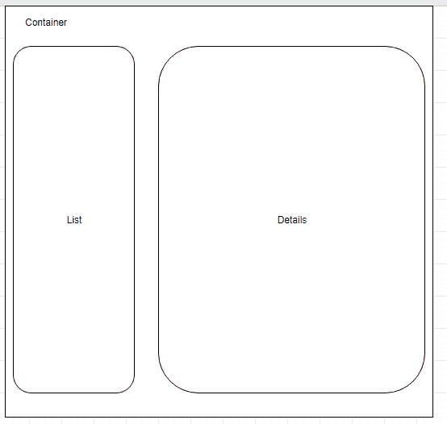
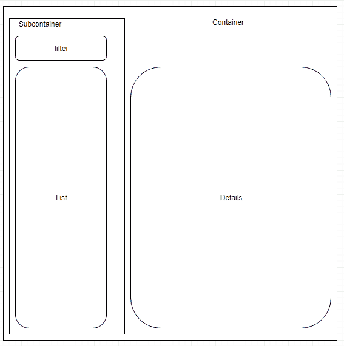

# 往返之路

> 原文：<https://www.freecodecamp.org/news/the-road-to-redux-and-back-d9987c7bb894/>

#### *为什么我决定回到香草反应过来*

我做了一些原型工作来展示客户机逻辑和持久性之间的数据访问层的好处。一路走来，我成了 GraphQL 的忠实粉丝。尽管我喜欢 React，但它并不是我所希望的低代码方法(尽管，嘿:没有 jQuery！).我尝试混合使用 Redux 来进一步简化编码，但也有令人失望的地方。

React 在概念上很简单:一个组件可能包含*状态*和接收*属性*。React 将监视状态的变化，并将重新呈现该组件和*任何可能受状态变化影响的子组件*。状态通过 props(元素属性)传递给子元素。流程中调用了一些内置的 React 组件方法，每个方法都可以根据需要被覆盖(例如，为了避免不必要的重新呈现)。

学习 React 时，我首先求助的资源之一是巴基·罗伯特的系列文章。布基在简单和非正式地解释概念方面做得很好。你得到了 React 如何工作的要点，这是你开始时所需要的。

因此，我写了一些 React 代码。起初这进行得很顺利。然而，随着我的组件层次结构变得越来越复杂，跟踪每个组件的关系层次结构，以及传递的所有道具，变得令人困惑。



Are <section> and <aside> in the same container? What about <nav>?

在学习 React 时，它有助于明确区分**表示组件**和**容器组件** *。*表示组件是页面上显示的元素。容器组件是维护其子组件状态的组件。容器组件可以是表示性的，容器的，或者两者都是。容器是智能的，有状态逻辑。表示组件是哑的，大部分是处理传入道具表示的模板化 HTML。

首先，很难看出哪些组件相互影响并共享状态，因此需要属于同一个容器。您将需要改变状态并重做属性传递，因为什么组件将一起工作变得越来越清楚。这就是所谓的“[重构](http://erikaybar.name/refactoring-react-extracting-layout-components/)”。

### 道具，道具，还有更多道具

所有的改变都通过属性。大多数教程通过从根容器组件到所有子组件按名称传递每个属性来说明这一点，其中每个子组件选择它想要的属性，而忽略其余的。

让我们以 React 自己的文档为例:

```
function Welcome(props) {
  return <h1>Hello, {props.name}</h1>;
}

function App() {
  return (
    <div>
      <Welcome name="Sara" />
      <Welcome name="Cahal" />
      <Welcome name="Edite" />
    </div>
  );
}
```

****欢迎**** 组件需要一套属性或道具。它使用名为 ****名为**** 的道具来显示个性化的欢迎信息。包含组件是一个匿名的< div >。它把名字传给了 ****欢迎**** 三个人的分量。

这很好。但是，当您希望在 ****Welcome**** 组件中不仅显示名字，还显示姓氏、地址、电子邮件和电话号码时，会发生什么呢？

```
function Welcome(props) {
  return <div>
     <h1>Hello, {props.first_name} {props.last_name}</h1>
     <ul>
       <li> email: {props.email} </li>
       <li> phone: {props.phone} </li>
       <li> address: /* mercifully omitted */ </li>
     </ul>
  </div>;
}

function App() {
  return (
    <div>
      <Welcome first_name="Sara" last_name="Smith" email="...", phone="...", address={/*address object*/}/>
      <Welcome first_name="Cahal" last_name="Murthi" email="...", phone="...", address={/*address object*/}/>
      <Welcome first_name="Edite" last_name="Franco" email="...", phone="...", address={/*address object*/}/>
    </div>
  );
}
```

显式传递道具很吵。此外，如果 Welcome 组件是几个其他组件的组合，每个组件都有自己的一组所需属性，那么您也必须将这些属性传递给 Welcome 组件。

道具不仅是数据，也是方法。按照惯例，道具是不可变的。

如果任何一个孩子想要改变一个属性，它应该通过一个从保存状态的容器传入的 set 方法来完成。子进程调用 state set 方法，更新状态并生成新的属性值。然后，每个孩子都被通知属性更改。进行状态突变的孩子不知道哪个容器保存了状态，但也不需要知道。它调用从某个匿名父容器中给定的 set 方法。

这是 React 文档中的另一个例子:

```
class Toggle extends React.Component {
  constructor(props) {
    super(props);
    this.state = {isToggleOn: true};

// This binding is necessary to make `this` work in the callback
    this.handleClick = this.handleClick.bind(this);
  }

handleClick() {
    this.setState(prevState => ({
      isToggleOn: !prevState.isToggleOn
    }));
  }

render() {
    return (
      <button onClick={this.handleClick}>
        {this.state.isToggleOn ? 'ON' : 'OFF'}
      </button>
    );
  }
}

ReactDOM.render(
  <Toggle />,
  document.getElementById('root')
);
```

虽然在这种情况下，按钮可以直接访问状态，但常见的情况是状态作为属性传递给子按钮表示组件，并使用附加的 set 方法来更改该组件状态中的 isToggleOn。

```
handleClick() {
    this.setState(prevState => ({
      isToggleOn: !prevState.isToggleOn
    }));
  }

render() => <Button 
onclick=handleClick.bind(this)
isToggleOn=this.state.isToggleOn />;

ReactDOM.render(
  <Toggle />,
  document.getElementById('root')
);
```

### 啊，重构

因此，您通过所有子组件进行所有这些属性传播，一切都很美好。然后再添加一个组件，并意识到它依赖于某个状态，而这个状态并不在您想要放入新组件的容器中。

让我们从一个简单的列表和细节应用程序开始:



As I choose items in the List, it updates Details (I am not a Web Designer)

当在列表中选择项目时，通知通过作为道具发送的 mutator 发送到容器，并且容器的状态被改变。这将导致列表和详细信息重新呈现。作为重新渲染操作的一部分，会通知详细信息列表中选定的项目，并使用新的项目信息进行更新。

现在，我们稍后决定要在列表中添加一个过滤器。我们添加了一个新的容器来管理过滤器状态，比如一个单选控件。当过滤器改变时，它更新子容器的状态，这导致列表重新呈现。最外层的容器现在包含子容器，而不是列表。它仍然包含细节组件，但是所选列表项的状态管理保持不变。容器对过滤器一无所知。



Adding a Filter and new Subcontainer

没什么变化。容器现在有一个子容器，而不是一个列表，但是相同的属性被传递给新的子组件。每个容器都有自己管理的状态。

然而…后来我们意识到知道应用哪个过滤器将影响我们显示什么细节，但是因为过滤器是细节的兄弟，细节将不能访问过滤器的状态。所以现在的选择是:

1.  让列表项包含有关其筛选依据的信息
2.  将过滤器状态从子容器向上推至容器

这就是 React 重构。任何共享状态的东西都必须在同一个容器中(在某种程度上)。这个概念没有错，但你永远不会第一次就搞对。随着应用程序的发展，组件也不会在一个地方停留很长时间。

#### 运水

容器是推动者，在子组件之间传递知识。当事实发生变化时，组件会被重新绘制。但是他们是爱管闲事和吵闹的推动者。他们知道孩子感兴趣的一切，但这并不能让他们成为好父母。我曾在之前写过这方面的文章，在那里这样的知识并不总是一件好事。

### 解决方案 1: Redux

一个解决方案是不要有这么多的状态。为什么不生一个呢？好吧，如果你还记得的话，状态的每一个变化都会通知孩子一些属性发生了变化。这取决于子组件是否知道该属性会影响它们所显示的内容。但是无论如何都要发送通知。

与其让容器假设它知道哪些属性被传递给了子容器，为什么不进行控制反转，让子容器说出他们对哪些属性感兴趣，然后只订阅那些状态变化。

#### 一个国家来统治他们

这就是 Redux 的用武之地。它只为所有组件提供一种状态，独立于所有 React 组件维护，但可由所有 React 组件访问。

Redux 推出了几款新品。首先是状态容器，称为商店。商店通过提供商连接到您的应用程序。这两个是“设置和忘记”。一旦写了几行代码，就再也碰不到了。

```
import React from 'react'
import ReactDOM from 'react-dom'
import { createStore } from 'redux'
import { Provider } from 'react-redux'
import RootReducer from './app/reducers'
import App from './app/app'

const store = createStore(RootReducer)

ReactDOM.render(
  <Provider store={store}>
    <App />
  </Provider>,
  document.getElementById('root')
)
```

另外两个部分稍微复杂一些:动作和减少器。按键或数据库查询结果等事件会创建一个操作。然后，根据动作类型，将动作分派给某个解析器来处理。如果你看了[我之前关于 Seneca 微服务的系列](https://medium.freecodecamp.org/follow-the-rules-with-seneca-b3cf3d08fe5d)，你会注意到 Redux 动作和 Seneca 模式是如何的相似，Reducers 和 Seneca 动作又是如何的相似。

一旦被触发，Redux 将根据操作消息中的数据修改 Redux 状态。因此，一个组件可以启动一个动作，这个动作可能会调用数据库查询或文件获取或其他任何操作，其结果作为有效负载附加到该动作上，然后被分派到 Reducers 云中，其中一个 Reducers 将(希望)从该动作停止的地方继续，并修改部分状态，以便监听部分状态的组件有机会被重新呈现。

不存在道具从容器传递给孩子的情况，但道具还是有参与的。

```
import { connect } from 'react-redux'
import { setVisibility } from '../actions'
import Popup from '../components/Popup'
const mapStateToProps = (state, ownProps) => {
  return {
    active: ownProps.toggle === state.visibilityToggle
  }
}
const mapDispatchToProps = (dispatch, ownProps) => {
  return {
    onClick: () => {
      dispatch(setVisibility(ownProps.toggle))
    }
  }
}
const Toggle = connect(
  mapStateToProps,
  mapDispatchToProps
)(Popup)
export default Toggle
```

在上面的示例中，通过使用 Redux API 方法 mapDispatchToProps 和 mapStateToProps 的属性映射，Popup 组件被绑定到状态。这段代码很可能包含在 Popup 组件的容器中。稍后会详细介绍。

传统的组织方式是在一个 **/actions** 文件夹中有动作。通常，index.js 位于导入所有操作的文件夹中，这样就可以在需要它们的依赖项中的一行中导入它们。减速器在**/减速器**文件夹中。组件在一个**/组件**文件夹中，或者在“表示性的”**/组件**和**/容器之间分开。**而 app 会在根文件夹里。

#### 然而，所有这些线路

因此，您最终得到的是带有标识文件中动作的常量的动作文件，以及使用这些常量来接收和处理动作类型的 Reducers。每一个处理状态的组件都会触发这些动作，以及受状态变化影响的属性。

这一切都很好，但是当您开始构建组件时，事情就不正常了，您会想:

*   我记得定义动作了吗？
*   我记得导出动作了吗？
*   我定义了减速器吗？
*   我在组件中包含了动作常量吗？
*   我把它导入我的减速器了吗？
*   我打错字了吗？
*   那个文件的名字是什么，我现在忘记了？

耶！假设你能记起你在搜索什么，你最终会在你的代码中做大量的搜索。问题[的一个解决方案是使动作和减少器协同本地](https://medium.com/@TuckerConnelly/simplifying-redux-architecture-cd50426c941a)。它们是相互依赖的，所以在一个公共文件中定义它们是有意义的。

### 解决方案 2:返回与 ES6 反应

当我开始掌握 Redux 时，我注意到其他人使用了一些技术，如果我当时想到这些技术，会使处理 vanilla React 容易得多。因此，由于 Redux 的代码并不比 React 本身的代码少(记住，我只是在做一个简单的原型)，所以我放弃了 Redux。

#### 散开休息

在[运载水，](https://medium.com/@jefflowery/carrying-water-4dee1ddb7eae)我提到了在途数据的主动和被动运载的区别。前者不好，但后者是可以接受的，因为它避免了紧耦合。数据只是传递给预定的接收者。这就是邮局打开一个包裹，然后把里面的所有东西都重新包装在他们自己的包裹里，与只把一个包裹寄出去的区别。

[通过使用对象扩展操作符](https://zhenyong.github.io/react/docs/transferring-props.html)，可以将属性传递给子对象，而无需显式引用属性本身。虽然这仍然从容器向子组件“输送水”，但这是以一种隐含的方式进行的。容器只知道它有道具要送下去。如果它有状态，它也会把它们发送下来。

不过，应该提到的是，对象的扩展操作符还不是 ECMAScript 的正式部分。巴别塔 transpiler 支持它，如果它配置这样做。

```
{
 "presets": [
  "latest",
  "react"
 ],
 "plugins": ["transform-object-rest-spread", "syntax-object-rest-spread"]
}
```

#### 挑选属性

一个问题是将过多的信息传递给子组件。避免这种情况的一种方法是让更高层的容器和组件“挑选”出它们感兴趣的属性，只传递其余的属性。这可以通过对象析构来实现:

```
var { checked, ...other } = props;
```

这里，选中的道具从其他道具中拉出，然后其他道具被传递(没有选中的道具[上面的例子来自[链接](https://zhenyong.github.io/react/docs/transferring-props.html)):

```
function FancyCheckbox(props) {
  var { checked, ...other } = props;
  var fancyClass = checked ? 'FancyChecked' : 'FancyUnchecked';
  // `other` contains { onClick: console.log } but not the checked property
  return (
    <div {...other} className={fancyClass} />
  );
}
```

### 反应还是还原？

当构建一个原型来演示一些概念或特性时，越简单越好。React 在概念上更容易处理。Redux 有很多工作要做，人们已经注意到动作可以变得多么细粒度。需要展示旋转器吗？发起一项行动！).

围绕 Redux [的工具正在改进](http://dev.apollodata.com/react/redux.html),[将简化](https://github.com/anshulsahni/simplify-redux)维护动作、reducers、mapStateToProps 和 matchDispatchToProps 的开销，方法是使用[更具声明性的](https://github.com/nstraub/simple-react-redux)将这些部分缝合在一起，并使用普通连接的隐式规则。