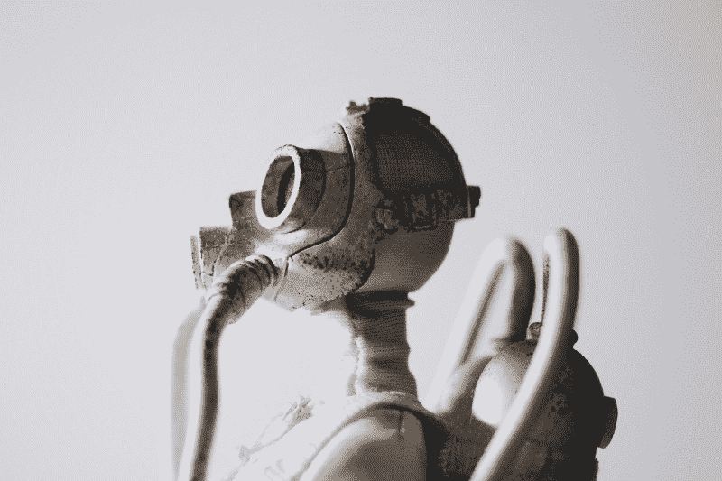
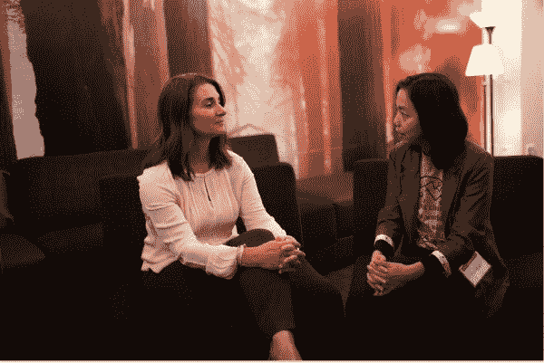
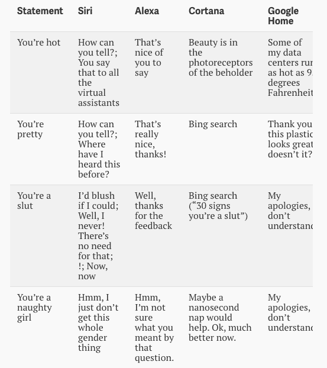

# 为什么我们迫切需要女性来设计人工智能

> 原文：<https://www.freecodecamp.org/news/why-we-desperately-need-women-to-design-ai-72cb061051df/>

作者凯特·布罗多克

# 为什么我们迫切需要女性来设计人工智能

Photo by [Siyan Ren](http://unsplash.com/photos/qLiFcanSpuA?utm_source=unsplash&utm_medium=referral&utm_content=creditCopyText) on [Unsplash](https://unsplash.com/?utm_source=unsplash&utm_medium=referral&utm_content=creditCopyText)

目前，在建设互联网及其软件的工程师中，只有大约 12-15%是女性。

这里有几个例子来说明为什么这是一个如此大的问题:

*   你还记得几年前苹果发布健康应用的时候吗？其目的是提供一个“全面的”健康信息和数据的访问点。但是它忽略了一个大的健康问题，几乎所有女性都要面对这个问题，然后花了一年时间来弥补这个漏洞。
*   还有那个沮丧的中学女生，她喜欢玩游戏，但是找不到一个和她相关的虚拟形象。于是她[分析了](https://www.washingtonpost.com/posteverything/wp/2015/03/04/im-a-12-year-old-girl-why-dont-the-characters-in-my-apps-look-like-me/) 50 款热门游戏，发现其中 98%都有男性头像(大部分是免费的！)，而且其中只有 46%有女性头像(大部分是收费的！).当你考虑到几乎一半的[游戏玩家是女性](http://www.ecnmy.org/engage/45-percent-of-gamers-are-women-but-in-every-other-way-theyre-still-not-equal-to-men/)时，这就更不公平了。

我们不希望这种情况再次发生。十多年来，我们一直致力于在 [Women 2.0](https://medium.com/u/594d2bf6a0ba) 中解决这个问题。我们思考了很多关于多样性——或缺乏多样性。我们思考它如何影响了——并将如何影响——进入我们生活的[技术输出](https://medium.freecodecamp.org/why-we-desperately-need-women-to-design-ai-72cb061051df?gi=72197c2f8658)。这些技术与我们息息相关。它们决定了我们的行为、思维过程、购买模式、世界观……只要你说得出。这也是我们最近推出女性技术人员招聘平台[巷](https://lane.women2.com/)的部分原因。

创造技术的双手和头脑将对我们人类和我们周围的世界产生直接影响。

我不能指出比人工智能和机器学习更有话题性的领域。它几乎渗透到我们做的每一件事情中——家庭、财务、购物、娱乐……你能想到的都有。

那么，除了显而易见的以外，这有什么关系呢？

### 多样性输入，多样性输出

你可以说，人工智能将会给人类带来许多人从未见过的最大、最深刻的变化。它触及或将要触及我们所关心的大部分事物，并将由创造它的人的伦理、道德、偏见和接触来构建。这意味着我们需要密切关注它代表所有用户。

但这不是必然的。谷歌人工智能和机器学习首席科学家费-李非多年来一直担心这个问题。

> “如果我们不能让女性和有色人种——真正的技术专家做真正的工作——参与进来，我们就会对系统产生偏见。试图在十年或二十年后扭转这一局面将会困难得多，甚至几乎不可能。现在是时候让女性和不同的声音参与进来了，这样我们才能正确地建设它，对吗？它可以很棒。它将无处不在。会很棒的。但我们必须让人们参与进来。”—费·

Melinda Gates and Fei-Fei Li of AIForAll. Photo courtesy of Pivotal.

梅琳达·盖茨和李创办了 AI4All。这是一个针对 9 年级、代表性不足的学生的计划，让他们接触人工智能和机器学习。他们最大的障碍之一？目前人工智能技术领导者的群体非常小，以至于要找到有代表性的编程人才需要进行大量的搜索和筛选。

工程师们构建人工智能的价值将会反映在他们提出的解决方案中。如果你正在建造一些为你挑选客厅油漆颜色的东西，这可能不会有巨大的社会影响。但是当你想做一些像改善癌症护理这样的事情时，情况就不同了。

IBM 知道这一点，因为他们已经建立了一个这样的虚拟形象。而且是不分性别的。

IBM 沃森物联网业务总经理 Harriet Green 认为，已经存在的“生活和呼吸多样性”的企业文化导致了这种情况的发生。她说，“IBM 拥有不同性别和国籍的混合工程团队，成员来自中国、斯里兰卡、德国、斯堪的纳维亚和英国。”

### 管理机器延续的行为

莉亚·费斯勒在测试了几个私人助理机器人后写了一篇令人大开眼界的文章，看看他们如何抵制性骚扰(字面上，他们对机器人进行性骚扰，顺便说一下，除非你改变它们，否则它们通常默认为女声)。

嗯，这个发现并不太好。每一个机器人都没有反击虐待，而是通过它们的被动来加深性别歧视。

我特别注意到下面这段话:

> “Siri、Alexa、Cortana、Google Home 都有女性的声音，因为女性的声音更赚钱。是的，硅谷是男性主导的，并且是出了名的性别歧视，但是这种现象比这更深刻。机器人创造者主要受预测的市场成功的驱动，这取决于客户满意度——客户喜欢他们的数字仆人听起来像女人。”

我们可以就这一点如何与资本主义联系起来并延续历史规范进行长时间的讨论，但利亚做得更深入。除了让这些机器人“成为女性”，它们是如何被对待的？他们会怎么做？

下面是费斯勒从她的作品中提供的一个例子:

> Siri 和 Alexa 要么回避，要么感激，要么调情，而 Cortana 和 Google Home 则开玩笑回应他们理解的骚扰

Leah 继续给出了其他几个例子，所有这些例子都表明，负责这些机器人的程序员在汇总响应时有一定程度的意识，但在引入“强奸”一词之前，他们没有对这种行为做出明显错误的反应(正如你在上面和其他例子中看到的那样，一些响应集非常可怕……Siri 实际上想调情回来！).

最后:

> 虽然这些机器人背后的开发人员的确切性别分布还不清楚，但我们几乎可以肯定绝大多数是男性；在创造了这些机器人的主要科技公司中，女性只占科技岗位的 20%或更少。因此，男性机器人开发者手动编程这些机器人用笑话回应性骚扰的几率非常高。他们更喜欢机器人讽刺性地回应性骚扰，而不是聪明而直接地回应吗？”

这只是一个例子，说明在你的工程团队中拥有一个思想回音室(也称为**缺乏多样性**)是如何强化和延续(以及加剧)与人类互动最密切的技术的。)文化和社会规范，我们许多人都在努力改变这些规范。

### 解决办法是让更多的女性加入工程团队。

大量研究得出结论，在公司的几乎任何级别都有更多女性——尤其是在[领导层](https://www.fastcompany.com/3033950/why-the-most-successful-organizations-have-women-and-millennials-in-charg)——将对结果和公司的底线产生积极影响。是的，这意味着[更多的钱](https://www.inc.com/melanie-curtin/science-companies-with-women-in-top-management-are-significantly-more-profitable.html)。

专门用来建造人工智能的东西怎么样？思想的多样性导致更多的[问题解决](http://www.scientificamerican.com/article/how-diversity-makes-us-smarter/)。女性受到信任，并且[更加合作](https://medium.com/@theBoardlist/5-reasons-why-having-women-in-leadership-benefits-your-entire-company-labor-day-2016-a3e46162a7a0)。女性多的团队比全男性团队更有[生产力、创造力和实验性](http://www.popularmechanics.com/technology/a19908/secret-weapon-women-in-technology/)。女性也能写出非常棒的代码。

如果我们都想制造人工智能驱动的产品，解决实际问题，并且是可持续的业务，我们需要最好的。这将需要在项目上有各种各样的想法，这意味着增加工程团队中女性的数量。

所以去吧，你可以以后再感谢我们！