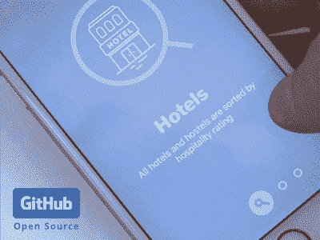
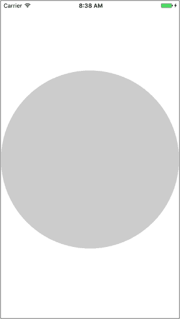
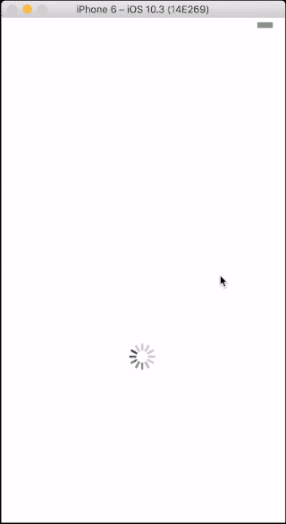
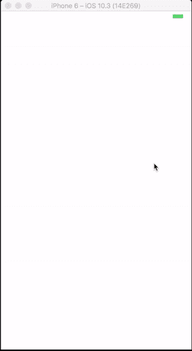
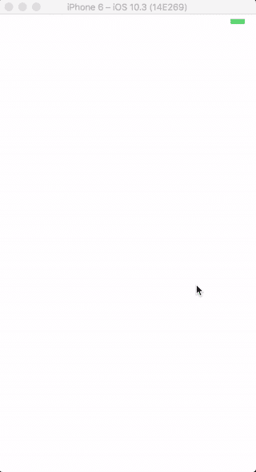
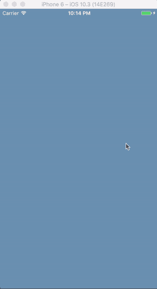
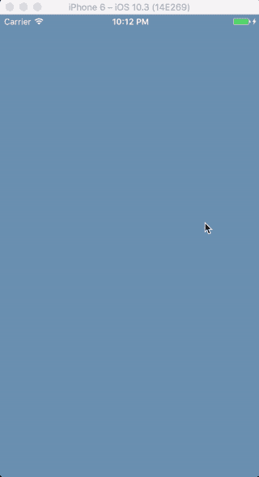
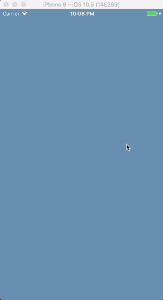

# 带有 React Native 的气泡动画

> 原文：<https://www.freecodecamp.org/news/bubble-animation-with-react-native-72674eab073a/>

作者纳伦德拉·谢蒂

# 带有 React Native 的气泡动画

#### 使用`Animated`和`PanResponder`构建 React 原生应用的经验教训

在这篇文章中，我将谈论我如何实现一个应用程序转换，这是我在 Dribbble 上由 [Ramotion](https://dribbble.com/Ramotion) 发现的。

[https://dribbble.com/shots/2694049-Pagination-Controller-App-Interface](https://dribbble.com/shots/2694049-Pagination-Controller-App-Interface)

这个分页控制器可以用于 onboarding 流或教程。

完整版发布于 Expo，打开 Expo app 扫描此二维码即可获取:

[https://expo.io/@narendrashetty/onboarding-blog](https://expo.io/@narendrashetty/onboarding-blog)

### 我们开始吧，好吗？

我是这样构建背景的:

我让`View` 控制背景颜色。这包括气泡动画的`Animated.View`。它的位置是绝对的，所以它停留在屏幕的顶部。我还添加了一些基本样式。

然后，我用 CSS 变换比例和`Animated.timing`将气泡从 0 扩大到最大来制作动画。

上述动画需要基于用户交互来触发。首先我用了`TouchableWithoutFeedback`。然后我就用手势改了。

我根据从底部开始动画的 gif 定位了气泡。我使用了`top`和`left`属性。

整洁！除了颜色之外，结果和预期的一样。我们稍后将回到这一点。

现在，我通过将气泡逻辑移动到一个名为`CircleTransition.` 的独立组件中来重新构建代码，然后从父组件中触发动画。

然后是处理颜色的时候了。为了用新的颜色制作气泡动画，我将新的颜色传递到组件中。在转变之后，我藏起了泡泡。

你能从上面的过渡中看出一些怪异的东西吗？

在第二个气泡过渡过程中，背景颜色会回落到第一个颜色。我需要将背景色更新为新的颜色，使气泡过渡。

我向转换完成时执行的`start`方法传递了一个回调。

瞧啊。都安排好了。现在我有了基本的动画工作。

接下来我开始做手势。当用户根据 gif 向左或向右滑动时，气泡会发生变化。

我创建了一个名为`Swipe`的新组件。它包含手势的所有逻辑，并取代了`TouchableWithoutFeedback`。

我使用了`PanResponder`，它将几个触摸协调成一个手势。它使单点触摸手势对额外触摸具有弹性。它还可以识别简单的多点触控手势。关于这方面的更多信息，你可以点击[这里](https://facebook.github.io/react-native/docs/panresponder.html)和[这里](https://facebook.github.io/react-native/docs/gesture-responder-system.html)。

现在来看看手势的逻辑。

首先，我需要弄清楚用户在向哪个方向滑动。我只需要在用户向左或向右滑动时制作动画。我还需要设置一些阈值来确定它是否真的是刷卡。

如果这是一个有效的刷卡，我触发了适当的行动。

是啊！你猜对了。我已经得到了我想要的手势。然后我给`swipeRight`加了一个动作。这个手势经过一点重构就完成了。

就是这样！这是应用程序中最复杂的部分。

我不会在这个应用程序上显示我的完整作品。这篇文章中的信息应该足够帮助你建立你自己的。叉[这个](https://github.com/narendrashetty/onboarding-RN)并尝试完成你的 app 来匹配上面的 gif。

如果你被卡住了，需要任何帮助，最终版本在`result`分支，看看吧。你也可以在推特上联系我或者在下面评论。

完成后，请分享您的 Expo/GitHub 链接。

如果这篇文章对你有所帮助，请为我鼓掌。会激励我多写点:)