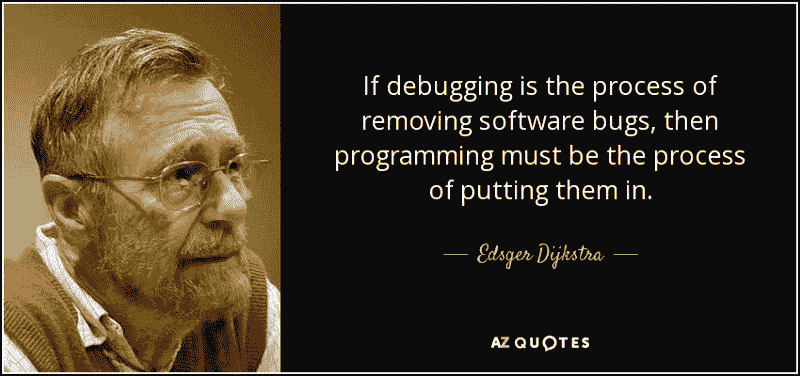
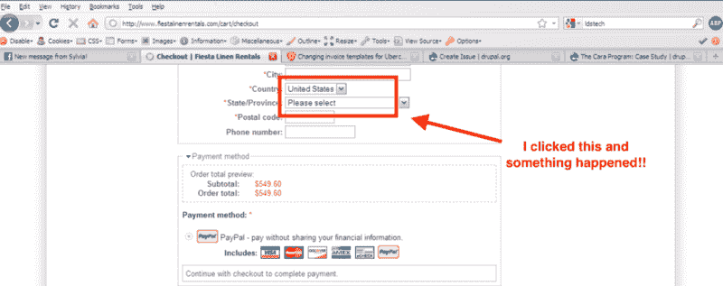
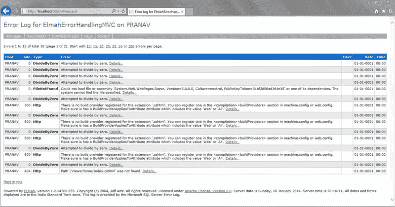
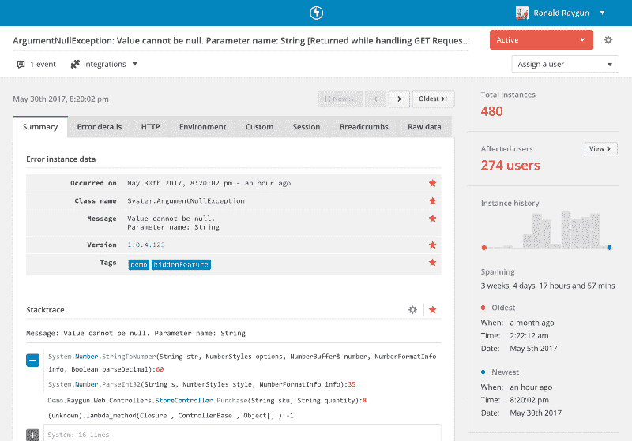

# 为什么依赖用户报告错误是你做过的最愚蠢的事情

> 原文：<https://www.freecodecamp.org/news/why-relying-on-your-users-to-report-errors-is-the-dumbest-thing-youll-ever-do-cca307fa67f0/>

尼克·哈利

# 为什么依赖用户报告错误是你做过的最愚蠢的事情


If you have unhappy users, how would you know?

我们都喜欢编码。

当我们想到编码时，我们通常会想象自己在**构建**。

构建用户会喜欢的特性、新创新、新功能和激动人心的更新。正是这种精神图景让我们对下一步能做的事情感到兴奋。

但我们脑海中的浪漫画面往往无法转化为现实。



软件开发人员将大部分时间花在了构建之外的任务上。他们参加会议，讨论规范，计划，并整理现有的代码。当然，他们最喜欢的活动是修复 bug。

我还没见过喜欢在代码库中寻找问题的开发人员。但是这种挫败感可能源于这样一个事实，即发现和重现错误需要很长时间。

历史上，软件开发人员不得不大海捞针。他们不得不自己寻找答案，而不是依靠用户发布在微软 Word 文档中的截图。



We’ve all been there!

你用的是什么浏览器和版本？什么 OS？你能告诉我你点击了哪里吗？然后发生了什么？你之前在哪一页？你是怎么看到这个屏幕的？

这么多问题，这么少(有用的)答案。

调试一个问题可能会花费**很长时间！**

### 依靠用户报告问题

许多软件开发团队仍然依赖用户来报告他们的应用程序的问题。

最近这有点疯狂。

这就像连锁快餐店一样。他们通过提供托盘和垃圾处理站，让顾客承担清理餐桌的责任。这家餐馆的食物可能很糟糕。但是顾客可以平静地清理他们的桌子，扔掉他们的垃圾，然后走开。除非他们花时间去抱怨，否则员工会认为又一个快乐的顾客刚刚离开了餐厅。

但是他们再也不会回来了。

一些开发人员希望用户在使用他们的应用程序时自己照顾自己。毕竟，如果没有人报告问题，我们就没有任何问题，对吗？让你的用户报告他们遇到的问题是有局限性的。您将会看到大约 1%的实例影响到您的整个用户群，并且技术细节将会很少且不一致。

开发人员将会花更多的时间来调试问题——使用少量的信息——而不是修复它。如果他们能找到问题所在的话。

### 你的软件没有你想象的那么好

我和一个在大型在线零售商工作的朋友聊天。他向我解释了他们是如何在网上订购系统中发现一个没人知道的大问题的。

经过几天的调查，他们无法确定问题所在。那时，他们决定试用一种专用工具来检测和诊断应用程序中的错误。

他们的发现令人震惊。

该工具识别出八台服务器中的一台内存不足并抛出错误。这导致用户的结账流程完全停顿。

**每八个用户结帐会话中就有一个被破坏。**

发现并解决这个问题后，销售额立即上升，每月达到 20，000 美元！人们在购买过程中不再遇到问题。

他们估计它影响了超过 5000 名用户——然而他们只收到了两张关于它的支持票。

虽然团队很高兴发现这个问题，但也有令人沮丧的失望。一个不明错误可能导致超过 100，000 美元的收入损失。

### 当错误发生时给自己发电子邮件是一个愚蠢的想法

您可以坐着观看代码跟踪日志中发生的实时问题流。你可以在睡觉的时候租一个温暖的身体来做这件事。或者，当一个未处理的异常发生时，你可以给自己发电子邮件——这似乎是一个好主意！

直到你做到为止。

如果您设置了它，它可能看起来像这样:

```
public void TryProcessLineNumber(int lineNumber){    try    {        ProcessLineNumber(lineNumber);    }    catch (Exception ex)    {        LetMyselfKnowViaEmail("Something went wrong: " + ex.Message);    }}
```

但是要小心它可能带来的问题。

用电子邮件发送错误可能适合较小的副业项目和个人项目。但是一旦你扩展到这之外，事情就开始变得混乱了。非常非常乱:

*   诊断细节有限
*   很难建立通知规则，事情开始变得混乱
*   陷入无限循环的异常可能会在一夜之间向您的收件箱发送 50，000 封电子邮件
*   错误没有优先级或影响可见性，所有错误都是平等的
*   当你收到超过一百封邮件时，你就放弃阅读它们


在你开始给自己发错误邮件后不久，你开始忽略它们。或者你把它们过滤到一个文件夹里，因为噪音太大，没有信号。

您需要在成千上万封电子邮件中搜寻正确的错误实例。

我们需要更聪明的东西。

### ELMAH —记录您的例外情况

ELMAH(错误记录模块和处理程序)是一个完全可插拔的应用程序范围的错误记录工具。它可以动态地添加到一个正在运行的[ASP.NET](http://www.asp.net/)web 应用程序中，甚至是一台机器上的所有 ASP.NET web 应用程序中，而不需要任何重新编译或重新部署。

ELMAH 并不支持每一种编程语言和平台。因为当深入到问题的根本原因时，它的功能相当有限，所以它通常用于较小的项目。它目前也没有真正处于开发中，但至少它是*的东西，*而且是免费的。



Elmah logging of errors

ELMAH 基本上是一个 NuGet 包。NET web 应用程序。它会将一个或多个网站上发生的每个异常记录到您选择的存储中。与其他日志记录框架不同，当以最简单的形式配置时，ELMAH 会自动记录每个异常。当然，有一个 API 可以用来记录自定义错误。但是大部分人只用自动部分。在本教程中，我们将只关注基本部分。

这里有一个关于如何开始的很棒的教程。

### 专用的错误和崩溃报告工具

如果你对处理应用程序中的错误和崩溃很认真，使用专用的[错误监控工具](https://raygun.com/)。它通过向应用程序代码中添加提供程序来自动检测和诊断影响用户的问题。

这只是几行代码——仅此而已。

**使用这样的工具，您可以:**

*   剔除嘈杂的异常，专注于重要的事情，比如影响用户
*   通过电子邮件、Slack 或 HipChat 设置可配置的通知
*   使用一个工具跟踪多种语言和平台
*   利用类似错误的错误分组
*   让您的整个团队掌握错误及其解决方案



Use a dedicated error monitoring software system like [Raygun](https://raygun.com)

像这样的工具不像我们讨论过的其他程序那样便宜或免费，但是你为你的时间付出了什么代价呢？假设您使用免费解决方案。然后你必须停止编码三个小时，同时你试图重现一个错误。这其实是一个很差的投资回报。

希望快速行动并向用户交付新功能的团队会说，这样的专业解决方案物有所值。他们可以减少开发人员花在修复 bug 上的时间，让他们回到编码和构建改进上来。

即使你认为你的代码是完美的，用户没有任何问题，插入一个像 [Raygun](https://raygun.com/) 这样的工具。你会对你的发现感到惊讶。

### 采取积极主动的方法并获得回报

我们都喜欢自动修复软件问题的技术。不幸的是，我认为我们离自我修复和自我感知软件还有一段时间。

您还可以将错误监控解决方案插入到开发人员工作流中，以便更容易地解决错误和崩溃。但是在其他系统中，数据经常被污染并与上下文分离。

错误监控的未来在于确保所有团队——前端、后端、管理或支持——对他们的用户遇到的每个问题都有完全的可见性。然后有能力马上解决。

这也延伸到了持续交付和部署领域的未来趋势。您可以在发现问题后的几分钟内应用修复程序并投入生产。在下一次重大部署之前，您不必等待数周。

在处理您自己的应用程序中的错误和崩溃时，将焦点放在您的团队上。在用户之前发现问题，不要依赖他们报告错误。

***因为不会。***