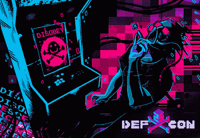
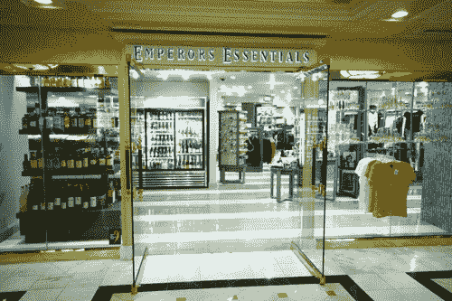
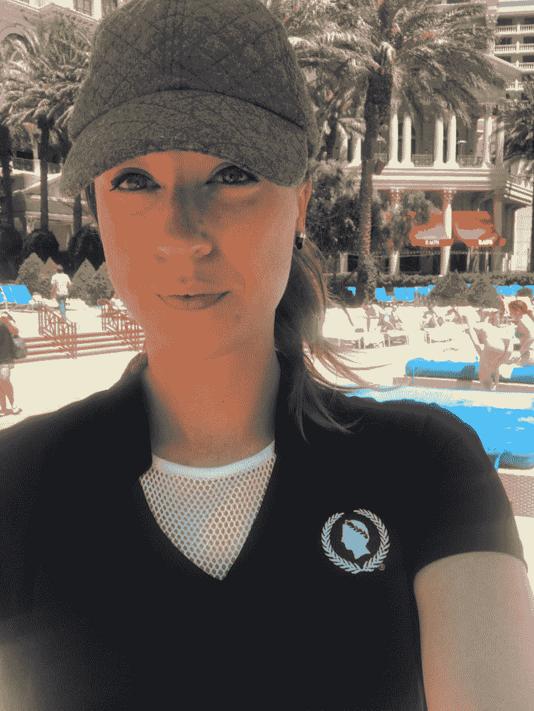
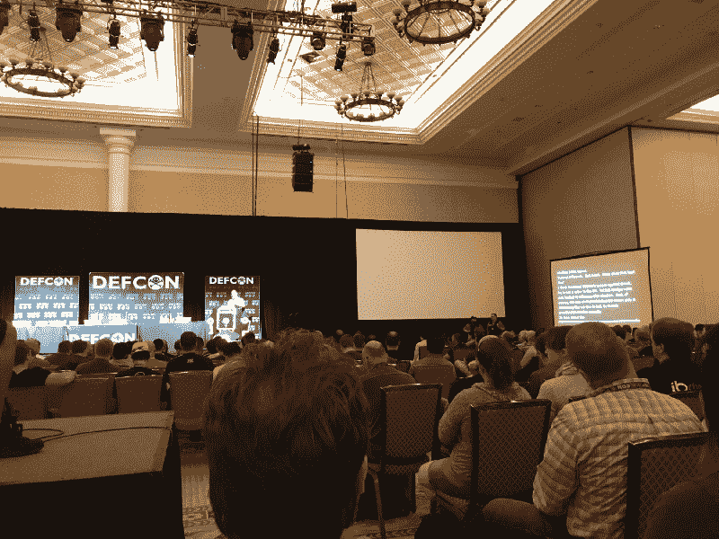

# 我是如何黑掉 DEF CON 的

> 原文：<https://www.freecodecamp.org/news/how-i-hacked-def-con-c5bf718bb9d8/>

阿曼达·默克

# 我是如何黑掉 DEF CON 的

由 Dark Tangent 于 1992 年发起的 [DEF CON](https://www.defcon.org/) 是世界上持续时间最长、规模最大的地下黑客会议。它每年七月在内华达州的拉斯维加斯举行。

安全行业是一个 1000 亿美元的市场。随着我们整个世界的信息数据库上网，软件是连接这一切的结构。然而，哪里有软件，哪里就有漏洞。

此外，有人的地方就有漏洞。这就是我进来的地方。我不是“黑客”，也不是工程师、系统管理员或程序员。我在[通讯](https://www.contramore.com/)里。我是一名翻译，一个变色龙，也是我觉得做事与众不同的人、项目和产品的倡导者。

我决定今年第一次去 DEF CON，把自己“放在房间里”,感受一下这个社区、这里的人们以及他们微妙的原型。

### 我想黑掉黑客。只需从凯撒礼品店购买一件价值 65 美元的高尔夫球衫，我就可以免费参加整个会议。

我是这样做的:

1.在周围走了一圈找到了入口和出口

星期四晚上，当我到达时，我打量着凯撒。我走进去，找到了会议注册处，遇到了几个朋友，四处走走，了解一下情况。我看到了将要举行大型会谈的地方，画出了所有房间和走廊的电梯、自动扶梯和出口。然后，是时候检验我的理论了:我能不带徽章在整个会议上走来走去吗？

有一次，当我走进一个主要的电梯室时，一名凯撒的员工问我，“对不起，女士，你的徽章在哪里？”我快速而温柔地回答:“哦，是的，非常抱歉。我在找信息亭，是这条路吗？”她点点头，我继续往前走，进入另一个话题。我总是喜欢知道如何在需要的时候快速逃离。

2.第一次渗透测试:索要会议程序书

周四晚上，我走到登记处，告诉可爱的工作人员，我把日程表放错了地方，他们能给我另一份吗？“可以，没问题！”一名志愿者提到，他们递给我一个。太好了，现在我有了时间表，知道他们对徽章的要求有多严格，也知道志愿者们训练有素。

我总是在酒店会议上寻找电梯，因为它总是比走楼梯或自动扶梯快。第一天，我径直走过登记处，乘电梯去参加会谈。很低调，没有太多的谈话，所以没有争论。

3.伪装

在飞往拉斯维加斯后，我需要一件新衬衫，没有时间去入住我在 Flamingo 的房间。我试图在 DEF CON 找到路，走过凯撒礼品店。就在那里…完美的衬衫。黑色 v 领凯撒高尔夫衫。它足够专业，看起来很正式，但又足够休闲，让我看起来像一个中层员工。我花了 65 美元买了这件衬衫，加上我的黑裤子和正装鞋，看起来就完整了。

凯撒的衬衫是完美的平衡。这足以推翻 DEF CON“暴徒”，因为我认为他们被指示不要与酒店员工乱来。经过凯撒的工作人员也很完美，因为他们在那里专注于维持 DEF CON 与会者的秩序，而不是数百名随机的凯撒工作人员。

The Caesars’ golf shirt.

4.坚定地行走

无论我走到会议中心的什么地方，我总是自信而有目的地走着。不要太快，好像我被追赶，但也不要太慢，好像我迷路了(即使我迷路了)，只要足以表明我有信念。我戴着一顶灰色的棒球帽，并强调不要与与会者有太多的眼神接触，也不要抬头看房间的名字，我只是向前看，继续我的任务。我也经常看我的猫表。

Cat watch. This can also be used as a metro pass in Hong Kong.

5.避免 linecon

Talk on hacking digital voting booths.

每当我想去看一个讲座，我总是会找到房间的额外的门。整个活动我都没有排队。相反，我等待队伍开始移动，并在适当的时候加入，等待 10 分钟的演讲开始，或者只是等待有人在活动开始后离开房间，并请他们为我开门。

6.黑进社会工程室

到周五下午 12:30，我已经无缝享受了上午的会谈，并成功地绕着会议走了 4 个小时，完全没有被发现。我想提高赌注，所以我想我要给社会工程室一个机会。

我从后门溜了进去，当然是越过警戒线，直接溜进了房间的后面。与会者没有给我第二一眼，因为我看起来仍然像酒店工作人员。有人刚刚在舞台上的隔音室打了一个电话，他们正在与观众进行问答，我就走进去了。

就在观众的问答时间越来越少的时候…我看到了我的出场。我走到房间的一边，全神贯注地站着，努力地看着我的手表，给人一种不耐烦的印象。然后，我抓住了机会。

我径直走向管理舞台的舞台技术人员，弯下腰来到他们的桌子前，平静地说…

我:“嘿，伙计们，我只是想让你们知道，我们房间的空调出了点问题，我们必须尽快疏散房间。”

技术员 1:看上去有点困惑，平静地说，“好的，当然，我们正要结束午休。你觉得你的团队能等 15 分钟吗？”

我:“嗯，你知道，这是一个工会之家，所以我们真的必须非常准时地准备好一切，否则你的会议将会产生额外的费用……但是让我看看我能做些什么。你说你在 5-10 分钟内休息？”

技术员 2:看起来有点可疑，“是的。好吧，所以你需要疏散整个房间？我们的一些员工可以留在这里吗？”

我:“是的，当然没问题，但是我们真的需要快速行动，在五分钟内准时疏散所有人。”

技术员 1:“知道了，等一下。让我赶紧拉个人进来。”

我:看到他们正在召集社会工程室的主要组织者…我向组织者伸出手说:“嗨，我叫阿曼达。我不为凯撒工作。我想看看我是否能黑掉会议和社会工程师！”

活动组织者:她笑了，她喜欢。“是的！这太棒了。你说对了。”

技术员 2:“我们有一种感觉，你可能在骗我们。但是干得好，如果有人给你出任何问题，就告诉他们你和我们在一起。”

我笑了笑，给了她我的名片，然后走了出去。任务完成。

这整个经历让我思考。社会工程是一种安全形式，但就像“黑客”一样，它有时会名声不好。让我们思考一下这些技术在 DEF CON 之外可以用于哪些应用。

社会工程可以用于许多事情，不仅仅是侵入事件，而是用于生活中的许多情况，甚至是脱离危险的现实世界的情况。

当然，这整个策略中有一点运气的成分，因为这是会议第一年在凯撒举行。这意味着酒店员工和 DEF CON 志愿者有一个学习曲线。

说到黑客，运气好不如技术好。