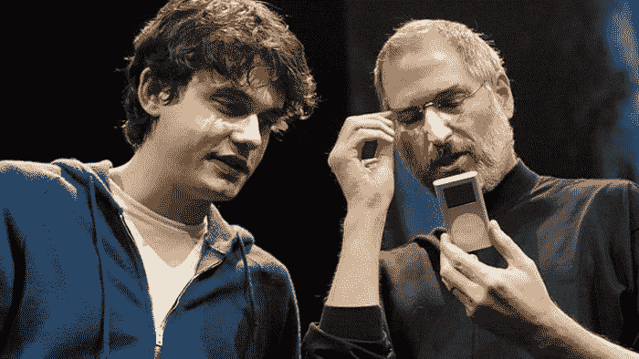
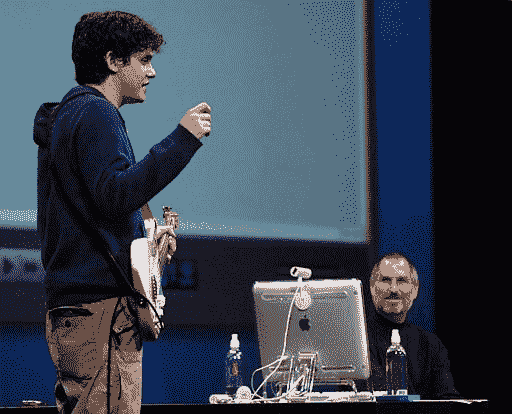
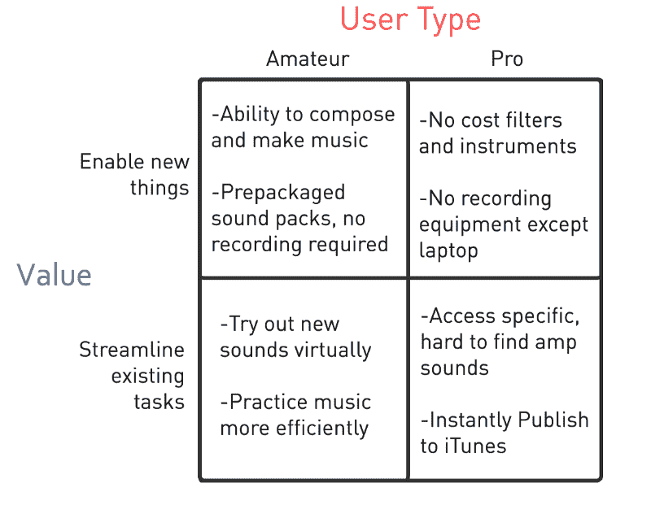
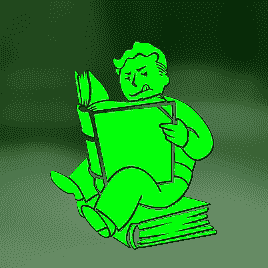

# 为什么史蒂夫·乔布斯的 GarageBand reveal 是有史以来最好的现场产品演示

> 原文：<https://www.freecodecamp.org/news/why-steve-jobs-garageband-reveal-is-the-best-live-product-demo-of-all-time-535c3192e267/>

尼古拉斯·沃尔什

Justin Sullivan/Getty Images

# 为什么史蒂夫·乔布斯的 GarageBand reveal 是有史以来最好的现场产品演示

#### *讲述一个故事如何将你的演示变成一次迷人的经历*

作为一名技术布道者，我一直在寻找提高自己技术的方法。学习如何通过现场演示让观众对产品感到兴奋是福音传道的圣杯。你只有一次机会。你的产品给人的第一印象决定你的生死。

我想介绍一下史蒂夫·乔布斯最低调的作品之一:GarageBand。这是我见过的最好的现场产品演示。

让我们看看 MacWorld 2004 上的 GarageBand 展示视频，并分析是什么让它成为一个伟大的产品演示。按照下面的时间顺序阅读，或者点击你感兴趣的部分。我已经将每个时间戳与视频中相应的部分联系起来。在最后留下来听关键的要点！

[点击这里观看视频！](https://www.youtube.com/watch?v=Q2jq4iRyULg)

[**0:23**](https://youtu.be/Q2jq4iRyULg?t=23s) —乔布斯公布产品名称。他将其描述为“一个主要的新专业音乐工具…但它是为每个人准备的。”通过解释这是为每个人准备的，乔布斯吸引了那些可能会忽视这个产品，认为这个产品不适合他们的人的注意力。

[**0:38**](https://youtu.be/Q2jq4iRyULg?t=38s)——乔布斯立刻问房间里的大象:“这是小众的东西吗？不，不是的。”乔布斯解释道，“一半的美国家庭有**至少有**一个人会演奏乐器。”

[**1:10**](https://youtu.be/Q2jq4iRyULg?t=1m10s) —乔布斯分享产品的统计数据。例如，仪器的数量和成本值。但是他并没有在这个话题上停留太久。

[**2:05**](https://youtu.be/Q2jq4iRyULg?t=2m5s) —乔布斯解释 GarageBand 如何革新音乐。现在，只要有一台苹果电脑和一副耳机，任何人都能听到价值 5 万美元的雅马哈三角钢琴的声音。

[**2:55**](https://youtu.be/Q2jq4iRyULg?t=2m55s) —乔布斯介绍歌手约翰·梅耶，他代言 GarageBand。Mayer 在这里确定该产品是为专业音乐人设计的，并展示了该产品的功能。他们开始演示产品，迈尔在 MIDI 键盘上弹奏。

[**6:14**](https://youtu.be/Q2jq4iRyULg?t=6m14s) —梅耶尔认为音乐软件很难模仿吉他的细微差别。然后，他展示了 GarageBand 如何解决这个问题。“这是我第一次听到吉他在键盘上发出的声音，”迈尔说。

[**8:29**](https://youtu.be/Q2jq4iRyULg?t=8m29s)——乔布斯展示产品新功能。他不必每次展示新功能时都从头开始。这有助于最大限度地提高演示的时间价值比。

[**9:19**](https://youtu.be/Q2jq4iRyULg?t=9m19s)——乔布斯在序言中说，他要展示一下他这个非音乐人可以用这个软件做些什么。乔布斯展示了用户如何使用“循环”从零开始构建项目循环是随软件发布的超过 1，000 个预打包的音乐样本。他模拟了普通用户创作音乐的过程。**这种用户体验的一致性使得他的演示与众不同。**

[**13:34**](https://youtu.be/Q2jq4iRyULg?t=13m34s)——你听到了“啊哈！”观众席上的瞬间。虽然很微妙，但当乔布斯将最后一层添加到音轨中时，你可以听到观众们都在一起了。

[**13:47**](https://youtu.be/Q2jq4iRyULg?t=13m47s)——从一个空白模板开始，使用“循环”之后，乔布斯构建了一个十二小节的音乐短语。这吸引了他们的一部分观众:想要创作音乐的业余音乐家。

[**14:12**](https://youtu.be/Q2jq4iRyULg?t=14m12s) —乔布斯换挡。他向那些希望从昂贵而稀有的扩音器中重现声音的专业音乐家推销。Mayer 通过演奏经典摇滚歌曲的重复片段来演示 GarageBand 的不同吉他滤镜。每个过滤器都有一个不同于每首摇滚歌曲的音调。

[**16:30**](https://youtu.be/Q2jq4iRyULg?t=16m30s) —梅耶尔向苹果工程师称赞他特别喜欢的定制滤镜。它不存在于传统的音乐世界，也没有正式的名字，除了“把麦克风放在放大器前面”

[**17:03**](https://youtu.be/Q2jq4iRyULg?t=17m3s) —乔布斯播放一首曲目，展示职业音乐人的可能。他演示了一首让 GarageBand 成为音乐软件一站式商店的歌曲。

[**18:15**](https://youtu.be/Q2jq4iRyULg?t=18m15s) —梅耶尔解释了他喜欢的 GarageBand 的一个独特优势。可以作为练习工具。Mayer 解释说，他希望他刚开始玩音乐的时候就有这个工具。

[**19:23**](https://youtu.be/Q2jq4iRyULg?t=19m23s) —乔布斯用 Mayer 的回溯，用 GarageBand 录制，来展示在上面录制现场表演是多么容易。他通过将现场音轨直接融入歌曲中来做到这一点。

[**22:57**](https://youtu.be/Q2jq4iRyULg?t=22m57s)——“你可以把版权导出到 iTunes，”乔布斯说。这对业余和专业音乐家都是有利的。它增强了 GarageBand 简化音乐创作和分发音乐的能力。

### 关键要点

#### **要点 1:找到能支持你的产品的人**

任何产品都可以有付费的代言人，但是没有什么比有人使用你的产品并为它代言更好的了。并且对它充满热情。

在这个演示中，在 points Mayer 对 GarageBand 非常兴奋，他几乎忍不住对它赞不绝口。

#### **要点 2:倾听用户并寻求反馈**

梅耶尔分享说，苹果工程师向他征求对 GarageBand 的反馈。他的反馈使苹果公司能够为专业音乐人恰当地制造产品。

建造 GarageBand 的工程师可能不是专业的音乐家，但他们知道倾听专家的意见。工程师们解决了他们知道的音乐家们直接面临的问题。他们没有做出假设。

#### 第三点:向你试图授权的社区推销你的产品。

乔布斯在向两个不同的目标群体推销产品方面做得很好。通常，试图同时针对两个群体的演示往往会忽略这两个群体。

初学者可能会认为该产品太难使用。

高级用户可能会认为它不够强大。

将来，演示可以被定制成只适合一个群体。演示展示了用户/价值矩阵的所有四个象限。请参考下图了解用户/价值矩阵。

#### 要点 4: **学会掌握演示的艺术**

发布会可能会包括无数文字丰富的幻灯片、图片或预先录制的视频。一个谈吐得体、风度翩翩的演示者，既了解产品又了解观众，可以改变演示。

演示者可以将演示从一个只是分享信息的论坛变成一次变革性的体验。

#### **外卖#5:有一个很棒的产品**

你可以让最好的产品宣传员站在舞台上，面对数百万人，但是如果产品没有完成它的营销任务，促销就没有用了。或者产品提供了糟糕的用户体验。

营销技巧可能会让它起步，但产品不能长期维持。

### 有没有另一个你觉得很牛逼的现场产品演示？我很想听听。请在下面分享！

嘿，我是 [**尼克·沃什**](http://twitter.com/thenickwalsh) 。感谢阅读我的文章！

我是 Wolfram Research 的技术布道者，也是 T2 职业黑客大联盟的黑客马拉松蔻驰，对技术、电子竞技和授权开发者充满热情。