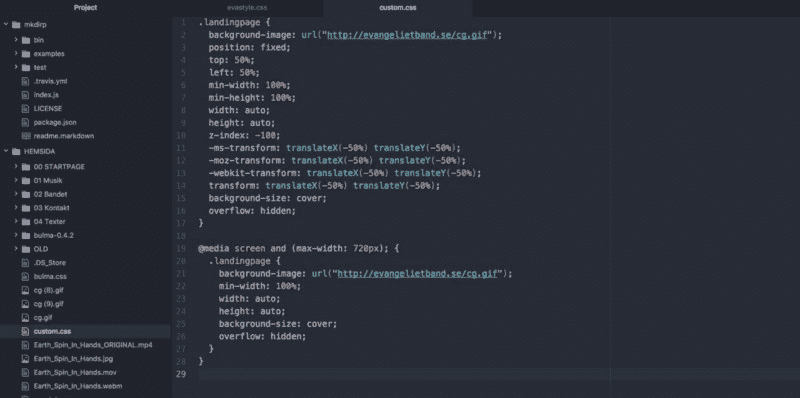
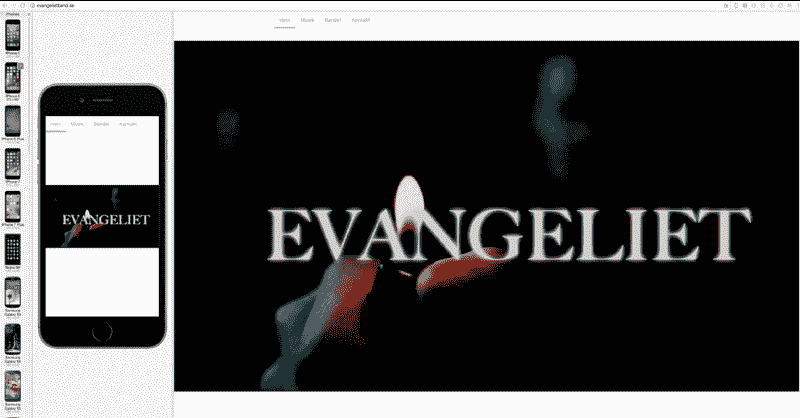
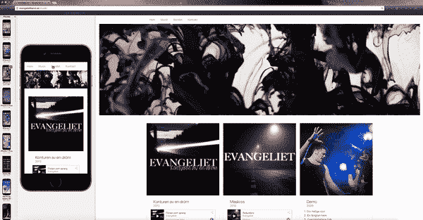
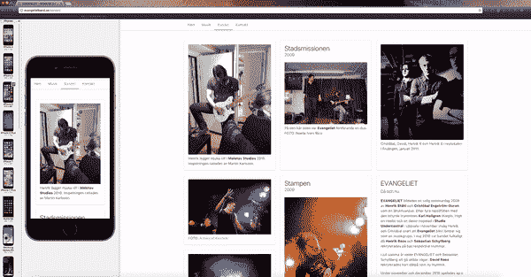

# 我的布尔玛 CSS 框架之旅

> 原文：<https://www.freecodecamp.org/news/colorful-fundamentals-the-reward-of-building-with-bulma-7b14883317bd/>

亨利·斯塔沃

我最近决定尝试一个 CSS 框架。作为一名记者，我被教导要从头开始工作，做事要彻底，永远不要“借用”别人的东西(在新闻行业，这被认为是剽窃)。因此，自从开始我的[编码之旅](https://news.maythecode.com)以来，我有点不愿意使用框架。仅仅是因为我觉得这就像作弊，如果你知道我的意思。

我大错特错了。

重要的事情先来。在我自己用视频作为全屏背景做了一点试验之后——顺便说一下，这是一个非常有趣的挑战——我想在一头扎进[布尔玛](http://bulma.io)之前处理更多实际的内容，这是一个基于由[杰瑞米·托马斯](https://www.freecodecamp.org/news/colorful-fundamentals-the-reward-of-building-with-bulma-7b14883317bd/undefined)创建的 Flexbox 的现代框架。

这就是为什么我最终决定*而不是*在我的 [May The Code](http://maythecode.com) 网站上对布尔玛进行实验。

相反，我选择重新设计我为现已解散的瑞典摇滚乐队 [Evangeliet](http://play.spotify.com/album/2bXUzHUmEZpXpTc6mNbQgH) 创建的网站(我们自 2014 年以来一直处于中断状态)。

在这个故事中，我将告诉你为什么我感到被 PHP 欺负，尽管一遍又一遍地阅读文档，我是如何一次又一次地失败，以及我通过把一切都搞砸最终学到了什么。

### 新的头版

我已经实现了一个首页的第一次迭代，以全屏视频作为背景和一个简单的导航条，所以我做的第一件事就是用布尔玛导航条替换我有点难看的导航条。

添加导航并不是特别困难。至少在阅读了[文档](http://bulma.io/documentation/components/navbar/)一堆遍之后没有。但是作为背景的全屏视频有点棘手。在对不同的布尔玛布局元素(如`.hero`和`.container is-fluid`)进行了一些毫无结果的实验后，我创建了一个自定义 CSS 来处理全屏背景:



My custom CSS.

成功了！至少在桌面上是这样。当我拿起手机在一个更小的视窗上查看时，我很快发现我已经被我过时的桌面优先方法残酷地惩罚了:



The GIF image I made didn’t override the video on mobile.

正如你所看到的，我不小心把导航条和全屏背景视频放在了 HTML 文档的单独的`sections`中，导致前者与后者分离。

尽管如此，我还是有前进的动力，所以我暂时保持现状。

### 有声页面

接下来，我想创建一个整洁的音频页面。页面本身非常简单:它是由带有 Spotify 列表的三个专辑“区块”组成的[。首先，我创建了一个带有图像的`fluid container`:](https://medium.com/backchannel/meet-the-ultimate-wikignome-10508842caad)

```
<div class="container is-fluid">  <figure class="image">      </figure></div>
```

然后，我浏览了布尔玛[的文档](https://bulma.io/documentation/form/general/)，希望能找到适合我需要的组件。我最终选定了一个:

```
<div class="card">          <div class="card-image">            <figure class="image is-square">                          </figure>          </div>          <div class="card-content">            <div class="media">              <div class="media-left">              </div>              <div class="media-content">                <p class="title is-4">Konturen av en dröm</p>                <p class="subtitle is-6">2013</p>              </div>            </div>
```

然后，我在`card`组件中嵌入了一个`.card-content`类:

```
<div class="content">              <iframe src="https://open.spotify.com/embed?uri=spotify:album:2bXUzHUmEZpXpTc6mNbQgH&theme=white" width="100%" height="380" frameborder="0" allowtransparency="true"></iframe>              <br>              <small><strong>UPC:</strong> 0885014300335</small>              <small><strong>Catalog Number:</strong> RU 27130</small>              <br>              <small><strong>Release date:</strong> 18 Dec 2013</small>            </div>          </div>        </div>
```

为了得到一个漂亮的 [Spotify 播放器](https://developer.spotify.com/technologies/widgets/spotify-play-button/)，我从 [Spotify 开发者](https://developer.spotify.com)文档中获取了一个嵌入代码。(我把宽度从`300px`改成了`100%`，主题从默认的黑色改成了白色，更适合我的设计。)

我创建了三张卡片，添加了一些专辑信息，并用`column`元素捆绑在一起。结果令人满意:


### 图像网格

之后，我想创建一个包含乐队照片的页面。我想要比标准的“乐队成员传记”页面更具挑战性的东西，这与音频页面没有太大区别。

我再次浏览了[文档](http://bulma.io/documentation/grid/tiles/)，并决定对`tiles`元素做些什么。这个元素是

> "[a] **单个 tile** 元素来构建类似 Metro、Pinterest 或任何你喜欢的二维网格。"

我一遍又一遍地阅读和思考这些文档，并得出了一个结论:因为我仍然认为自己是一个标记初学者，所以我需要做一些动手实验，以便理解布尔玛瓷砖。因为阅读…嗯，它没有让我去任何地方。

所以我基本上复制粘贴了文档中的一个例子，并修改了内容。我把东西翻来翻去，有效地打破了所有东西。在搞砸中学习，对吗？:)

在摆弄了不同的类之后，我选择了一个 3 列网格结构，由各种瓦片元素组成。下面是一个标记示例:

```
<div class="tile is-ancestor">        <div class="tile is-parent">          <article class="tile is-child box">            <figure>                            <figcaption>                Henrik lägger mjuka riff i <strong>Molotov Studios</strong> 2010\. Inspelningen rattades av Martin Karlsson.              </figcaption>            </figure>          </article>        </div>        <div class="tile is-parent">          <article class="tile is-child box">            <p class="title">Stadsmissionen&lt;/p>            <p class="subtitle">2009</p>            <figure>                            <figcaption>                På den här tiden var <strong>Evangeliet</strong> fortfarande en duo.                <br>                FOTO: Noelia Ivars Rico              </figcaption>            </figure>          </article>        </div>        <div class="tile is-parent">          <article class="tile is-child box">            <figure>                            <figcaption>                Cristóbal, David, Henrik R och Henrik S i replokalen i Fruängen, januari 2011\.              </figcaption>            </figure>          </article>        </div>      </div>
```

上面的例子是网页上的**三个顶部图片**。页面上的`tile boxes`的结构和文档中的差不多，除了我在除了一个框之外的所有框中添加了图片。还有，我插入了`column elements`，在其中一个框中添加了三张图片。

这需要一点耐心，因为:

1.  当嵌套东西时，我仍然很容易被所有的标签和结束标签弄晕
2.  我没有注意到在 Atom 中突出显示开始和结束 HTML 标签的视觉特性。？？‍

我本可以选择我在实验阶段测试的不同结构中的任何一种，但是我认为布尔玛文档中提供的布局是最合适的。为什么要修理没坏的东西？

老实说，我喜欢移动用户在进入文本块之前看到一些图片。这就是为什么我在最初镜像第二列并将其五个框放在页面顶部后切换回当前结构，有效地将高垂直框定位在桌面的左上角。



### 联系页面

最后但同样重要的是，我想要一个联系页面。带着电子邮件表格和所有的东西。

同样，[文档](http://bulma.io/documentation/elements/form/)提供了我在标记方面需要的一切。显而易见的。幸运的是，我已经试着学习了一点点 PHP，唯一的目的是创建一个在线表单(虽然是为一个不同的网站)。

我失败了。很难。

我不知道为什么其他人似乎讨厌 PHP，我猜是各种原因。但是我知道我个人不喜欢 PHP，因为我觉得被它欺负了。

感觉好像我什么都试过了。我读了一堆博客文章，并阅读了整个 [W3Schools](https://www.w3schools.com/pHp/default.asp) 教程。但是我还是没有掌握 PHP 的一点点。

无论如何，在我短暂的 PHP 掠夺者生涯中，我偶然发现了由[罗希特·达塔](https://www.freecodecamp.org/news/colorful-fundamentals-the-reward-of-building-with-bulma-7b14883317bd/undefined)创建的在线表单服务 [Formspree](https://github.com/formspree/formspree) 。

由于我之前在五月代码网站上使用 Formspree 都取得了很好的效果，我知道它也适用于我的乐队网站。

我添加了所需的`field`和`label`类，以及必需的`form action=”https://formspree.io/xx@xx.se" method=”POST"`类——就这样！

在提交了表格并确认了我的电子邮件之后，一切都变得非常顺利。



我用自定义样式表中的几行 CSS 固定了桌面上表单的大小，但这是很久以后的事了。表单已经建立并运行，我很高兴。

#### 那……？

现在我只剩下一个挑战:如何让手机上的汉堡菜单真正发挥作用？？

布尔玛文档只提供了标记。功能本身由我来解决。

从那以后，Jeremy 更新了文档，并用新的`navbar`组件替换了旧的`nav`组件。这里有一个旧的例子:

```
<!-- This "nav-toggle" hamburger menu is only visible on mobile -->  <!-- You need JavaScript to toggle the "is-active" class on "nav-menu" -->  <span class="nav-toggle">    <span></span>    <span></span>    <span></span>  </span>  <!-- This "nav-menu" is hidden on mobile -->  <!-- Add the modifier "is-active" to display it on mobile -->  <div class="nav-right nav-menu">    <a class="nav-item">      Home    </a>    <a class="nav-item">      Documentation    </a>    <a class="nav-item">      Blog    </a>
```

在过去的几个月里，我已经取得了很大的进步，但是我还不太熟悉 HTML 和 CSS，无法跨越到真正的编程，所以我真的很想在不陷入 JavaScript 的汪洋大海的情况下完成这项工作。

我不知道该怎么做。

这就是为什么我选择了一个水平的菜单栏，一直到最小的视窗，经过了几个小时的调查。我需要做的就是将`is-mobile`修饰符添加到`nav-item`类中:

```
<nav class="nav has-shadow">    <div class="container">      <div class="nav-left">        <a class="nav-item is-tab is-mobile" href="/">Hem</a>        <a class="nav-item is-tab is-mobile" href="/musik">Musik</a>        &lt;a class="nav-item is-tab is-mobile" href="/bandet">Bandet</a>        <a class="nav-item is-tab is-mobile is-active" href="/kontakt">Kontakt</a>      </div>  </nav>
```

我可以这样做，因为我的菜单只包含四个部分:首页、音频页、乐队页和联系页。因此，即使在较小的视窗中，一切都是可见和可访问的。

大约一周后，我在 GitHub 上偶然发现了这个伟大的主题。用户 [rudedogg](https://github.com/rudedogg) 和我遇到了完全一样的问题。线程中提供了许多不同的解决方案，例如

> 是的，你只需要一个 JS 事件来处理点击和“添加”或“删除”。' #nav-menu '上的' is-active '类。

和

> 对带有`className="nav-toggle" onClick={() => { let toggle = document.querySelector(".nav-toggle"); let menu = document.querySelector(".nav-menu"); toggle.classList.toggle("is-active"); menu.classList.toggle("is-active");` }}的元素的代码片段(无 jQuery)做出反应

似乎没有什么能完全满足我的需要。直到我向下滚动，发现了 [shaneturner](https://github.com/shaneturner) 的这段极其谦逊、简短而精彩的评论:

> nav 项本身更简洁一点:`<span class="nav-toggle" onclick="document.querySelector('.nav-menu').classList.toggle('is-active')`；">

我无法确定这是否是最好的解决方案，也无法确定它是否真的比 GitHub 线程中的任何其他建议更好。但是我试了一下，立刻就有了效果，开箱即用。


Photo by [Mike Wilson](https://unsplash.com/@mkwlsn?utm_medium=referral&utm_campaign=photographer-credit&utm_content=creditBadge) on [Unsplash](https://unsplash.com/photos/vAqmcvSMWMU).

### 迭代次数

我说完了。任务完成。

感觉真好！我不仅能够使用布尔玛构建一个完整的网站——我还通过浏览文档和试验不同的元素学到了很多关于 HTML 和 CSS 的知识。

起初感觉像一座要爬的山变成了一座中等大小的山，而我站在山顶上。

不过，我并不完全满意。现在我知道如何使用布尔玛来建立一个网站，但是我建立的网站无论如何都不是完美的。接下来，我想爬下一座山，更高的一座，离完美更近一点。换句话说:利用布尔玛建立一个我引以为豪的网站。

我做到了。

但那是后话了。

Henrik sthl 是一名拥有超过 15 年工作经验的记者，最近成为 Bonnier News 的产品负责人，负责 [Dagens industri](http://beta.di.se) 和 [Dagens Nyheter](http://dn.se) 的数字开发。在业余时间，他试图学习编程。