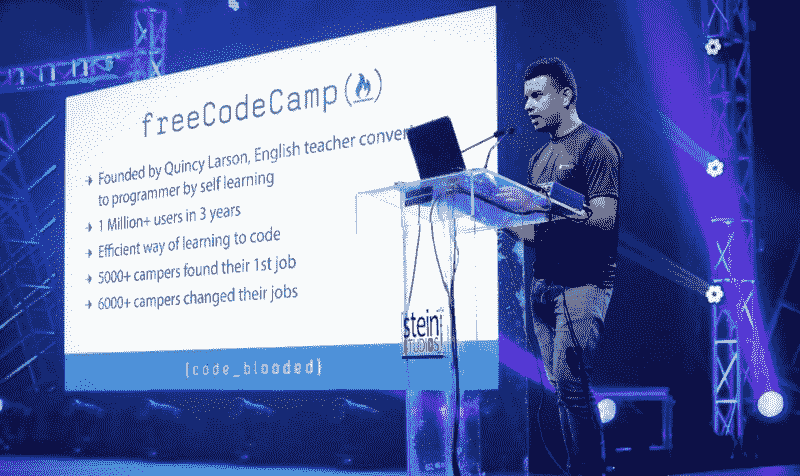
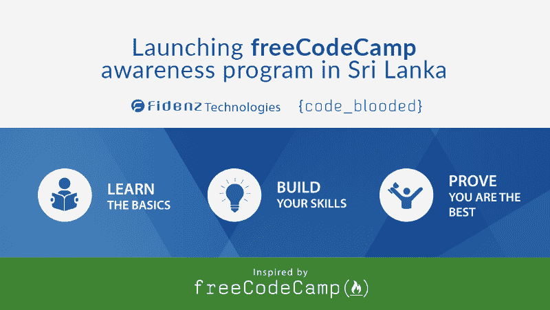
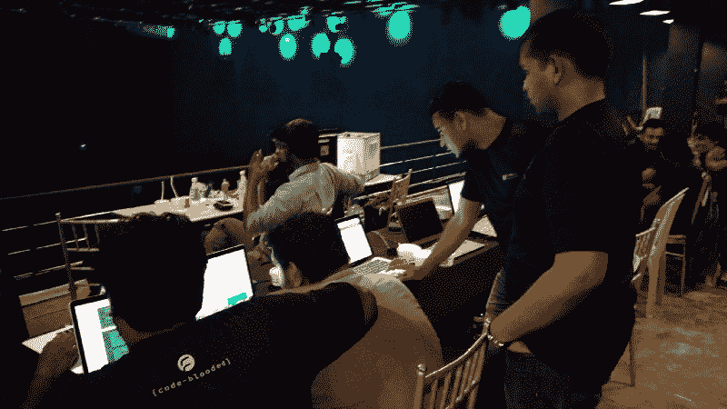

# 我们如何让数百名斯里兰卡人在谷歌 I/O 使用免费代码营

> 原文：<https://www.freecodecamp.org/news/launching-freecodecamp-com-awareness-promotion-program-in-sri-lanka-d0571edca3cc/>

freeCodeCamp 正在帮助培训成千上万的斯里兰卡人加入开发人员队伍。但是这里的大多数人仍然没有听说过这个平台和构建它的全球社区。所以我和我的公司，Fidenz Technologies，决定帮助向我们的同胞宣传它。

我们在谷歌 I/O 扩展斯里兰卡活动上登台，发起了一项名为{code_blooded}的倡议，名为 codeCampChallenges，这是一个举办编码挑战的平台。

该活动吸引了 2300 名科技爱好者。超过 200 名参加者注册参加了比赛。挑战者们相互竞争，在有限的时间内完成最多的编码挑战。获胜者不仅获得了冠军头衔，还赢得了免费的新加坡之旅。

The winner announcement

### **背景**

Fidenz Technologies 是一家位于斯里兰卡科伦坡的自举软件开发公司。像世界上其他地方一样，我们发现在斯里兰卡挑选合适的人才加入我们公司是一项挑战。随着对我们提供的服务的需求不断增加，这种压力甚至更大。

我们的策略是雇佣仍是大学生的工程师，然后把他们培养成专业人士。我们以多种不同的方式为挑选出来的本科生提供培训。然而，我们花了大约 2 年的时间来完善我们的流程，以最终产生我们预期的结果。

以下是我们面临的两个主要限制:

*   因为我们提供内部培训，所以每次只有很少的受训者。
*   高级工程师花了大量时间来培训和指导这些新员工。

当我们还是小公司的时候，这两个局限我们都能挺过去。但是现在，随着我们资源需求的增长，我们正在寻找将流程扩展到下一个级别的方法。我们的任务是使我们的过程更有效率。与此同时，我们将为面临同样问题的其他科技公司提供一个模式。

### 答对了！

Fidenz Technologies introducing freeCodeCamp and kicking off the coding competition

就在那时，我们遇到了 freeCodeCamp(在 softwareengineeringdaily.com 的 slack 频道)。这个平台做的几乎和我们做的一样，但是没有限制，或者至少没有大部分限制。

我们同意，从现在开始，依靠 freeCodeCamp 来训练我们的新成员。

然而，在斯里兰卡，自由代码营还没有得到应有的普及。它只有两个脸书团体，每个团体都有 200 多名成员。

这就是我们决定率先让 freeCodeCamp 为当地技术社区所熟知的原因。我们希望确保斯里兰卡未来的技术极客能够从自由代码营中获得最大收益，成为编程专家。

我们借此机会向 freeCodeCamp 课程介绍了一些其他内容。这包括 iOS、Android 和。Net，我们已经把它作为我们离线培训过程的一部分。我们也意识到这些新技术不会像 freeCodeCamp 框架中的 HTML/CSS/JavaScript 那样具有交互性。

我们最终决定用{code_blooded}这个名字，它完美地概括了我们的意图。我们想要的是让任何认真对待编程的人感觉编码就在他们的血液里。我们计划的目标是让他们{code_blooded}。

### **谷歌 I/O 扩展斯里兰卡 2017**

推出{code_blooded}的理想论坛是在科技界最受期待的活动之一——谷歌 I/O 扩展斯里兰卡 2017 上。由于旧金山和斯里兰卡有 14 个小时的时差，谷歌 I/O Extended 在斯里兰卡是通宵活动。在旧金山的主题演讲开始之前，斯里兰卡的活动将围绕主活动举行技术讲座、产品发布会和更多会议。

为了利用这个时间表，我们提出了推出{code_blooded}的想法，作为 Mobitel 创新中心在斯里兰卡组织的 Google I/O 扩展活动的一部分。组织者欢迎我们的想法，没有问太多问题。

我们的团队提出了一个编码竞赛，可以围绕 freeCodeCamp 中现有的挑战。团队决定谁在 5 小时内完成最多的挑战，谁就是获胜者。组织者非常喜欢这个想法。他们甚至同意为头奖得主提供一次全薪的新加坡之旅。

我们对事情的结果感到高兴，并对继续比赛充满信心。做出决定后，我们只剩下几件事要做了。

### **细节决定成败**

Fidenz providing the contestants with tech support through an online help desk with 10 engineers during the competition to ensure a smooth flow

我们团队的一名成员意识到，所有 freeCodeCamp 问题的答案都可以在 freeCodeCamp wiki 或任何营员的个人资料中找到。这是一个彻底的灾难，并且很明显不能使用 freeCodeCamp 来举办比赛。根据我们与组织者的协议，我们已经越过了不归路。这意味着我们必须在 2017 年谷歌 I/O 斯里兰卡展上举办一场编码比赛。

我们唯一的出路是找到一个解决方案，我们必须为这个比赛主持一个 freeCodeCamp 的克隆。建立这个克隆网站有几个挑战，所以我们修改它以适应我们的要求。我们决定:

*   引入新的注册流程
*   将所有解决方案设为私有
*   建立一个领导委员会
*   提出新的挑战
*   部署和测试新平台

我们将我们的平台命名为“codeCampChallenges”，它定义了竞赛的目的。

我们团队经历的最大挑战是将所有这些纳入 6 天的日程。我们的团队不得不努力工作，想出可以持续 5 个小时的挑战。而且，假设可能会有几个超级极客争夺第一名，我们必须额外努力，让挑战足够艰难。

我们从 freeCodeCamp 导入了大部分问题，并修改了 80 个 JavaScript 问题。我们的五名工程师在挑战中提出了五个算法问题。我们想让我们的团队向参赛者展示比赛有多艰难。他们做得很好，把问题变得足够复杂。

作为一个团队，我们检查了所有定制的问题，并根据难度从 1 到 10 进行评级。这些问题跟在 freeCodeCamp 的 80 个问题后面，最难的问题放在最后。

我们还制定了一些准则，以确保竞争是公平和公正的。这些准则包括:

*   如果一个选手跳过了一个挑战，得分将只发生在那个特定的挑战。
*   在最短时间内完成挑战的候选人将成为获胜者。

我们在 Heroku 组织了代码营挑战赛。Heroku 是一个平台即服务(PaaS)。它使开发人员能够完全在云中构建、运行和操作应用程序。由于 freeCodeCamp 最初也是在 Heroku 上运行的，我们看不出有什么理由不利用同一个平台。

我们做了一些压力测试，以确保我们有足够的服务器资源。我们还必须确定其 10 个性能 M/L dyno 的有效性。我们谁也不想冒险失败。

利用[LiveChatInc.com](https://www.livechatinc.com/)30 天免费试用，我们将 LiveChat 集成到我们的平台中。

同时，组织者要求注册用户带上他们的笔记本电脑和充电器。

总而言之，我们设法按时完成了一切。向所有努力工作使这次发射成功的人致敬！

### **登陆日**

当活动开始时，我们向 2300 名技术爱好者开放了比赛。超过 200 名用户注册了比赛并开始了挑战。

事实证明，LiveChat 是这场故障排除竞赛的生命线。许多人遇到了琐碎的问题。这并没有阻止他们在给定的时间内完成尽可能多的挑战。

在 200 多名参赛者中，大约 150 人最终通过 LiveChat 联系了帮助台。我们已经部署了大约 10 名员工为竞争对手提供在线帮助。我们的团队在帮助选手重回正轨的过程中获得了很多乐趣。事实上，作为一个团队，作为技术极客，我们意识到，我们非常重视技术支持。

在 5 个小时内，大约 50 名选手完成了 30 项挑战。但只有最优秀的人才能获得冠军头衔。Ashan Beruwalage 完成了 85 项挑战，赢得了新加坡 3 日游套餐。

### 下一步是什么

随着{code_blooded}的推出，freeCodeCamp 受到了该国技术社区的宣传和关注。这次活动的巨大成功给了我们动力，让我们将这个项目推向下一个发展阶段。

我们现在期待着从八月开始举办每月一次的学习小组聚会。我们还计划在明年访问四所公立大学，宣传 freeCodeCamp 是开始编程的最佳工具。

[Fidenz Academy](http://fidenz.com/academy/) 是 Fidenz Technology 旗下培养研究生和本科生的单位。学院挑选的学生使用 freeCodeCamp 的克隆版。大多数培训使用 freeCodeCamp 作为交付培训和测试个人的平台。

要举办编码比赛，或建立 freeCodeCamp 来选择招聘或培训的候选人，我们有完整的平台可用。我们非常乐意协助您主持会议，并确保会议顺利进行。请随时通过我们的[联系页面](http://fidenz.com/contact-us/)联系我们。

### 如果你想了解更多，这里有一些有用的链接。

*   [代码挑战](http://fidenz.com/codecampchallenge)
*   信誉度学院
*   [CCC 的 GitHub 回购](https://github.com/Fidenz/ccc)
*   [CCC 排行榜的 GitHub 回购](https://github.com/Fidenz/ccclb)

感谢阅读！