# 网页设计中颜色使用的综合指南

> 原文：<https://www.freecodecamp.org/news/comprehensive-guide-for-color-usage-in-web-design-e2a9afce09fb/>

网上有很多关于颜色的资料。但是我们没有人有时间去搜索和阅读冗长的系列文章来讨论这个话题。这就是为什么我想创建这个**在网页设计中应用颜色的综合指南**。在本帖中，我们将介绍:

*   色彩心理学
*   颜色术语
*   颜色规则
*   如何在网页设计中构建和应用颜色 aletta
*   有用的工具和资源

### 入门指南

所以，你手上有一个网页设计项目。为了启动这个过程，你可能必须采取的第一步就是**选择调色板**。如果你为一个现有的品牌工作，那么你的颜色范围可能会受到限制，尤其是如果这家公司有一个品牌指导方针。然而，如果到目前为止你只有一个品牌的黑白草图，等待定义如颜色，那么继续阅读。

我建议做的第一件事是和你的客户或者项目的利益相关者一起做一个小练习。这个练习包括让这些利益相关者写一个简短的清单，列出他们认为他们的新品牌应该具备的属性。如果你能在现场练习(我个人在阿根廷为欧洲和美国的客户远程工作)，然后让他们在便笺上写下每个属性。然后收集所有的便利贴，放在白板上。很快，你会开始注意到模式。拿起并重新组织便笺，以便将彼此相关的便笺聚集在一起。然后，您可以命名每个集群。在这种情况下，由于这是一个小练习，名称可能是一个包含所有相关属性的单词。换句话说，**一个合意的属性**。

### 色彩心理学

当你完成这个小型研讨会时，你手中应该有一个共识属性列表。你的目标是让品牌唤起这些属性。为此，一个非常强大的工具是**色彩心理学**。你不应该仅仅因为你(或其他人)喜欢就定义一个品牌的颜色。无论你使用哪种颜色，都会对你的观众产生影响。关于受众有很多要说的，足以在一个单独的帖子中涵盖它。现在，我们只能说你的*观众很重要*，你应该为此专门设计。

回到色彩心理学。总而言之，颜色影响人，唤起某些想法/属性。我们将想法与颜色联系起来的方式取决于我们的文化。不同的文化有不同的颜色解释(看，我告诉过你观众很重要)。世界上许多国家/地区都有关于色彩心理学的资料。这是我找到的一个资源。

在本帖中，我们将介绍**西方色彩解读**:

*   **红色:**爱情，危险，愤怒，战争。暗红色可能与优雅有关。
*   **橙色:**能量，活力，秋天。
*   **黄色:**警告，幸福，懦弱，或财富，在金色的阴影里。
*   **粉色:**女人味，浪漫，敏感。也可以传递能量和创新。
*   **紫色:**皇室，奢华，创意，灵性。
*   **蓝色:**悲伤、平静、可靠、信任、合作。
*   **绿:**自然、运气、清洁(依阴)。
*   **灰色:**保守、现代、奢华。
*   **黑色:**优雅，力量，力量。
*   **白色:**纯洁，干净，优雅。

值得注意的是，颜色的深浅也会影响其解释。不过话说回来，不光是*“树荫”。*

### 颜色术语

*说正经的*。如果我们要用颜色工作，我们应该知道如何谈论它，因此，如何操纵它来满足我们的设计需求。让我们熟悉几个术语:

*   **色调:**这是颜色。
*   **饱和度/色度:**这是指颜色的纯度。没有灰色的颜色是最纯净的。
*   **值:**指一种颜色的明度或暗度。

有了这三个参数，我们可以创建一种颜色的许多“版本”。为了更好地解释它，让我们来看看**孟塞尔球**:

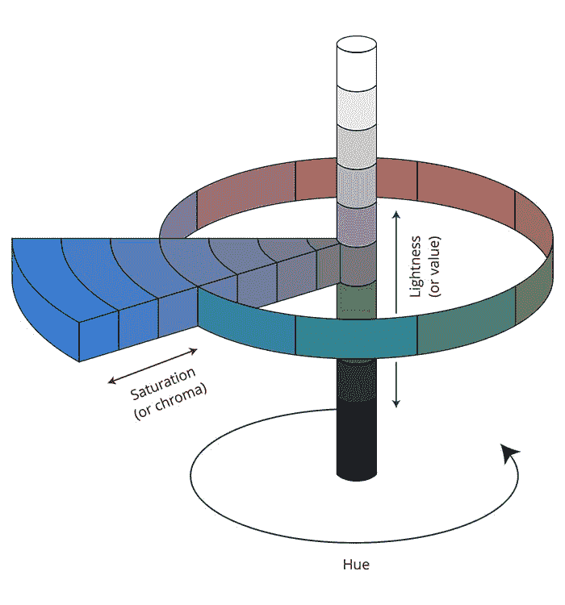

我之前提到的“版本”实际上都有名字。是的，更多的颜色术语要学！

*   **色调:**当你添加灰色(去饱和)一种颜色或色调。
*   **阴影:**当你添加一种颜色或色调的黑色(降低数值)时。
*   **色调:**当您添加颜色或色调的白色(增加值)时。

### 创建调色板

所以，快速回顾一下。到目前为止，您已经:

1.  为你的品牌定义一个属性列表。
2.  选择一种颜色来反映这些属性，通过使用色彩心理学。
3.  通过你对孟塞尔球的了解，确定你的颜色的更具体的“版本”(色调、阴影或色彩)。

太好了！现在，是时候为你的网站建立一个调色板了。为此，我们将把您品牌的新颜色作为调色板的中心色。下一步是选择一些颜色来搭配你的主色，因此，创建你的调色板。为了做到这一点，有几个**颜色规则**供你选择和应用。这些规则建立在**色环**或**色轮**的基础上，这是一个非常有用的创建颜色组合的工具。

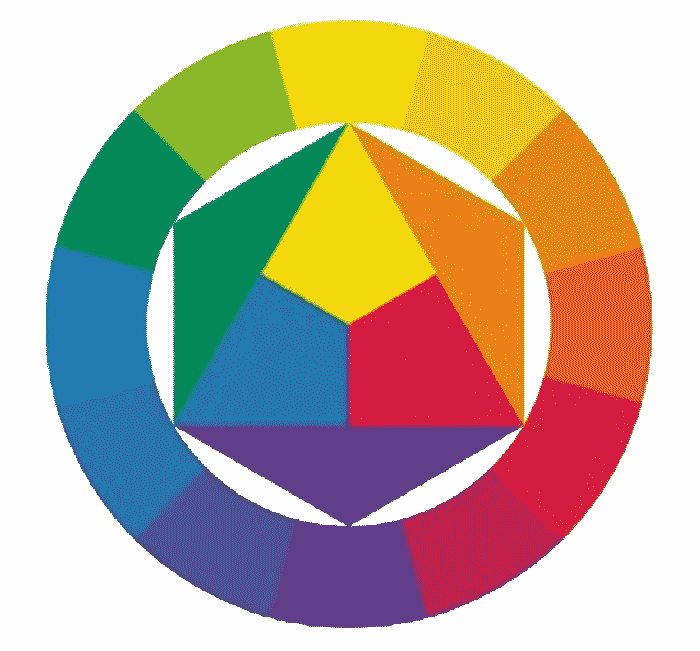

#### 互补色

这些颜色位于色环的相对两侧。

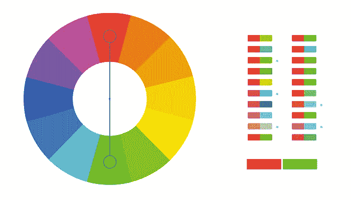

#### 相似的颜色

这些是色环上相邻的颜色。

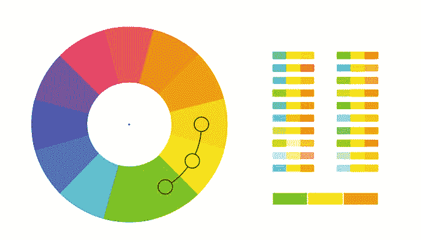

#### 三原色

这些颜色是由一个等边三角形重叠在色环上得到的。

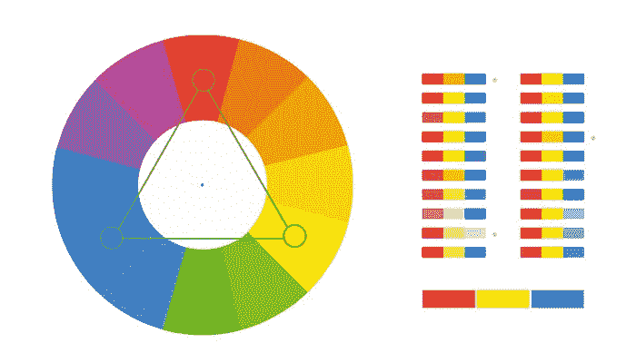

#### 分裂互补色

这种组合是通过将主色和与其互补色相邻的两种颜色相匹配而获得的。

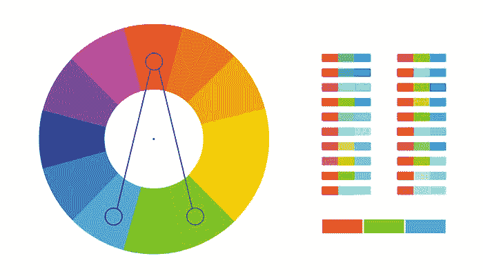

#### 方形颜色

这些颜色是通过将一个正方形重叠到色环上获得的。

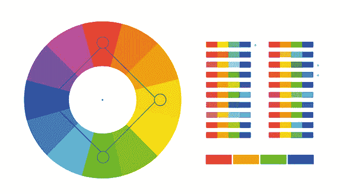

#### 更多组合

与三元色和正方形颜色组合一样，您可以使用其他几何图形(如五边形或六边形)来创建更大的调色板。

#### 提示:当心颜色振动

当你创建一个调色板，尤其是一个补充调色板时，不仅仅需要定义**色调。**你还需要考虑你的颜色**、**的**饱和度/色度**和**值**，以获得和谐的调色板。否则，你的颜色可能会抖动。字面上。

有些颜色如果放在一起，会对我们的眼睛产生干扰。它们似乎在振动。这种情况尤其发生在色环中相对的颜色上，它们有相同的饱和度。

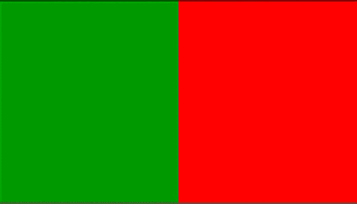

### 在网页设计中应用颜色

现在我们有了一个中心颜色和一些关于颜色规则的概念，我们可以选择一个策略，为我们的网站设计定义我们的调色板。让我们从头开始。

#### 多少种颜色？

事实上，你可以拥有任意多的颜色，但是你应该记住，更大的调色板更难有效地实现。它也可能影响拥有一致的设计系统的能力。然而，这是你的选择。我个人建议使用简单的调色板，尤其是如果你刚刚开始。

#### 我的调色板应该包括哪些颜色？

首先，你的调色板应该包括一个非常浅的颜色和一个非常深的颜色。想法是这两种颜色有一个**大的**对比度(我会在文章的最后留下测量对比度的工具)。比如黑白(没错，白色也算一种颜色)。为什么？因为你需要一种背景颜色和一种文本颜色。就这么简单。就我个人而言，我更喜欢选择中性颜色。中性色是百搭且优雅的颜色，可以搭配任何给定的调色板。

底线是，你的调色板不应该只包括非常生动有趣的颜色。你也需要基色。

#### 完成的调色板

假设我们的调色板中总共有 5 种颜色。我们已经知道，一种颜色应该非常浅(例如白色)，另一种颜色应该非常深(例如黑色)。这就给我们留下了三个可以选择有趣颜色的地方。我们也知道我们有主色，其他两种颜色将通过颜色规则的使用与这个主色相关联。

假设我们的主色是蓝色。以下是一些可能以蓝色为主色调的调色板。

互补调色板

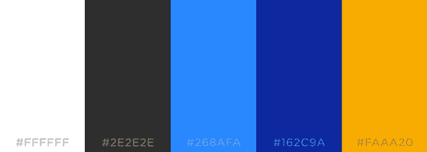

模拟调色板

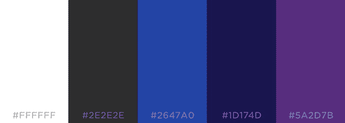

三元调色板

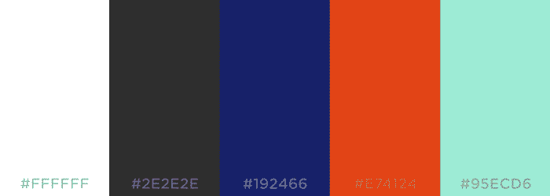

#### 我应该如何将这些颜色应用到我的设计中？

当然，没有固定的规则，不同的设计者可能使用相同的颜色、字体等获得非常不同的结果。这只是作为入门指南。换句话说，如果你不知道如何使用你的新调色板。

让我们继续制作调色板。假设我们选择使用互补调色板。

#### 怎么才能应用呢？

*   **白色:**可以作为底色/背景色。当然，你可以使用其他的中性色(比如灰色)作为背景，甚至可以使用调色板中的亮色，但是一般来说，为了易读，你应该在适当的位置使用更多的白色。
*   **黑色:**可用于文字。同样，您可以用另一种颜色引用或突出显示文本。
*   **浅蓝色:**挑一个和文字颜色差别很大，但和主背景色对比很好的颜色。在这种情况下，颜色应该是浅蓝色。这种颜色非常适合超链接。你希望链接与你的文本有所区别，但可读性强。
*   蓝色:这是你的主色调，所以很可能会为你的设计定下基调。你可能会用它来做一些背景、按钮、图表等等。
*   橙色:这是你的强调色。你可以用它来为你的设计增添一点色彩。可以用在一些按钮、杂集、图标和图表上。

#### 好吧，但是一致性呢？

我喜欢规则。对我来说，规则是区分有基本原理/目标/理由的设计和仅仅设计你喜欢的东西。所以，当我开始的时候，我会寻找使用颜色的规则。例如:

*   所有的(主)按钮应该有相同的颜色吗？
*   所有可点击的元素看起来都应该一样吗？
*   所有可点击的元素应该有相同的颜色吗？

诸如此类。事实是没有规则(在这种情况下)。你可以有不同颜色的(主)按钮，你可以对可点击和不可点击的元素使用相同的颜色。并非所有可点击的元素都需要看起来像链接或按钮。有一点**是**必须的，那就是你要清楚地显示哪些元素是可点击的，哪些是不可点击的。您可以通过定义悬停状态来实现这一点。

此外，无论您决定如何设计您的 UI 元素，您都需要确保在整个平台上保持设计的一致性。为此，您可以创建:

*   一个[厨房水槽](http://foundation.zurb.com/sites/docs/kitchen-sink.html)(如果你管理 HTML/CSS)
*   一个[风格指南](https://frontify.com/styleguide)
*   设计软件中的符号(如[草图符号](https://www.sketchapp.com/learn/documentation/symbols/))。所以每当你需要一个元素的时候，你不需要从头开始创建它，你只需要使用一个已经存在的符号。如果您对某个符号进行了更改，此更改将反映在该符号的所有实例上。

### 颜色的实际用途

颜色不仅仅是为了让你的设计吸引人。也用来传达意思。例如:

*   您可以在**警告/通知**上使用红色/黄色。
*   可以实现**颜色编码**(比如 X 话题的所有内容都会有 X 颜色)。
*   您可以显示**状态**(绿色表示活动，红色表示不活动等)。

这很棒，它帮助用户理解和解码你向他们展示的信息。然而，你不应该仅仅依靠颜色。为什么？因为你需要考虑色盲用户，他们占世界人口的 8%。为了他们的利益，总是试图包括清晰的标签和/或图标来传达意思，并使用颜色来**支持**这个意思。

### 更复杂的调色板

就像我们之前说的，你可以有更复杂的调色板，更多的颜色。例如正方形调色板或具有更多颜色的类似调色板。它可以完美地工作，但是像往常一样，使用更多颜色的决定应该基于像你的网站的目标和它的目标受众这样的事情。让我们看几个例子:

#### 松弛的

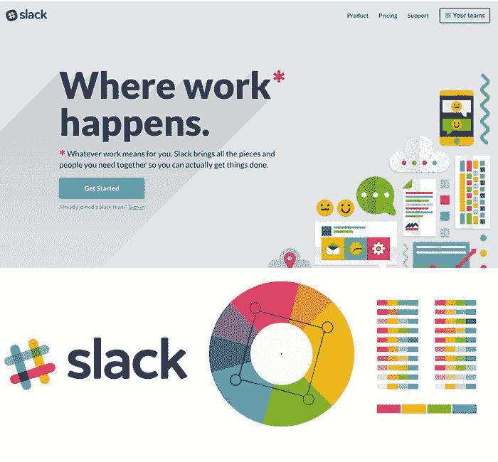

[slack.com](http://slack.com/)

#### 种类

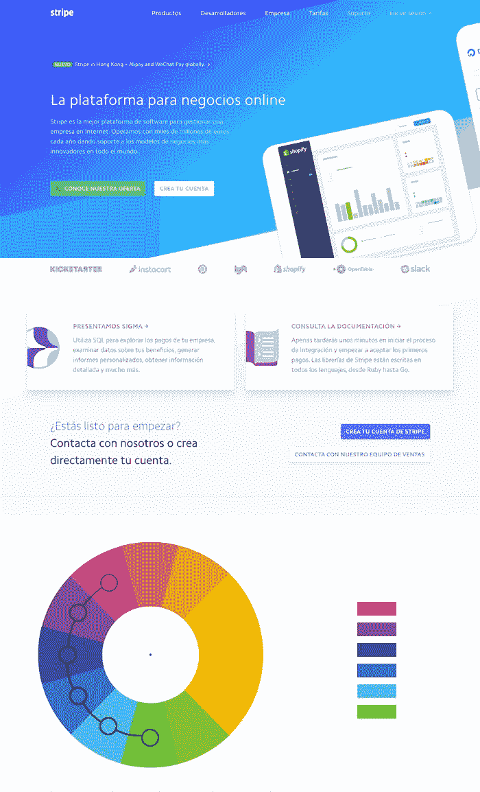

[stripe.com](http://stripe.com/)

### 工具和资源

你已经到达这篇文章的结尾，祝贺你！(也谢谢你的阅读)。我希望这篇文章对你有所帮助。我们已经谈了很多，但只是概括地谈了一下(是的，可能会更久)。

请在下面找到一些在网页设计中使用颜色的工具和资源:

#### 选择颜色

*   [FlatColorsUI](http://www.flatcolorsui.com/)
*   [colorsupplyy](http://colorsupplyyy.com/app/)
*   [土坯色轮](https://color.adobe.com/create/color-wheel/?base=2&rule=Complementary&selected=0&name=My%20Color%20Theme&mode=rgb&rgbvalues=0,0.4470815840874307,0.5862745098039215,0.09999999999999998,0.7863225655388988,1,0,0.675855772600397,0.8862745098039215,0.5862745098039215,0.2937319402343398,0,0.8862745098039215,0.6426813290508187,0.3980977878734222&swatchOrder=0,1,2,3,4)
*   [酷派](https://coolors.co/)
*   [ColorDrop](https://colordrop.io/)
*   [呼叫 255](http://www.0to255.com/)
*   [自定义 CSS 生成器](https://getmdl.io/customize/index.html)

#### 检查对比度

*   [对比检查器](http://contrastchecker.com/)
*   [对比查找器](http://contrast-finder.tanaguru.com/)
*   [使用此](https://www.smashingmagazine.com/2014/10/color-contrast-tips-and-tools-for-accessibility/)[对比度检查器](http://webaim.org/resources/contrastchecker/)的颜色对比度提示和辅助工具

#### 色盲

*   [ColorOracle](http://colororacle.org/) :一键查看普通色觉障碍者会看到的内容。

你可以在 uxagustina.com 阅读更多我的博客文章。