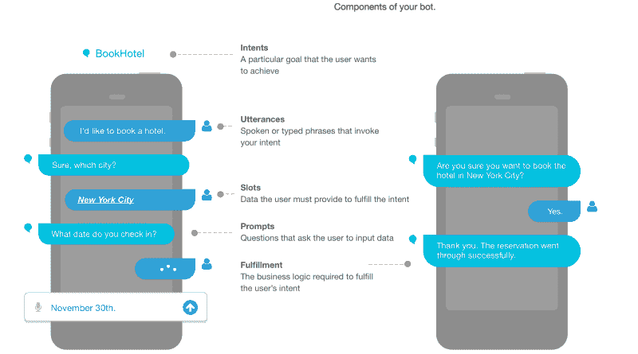
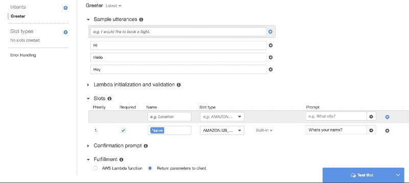
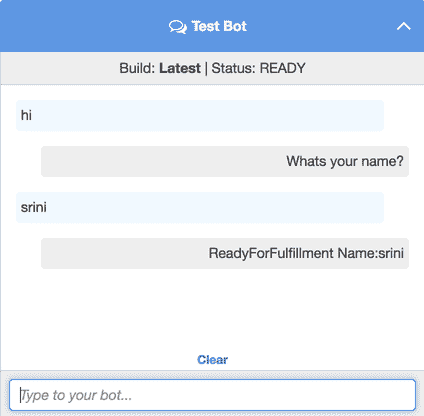
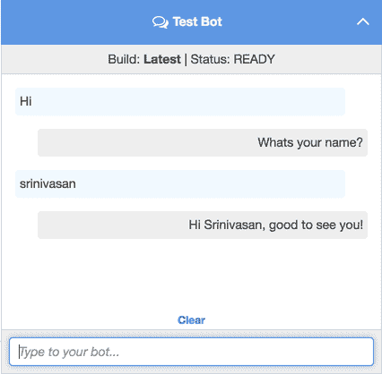

# 使用 Lex 构建聊天机器人的初学者指南

> 原文：<https://www.freecodecamp.org/news/noobs-guide-to-building-a-chatbot-using-lex-54c88b5323ea/>

最近，我们使用 Amazon Lex 为 AWS 聊天机器人挑战赛构建了一个聊天机器人。我从那次经历中学到了很多东西，并认为我应该发布一个教程，以便人们可以轻松地开始构建一个基本的机器人。让我们开始吧。

### 重要的事情先来

Amazon Lex 是一个解析自然语言(无论用户说什么)并将其转换为机器人可以执行的动作的引擎。所以基本上当你说“我想订一个披萨”时，Lex 理解这个订单是用户想要执行的一个**动作**。然后它告诉机器人，这样它就可以订购比萨饼。

第一步是理解 Amazon Lex 中涉及的不同移动部件。

#### 目的

意图是用户想要达到的特定目标。当用户说“我想点一份披萨”时，**点**就是**意图**，也就是用户想要发生的动作**。**有两种类型的意图:

*   [内置意图](https://developer.amazon.com/public/solutions/alexa/alexa-skills-kit/docs/built-in-intent-ref/standard-intents) —这些是 Lex 提供的基本意图。您可以使用它们来执行标准操作，比如允许用户取消操作、获取帮助等等。
*   自定义意图—自定义意图由开发人员提供，用于执行一组特定的操作。我们将在这篇文章的后半部分详细讨论创建一个自定义意图。

#### 言论

话语是用来唤起意图的短语。“我想订购一个比萨饼”是用来调用 OrderIntent 的话语。

#### 时间

槽是用户为实现意图而需要提供的输入。你可能想知道 OrderIntent 的披萨的**类型，这是一个槽。您可以根据自己的目的创建自定义插槽类型，也可以使用内置类型。内置类型为标准枚举提供值，如日期、姓名、国家名称等等，您可能希望从用户那里获得这些值。**

#### 提示

提示是要求用户输入的问题。它们用于**向用户请求槽**的值。它们等待用户的响应，并用用户给出的响应填充该槽。提示可以是“您想点什么类型的披萨？”订单意向。



Components of a chatbot

### 把手放在某物或者某人身上

如果您没有 Amazon 帐户，请创建一个并在 Amazon 控制台中转到 Lex。

现在让我们建立一个小型迎宾机器人。迎宾机器人会问你的名字，然后用你的名字问候你。很简单，不是吗？让我们开始建造一个可以工作的机器人。

1.  创建一个新的机器人，并命名为“欢迎”或任何你想要的名字。
2.  转到您创建的机器人，创建一个新的**自定义意图**。
3.  当您创建一个定制意图时，您需要提供**话语**来调用该意图。对于我们的迎宾员，话语可以是**嗨，嘿，你好**，等等。
4.  现在我们需要提供一个**槽**来从用户那里获取名字。我们可以使用内置槽式**亚马逊。US_FIRST_NAME** 用于此目的。将名字命名为“name”(大小写对后面提供的代码起作用)，将**提示**命名为“你叫什么名字？”或任何你喜欢的，并保存插槽。
5.  暂时将履行作为**返回参数提供给客户端**并保存意向。

意图应该如下所示:



Greeter Intent

你现在可以**构建**你的机器人并测试它。你可以通过说**嗨**来调用它，它会提示你输入你的名字并等待你的输入。如果您提供姓名，它将打印 **ReadyForFulfillment** 和您提供的姓名。



Initial bot test

#### JSON 响应和对话动作

如果你的机器人只是想读你的名字，我们目前所做的已经足够了。但是我们希望机器人用你的名字回叫你，所以我们需要以机器人能理解的格式向它提供响应。Lex 定义了一个 JSON 格式，它期望用于 bot 对话。基本格式如下所示:

```
{
    "sessionAttributes": {
    "key1": "value1",
    "key2": "value2"
    ...
  },
  "
dialogAction": {
    "type": "ElicitIntent, ElicitSlot, ConfirmIntent, Delegate, or Close"    
  }
}
```

对话动作允许你为你的机器人决定下一步的行动。我们需要**关闭**类型**对话框动作来执行我们预定的任务。你可以在这里阅读更多关于其他对话框动作和它们的响应格式[。](http://docs.aws.amazon.com/lex/latest/dg/lambda-input-response-format.html#using-lambda-response-format)**

“关闭操作”允许您在向用户发送/不发送响应的情况下关闭对话。所以我们可以用它来称呼用户的名字并结束对话。我们的回应将是这样的:

```
{
 "dialogAction":
 {
  "fulfillmentState":"Fulfilled",
  "type":"
Close",
  "message":{
   "contentType":"PlainText","content": "Hi "+ 
name +", good to see you!"
  }
 }
}
```

您可能已经注意到，我们需要从用户响应中读取**名称**。因此，我们需要编写一些代码，从参数中获取名称，并将上面的响应发送给机器人。这就是 Lambda 的用武之地。

#### 介绍 Lambda

AWS Lambda 允许您在不提供或管理服务器的情况下运行代码。因此，您可以编写一个 Lambda 函数，并将其与您的意图挂钩，以发送您期望的特定响应。

让我们创建我们需要的λ。

1.  进入 lambda 控制台，点击**创建一个新的 lambda 函数**。
2.  选择**空白功能**，点击下一步。
3.  我们不需要任何触发器，因此单击“next”。
4.  为 lamdba 提供一个名称，并选择运行时为 **Python 2.7** 。
5.  将下面的代码复制粘贴到编辑器中:

```
def lambda_handler(event, context):
    name = event["currentIntent"]["slots"]["Name"].title()
    response = {
                "dialogAction":
                    {
                     "fulfillmentState":"Fulfilled",
                     "type":"Close","message":
                        {
                          "contentType":"PlainText",
                          "content": "Hi "+name+", good to see you!"
                        }
                    }
                }
    return response
```

6.为 Lamdba 提供现有角色或创建新角色，然后创建 Lamdba。

既然我们的 Lambda 已经创建好了，我们唯一需要做的就是为我们的意图服务。

#### 连接 Lamdba 和 intent

1.  转到 Lex 控制台并选择机器人。
2.  转到我们创建的迎宾意图。
3.  选择意图名称附近的版本下拉列表作为**最新**进行编辑。
4.  将**履行类型更改为 AWS Lambda 功能。**
5.  从下拉列表中选择我们创建的 Lambda 并保存意图。

就是这样！我们的机器人现在准备好了。你可以**构建**这个机器人并测试它，对话应该是这样的。



Greeter Bot!

感谢您阅读我的帖子。希望你从中学到了一些东西。计划写一个后续的，这使我们能够将这个机器人与脸书或 Slack 整合。请随意留下您的评论和反馈。

如果你喜欢这篇文章，请随时联系我在 https://kaizencoder.com/contact.