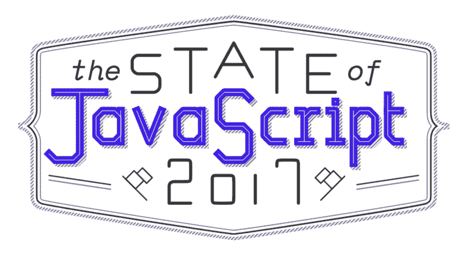
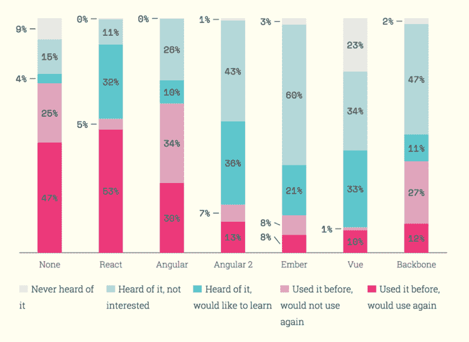
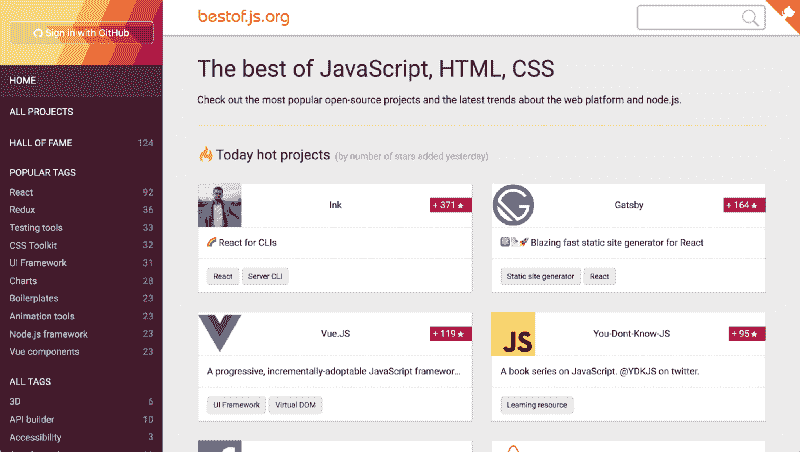

# 宣布 JavaScript 2017 年调查状态

> 原文：<https://www.freecodecamp.org/news/announcing-the-state-of-javascript-2017-survey-13e8742270d5/>

萨沙·格里菲

# 宣布 JavaScript 2017 年调查状态

#### 让我们来看看去年以来有什么变化！

*赶时间？您可以[在这里](http://stateofjs.com/)参加调查。*

当我去年发起第一个 JavaScript 调查的[状态时，主要是为了搔自己的痒处。我想知道哪些图书馆值得学习，哪些即将被淘汰。](http://stateofjs.com/)

原来，我不是唯一一个有这种痒感的人。超过 9000 人花时间回答了调查的 89 个问题。由此产生的数据是一个有趣的见解宝库。

例如，我们了解到，尽管有 11%的受访者曾经尝试过 T2 的 Vue，但 89%的 Vue 用户还是很乐意继续使用。另一方面，尽管 64%的受访者使用过 Angular，但只有 47%的 Angular 用户期待再次使用它。

你可以通过探索 2016 年的[结果](http://stateofjs.com/2016/introduction/)找到更多这样的数据点。

### 更好的数据

那么 2017 年有什么新鲜事？上次我们收到的一个批评是不清楚数据来自哪里。受访者位于何处？他们是如何得知这项调查的？

因此，该调查还将跟踪元数据，如你的推荐人、位置、浏览器类型等。当然，不言而喻，这些数据将保持完全匿名。

希望额外的元数据可以让我们做一些很酷的事情，比如比较地理趋势，或者看看来自 Reddit 和 Hacker News 的受访者是否倾向于使用不同的技术。

### 新问题

我们对问题做了一些修改。有些技术已经过时了(比如 CoffeeScript 和 Cucumber)，而有些技术正在流行(比如 Reason 和 Flow)。

当然，您仍然可以在“其他”部分填写您选择的框架，即使它没有出现在主选项中。

我们还稍微改变了问题组的结构。我们现在有了更大、更包容的分组，如“数据层”或“后端”，而不是试图将堆栈的每一层隔离在自己的组中

当然，没有一个组织是完美的。例如，GraphQL、Redux 和 Apollo 最终都属于同一个数据层组，尽管它们都是互补的技术。但希望这对你来说还是有点意义的。

### 一个新的团队成员

去年的调查是我一个人进行的，但是因为我想对这次的结果做更多的研究，所以我让我的朋友迈克尔·兰博也加入进来。

BestOfJS

迈克尔运营着一个名为 BestOfJS 的实时目录，该目录跟踪开源 JavaScript 库并提供其受欢迎程度的详细统计数据。所以我认为没有更好的人来帮助 JS 项目的状态了！

### 我们开始吧

但是说够了！[现在就开始参加调查吧](http://stateofjs.com/)。几周后的结果见！