# 10 亿个 Shazam 音乐识别的数据可视化

> 原文：<https://www.freecodecamp.org/news/data-visualisation-with-1-billion-shazam-music-recognitions-90728df3a8c9/>

在大学期间，我加入了 Shazam，担任兼职网站开发人员。我在 Shazam 度过了愉快的 5 年。这篇文章是关于我参与的一个 [hackday](https://en.wikipedia.org/wiki/Hackathon) 项目的。该项目包括在空白画布上绘制 10 亿个 Shazam 识别，然后观察结果。

这篇文章也提到了我用来创造视觉效果的过程。

### 什么是“Shazam 认证”

想象一下这样的 Shazam 识别。你打开手机应用程序 Shazam，让它“听”一段背景音乐。识别是对歌曲的成功识别。

### 位置数据

用户可以选择与 Shazam 共享他们的位置数据。然后，Shazam 根据员工的使用情况，将**的部分**匿名位置数据(纬度和经度)提供给员工。

让**匿名的**位置数据可视化是一种很酷的体验。它教会了我很多关于处理大型数据集、讲述一个故事的可视化，以及看起来很漂亮但不做任何其他事情的可视化。

### 可视化

你需要知道的一件事是，所有的观想都遵循这个想法:一个点代表一次成功的认知。点被标绘在地理坐标系统上。这不同于使用谷歌地图，然后在上面标上位置标记。

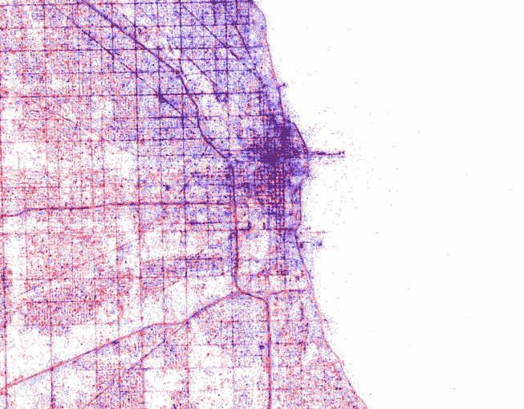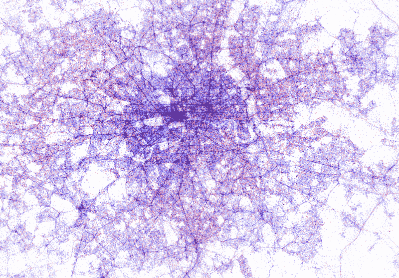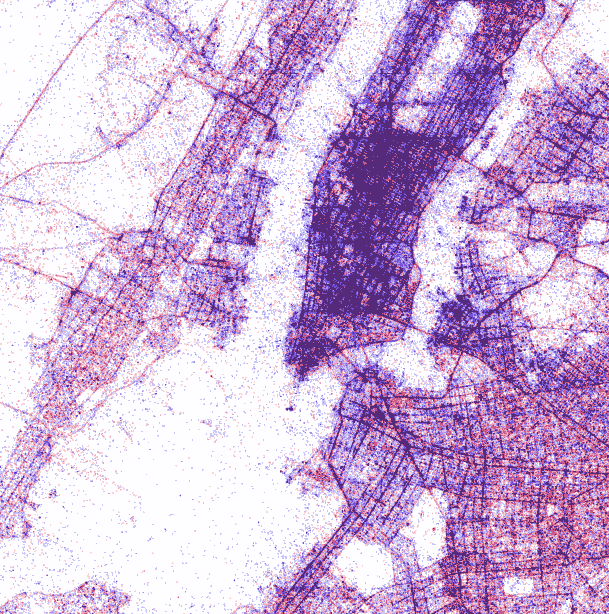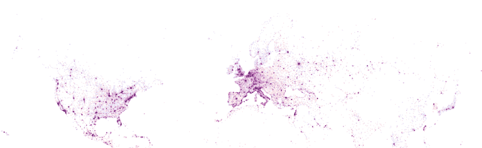

Chicago, London, New York, Full

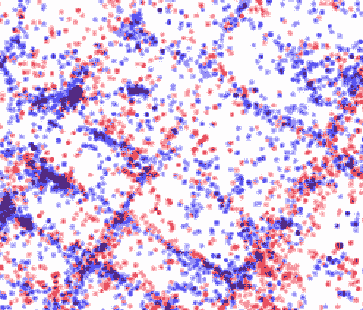

Zoomed into New York

我用颜色来区分 Android 和 iOS。你能猜出哪个是哪个吗？提示:看看主要城市。你认为那里流行哪种设备类型？

*   安卓系统:红色
*   **iOS** :蓝色

如果你仔细看这些点状地图，你会注意到道路的清晰定义。这可能是因为乘客在听汽车扬声器播放的音乐。

我还用不同的配色方案制作了地图。

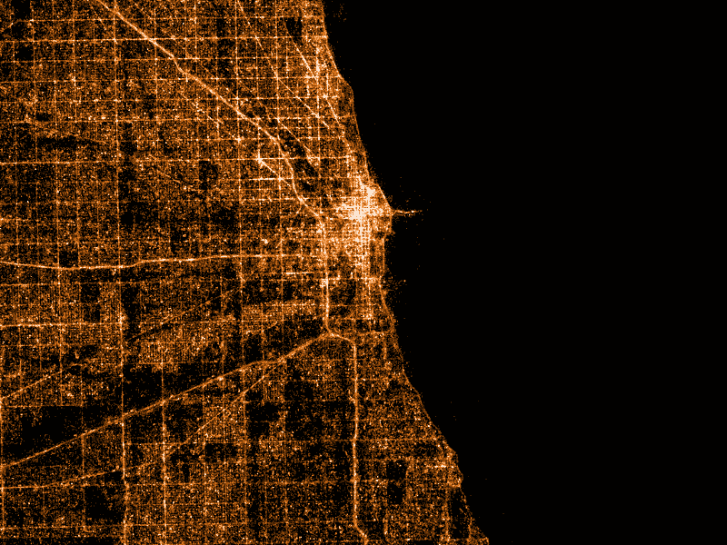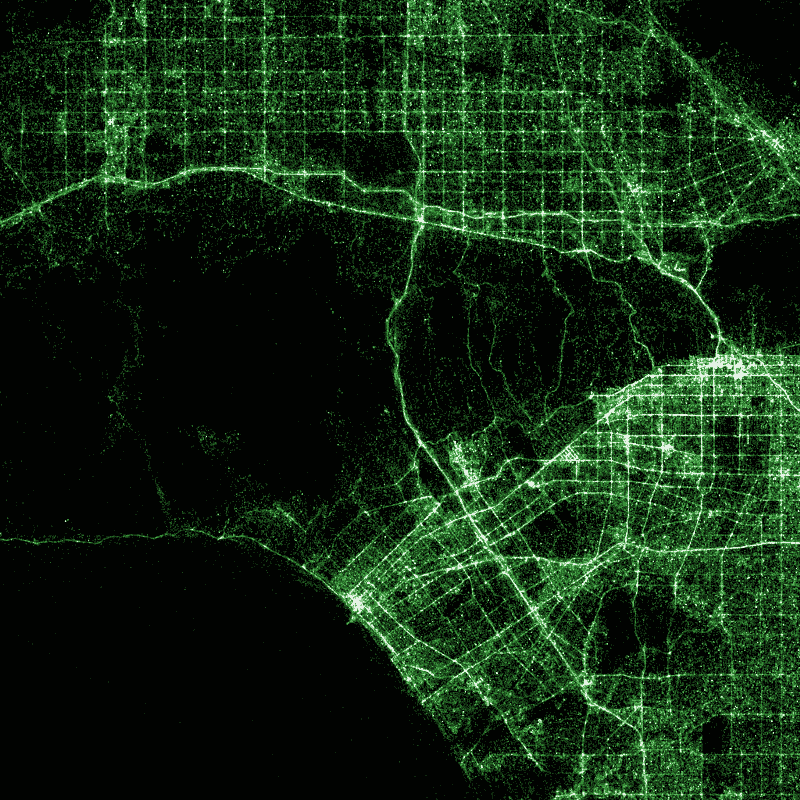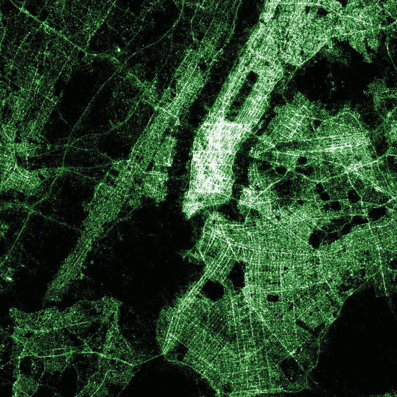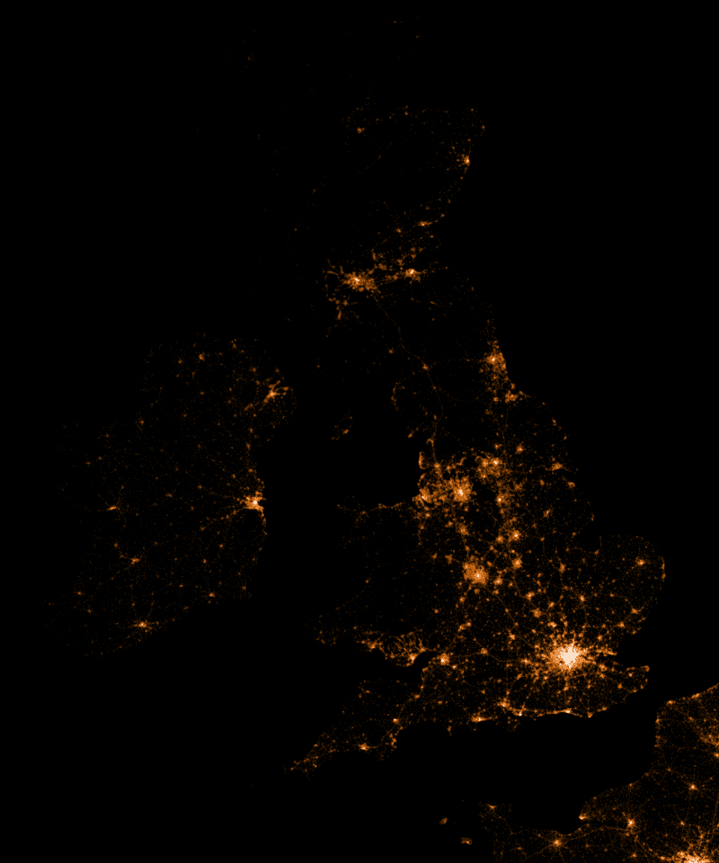

Chicago, Los Angeles, New York, United Kingdom

### 交互式地图

我认为交互式地显示地图会很有趣。就像你可以拖动/缩放谷歌地图一样，如果你也可以拖动/缩放 Shazam 地图呢？这种互动元素鼓励人们使用、探索和学习地图。而不是一成不变，永远不再重温。

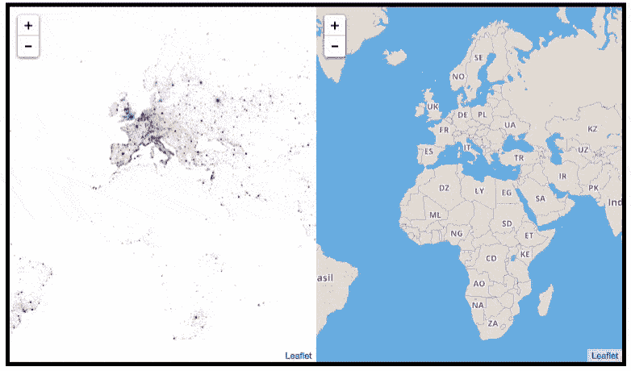

为了做到这一点，我需要生成数以百万计的地图“瓦片”。例如，这里有一些伦敦的地图，取自谷歌地图。

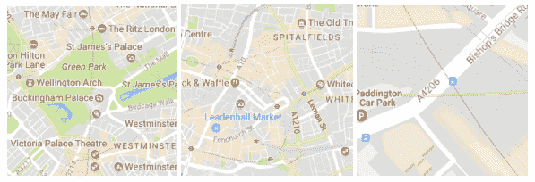

每个图块都是一个独立的图像。请注意不同的缩放级别。正如你可能猜到的，当你在谷歌地图上拖动和缩放时，它会向你呈现许多不同的图像，这些图像被称为地图拼图。

这是 Shazam 地图的图块。

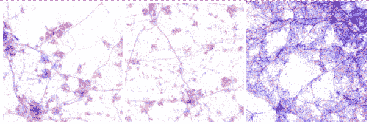

我总共创建了超过 40GB 的切片数据。这是因为我指定了缩放级别。高缩放级别意味着查看地图的人能够放大到更大的级别。

在和同事一起回顾这些图像时，我们一直在想:在大星团的位置上，什么是“位置”。例如，它是一个人们经常使用 Shazam 的音乐场所吗？

为了帮助回答这个问题，我有了一个想法:如果我使用定位服务来确定当前有哪些地方会怎么样。为此，我使用了 [Google Maps Places API](https://developers.google.com/maps/documentation/javascript/places) 。每次你滚动到一个新的位置，我都会查询 Google Maps API 来问这个问题:这个位置内有哪些地方？

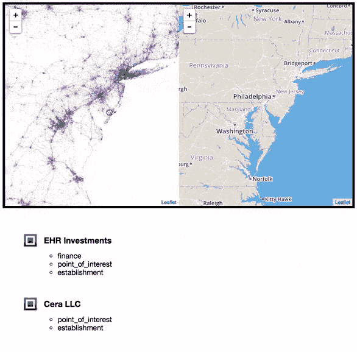

当使用这一功能时，我们开始意识到点群通常是咖啡馆、夜总会、购物中心、便利店等的结果。

我还同步了一张 [Mapbox](https://www.mapbox.com/) 地图(类似于谷歌地图),这样当你拖动并放大 Shazam 地图时，另一张“常规”地图也会随之移动。这使您能够快速识别您当前正在查看的地理位置

### 代码

就像我做的所有事情一样，我只是受益于我们社区中其他人的辛勤工作。所有的荣誉都归于埃里克·菲舍尔，他们在[数据地图](https://github.com/ericfischer/datamaps)上的出色工作。如果你按照 Github 库上的说明去做，你将能够做出你自己的可视化。你需要一个由经度和纬度点组成的数据集，你可能会在 Github 上找到一些东西，例如， [awesome-public-datasets](https://github.com/caesar0301/awesome-public-datasets) 。

如果你最终尝试了:这里是我为自己做的一些笔记，你可能会觉得有用。

首先，你需要一个长长的纬度和经度列表。然而，即使要获得这些数据，您也可能需要做额外的工作。在我的例子中，我是从一个内部 Shazam API 获得的。我使用了一个名为 [fast-csv](https://github.com/C2FO/fast-csv) 的节点模块来解析数据。以这种方式使用流使得解析大数据(千兆字节)变得简单。

```
csv.fromStream(stream,{headers : true}).on(‘data’, handleRecord);
```

*handleRecord* 函数的作用是:

```
function handleRecord(record) {   const location = tag.location.latitude + ‘,’ + tag.location.longitude;   console.log(location);}
```

输出如下所示:

```
lat,lon
```

```
-22.1028,166.1833
```

```
29.8075,-95.4113
```

```
51.2168,-0.8045
```

```
27.3007,-82.5221
```

```
20.5743,-100.3793
```

```
-36.0451,146.9267
```

```
26.7554,-81.4237
```

此时，您可以开始将它插入到数据地图中(在项目文档中有详细的说明)。

跟随文档足够长的时间，我到达了可以创建最终图像的点。要创建伦敦的数据地图，请将边界框指定为要捕捉的位置坐标:

```
./render -A -- output 14 51.641353 -0.447693 51.333508 0.260925 > london.png
```

因为我经常创建相同的静态地图(例如，在尝试颜色时)，所以我决定编写整个过程的脚本。作为一名 web 开发人员，我在 Node.js 中完成了所有这些工作，但是一个简单的 Bash 脚本就足够了。首先，我制作了一个包含所有我想要渲染的地图的对象。

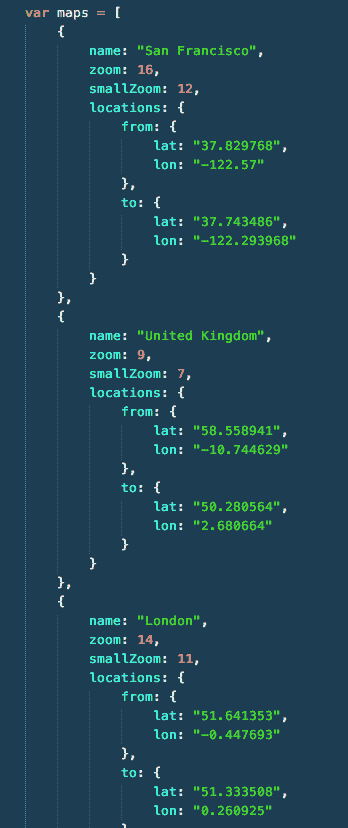

Data structure to render all maps

接下来是构造您之前看到的命令，但是对于您在上图中看到的 JSON 块中的每个位置条目。

### 呈现

在 Shazam，有多个黑客日。几个月后，是演示日。你在演示日展示了你的作品。向人们展示这个特别的项目很受欢迎。

对于那些在黑客时代创建命令行应用程序或进行代码重构冒险的开发人员，考虑一下演示日的观众可能更喜欢视觉演示，而不是技术演示(这是我的经验)。解决这个问题的一个方法是:把你所做的写在博客上，然后分享资源，完全跳过现场演示。或者更好的是，找出如何向非技术观众提炼技术概念，引入更多的视觉效果，并继续向现场观众进行演示。更难，但更有回报。

### 数据地图的高分辨率图像

注意:你可以通过谷歌照片界面放大这些图片

*   [世界](https://photos.app.goo.gl/tIm9mmst7qU1aH242) —注意哪些国家/城市的 iOS 使用率较高
*   英国——注意城市
*   [多伦多](https://photos.app.goo.gl/CQlMePnEUXHN6eqF2)
*   [旧金山](https://photos.app.goo.gl/Mnn5fcDGrUElXjCO2)
*   [巴黎](https://photos.app.goo.gl/IwXHWw9ve3DGufc82)

### 结论

我很感谢 Shazam 鼓励我们学习新的技能和技术。也感谢 Eric Fischer 首先开发了 datamaps 项目！如果您可以访问位置数据，请考虑许多有趣的可视化方式。您也可以尝试使用 Twitter API 中的 Tweets，只要确保它们附有位置数据即可。

### 想看更多这样的吗？

在 Twitter 上关注我: [@umaar](https://twitter.com/umaar) 让我知道！我试着&发布大量网络开发资源。

如果你喜欢阅读我的文章，请喜欢并分享，并留下你在数据可视化方面的经验。