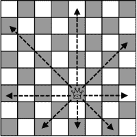
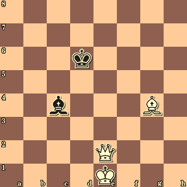
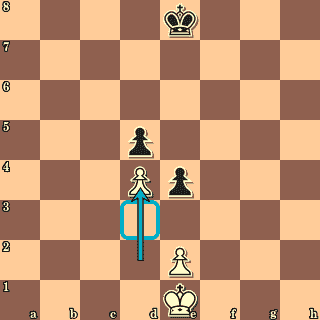
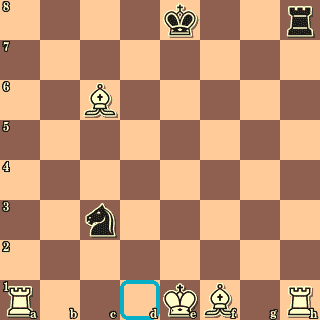

# 使用 Node.js 和 Seneca 编写象棋微服务，第 3 部分

> 原文：<https://www.freecodecamp.org/news/writing-a-chess-microservice-using-node-js-and-seneca-part-3-ab38b8ef9b0a/>

完成关于使用 Seneca microservices 编写规则引擎的三部分系列文章。

本系列零件 [1](https://medium.freecodecamp.org/follow-the-rules-with-seneca-b3cf3d08fe5d) & [2](https://medium.com/@jefflowery/follow-the-rules-with-seneca-ii-c22074debac) 包括:

*   Seneca 微服务 Node.js 模块
*   如何编写服务，如何通过模式识别它，以及如何调用它
*   如何将服务调用串在一起
*   如何增强现有服务

一路上，我都在思考一个服务应该返回什么。我得出的结论是，返回一个数据对象(本例中是 JSON)是最灵活的。它允许服务在不影响服务的现有客户端的情况下对输出进行**修饰** 。

**润？**我的意思是，中间结果可以作为一种跟踪信息的手段来维护，这些信息可能在以后对尚未编写的服务有用。在本例中，我有一个返回一系列移动的`rawMoves` 服务。这对我的客户来说已经足够了。计算出的服务沿着运动向量移动，并将它们组合成一维数组。



Queen movement vectors

不过后来我发现，当后来编写的`legalMoves` 服务需要考虑阻挡移动的友军棋子时，这些移动向量会派上用场。向量本来可以使这些计算更简单、更高效，但是它们被`rawMoves` 服务“抛弃”了。

返回并添加向量(除了移动列表之外)意味着更改原始服务的客户端以接受对象，而不是数组。没错，我可以让最初的服务有状态，但是那样做有点过头了。我有一个选择:重构服务和它的客户，或者**处理 It™️** 。在第 2 部分中，我选择了后者。

然而在这一期中，是时候进行重构了。`rawMoves`现在返回`{moves, moveVectors}`，服务的上游客户端可以选择关注什么。然而，必须注意的是`moves`和`moveVectors`在任何时候都是同步的。

我们来看看优势是什么。在原始代码中，如果给定一个棋子、移动列表和棋盘上其他地方的友好棋子([示例)](https://github.com/JeffML/ms-chess2a/blob/master/services/helpers/legalMovesWithBoard.js)，找到`legalMoves`是一个复杂的过程。将该代码与使用`moveVectors`的代码进行比较:

```
module.exports = function (boardAndPiece, candidateMoves) {
    if (!boardAndPiece.board) return candidateMoves;

    const rangeChecks = {
        B: vectorChecks,
        R: vectorChecks,
        K: vectorChecks,
        Q: vectorChecks,
        P: pawnChecks,
        N: knightChecks
    };

    var rangeCheck = rangeChecks[boardAndPiece.piece.piece];
    return rangeCheck(boardAndPiece, candidateMoves)
}

//...

function vectorChecks(boardAndPiece, candidateMoves) {
    for (const [j, v] of candidateMoves.moveVectors.entries()) {
        for (const [i, m] of v.entries()) {
            const p = boardAndPiece.board.pieceAt(m);
            if (p) {
                if (p.color === boardAndPiece.piece.color) {
                    candidateMoves.moveVectors[j] = v.slice(0, i);
                    break;
                } else {
                    candidateMoves.moveVectors[j] = v.slice(0, i + 1);
                    Object.assign(candidateMoves.moveVectors[j].slice(-1)[0], {
                        hasCaptured: p
                    })
                    break;
                }
            }
        }
    }

    return {
        moveVectors: candidateMoves.moveVectors,
        moves: Array.prototype.concat(...candidateMoves.moveVectors)
    }
}
```

更简单，更高效。包装函数由`legalMoves` [服务](https://github.com/JeffML/ms-chess3/blob/master/services/Movement.js)导出并使用。

```
const legalMovesWithBoard = require("./helpers/legalMovesWithBoard")
//...
    this.add('role:movement,cmd:legalMoves', function (msg, reply) {
        this.prior(msg, function (err, result) {
            if (msg.board) {
                const result2 = legalMovesWithBoard(msg, result);

    //...
```

### 回到游戏中

#### 服务概述

所有移动请求都由`legalMoves` 服务处理，该服务依赖于其他几个服务和助手方法:

*   调用`rawMoves` 服务
    这将返回一个虚拟 15x15 棋盘上一个单独棋子的所有移动(称为**移动掩码**)。在第 1 部分中解释
*   调用基础`legalMoves` 服务
    这将把**移动遮罩**夹在“真实的”8x8 板的边缘，带有适当的[代数坐标](https://en.wikipedia.org/wiki/Algebraic_notation_%28chess%29)。在第 2 部分中解释
*   调用覆盖的`legalMoves` 服务
    如果有棋盘作为传入消息的一部分(服务模式)，则进行一系列检查以说明友好和敌对棋子的存在，因为这些会影响移动。在本部分(第 3 部分)解释。

所以 [Part 2](https://medium.com/@jefflowery/follow-the-rules-with-seneca-ii-c22074debac) 处理了阻挡其他友军棋子的友军棋子，但是现在还有那些烦人的敌方棋子要处理。像友军棋子一样，敌军棋子可以阻挡移动，但也可以被俘虏。在某些情况下，敌人的棋子甚至可以增加我们的移动选择。

然后是阉割:两个棋子可以同时移动位置的唯一动作。需要特别考虑，其中一些涉及到敌人的棋子。

#### 皇后、车和主教

涉及敌方棋子的新规则扩展或修改了第 2 部分中只处理友军棋子的原始`legalMoves`服务。新的微服务扩展将需要知道阻挡块是朋友还是敌人。如果是朋友，那么在广场前行动受阻。如果是敌人，那么移动会被对方的方块阻挡(通过捕捉)。在一个棋子返回的合法移动列表中，我们将通过设置一个`hasCaptured`标志来表示捕获，以及要捕获的敌人棋子的类型。



The Queen can go to f3, but not g4; it can go to d3 and c4 (by capture)

前面的要点列表中显示的`vectorChecks`辅助方法处理皇后、车和象的所有基于向量的移动。

#### 爵士

骑士在棋盘上跳来跳去，所以只能被潜在着陆点上的友方棋子阻挡。敌人的棋子不会阻挡，但是如果有骑士落在上面，就会被俘获。`legalMoves` 服务使用的方法很容易编写。

```
function knightChecks(boardAndPiece, candidateMoves) {
    const newMoves = [];

    for (const m of candidateMoves.moves) {
        const p = boardAndPiece.board.pieceAt(m)
        if (!p) {
            newMoves.push(m)
        } else if (p.color !== boardAndPiece.piece.color) {
            m.hasCaptured = p;
            newMoves.push(m)
        }
    }
    return {
        moves: newMoves,
        moveVectors: [newMoves]
    };
}
```

#### 卒

卒起初看起来是一个非常简单的例子。如果任何棋子(无论是朋友还是敌人)站在棋子前面，则该棋子被阻挡。但是它可以斜着向前移动一格来捕捉坐在那个格中的敌人。


The pawn at e4 is blocked at e5, but can capture at f5

还有一个**顺道**规则，一个棋子可以捕获一个**在前一回合刚刚**移动了两格的相邻敌方棋子:



The Black pawn at e4 can capture the White pawn at d4 by moving to d3(!)

然后还有一个问题，一旦一个卒达到 8 级，就必须晋升。令人困惑的是，这指的是棋子前面的第八级，如果出黑棋，这将是棋盘坐标的第一级。

所有这些考虑因素构成了一套相当复杂的规则来决定棋子的移动选项。这些可以在 GitHub 的附带的[源代码](https://github.com/JeffML/ms-chess3)中[找到](https://github.com/JeffML/ms-chess3/blob/master/services/helpers/legalMovesWithBoard.js)。

#### 国王

卒是有点工作，但国王更是如此。有几种情况:

*   一个潜在的移动方格是由敌方棋子控制的吗？消除那个选项。
*   国王在位了吗？
    如果是，它**必须**移动本回合
    *如果它在检定中，并且不能移出检定，游戏结束！将死！
    *如果它不在检查中，但是棋盘上任何一方没有其他合法的棋步，则相持不下！
*   国王城堡可以(女王侧或国王侧)吗？
    *国王在检查中:编号
    *国王先前移动过:编号
    *车先前移动过:编号
    * K 和 R 之间的中间方格被占据:编号
    *中间方格空着，但被敌方棋子控制:编号
    *否则:是。

这项服务我将分解成细节。您可能还记得，`legalMoves`服务分为两部分。一方把一个棋子当作棋盘上单独的一个。另一部分处理友好和对立的作品。让我们看看清单:

```
 this.add('role:movement,cmd:legalMoves', function (msg, reply) {
        this.prior(msg, function (err, result) {
            if (msg.board) {
                const result2 = legalMovesWithBoard(msg, result);
                if (msg.piece.piece === 'K') {
                    legalMovesWithKing.call(this, msg, result2, reply)
                } else {
                    reply(err, result2);
                }
            } else {
                reply(err, result);
            }
        });
    });
```

对于除了国王之外的每一个部分，我们简单地调用基本服务(通过 Seneca 框架的`prior()`方法),然后调用助手方法`legalMovesWithBoard()`,其中的一部分在本文之前的要点中已经列出。

如果棋子是国王，则调用额外的辅助方法`legalMovesWithKing()`。调用参数是`this`引用，一个包含棋盘和被移动棋子(国王)的`msg`对象，来自基础`legalMoves` 服务调用的`result2` (包含移动信息)，以及`reply`回调。

有一点代码需要仔细阅读，所以我将按行号引用各个部分:

```
module.exports = function (boardAndPiece, candidateMoves, reply) {
    const opposingColor = boardAndPiece.piece.color === 'W' ? 'black' : 'white';

    //temporarily remove the K to avoid cycles
    boardAndPiece.board.removePiece(boardAndPiece.piece);

    function canCastle(king, rook, intervening, opposing) {
        // console.log("canCastle", arguments)

        const opposingControlled = [...opposing.controlled]
        const board = boardAndPiece.board;
        const canCastle = !candidateMoves.inCheck &&
            !king.hasMoved &&
            rook &&
            rook.color === king.color &&
            !rook.hasMoved;
        if (!canCastle) return false;

        const pieceInTheWay = !!intervening.find(sq => board.pieceAt(sq));
        if (pieceInTheWay) return false;

        const passThruCheck = !!intervening.find(sq =>
            opposingControlled.find(opp => (opp.rank === sq.rank && opp.file == sq.file))
        )
        if (passThruCheck) return false;

        return true;
    }

    this.use(require('../SquareControl'))

    this.act({
        role: "board",
        cmd: "squaresControlledBy",
        board: boardAndPiece.board,
        color: opposingColor,
    }, (err, opposing) => {
        if (err) {
            reply(err);
            return;
        }

        const king = boardAndPiece.piece;
        // console.log(opposing.controlled)
        // add the removed K back in
        boardAndPiece.board.addPiece(king);
        const filteredMoves = candidateMoves.moves.filter(m =>
            !!!opposing.controlled.find(o => o.rank === m.rank && o.file === m.file)
        )

        const kingSq = king.position;
        const inCheck = !!opposing.controlled.find(o => o.rank === kingSq.rank && o.file === kingSq.file)

        const additional = {}
        additional.inCheck = inCheck;

        additional.checkMated = (inCheck && filteredMoves.length === 0)

        const rank = additional.color === 'W' ? 1 : 8;
        let rook = boardAndPiece.board.pieceAt(`a${rank}`);
        let intervening = [`b${rank}`, `c${rank}`, `d${rank}`]

        additional.canQSideCastle = canCastle(king, rook, intervening, opposing)

        rook = boardAndPiece.board.pieceAt(`h${rank}`);
        intervening = [`f${rank}`, `g${rank}`]

        additional.canKSideCastle = canCastle(king, rook, intervening, opposing)

        candidateMoves.moves = filteredMoves;
        delete candidateMoves.moveVectors; // no longer valid, and no longer needed

        Object.assign(candidateMoves, additional);
        console.log(candidateMoves)
        reply(null, candidateMoves)
    });
};
```

让我们从中间的第 30 行开始。一个名为`squaresControlledBy` 的服务从 [SquareControl.js](https://gist.github.com/JeffML/a44d20e88767df03581b264e50b5a99d) 导入到框架中。它收集了对方所有合法的移动，称之为受控方块。我们需要这些信息，因为国王不能进入敌人“控制”的区域。国王不能动支票。

这里有一个棘手的问题，那就是因为`squaresControlledBy` 服务依赖于`legalMoves` 服务。可能发生的情况是:

*   友好的棋子需要发球
*   如果友军的棋子是国王，那么对方就叫
*   `squaresControlledBy`请求`legalMoves`所有相对侧的棋子
*   如果对方国王请求`legalMoves`，它将调用**的`squaresControlledBy`服务其**对方(我方)。
*   我们兜了一圈，又兜了一圈…

这些周期是微服务的缺陷之一，必须仔细考虑。我不会深入讨论处理这个问题的各种策略，但是 Seneca 为动作`( — seneca.print.tree)`和服务调用`( — seneca.log.all)`提供了跟踪选项，这对调试很有帮助。

我用来避免无休止循环的技巧是暂时从棋盘上移除友好的国王(第 5 行)，然后再把它添加回来(第 46 行)。我认为最佳实践是不修改传入的服务动作数据。有潜在的难以追踪的副作用。不过，为了在合理的时间框架内完成这个系列，我将忽略一点捏造。

我们通过将附加信息(`inCheck`、城堡选项【第 7-28 行】、`checkmate`)存储在本地数据结构中，然后使用`Object.assign()`将其合并到`candidateMoves`结构中，从而将附加信息推送到`reply`。`candidateMoves`对象现在将具有由附加对象提供的新属性(第 54–73 行)。



Black King can’t castle because it’s in check; White King can’t castle because of intervening friendly Bishop (kingside) and opposing control of d1 square (queenside)

这就结束了！记住，如果你觉得这个系列有用且吸引人，请不要忘记推荐它(点击那个小心形图标)。随时欢迎反馈。

本系列第 3 部分的完整源代码(包括测试)可以在[这里](https://github.com/JeffML/ms-chess3)找到。