# 扩展 Node.js 应用程序

> 原文：<https://www.freecodecamp.org/news/scaling-node-js-applications-8492bd8afadc/>

#### 关于 Node.js 的一切你需要知道的可伸缩性内置工具

> **更新:**这篇文章现在是我的书《Node.js Beyond The Basics》的一部分。

> 阅读此内容的更新版本和更多关于节点在[](https://jscomplete.com/g/scaling-node)**的信息。**

**Node.js 中的可伸缩性并不是事后才想到的。它是嵌入运行时核心的东西。节点被命名为 Node 是为了强调节点应用程序应该包含多个相互通信的小型分布式*节点*的思想。**

**您的节点应用程序是否运行多个节点？您是否在生产机器的每个 CPU 内核上运行一个节点进程，并在它们之间平衡所有请求的负载？您知道 Node 有一个内置模块来帮助解决这个问题吗？**

**Node 的*集群*模块不仅提供了一个开箱即用的解决方案来充分利用机器的 CPU 能力，而且它还有助于提高您的节点进程的可用性，并提供了一个在零停机时间重启整个应用程序的选项。本文涵盖了所有这些优点以及更多。**

> **这篇文章是我关于 Node.js 的 Pluralsight 课程的一部分。我在那里用视频格式报道了类似的内容。**

### **可扩展性策略**

**工作负载是我们扩展应用程序的最常见原因，但不是唯一原因。我们还扩展了我们的应用程序，以提高它们的可用性和容错能力。**

**我们主要可以通过三种不同的方式来扩展应用:**

#### **1 —克隆**

**要扩展一个大型应用程序，最简单的方法是多次克隆它，并让每个克隆的实例处理部分工作负载(例如，使用负载平衡器)。就开发时间而言，这并不花费太多，而且非常有效。这是您应该做的最基本的工作，Node.js 有内置的模块`cluster`，使您可以更容易地在单个服务器上实现克隆策略。**

#### **2 —分解**

**我们还可以通过基于功能和服务分解应用来扩展应用。这意味着拥有多个不同的应用程序，它们有不同的代码库，有时还有自己专用的数据库和用户界面。**

**这种策略通常与术语*微服务*相关联，其中微表示这些服务应该尽可能小，但实际上，服务的大小并不重要，重要的是服务之间的松耦合和高内聚。这一策略的实施通常并不容易，可能会导致长期的意外问题，但如果实施得当，优势是巨大的。**

#### **3 —拆分**

**我们还可以将应用程序分成多个实例，每个实例只负责应用程序的一部分数据。在数据库中，这种策略通常被称为*水平分区*，或*分片*。数据分区需要在每个操作之前进行查找，以确定使用哪个应用程序实例。例如，也许我们想根据国家或语言对用户进行分类。我们需要先查找这些信息。**

**成功地扩展一个大的应用程序应该最终实现所有三个策略。Node.js 使这一点变得很容易，但我将在本文中重点讨论克隆策略，并探索 Node.js 中可用的内置工具来实现它。**

**请注意，在阅读本文之前，您需要很好地理解 Node.js *子进程*。如果你还没有看过，我建议你先看看另一篇文章:**

**[**Node.js 子进程:你需要知道的一切**](https://medium.freecodecamp.org/node-js-child-processes-everything-you-need-to-know-e69498fe970a)
[*如何使用 spawn()、exec()、execFile()、fork()*medium.freecodecamp.org](https://medium.freecodecamp.org/node-js-child-processes-everything-you-need-to-know-e69498fe970a)**

### **集群模块**

**集群模块可用于在环境的多个 CPU 核心上实现负载平衡。它基于子进程模块`fork`方法，它基本上允许我们根据 CPU 内核的数量来分支主应用程序进程。然后，它将接管所有分支进程，并对主进程的所有请求进行负载平衡。**

**集群模块是我们实施克隆可扩展性策略的节点助手，但只能在一台机器上实现。当您有一台拥有大量资源的大型机器时，或者当向一台机器添加更多资源比添加新机器更容易、更便宜时，集群模块是快速实现克隆策略的绝佳选择。**

**即使小型机器通常也有多个内核，即使您不担心节点服务器上的负载，也应该启用集群模块来提高服务器的可用性和容错能力。这是一个简单的步骤，例如，当使用像 PM2 这样的进程管理器时，只需给启动命令提供一个参数就可以了！**

**但是让我告诉您如何本机使用集群模块，并解释它是如何工作的。**

**集群模块的结构很简单。我们创建一个*主*进程，该主进程派生出许多*工作进程*并管理它们。每个工作进程代表我们想要扩展的应用程序的一个实例。所有传入的请求都由主进程处理，主进程决定哪个工作进程应该处理传入的请求。**

**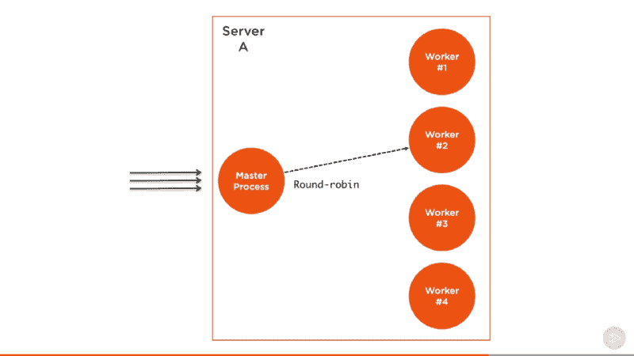

Screenshot captured from my Pluralsight course — Advanced Node.js** 

**主进程的工作很简单，因为它实际上只是使用一个*循环*算法来选择一个工作进程。这在除 Windows 之外的所有平台上都是默认启用的，并且可以进行全局修改，让操作系统自己处理负载平衡。**

**循环算法在循环的基础上将负载均匀地分布在所有可用的进程中。第一个请求被转发到列表中的第一个工作进程，第二个被转发到下一个工作进程，依此类推。当到达列表的末尾时，算法再次从头开始。**

**这是最简单和最常用的负载平衡算法之一。但这不是唯一的一个。更具特色的算法允许分配优先级和选择负载最小或响应时间最快的服务器。**

#### **HTTP 服务器的负载平衡**

**让我们使用集群模块克隆和负载平衡一个简单的 HTTP 服务器。下面是简单节点的 hello-world 示例服务器，该服务器稍作修改以模拟响应前的一些 CPU 工作:**

```
`// server.js
const http = require('http');
const pid = process.pid;

http.createServer((req, res) => {
  for (let i=0; i<1e7; i++); // simulate CPU work
  res.end(`Handled by process ${pid}`);
}).listen(8080, () => {
  console.log(`Started process ${pid}`);
});`
```

**为了验证我们将要创建的平衡器是否能够工作，我在 HTTP 响应中包含了进程`pid`,以识别应用程序的哪个实例实际上正在处理请求。**

**在我们创建一个集群来将这个服务器克隆到多个 workers 之前，让我们做一个简单的基准测试，看看这个服务器每秒可以处理多少个请求。为此，我们可以使用 [Apache 基准测试工具](https://httpd.apache.org/docs/2.4/programs/ab.html)。运行上面简单的`server.js`代码后，运行这个`ab`命令:**

```
`ab -c200 -t10 http://localhost:8080/`
```

**该命令将在 10 秒钟内用 200 个并发连接对服务器进行测试负载。**

**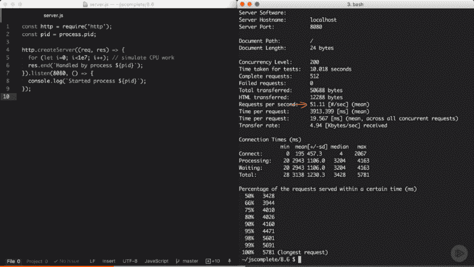

Screenshot captured from my Pluralsight course — Advanced Node.js** 

**在我的机器上，单节点服务器每秒能够处理大约 51 个请求。当然，这里的结果在不同的平台上会有所不同，这是一个非常简单的性能测试，并不是 100%准确，但它将清楚地显示集群在多核环境中会产生的差异。**

**现在我们有了一个参考基准，我们可以使用集群模块通过克隆策略来扩展应用程序。**

**在与上面的`server.js`文件相同的层次上，我们可以为主流程创建一个新文件(`cluster.js`)，其内容如下(解释如下):**

```
`// cluster.js
const cluster = require('cluster');
const os = require('os');

if (cluster.isMaster) {
  const cpus = os.cpus().length;

  console.log(`Forking for ${cpus} CPUs`);
  for (let i = 0; i<cpus; i++) {
    cluster.fork();
  }
} else {
  require('./server');
}`
```

**在`cluster.js`中，我们首先需要`cluster`模块和`os`模块。我们使用`os`模块来读取我们可以使用`os.cpus()`处理的 CPU 内核的数量。**

**`cluster`模块给了我们一个方便的布尔标志`isMaster`来确定这个`cluster.js`文件是否作为主进程被加载。我们第一次执行这个文件时，我们将执行主进程，并且那个`isMaster`标志将被设置为真。在这种情况下，我们可以指示主进程根据我们拥有的 CPU 内核来分支我们的服务器。**

**现在，我们使用`os`模块读取 CPU 的数量，然后用 for 循环遍历这个数量，我们调用`cluster.fork`方法。for 循环将简单地创建与系统中 CPU 数量一样多的工作线程，以利用所有可用的处理能力。**

**当从主进程执行`cluster.fork`行时，当前文件`cluster.js`再次运行，但是这次是在*工作模式*下运行，并且`isMaster`标志设置为假。*在这种情况下，如果你需要使用它，实际上还有另一个标志被设置为 true，这就是`isWorker`标志。***

**当应用程序作为工作者运行时，它可以开始做实际的工作。这是我们需要定义我们的服务器逻辑的地方，对于这个例子，我们可以通过要求我们已经有的`server.js`文件来完成。**

**基本就是这样。这就是利用机器的所有处理能力是多么容易。要测试集群，运行`cluster.js`文件:**

**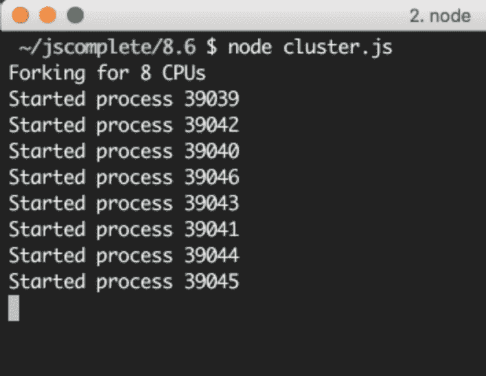

Screenshot captured from my Pluralsight course — Advanced Node.js** 

**我的机器上有 8 个内核，所以它启动了 8 个进程。理解这些是完全不同的 Node.js 进程是很重要的。这里的每个工作进程都有自己的事件循环和内存空间。**

**当我们多次访问 web 服务器时，请求将开始由具有不同进程 id 的不同工作进程处理。工作进程不会按顺序准确轮换，因为集群模块在挑选下一个工作进程时会执行一些优化，但是负载会以某种方式分布在不同的工作进程中。**

**我们可以使用上面相同的`ab`命令来负载测试这个进程集群:**

**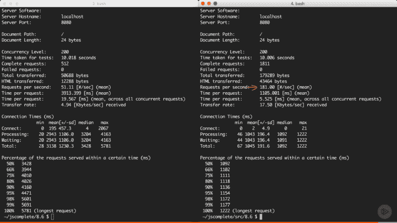

Screenshot captured from my Pluralsight course — Advanced Node.js** 

**我在我的机器上创建的集群每秒能够处理 181 个请求，相比之下，我们使用单节点进程每秒可以处理 51 个请求。仅用几行代码，这个简单应用程序的性能就提高了三倍。**

#### **向所有工人广播消息**

**主进程和工人之间的通信很简单，因为在幕后，集群模块只是使用`child_process.fork` API，这意味着我们在主进程和每个工人之间也有可用的通信通道。**

**基于上面的`server.js` / `cluster.js`示例，我们可以使用`cluster.workers`来访问 worker 对象的列表，这个对象包含对所有 worker 的引用，可以用来读取关于这些 worker 的信息。由于我们在主进程和所有工人之间有通信通道，要向所有工人广播消息，我们只需要在所有工人之间有一个简单的循环。例如:**

```
`Object.values(cluster.workers).forEach(worker => {
  worker.send(`Hello Worker ${worker.id}`);
});`
```

**我们简单地使用了`Object.values`从`cluster.workers`对象中获取所有工人的数组。然后，对于每个工人，我们可以使用`send`函数发送我们想要的任何值。**

**在一个工人文件中，在我们的例子中是`server.js`，为了读取从这个主进程接收的消息，我们可以在全局`process`对象上注册一个`message`事件的处理程序。例如:**

```
`process.on('message', msg => {
  console.log(`Message from master: ${msg}`);
});`
```

**下面是我在测试集群/服务器示例中的这两个附加组件时看到的情况:**

**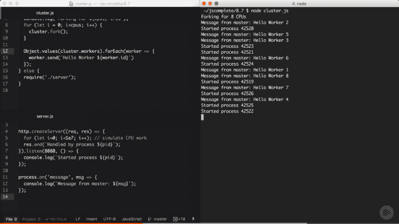

Screenshot captured from my Pluralsight course — Advanced Node.js** 

**每个工人都从主进程收到一条消息。注意工人们是如何没有按顺序开始的。**

**让我们把这个交流的例子变得更实际一点。假设我们希望服务器回复我们在数据库中创建的用户数量。我们将创建一个模拟函数，它返回我们在数据库中的用户数量，并在每次被调用时计算其值的平方(dream growth):**

```
`// **** Mock DB Call
const numberOfUsersInDB = function() {
  this.count = this.count || 5;
  this.count = this.count * this.count;
  return this.count;
}
// ****`
```

**每次调用`numberOfUsersInDB`时，我们都会假设已经建立了数据库连接。我们在这里想要做的是——为了避免多个 DB 请求——将这个调用缓存一段时间，比如 10 秒。然而，我们仍然不希望这 8 个分叉的工作线程执行自己的数据库请求，并以每 10 秒 8 个数据库请求而告终。我们可以让主进程只执行一个请求，并使用通信接口将用户计数的新值告诉所有 8 个工作进程。**

**例如，在主进程模式中，我们可以使用相同的循环向所有工作人员广播用户计数值:**

```
`// Right after the fork loop within the isMaster=true block
const updateWorkers = () => {
  const usersCount = numberOfUsersInDB();
  Object.values(cluster.workers).forEach(worker => {
    worker.send({ usersCount });
  });
};

updateWorkers();
setInterval(updateWorkers, 10000);`
```

**这里我们第一次调用`updateWorkers`，然后每隔 10 秒用一个`setInterval`调用它。这样，每隔 10 秒钟，所有工作线程都会通过进程通信通道接收到新的用户计数值，并且只建立一个数据库连接。**

**在服务器代码中，我们可以使用相同的`message`事件处理程序来使用`usersCount`值。我们可以简单地用一个模块全局变量缓存该值，并在任何需要的地方使用它。**

**例如:**

```
`const http = require('http');
const pid = process.pid;

let usersCount;

http.createServer((req, res) => {
  for (let i=0; i<1e7; i++); // simulate CPU work
  res.write(`Handled by process ${pid}\n`);
  res.end(`Users: ${usersCount}`);
}).listen(8080, () => {
  console.log(`Started process ${pid}`);
});

process.on('message', msg => {
  usersCount = msg.usersCount;
});`
```

**上面的代码让 worker web 服务器使用缓存的`usersCount` 值进行响应。如果您现在测试集群代码，在第一个 10 秒内，您将得到“25”，因为所有工作线程的用户数都是“25”(并且只会发出一个 DB 请求)。然后，再过 10 秒钟，所有工作线程将开始报告新的用户计数，即 625(并且只会发出一个其他 DB 请求)。**

**这一切都要归功于主流程和所有工人之间的沟通渠道。**

#### **提高服务器可用性**

**运行节点应用程序的单个实例的一个问题是，当该实例崩溃时，它必须重新启动。这意味着这两个操作之间会有一些停机时间，即使这个过程应该是自动化的。**

**这也适用于必须重启服务器来部署新代码的情况。在一个实例中，会有影响系统可用性的停机时间。**

**当我们有多个实例时，只需几行额外的代码就可以轻松提高系统的可用性。**

**为了模拟服务器进程中的随机崩溃，我们可以简单地在一个定时器中执行一个`process.exit`调用，该定时器在随机时间后触发:**

```
`// In server.js
setTimeout(() => {
  process.exit(1) // death by random timeout
}, Math.random() * 10000);`
```

**当一个工作进程像这样退出时，将使用`cluster`模型对象上的`exit`事件通知主进程。我们可以为该事件注册一个处理程序，并在任何工作进程退出时派生一个新的工作进程。**

**例如:**

```
`// Right after the fork loop within the isMaster=true block
cluster.on('exit', (worker, code, signal) => {
  if (code !== 0 && !worker.exitedAfterDisconnect) {
    console.log(`Worker ${worker.id} crashed. ` +
                'Starting a new worker...');
    cluster.fork();
  }
});`
```

**最好添加上面的 if 条件，以确保工作进程确实崩溃了，并且没有被主进程本身手动断开或终止。例如，主进程可能根据它看到的负载模式决定我们使用了太多的资源，在这种情况下，它需要杀死一些工作线程。为此，我们可以对任何 worker 使用`disconnect`方法，在这种情况下，`exitedAfterDisconnect`标志将被设置为 true。上面的 if 语句将确保不会为该案例派生出新的 worker。**

**如果我们使用上面的处理程序运行集群(以及`server.js`中的随机崩溃)，在随机的秒数后，工作线程将开始崩溃，主进程将立即派生新的工作线程以增加系统的可用性。实际上，您可以使用相同的`ab`命令来测量可用性，并查看服务器总共将无法处理多少请求(因为一些不幸的请求将不得不面对崩溃情况，这是难以避免的。)**

**当我测试代码时，在 10 秒的测试时间间隔内，在 200 个并发请求中，1800 多个请求中只有 17 个失败。**

**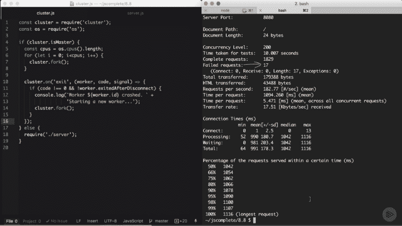

Screenshot captured from my Pluralsight course — Advanced Node.js** 

**这超过了 99%的可用性。通过添加几行代码，我们现在不必再担心进程崩溃了。主守护者会为我们关注这些进程。**

#### **零停机重启**

**例如，当我们需要部署新代码时，如果我们想要重启所有工作进程，该怎么办呢？**

**我们有多个实例正在运行，因此我们可以简单地一次重启一个实例，以便在重启一个工作线程的同时，允许其他工作线程继续为请求提供服务，而不是一起重启它们。**

**用集群模块实现这一点很容易。因为我们不想在主进程启动后重启它，所以我们需要一种方法来给这个主进程发送一个命令，指示它开始重启它的工作进程。这在 Linux 系统上很容易，因为我们可以简单地监听像`SIGUSR2`这样的进程信号，我们可以通过在进程 id 上使用`kill`命令并传递该信号来触发它:**

```
`// In Node
process.on('SIGUSR2', () => { ... });
// To trigger that
$ kill -SIGUSR2 PID`
```

**这样，主进程将不会被终止，我们有一种方法来指示它开始做一些事情。`SIGUSR2`是一个合适的信号，因为这将是一个用户命令。如果您想知道为什么不是`SIGUSR1`，这是因为 Node 将其用于调试器，并且您希望避免任何冲突。**

**不幸的是，在 Windows 上，不支持这些进程信号，我们必须找到另一种方法来命令主进程做一些事情。有一些替代方案。例如，我们可以使用标准输入或套接字输入。或者我们可以监视一个`process.pid`文件的存在，并观察它的删除事件。但是为了简化这个例子，我们假设这个服务器运行在 Linux 平台上。**

**Node 在 Windows 上运行得非常好，但是我认为在 Linux 平台上托管生产节点应用程序是一个更安全的选择。这不仅仅是因为 Node 本身，而是因为许多其他生产工具在 Linux 上更加稳定。这是我个人的看法，完全可以无视。**

**顺便说一句，在最新版本的 Windows 上，你实际上可以使用 Linux 子系统，它工作得非常好。我亲自测试过，它给人留下了深刻的印象。如果你正在 Windows 上开发一个节点应用程序，看看 Windows 上的 [Bash，试试看。](https://msdn.microsoft.com/en-us/commandline/wsl/about)**

**在我们的示例中，当主进程接收到`SIGUSR2`信号时，这意味着是时候重新启动它的工作进程了，但是我们希望一次只启动一个工作进程。这仅仅意味着主进程应该只在完成重新启动当前进程后才重新启动下一个工作进程。**

**要开始这个任务，我们需要使用`cluster.workers`对象获取对所有当前工人的引用，我们可以简单地将工人存储在一个数组中:**

```
`const workers = Object.values(cluster.workers);`
```

**然后，我们可以创建一个`restartWorker`函数来接收要重启的工作线程的索引。这样，我们可以通过让函数在准备好下一个工作线程时调用自己来按顺序重新启动。这里有一个我们可以使用的示例`restartWorker`函数(解释如下):**

```
`const restartWorker = (workerIndex) => {
  const worker = workers[workerIndex];
  if (!worker) return;

  worker.on('exit', () => {
    if (!worker.exitedAfterDisconnect) return;
    console.log(`Exited process ${worker.process.pid}`);

    cluster.fork().on('listening', () => {
      restartWorker(workerIndex + 1);
    });
  });

  worker.disconnect();
};

restartWorker(0);`
```

**在`restartWorker`函数中，我们得到了一个对要重启的 worker 的引用，因为我们将递归调用这个函数来形成一个序列，所以我们需要一个停止条件。当我们不再有需要重启的工作线程时，我们可以直接返回。然后我们基本上想要断开这个 worker(使用`worker.disconnect`)，但是在重新启动下一个 worker 之前，我们需要派生一个新的 worker 来替换我们正在断开的当前 worker。**

**当当前的 worker 存在时，我们可以使用 worker 本身的`exit`事件派生出一个新的 worker，但是我们必须确保退出操作实际上是在正常的断开连接调用之后触发的。我们可以使用`exitedAfetrDisconnect`标志。如果这个标志不为真，那么退出是由除了我们的断开调用之外的其他原因引起的，在这种情况下，我们应该返回，什么也不做。但是如果标志被设置为 true，我们可以继续前进并派生一个新的 worker 来替换我们正在断开的 worker。**

**当这个新的分叉工人准备好了，我们可以重新开始下一个。但是，请记住，fork 进程不是同步的，所以我们不能在 fork 调用后就重启下一个 worker。相反，我们可以监视新分叉的 worker 上的`listening`事件，它告诉我们这个 worker 已经连接并准备好了。当我们得到这个事件时，我们可以安全地按顺序重新启动下一个 worker。**

**这就是零停机重启所需要的一切。为了测试它，您需要读取发送给`SIGUSR2` 信号的主进程 id:**

```
`console.log(`Master PID: ${process.pid}`);`
```

**启动集群，复制主进程 id，然后使用`kill -SIGUSR2 PID`命令重启集群。您还可以在重启集群时运行相同的`ab`命令，以查看重启过程对可用性的影响。剧透一下，你应该得到零个失败的请求:**

**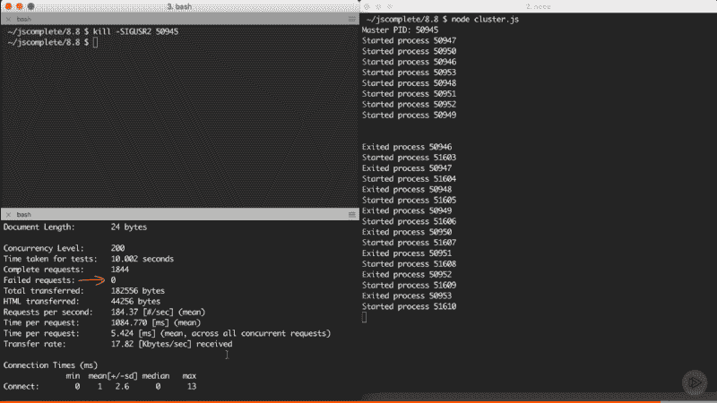

Screenshot captured from my Pluralsight course — Advanced Node.js** 

**像 PM2 这样的进程监视器，我个人在生产中使用，使我们到目前为止完成的所有任务变得非常容易，并提供了更多的功能来监视 Node.js 应用程序的健康状况。例如，对于 PM2，要为任何应用启动集群，您只需使用`-i`参数:**

```
`pm2 start server.js -i max`
```

**要实现零停机重启，您只需发出这个神奇的命令:**

```
`pm2 reload all`
```

**然而，我发现首先理解在使用这些命令时实际上会发生什么是有帮助的。**

#### **共享状态和粘性负载平衡**

**好事总是有代价的。当我们对一个节点应用程序进行负载平衡时，我们会失去一些仅适用于单个进程的功能。这个问题在某种程度上类似于其他语言中的线程安全，即在线程之间共享数据。在我们的例子中，它是在工作进程之间共享数据。**

**例如，对于集群设置，我们不能再在内存中缓存东西，因为每个工作进程都有自己的内存空间。如果我们在一个工作者的内存中缓存一些东西，其他工作者将不能访问它。**

**如果我们需要用集群设置来缓存东西，我们必须使用一个单独的实体，并从所有的工作线程读取/写入该实体的 API。这个实体可以是一个数据库服务器，或者如果您想使用内存缓存，您可以使用 Redis 之类的服务器，或者创建一个具有读/写 API 的专用节点进程，供所有其他工作器与之通信。**

**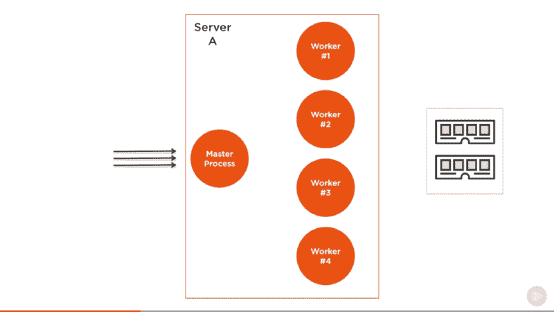

Screenshot captured from my Pluralsight course — Advanced Node.js** 

**但是不要把这看作是一个缺点，因为使用一个单独的实体来满足你的应用缓存需求是为了可伸缩性而分解你的应用的一部分。即使您运行在单核机器上，您也应该这样做。**

**除了缓存，当我们在集群上运行时，有状态通信通常会成为一个问题。由于不能保证通信是与同一个工作者进行的，因此在任何一个工作者上创建有状态通道都不是一个选项。**

**最常见的例子是认证用户。**

**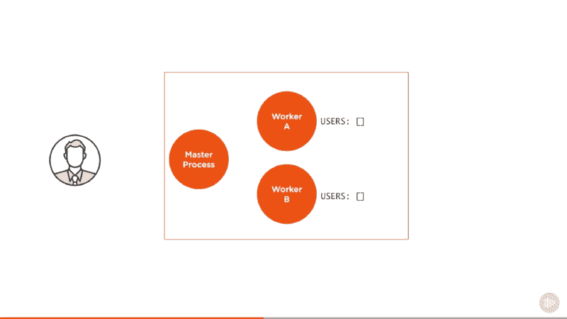

Screenshot captured from my Pluralsight course — Advanced Node.js** 

**对于集群，身份验证请求到达主平衡器进程，该进程被发送到工作进程，在本例中假设是。**

**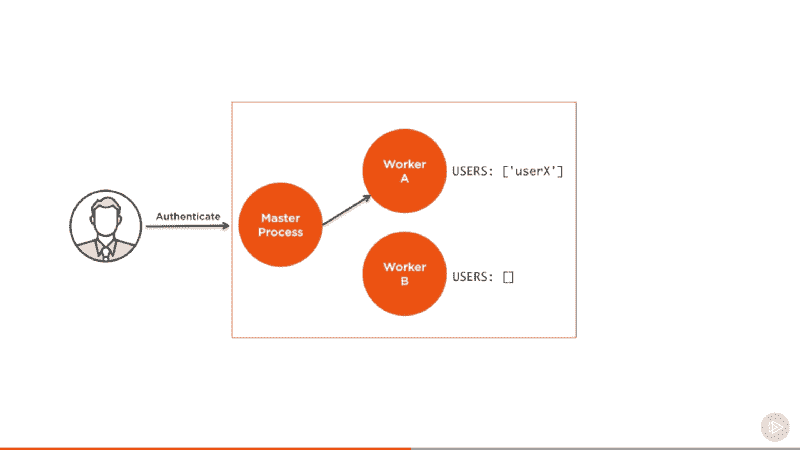

Screenshot captured from my Pluralsight course — Advanced Node.js** 

**工作者 A 现在识别该用户的状态。但是，当同一个用户发出另一个请求时，负载均衡器最终会将它们发送给其他工作器，而这些工作器没有对它们进行身份验证。在一个实例内存中保存对经过身份验证的用户会话的引用不再有效。**

**这个问题可以用很多方法解决。通过将这些会话的信息存储在一个共享数据库或 Redis 节点中，我们可以简单地在我们拥有的许多工作器之间共享状态。然而，应用这种策略需要一些代码更改，这并不总是一个选项。**

**如果您不能在这里进行共享会话存储所需的代码修改，有一个侵入性较小但效率较低的策略。您可以使用所谓的粘性负载平衡。这更容易实现，因为许多负载平衡器都支持这种现成的策略。这个想法很简单。当用户通过 worker 实例进行身份验证时，我们会在负载平衡器级别记录这种关系。**

**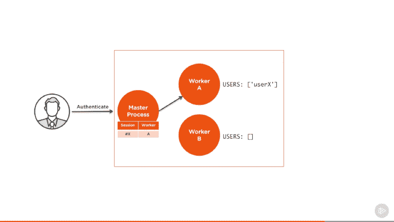

Screenshot captured from my Pluralsight course — Advanced Node.js** 

**然后，当同一个用户发送一个新请求时，我们在这个记录中进行查找，以确定哪个服务器对其会话进行了身份验证，并继续将它们发送到那个服务器，而不是正常的分布式行为。这样，服务器端的代码就不需要修改了，但是我们并没有真正从认证用户的负载平衡中获益，所以如果没有其他选择，就只使用粘性负载平衡。**

**集群模块实际上不支持粘性负载平衡，但是默认情况下可以配置其他一些负载平衡器来进行粘性负载平衡。**

**感谢阅读。**

**学习 React 还是 Node？签出我的图书:**

*   **[通过构建游戏学习 react . js](http://amzn.to/2peYJZj)**
*   **[Node.js 超越基础](http://amzn.to/2FYfYru)**