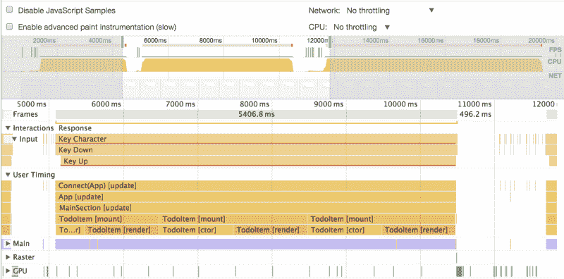
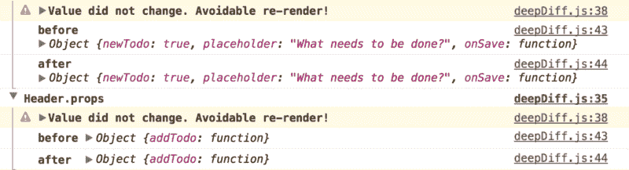
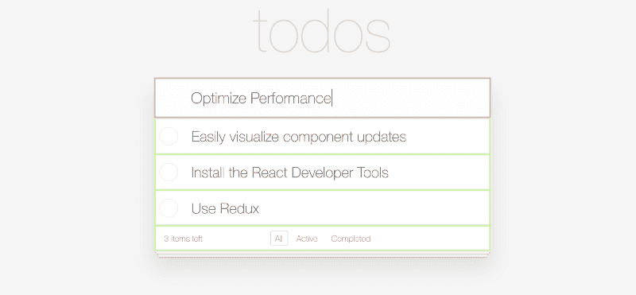
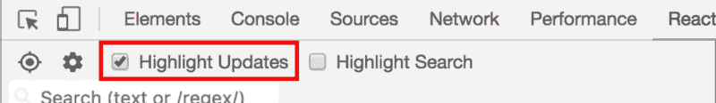
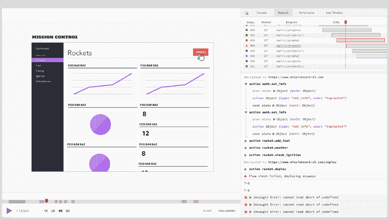

# 高性能反应:3 个新工具加速您的应用

> 原文：<https://www.freecodecamp.org/news/make-react-fast-again-tools-and-techniques-for-speeding-up-your-react-app-7ad39d3c1b82/>

本·埃德尔斯坦

# 高性能反应:3 个新工具加速您的应用


React 通常非常快，但是很容易犯小错误，导致性能问题。缓慢的组件安装、深度的组件树和不必要的渲染周期很快会让应用程序感觉很慢。

幸运的是，有很多工具可以帮助诊断性能问题，有些工具甚至是内置的。在这篇文章中，我将重点介绍让 React 应用程序快速运行的工具和技术。每个部分都有一个互动的，有趣的演示！

### 工具 1:绩效时间表

React 15.4.0 引入了一个新的性能时间线特性，可以让您准确地看到组件何时被挂载、更新和卸载。它还允许您可视化组件生命周期之间的相互关系。

**注意:**目前，该功能仅在 Chrome、Edge 和 IE 中有效，因为它利用了尚未在所有浏览器中实现的用户计时 API。

#### 它是如何工作的

1.  打开您的应用程序并追加查询参数:`react_perf`。例如，`[http://localhost:3000?react_perf](http://localhost:3000?react_perf)`
2.  打开 Chrome DevTools**Performance**选项卡，按下 **Record** 。
3.  执行您想要分析的操作。
4.  停止记录。
5.  在**用户计时下检查可视化。**



#### 了解输出

每个彩色条显示组件正在“工作”的时间。由于 JavaScript 是单线程的，每当组件被装载或渲染时，它就会霸占主线程并阻止其他代码运行。

括号中的文本描述了组件生命周期的哪一部分正在发生。时间线分解了每一步，所以你可以看到像`[componentDidMount]` `[componentWillReceiveProps]` `[ctor]`(构造函数)和`[render].`这样的方法的细粒度计时

堆叠的条形表示组件树。虽然 React 中通常有相当深的组件树，但如果您正在优化一个频繁挂载的组件，这有助于减少包装器组件的数量，因为每个组件都会增加少量的性能和内存损失。

这里需要注意的一点是，时间线中的计时数字是针对 React 的开发构建的，它比 prod 慢得多。事实上，性能时间线本身甚至会降低应用程序的速度。虽然这些数字不应该被认为是真实世界性能的代表，但不同组件之间的*相对*计时是准确的。此外，组件是否更新根本不取决于产品版本。

#### 演示#1

为了好玩，我修改了 TodoMVC 应用程序，使其存在一些严重的性能问题。你可以在这里试试[。](https://perf-demo.firebaseapp.com/?react_perf)

要查看时间线，请打开 Chrome dev 工具，转到“性能”选项卡，然后单击录制。然后在应用程序中添加一些 TODOs，停止录制，检查时间轴。看看您是否能发现哪些组件导致了性能问题:)

### 工具 2:你为什么更新

影响 React 性能的最常见问题之一是不必要的渲染周期。默认情况下，无论父组件何时渲染，React 组件都会重新渲染，即使它们的道具没有改变。

例如，如果我有这样一个简单的组件:

```
class DumbComponent extends Component {  render() {    return <div> {this.props.value} </div>;  }}
```

有这样一个父组件:

```
class Parent extends Component {  render() {    return <div>      <DumbComponent value={3} />    </div>;  }}
```

每当父组件渲染时，`DumbComponent`将重新渲染，尽管其属性没有改变。

一般来说，如果`render`运行，并且虚拟 DOM 没有变化，这是一个浪费的渲染周期，因为`render`方法应该是纯的，没有任何副作用。在大规模的 React 应用程序中，检测发生这种情况的位置可能很棘手，但幸运的是，有一个工具可以提供帮助！

#### 使用为什么更新



是一个连接 React 并检测潜在不必要的组件渲染的库。它检测组件的`render`方法何时被调用，尽管它的属性没有改变。

#### 设置

1.  使用 npm 安装:`npm i --save-dev why-did-you-update`
2.  将此片段添加到您的应用中的任意位置:

```
import React from 'react'
```

```
if (process.env.NODE_ENV !== 'production') {  const {whyDidYouUpdate} = require('why-did-you-update')  whyDidYouUpdate(React)}
```

**请注意**该工具在本地开发中非常有用，但请确保在生产中禁用它，因为它会降低应用程序的速度。

#### 了解输出

`why-did-you-update`在应用运行时监控应用，并记录可能发生不必要更改的组件。它可以让你在一个渲染周期之前和之后看到它认为可能是不必要的道具。

#### 演示#2

为了演示`why-did-you-update`，我在 Code Sandbox 上的 TodoMVC 应用程序中安装了这个库，Code Sandbox 是一个在线 React 游乐场。打开浏览器控制台，添加一些 TODOs 来查看输出。

[这里是演示](https://codesandbox.io/s/xGJP4QExn)。

请注意，应用程序中的一些组件进行了不必要的渲染。尝试实现上述技术，以防止不必要的渲染。如果操作正确，控制台中应该没有来自`why-did-you-update`的输出。

### 工具 3: React 开发者工具



React Developer Tools Chrome 扩展具有可视化组件更新的内置特性。这有助于检测不必要的渲染周期。要使用它，首先确保[在这里安装扩展](https://codesandbox.io/s/xGJP4QExn)。

然后，通过点击 Chrome DevTools 中的“React”选项卡打开扩展，并选中“高亮显示更新”。



然后，只需使用您的应用程序。与各种组件进行交互，并观看 DevTools 的神奇表现。

#### 了解输出

React 开发人员工具突出显示在给定时间点重新呈现的组件。根据更新的频率，使用不同的颜色。蓝色显示不频繁的更新，对于频繁更新的组件，蓝色显示为绿色、黄色和红色。

看到黄色或红色不一定是坏事。当调整滑块或其他触发频繁更新的 UI 元素时，这是意料之中的。但是，如果你点击一个简单的按钮，看到红色-这可能意味着有什么不对劲。该工具的目的是找出不必要更新*的组件。作为应用程序开发人员，您应该大致了解在给定时间应该更新哪些组件。*

#### 演示#3

为了演示组件高亮显示，我修改了 TodoMVC 应用程序来更新一些不必要的组件。

[这里是演示](https://highlight-demo.firebaseapp.com/)。

打开上面的链接，然后打开 React 开发人员工具并启用更新突出显示。当你在顶部输入文本时，你会看到所有待办事项被不必要的高亮显示。随着键入速度的加快，您会看到颜色发生变化，表示更新更加频繁。

### 修复不必要的渲染

一旦你发现应用程序中有不必要的重复渲染的组件，有一些简单的修复方法。

#### 使用纯组件

在上面的例子中，`DumbComponent`是其道具的纯函数。即组件只需要在其道具发生变化时重新渲染即可。React 内置了一种特殊类型的组件，称为`PureComponent`,正是为了这个用例。

而不是从 React 继承。组件，使用 React。像这样的纯组件:

```
class DumbComponent extends PureComponent {  render() {    return <div> {this.props.value} </div>;  }}
```

然后，组件只会在它的道具实际改变时重新渲染。就是这样！

注意`PureComponent`做了一个肤浅的道具比较，所以如果你使用复杂的数据结构，它可能会错过一些道具变化，不会更新你的组件。

#### 实现 shouldComponentUpdate

`shouldComponentUpdate`是当`props`或`state`发生变化时，在`render`之前调用的组件方法。如果`shouldComponentUpdate`返回 true，将调用`render`，如果返回 false，则不执行任何操作。

通过实现这个方法，您可以指示 React 避免重新渲染一个给定的组件，如果它的属性没有改变的话。

例如，我们可以在上面的哑组件中实现`shouldComponentUpdate`,如下所示:

```
class DumbComponent extends Component {  shouldComponentUpdate(nextProps) {    if (this.props.value !== nextProps.value) {      return true;    } else {      return false;    }  }
```

```
render() {    return <div>foo</div>;  }}
```

### 调试生产中的性能问题

React 开发人员工具仅在您在自己的机器上运行应用程序时有效。如果您有兴趣了解用户在生产中看到的性能问题，请尝试使用 [LogRocket](https://logrocket.com) 。



LogRocket 就像是网络应用的 DVR，记录下*字面上的* *发生在你网站上的一切*。您可以重放有错误或性能问题的会话，以快速了解根本原因，而不是猜测问题发生的原因。

LogRocket 让你的应用程序记录性能数据、Redux 动作/状态、日志、错误、带有头+主体的网络请求/响应以及浏览器元数据。它还记录页面上的 HTML 和 CSS，甚至可以重建最复杂的单页面应用程序的像素级完美视频。

[**【log rocket | JavaScript 应用的日志记录和会话重放**](https://logrocket.com/)
[*【log rocket】帮助您了解影响您的用户的问题，以便您可以重新开始构建优秀的软件。*logrocket.com](https://logrocket.com/)

感谢阅读。我希望这些工具和技术对您的下一个 React 项目有所帮助！