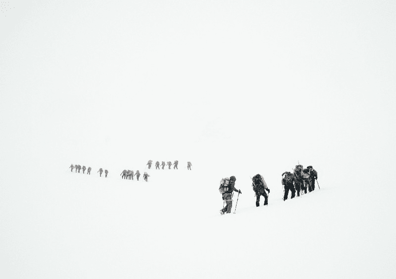
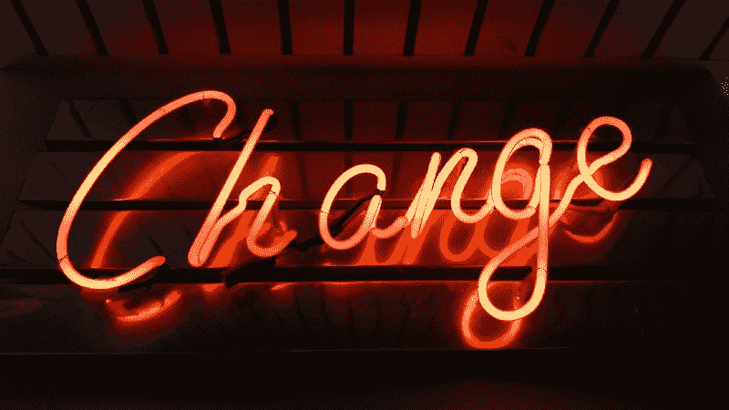

# 通过#100DaysOfCode 运动提高:回合、阻力和适应性

> 原文：<https://www.freecodecamp.org/news/the-100daysofcode-movement-rounds-resistance-and-adaptation-432429cc3306/>

亚历山大·卡拉威

# 通过#100DaysOfCode 运动提高:回合、阻力和适应性

Photo by [Thomas Hafeneth](http://unsplash.com/photos/pULttj3sqEY?utm_source=unsplash&utm_medium=referral&utm_content=creditCopyText) on [Unsplash](https://unsplash.com/?utm_source=unsplash&utm_medium=referral&utm_content=creditCopyText)

自从我们上次在 1 月更新#100DaysOfCode 挑战[以来，已经有数百人进行了尝试。他们已经完成了挑战，建立了惊人的项目，并找到了技术工作。](https://medium.freecodecamp.com/start-2017-with-the-100daysofcode-improved-and-updated-18ce604b237b)

一路走来，我们学到了很多经验教训，我将在本文中对它们进行总结。

首先，我会给你一些挑战本身的基本信息。然后我们将探索回合的新概念——多次接受挑战。我们将讨论阻力，以及它与#100DaysOfCode 挑战赛规则的联系。最后，我们将讨论适应，以及它对你成功应对挑战的重要性。

出色的#100DaysOfCode 社区源于我们一年多前在 freeCodeCamp 的媒体出版物上发起的最初挑战。

现在#100DaysOfCode 已经成为一个成熟的、自我推进的运动，在许多人的生活中扮演着一种有益的力量——帮助他们一天一天地提高他们的编码技能。

### 关于挑战的一些事情

#100DaysOfCode 是一个特别设计的挑战，旨在帮助你在学习编码时战胜拖延和恐惧。它帮助你把编码变成一种日常习惯。

**主要的两条规则是:**

1.  你承诺在接下来的 100 天里每天至少花一个小时编码
2.  你承诺鼓励至少两个人每天也做这项挑战。

这就是它的要点，要了解更多，请阅读挑战赛官方网站上的深入规则和常见问题:**【www.100DaysOfCode.com】T2。那里还有一个参考资料部分，您可以在那里找到更多的文章、播客等等。**

**为了给你更多的视角，这里有一些来自#100DaysOfCode 的人说的话:**

> **“我完成了 100 天的代码。此外，完成后，我的头衔改变了，我现在做一半的编码和一半的测试，而不是全面测试。每个月都有更多的测试任务会在团队中展开，我也会承担更多的编码任务。我正在考虑重新开始 100 天的代码。”罗伯特·约根森**

> **“我完成了#100DaysOfCode，它是帮助我找到工作的因素之一。”克里斯蒂娜·戈登**

> **“我曾经完成了 100 天的代码。打算九月份再开始。我还没有找工作，但它帮助我更好地完成了工作，并让我参与了开源项目。”艾米·卡尼**

**如果你正在考虑你是否应该学习编码——答案是肯定的！**

**如果你还没有接受#100DaysOfCode 挑战，[让我们在 7 月 17 日一起开始吧！](https://twitter.com/intent/tweet?text=I%27m%20publicly%20committing%20to%20the%20100DaysOfCode%20Challenge%20starting%20July%2017,%202017.%20Join%20me!&url=https://medium.com/@ka11away/the-100daysofcode-movement-rounds-resistance-and-adaptation-432429cc3306&hashtags=100DaysOfCode)**

### **随着#100DaysOfCode 运动的进步和发展，我们学到了一些经验**

#### **#100DaysOfCode 回合的概念**

**

Photo by [Braden Collum](http://unsplash.com/photos/ttbCwN_mWic?utm_source=unsplash&utm_medium=referral&utm_content=creditCopyText) on [Unsplash](https://unsplash.com/?utm_source=unsplash&utm_medium=referral&utm_content=creditCopyText)** 

**许多已经完成挑战的人想要重复一遍，因为它对他们的结果有影响，并且加速了他们的学习过程。**

**我相信重新接受挑战是非常有价值的，但你需要有一种方法来衡量和分析你的进展，以便能够改进你的计划和下一轮的结果。**

**假设你即将完成第一轮挑战。我建议你在完成第 100 天之后，休息 3-4 天(你仍然可以编码，但不要作为挑战的一部分)，停下来反思一下你的经历。**

**最好的方法是把你的想法写在博客上，甚至写在笔记本上。最重要的是你开始了反思的过程。**

**这个过程会揭示很多你最初没有想到的事情，通过思考你刚刚完成的旅程，你可以将这些事情转化为关于你自己和关于经历本身的教训。**

**至少，把这段时间花在庆祝上，因为这是你应得的。**

**然后，用你综合的知识武装自己，计划你的下一轮#100DaysOfCode。**

*   **你想从事什么技术？**
*   **您想要构建什么项目**

**不要把你的计划做得太详细。你不想在前进的过程中扼杀自己的能量，你想给自己足够的适应空间。只要记下你将遵循的一般主题和准则。**

**考虑到#100DaysOfCode 回合的新系统，我建议我们采用一种新的方式来记录你在 Twitter 上进行每日更新的日子。比如 **R2D23** 、**其中 R 代表你在第几轮，D 代表当天。(这个例子可以解读为:Round 2 Day 23。)****

**在几轮挑战后，你将能够比较这几轮，并收集更多关于你如何学习、什么对你有用、什么没用的有价值的数据。**

#### **阻力和挑战的规则**

**

Photo by [Todd Diemer](http://unsplash.com/photos/zglUlG8k47I?utm_source=unsplash&utm_medium=referral&utm_content=creditCopyText) on [Unsplash](https://unsplash.com/?utm_source=unsplash&utm_medium=referral&utm_content=creditCopyText)** 

**抵抗是我最喜欢探索的话题之一，因为我每天都在和它打交道。**

**阻力是一种内在的力量，当你受到激励去创造或完成某件事时，你会感觉到这种力量，但你不能强迫自己开始努力。**

**当一个作家遇到“写作瓶颈”时，他会有抵触情绪这个术语是由史蒂文·普莱斯菲尔德在他的书《艺术的战争》中推广开来的，我强烈推荐你阅读这本书。(编码是一个创造性的过程，不像写作。)**

**反抗激发了#100DaysOfCode 背后的规则。**

**每天下班后，我对自己不能编码感到沮丧。总是有一些借口不这样做。所以我开始寻找克服拖延症的方法。**

**我读了一些关于习惯养成的心理学书籍，我想我可以用其中概述的一些概念来创建一个系统。这个系统可以帮助抵消我自然想出的不做我应该做的事情的所有借口。**

**挑战就是这样诞生的——几条简单的规则，社会责任，仅此而已。**

**这里有一个挑战规则如何帮助你养成编码习惯，然后每天继续战胜阻力的小分析。**

**首先，知道你有一个绝对必须做的具体的最低限度——每天 1 小时的代码——有助于你控制在困难的一天少做一些的冲动(相信我，会有很多这样的事情。)**

**这个概念被称为“亮线法则”比较“我每天花一个小时写代码”和“我每天花一点时间写代码，无论我有多少时间，我都会写代码。”后者似乎更有希望，但事实是，一致性会比你此刻脑海中想象的任何令人兴奋的计划都更能让你走得更远。**

**第二，你必须从事项目(而不是跟随教程)的原因是，你不太可能在消费现成内容的同时走捷径和放松。**

**这就是为什么研究 freeCodeCamp 的内容如此重要——它迫使你通过犯错误进行交互式学习。事实证明，与立即向人们展示正确的解决方案相比，人们能够更好、更长久地记住通过这种方式获得的信息。**

**在某些情况下，教程对于初学者是有用的，(对于那些需要快速完成工作的有经验的开发人员也是如此)。但是不要陷入阅读或观看一个又一个教程的陷阱。我已经陷入了那个陷阱，并为此浪费了不少时间。**

**我相信 freeCodeCamp 和#100DaysOfCode 是学习编码的最佳组合。**

**第三，社交方面:你和其他接受挑战的人联系越多，你从中获得的就越多。**

**社会责任是成功长期改变习惯的主要因素之一。于是，每天在 Twitter 上鼓励至少两个人的规则。**

**只需进入 [#100DaysOfCode 标签](https://twitter.com/search?f=tweets&vertical=default&q=%23100DaysOfCode&src=tyah)，点击**“最新”**而不是“热门”，就可以看到所有正在完成挑战的人。**

**一个简单的喜欢可以让某人的一天变得更加积极。谁知道呢，也许他们正处于放弃的边缘，但知道有人关心并帮助他们坚持下去。通常，你正在改变人们的生活，却没有意识到这一点。**

**如果你对阻力如何影响你的生活以及你能做些什么感兴趣，我已经在这里写了更多关于阻力的内容。**

**关于你如何帮助他人的另一个小主意:在我们的自由代码营多伦多聚会上，我们总是问新成员他们是如何听说自由代码营的。在 99%的情况下，他们的回答是“一个朋友告诉我的。”**

**在这种情况下，我总是在想:对于那些具备必要条件的人，他们会喜欢学习编程的机会，但在他们的社交圈里没有编程或正在学习编程的朋友，该怎么办？如果他们知道学习编码和改变他们的生活是可能的，而且是免费的。)，他们肯定会这么做。但他们只是还不知道。**

**我们中许多已经在学习编码的人可能以前也遇到过这种情况，并且想:为什么我不早点知道呢？**

**所以，在你的日常生活中，我想让你做的是:联系那些你认识的人，他们可能觉得自己陷入了职业生涯，或者喜欢挑战自己，或者希望自己和家人过上更好的生活。和他们谈论整个“学习编码”运动。给他们发一些资源。**

**那么一两年后可能会发生的是，你会再次见到他们，你会意识到你已经帮助他们彻底改变了生活，他们会为此感谢你。**

**当你意识到通过分享你所知道的，你所取得的巨大成就时，你甚至会哭出来。**

**

Photo by [Ross Findon](http://unsplash.com/photos/mG28olYFgHI?utm_source=unsplash&utm_medium=referral&utm_content=creditCopyText) on [Unsplash](https://unsplash.com/?utm_source=unsplash&utm_medium=referral&utm_content=creditCopyText)** 

### **适应**

**每个人的生活都是不同的，对一个人有用的可能对另一个人不现实。不要屈服于现在可能告诉你的阻力:“你当然可以做，但是很遗憾你一天没有那个时间，”或者类似的话。**

**我想让你做的是如你所愿，让挑战适应你自己。挑战的主要目的不是遵循一些刻板的规则——而是确保你坚持编码，坚持学习，不要在困难的时候放弃。(而且会的。)**

**所以，如果你刚开始你的旅程，请随意使用教程来推动你前进。如果你要旅行 2-3 天而不会编码，带一本关于编码的书去读吧。如果你每天只能抽出 20 分钟，那就去做吧。让挑战成为你自己的。**

**我希望你保持神圣的唯一规则是你必须每天编码。你可以因为计划外的情况在这里或那里跳过一天，但不能更多。目标是变得始终如一，不管生活给你带来什么。**

**我想留给你们的想法是，你们认为自己的局限性并不真实。它们会随着你的发展而扩展。**

**如果你想一想，在生活中，为了成长，你必须做与你的大脑和身体告诉你的相反的事情。为了变得更强壮，你必须让你的肌肉超越它们所习惯的极限。为了把工作做得最好，你必须学会对抗你头脑中走神和寻求分心的自然倾向。为了吃得更好，你必须抵制吃脂肪和含糖食物的欲望，这似乎对你的大脑最有吸引力。为了更好地利用时间，你必须学会逃离点播娱乐的暴政，关掉它，强迫自己选择更好的活动。**

**换句话说，当你对抗阻力的时候，你所取得的任何进步都是在你舒适区之外发生的。如果没有抵抗，就不会有进步。所以我们在生活中确实需要它。**

**最重要的是，我们要学会在反抗者的游戏中不断击败他们。变成一条小溪，形成了大峡谷。**

**怎么会？通过决定**做与阻力想要你做的事情相反的**。你朝这个方向迈出的第一步可能是致力于#100DaysOfCode。**

**[点击此处公开参加#100DaysOfCode 挑战](https://twitter.com/intent/tweet?text=I%27m%20publicly%20committing%20to%20the%20100DaysOfCode%20Challenge%20starting%20July%2017,%202017.%20Join%20me!&url=https://medium.com/@ka11away/the-100daysofcode-movement-rounds-resistance-and-adaptation-432429cc3306&hashtags=100DaysOfCode)。**

**如果您对这些主题感兴趣，并想阅读更多相关内容，请告诉我:)**

***像往常一样，写在蠢朋克的《创:遗产》的原声中。**

**如果你有朋友可能对这个挑战感兴趣，或者对学习编码感兴趣，请与他们分享这个故事。你可以点击下面的❤，帮助更多的人在 Medium 上看到这个。**

**如果您有问题/意见或想法，您可以通过 twitter 联系我[。](https://twitter.com/ka11away)**