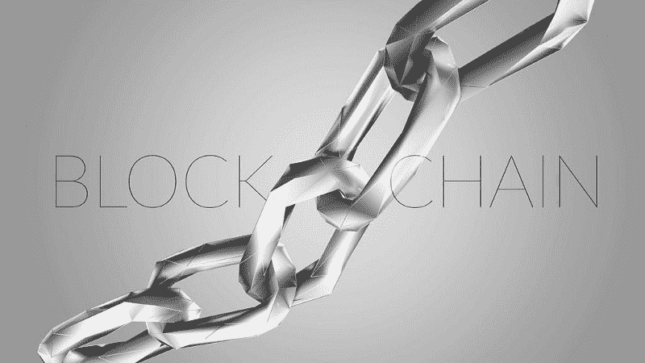
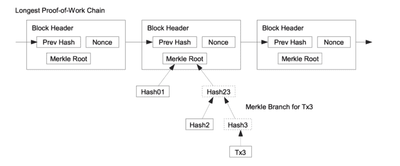

# 区块链:我们还没准备好的革命

> 原文：<https://www.freecodecamp.org/news/blockchain-is-our-first-22nd-century-technology-d4ad45fca2ce/>

作者 Haseeb Qureshi

# 区块链:我们还没准备好的革命

想象一下，你不需要信任一个陌生人来和他们做交易。想象一下，你不需要相信你的银行会把你的钱存在那里。想象一下，你不需要相信你的政府就知道它是公正和公平的。

会发生什么？

它会改变世界。

这正是区块链的承诺。

建立在区块链基础上的加密货币如今充斥着媒体，主要是因为其高昂的价格、波动性以及围绕诸如 Mt. Gox 和[丝绸之路](https://www.wired.com/2015/04/silk-road-1/)等失败的耸人听闻的故事。

但是，除了数字货币之外，还有更大的事情在发生。

虽然主流媒体一直忙于猜测价格和黑市阴谋，但他们忽略了一个事实，即在这一切的背后，密码学家已经悄悄地发明了一套全新的技术原语。

区块链(以及支持它们的共识协议)的发明是开发人员试图解决一个大胆问题的结果:如何创造数字的、不可追踪的货币。通过结合密码学、博弈论、经济学和计算机科学，他们成功地创造了一套全新的工具来构建分散式系统。

但是他们所创造的不仅仅会改变我们交换货币的方式。它将会改变整个世界。几乎没有人注意到。

著名物理学家爱德华·威滕曾这样评价弦理论:“它是 21 世纪物理学的一部分，却碰巧落入了 20 世纪的范畴。”换句话说，物理学界还没准备好接受弦理论。

**区块链是一项 22 世纪的技术，偶然落入 21 世纪初。**

很明显我们还没有准备好。

### 什么是区块链？

在其核心，区块链是一个惊人的简单和优雅的数据结构。它基本上只是一个有重要增加的链表——每个块包含前一个块的一个[加密散列](https://simple.wikipedia.org/wiki/Cryptographic_hash_function)。这就创建了一个实际上不可更改的区块链和它们的指纹，一直延伸到原始区块。

如果系统中的每个人都复制这个链表(并通过重复加密哈希函数来验证其合法性)，那么它将实现一个缓慢且有些粗糙的分布式数据库，该数据库可以抵抗篡改。

那是区块链。听起来没那么神奇，是吧？

当然，要实际构建一个功能性协议，您需要的远不止这些——您需要身份验证(公钥/私钥加密)、共识机制(通过工作证明或各种利害关系证明的 Nakamoto 共识)、空间和时间优化(Merkle 树和 Merkle 证明)以及一堆花哨的对等网络东西。但这是另一篇更具技术性的博客文章的主题。

重点是:**区块链是组织复杂系统的真正新工具**。我们才刚刚开始了解如何将它们融入现实世界。

### 区块链的承诺

如果每个人都在同一个区块链下工作，每个人都公开分享区块链的当前状态，并且篡改它在计算上是难以处理的，每个人都同意如何提交新数据的规则…那么突然之间一切都变了。

突然间，你可以建立完全去中心化的系统，不需要参与者之间的信任。只要系统中有足够多的参与者遵守协议的规则(在最原始的情况下，至少有 50%的参与者是好的)，那么您就可以给系统注入可证明的安全保证。阴谋或坏演员不能审查或破坏系统。

你甚至可以直接在协议中设计正确的激励机制，然后让系统中的每个参与者执行它们。

使用区块链，许多大规模的协调问题就消失了。困扰全球金融基础设施、投票、国际汇款、保险单、保管记录甚至政府腐败的难题可以被简单地设计得不存在。

通过创建具有正确保证的正确系统，你可以修复不良激励。你可以消除腐败的中间人和寻租者。你可以创造全新的社会，比以往任何时候都更好、更透明、更有效地协调。

大多数人真的很难理解这件事的意义。

我这么说吧:如果约翰·洛克了解区块链，这无疑会迫使他写第三部《政府论》。这将是一个如何协调社会的革命性想法。

### 未来的未来

我现在在硅谷认识的大多数人都专注于深度学习和人工智能，认为这是最有前途的技术革命。我分享他们的热情！深度学习将颠覆行业，给我们带来我们只能在科幻小说中想象的新能力。

但是区块链——区块链将颠覆整个社会。这将使新型的治理体系成为可能，而这在以前只是乌托邦主义者和哲学家的白日梦。

然而，当你现在看加密货币世界时，你不一定会认识到这一点。

现在发生的大部分事情分为两类。

第一类是秘密无政府主义者和黑客，他们正在构建底层协议。他们正在竞相为未来的构建者构建将成为分散式 TCP/IP 堆栈的东西。

第二类是奸商，他们试图从无知和乐观的人身上赚快钱。

不幸的是，这第二类得到了最多的关注。

### 区块链之塔

想象一下，在 1995 年，你偶然发现了万维网，浏览着迎合怪人的小粉丝网站，心里想:“哈。哇哦。这个奇怪的小生态系统有一天会变得非常重要。”

那是几年前的区块链。换句话说，区块链已经安全地跨越了天使火鸿沟。

现在它已经证明了它的第一缕有用之光，下一步行动是不可避免的。

你可能已经听说过 [ICO 狂热](https://medium.com/blockchannel/understanding-the-ethereum-ico-token-hype-429481278f45)，或者最近[比特币和以太坊](https://coinmarketcap.com/)价格的回升。智者和老谋深算者已经注意到并意识到区块链的巨大潜力。他们已经在猜测加密货币的潜在未来时赚了钱，也赔了钱。

不幸的是，现在,“投机区块链”占据了大多数人的注意力。信号被淹没在噪音中。

但这是意料之中的。我们以前见过这种情况。

当人们第一次意识到互联网的非凡潜力时，大量的资金被投入到随机的网络公司中。预期大规模采用和天文数字的价值创造，投机助长投机，[直到狂热最终在 2001 年崩溃](https://en.wikipedia.org/wiki/Dot-com_bubble)。

现在发生的事情是有可比性的。最终会落魄的。

但是当尘埃落定时，就像网络泡沫破灭后，那些认真的人——微软、亚马逊、谷歌——将不得不进来做建设未来的不光彩的工作。

有许多工作要做。

我最近辞去了 Airbnb 的工作。我花了一年多的时间调查支付欺诈案。这是一份迷人而有影响力的工作——Airbnb 是一家很棒的公司——我愉快地离开了。但是我对加密和区块链了解得越多，我就越相信这种东西将会改变世界。

这就是为什么我要在区块链工作。(可能还会继续写博客！)

如果你是一名开发者，想知道如何参与进来并帮助建设这个未来，请查看这个[链接](https://github.com/Scanate/EthList)，并开始动手实践。