# 我们如何在麻省理工学院追踪和分析超过 20 万人的脚步

> 原文：<https://www.freecodecamp.org/news/tracking-analyzing-over-200-000-peoples-every-step-at-mit-e736a507ddbf/>

作者:莫因·纳迪姆

# 我们如何在麻省理工学院追踪和分析超过 20 万人的脚步

我大一的春天，我有幸参加了第六次考试。S08 (互联嵌入式系统)，教授基本的 EECS 概念，如试验板、密码学和算法设计。

虽然这堂课非常耗时且富有挑战性，但我不得不说这是迄今为止我上过的最有收获的课之一。我很自豪能与一些不可思议的人一起工作(为无尽的回忆向埃弗里·兰普、丹尼尔·冈萨雷斯和伊森·韦伯大声呼喊)，我们一起完成了一个我们不会忘记的最终项目。

对于我们的最终项目，我们的团队知道我们想要冒险。有一天，在步行去买冰淇淋时，埃弗里建议使用一种设备来监控 WiFi 探测请求，类似于一些商场的做法。经过一些初步的研究和对我们导师的劝说，我们决定投入并开始研究这个想法。

### 什么是 WiFi 探测请求？

大多数人认为他们的手机是一个接收器；它连接到蜂窝/ WiFi 网络，对于所有实际用途，只有在连接时才起作用。然而，当手机搜索 WiFi 网络时，它们通常也会发出名为*探测请求*的小数据包信息。

这些*探测请求*发送信息片段，例如唯一的 MAC 地址(类似于指纹)、 [RSSI](http://www.metageek.com/training/resources/understanding-rssi.html) 信号(对数信号强度)以及之前遇到的 SSIDs 列表。由于每部手机都会发送一个 MAC 地址(不包括最近匿名化的尝试)，我们可以很容易地利用这些来跟踪在校园里走动的学生。

### 收集探测请求

我们期末项目的要求包括使用标准 6。我们在学期中使用的 S08 组件:一个 [Teensy](https://www.pjrc.com/teensy/) 微控制器，一个 [ESP8266](https://www.sparkfun.com/products/13678) ，和一个 GPS 模块。然而，鉴于 ESP8266 的低功耗(120 mA)，以及不需要强大的 CPU，我们决定完全绕过 Teensy。这一设计决策要求我们学习如何利用 [FTDI 程序员](https://www.sparkfun.com/products/9716)来为我们的 esp 刷新 Arduino 的[实现，但它使我们能够继续使用一个环境，该环境提供了对内置 AT-command 固件的强烈熟悉和广泛的库。](https://github.com/esp8266/Arduino)

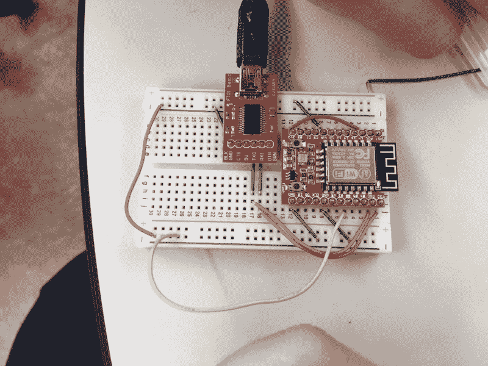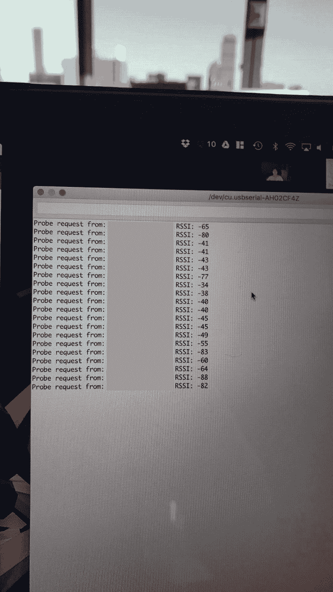

Flashing the ESP8266 & displaying Probe Requests

在接下来的几天里，我们有了一个概念验证，它跟踪校园内发出的探测请求；这足以减轻我们教授的任何疑虑，游戏开始了。

### 开发概念证明

现在我们已经对探测请求有了足够的了解，可以继续进行了，我们的团队在接下来的几天里编写了允许我们一起收集这些请求的基础结构。我编写了一个 Flask + MySQL 后端来管理设备基础设施+信息，Avery 开发了一个 iOS 应用程序来简化设备的部署，丹尼尔·冈萨雷斯为我们的网站创建了一个漂亮的前端，Ethan 创建了一个分析平台，将大量的输入数据转化为具有宝贵见解的可理解数据。

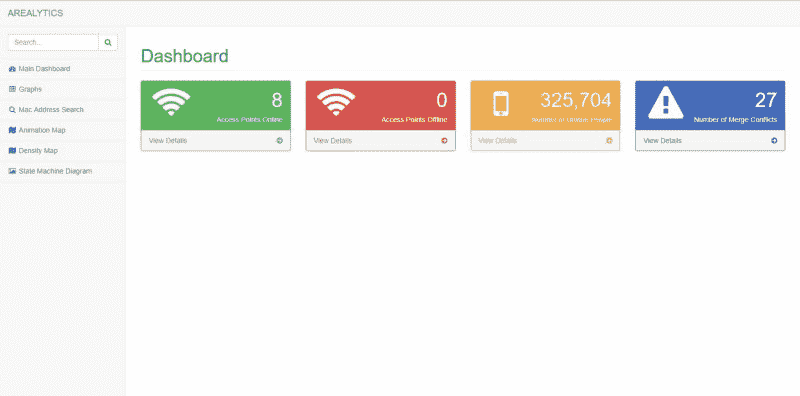

AREALYTICS taking its first breaths of life

在硬件方面，Daniel 和 Ethan 将我们的 ESP8266s 和一些电源模块焊接到原型板上。我们重复使用了班上同学给我们的 power boost 1000 c T1，使这些设备完全便携，这有一个很好的副作用，即允许我们在一些*紧张的*地点进行跟踪。

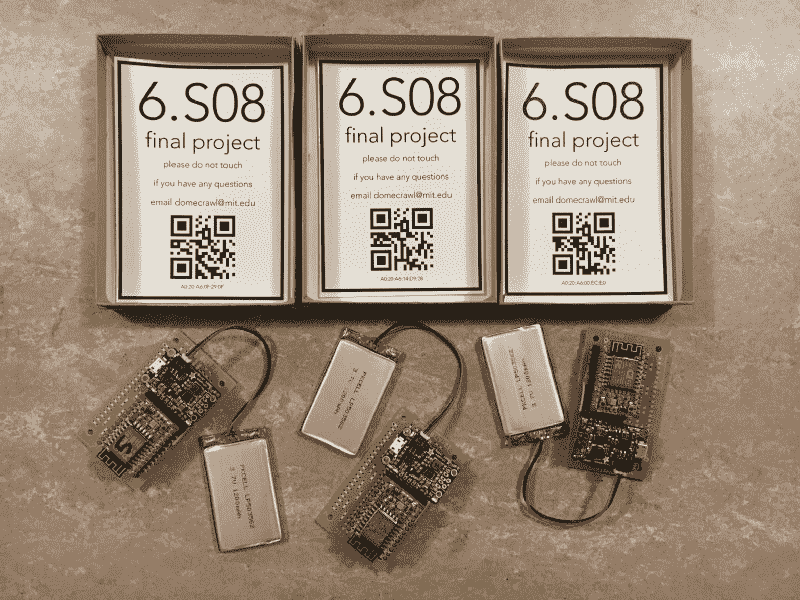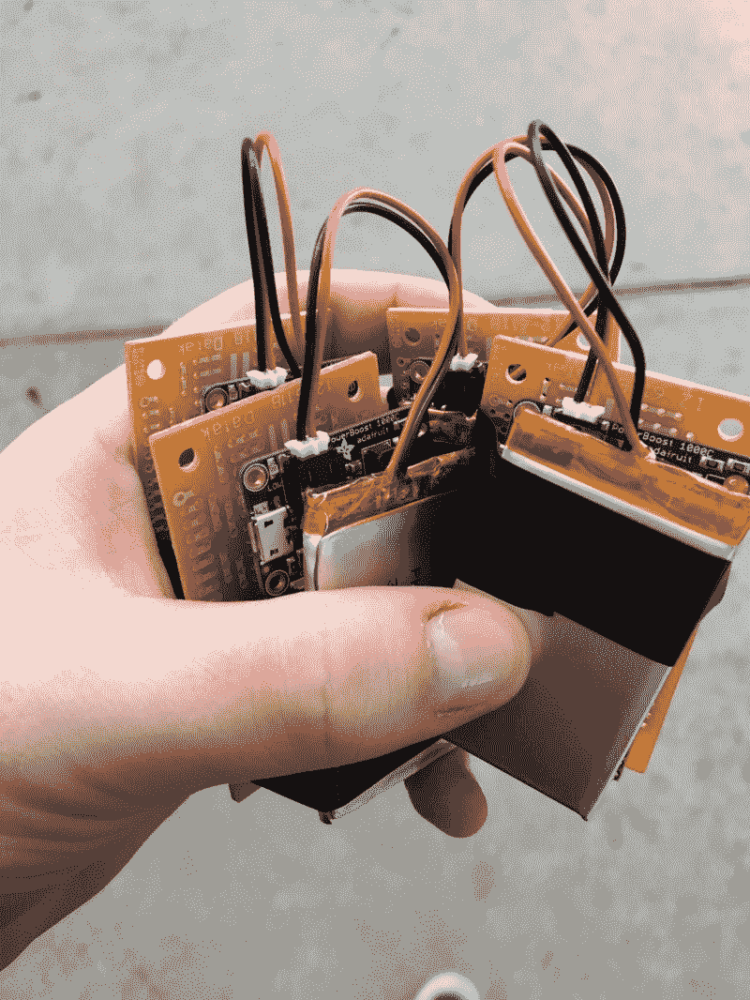

Finished soldering the boards & packed up into small boxes!

值得注意的是，团队的活力绝对是美妙的:我们一起欢笑，一起学习，真正享受彼此的陪伴。当和你最好的朋友在一起时，凌晨 4 点的部署并没有那么糟糕。

### 部署

鉴于 Ethan 编写了一些漂亮的代码来在启动时自动将设备连接到最近的不安全 WiFi 热点，Avery 编写了一个应用程序来更新位置+最后移动的字段(用于了解每个位置与哪些 MAC 地址相关联)，部署就像将设备插入附近的插座并确保它能够 ping 通家庭一样简单。如果你有创造性的话，部署是非常令人愉快的。

### 分析数据

在让项目运行一周后，我们收集了大约**350 万个探测请求**(!).我还想指出的是，这些数据都是匿名的；这些数据无论如何都不够精细，不足以确定从 MAC 地址到个人的映射，从而减轻我们的教师所担心的大多数隐私问题。

我们开始将 Ethan 的工作应用到所有的地点，这立即引起了兴奋。我们的数据**清楚地显示了每个位置背后的周期性行为**。

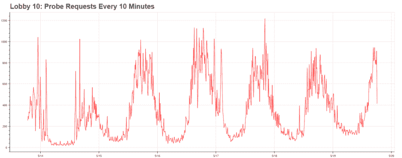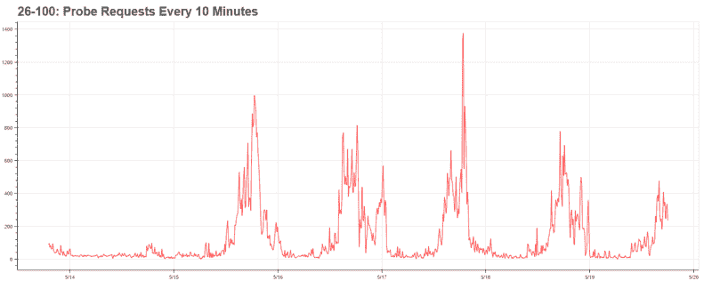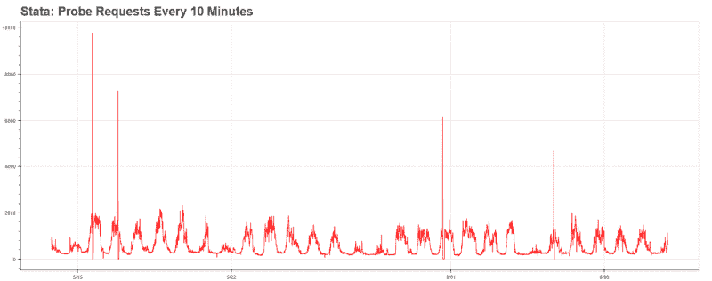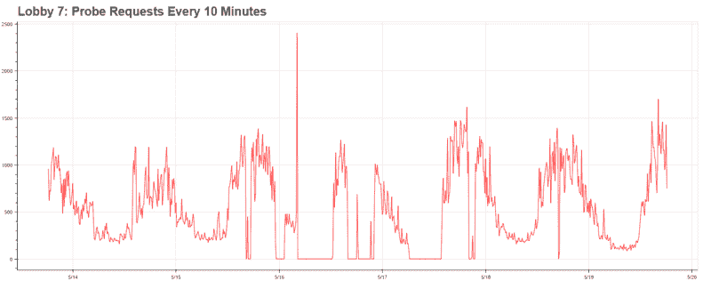

此外，它清楚地表明了整个校园的一些更大的趋势:主干道(10 号大厅，26-100)在下午 5 点左右达到了交通高峰，而校园边缘的建筑物(如 Stata，它有一家咖啡馆)在中午达到了交通高峰。不用说，随着基础设施的到位，数据变得更加令人兴奋。

一旦我们发现这些趋势的数据存在，我们开始问自己一些更有趣的问题:

*   关于麻省理工学院的 make +设备分布，我们可以得出什么结论？
*   如果我们把校园建模成一个网络图会怎么样？
*   有没有最常见的走法？
*   更有趣的是，根据人们的位置历史，我们能预测他们下一步会去哪里吗？

我们开始一个一个地攻击它们。

### 分析数据集

MAC 地址实际上在 6 个字节中提供了过多的信息；我们可以利用这些信息来更多地了解我们周围的人。例如，每个制造商为他们生产的每个设备购买一个供应商前缀，我们可以用它来确定麻省理工学院最受欢迎的设备。

但也有一个问题——最近，美国国家安全局试图利用这项技术来跟踪个人，这导致许多制造商对调查请求进行匿名化。因此，我们无法完全确定设备的分布，但我们可以调查探针请求匿名化的普遍程度。

具有讽刺意味的是，任何匿名探测请求的设备实际上**会通知您它们这样做了** —在匿名设备中，地址的[本地寻址位](https://en.wikipedia.org/wiki/MAC_address)(次低有效位)被设置为 1。因此，运行一个简单的 SQL 查询让我们知道，近 **25%的设备匿名 MAC 地址**(收集了 891，131 / 3，570，048 个探测请求)。

运行供应商前缀列表(MAC 地址的前三个字节)，我们看到前八个地址中的前两个是匿名的。

*   本地寻址的“02:18:6a”，162，589 次出现
*   本地寻址的“da:a1:19”，145，707 次出现
*   74:da:来自德州仪器的 ea，116，133 次出现
*   68:c4:4d 来自摩托罗拉移动，66，829 次出现
*   fc:f1:36 来自三星，66，573 次出现
*   64:bc:0c 来自 LG，63200 次
*   来自 HTC 的 ac:37:43，60，420 次出现
*   ac:bc:来自苹果的 32 个，出现 55，643 次

有趣的是，虽然苹果公司是迄今为止在探针请求匿名化方面最大的玩家，但他们似乎偶尔会随机发送真实地址。对于以和我们一样高的频率(几乎每秒)跟踪的人来说，这是有问题的；我们询问了拥有 iPhone 的朋友，并能够以惊人的准确度追踪他们的位置。

### 预测未来位置

在将学生的步行建模为网络图之后，我们意识到，给定他们之前所在的节点，我们可以很容易地计算出前往另一个节点的概率。此外，我们意识到这个图可以很容易地建模为马尔可夫链。给定一组初始顶点，它们下一步会去哪里？

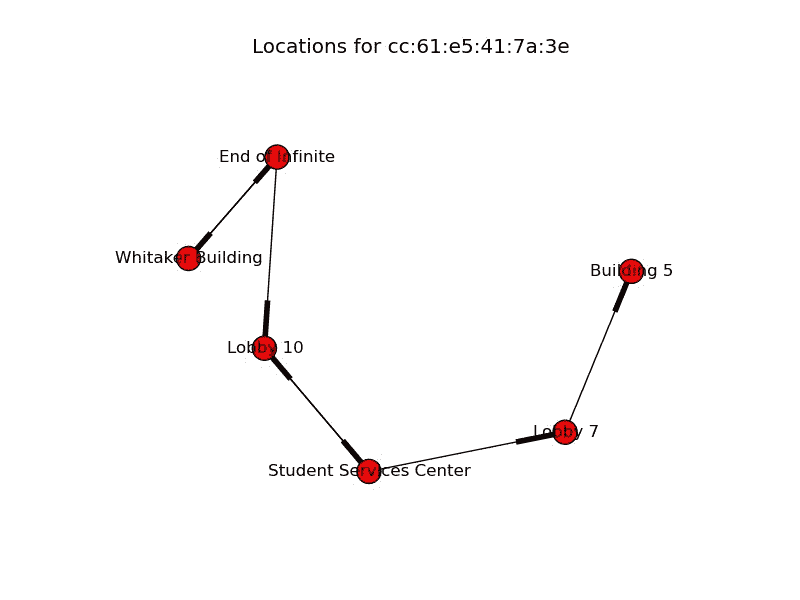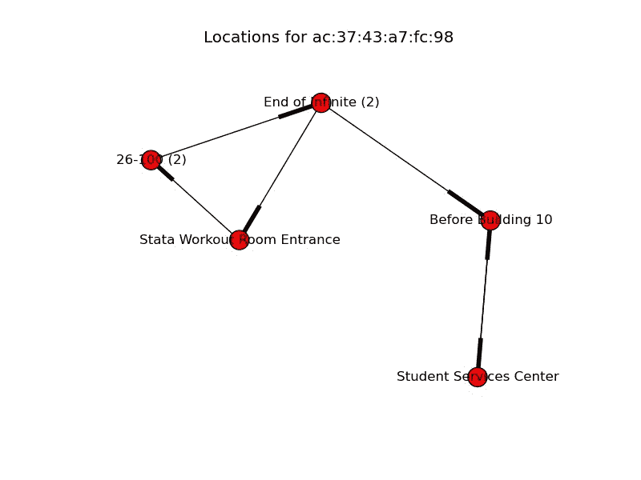

Modeling the walks as graphs with networkx. A black line represents an arrow towards that vertex.

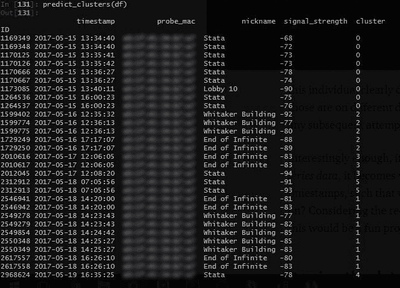

MAC addresses blurred out in order to preserve user anonymity.

然而，这提出了一个重大的挑战:我们的数据库对步行何时开始，何时结束知之甚少。它只不过是一堆带有位置和时间戳的坐标。如果你手动检查这些步行，很清楚一些是何时开始的，另一些是何时结束的，因为时间彼此相差很远。

这可以通过检查上面的图像来理解。例如，这个人显然没有从 Stata 走到 Whitaker 大楼，因为那是在不同的日子。然而，我们的数据库对此一无所知，因为任何后续的**尝试使用这些数据都会产生有缺陷的结果**。

有趣的是，如果我们把这个问题重新组织成一个聚类时间序列数据的问题，它会变得非常有趣。如果有一种方法可以将时间戳聚集在一起，这样我们就可以识别学生进行的各种“散步”,会怎么样呢？考虑到最近围绕时间序列数据聚类的讨论，我认为这将是一个有趣的项目来开始我的夏天。

### 将数据库解析成遍历

为了更好地理解如何对数据进行聚类，我需要更好地理解时间戳。为了更好地理解数据的分布，我首先将时间戳绘制到直方图上。令人高兴的是，这个简单的步骤帮助我找到了回报:事实证明，相对于与 ESP8266 的距离，探测请求的频率大致遵循高斯分布，这允许我们使用[高斯混合模型](http://scikit-learn.org/stable/modules/mixture.html)。更简单地说，我们可以利用时间戳将遵循这种分布的事实来提取各个集群。

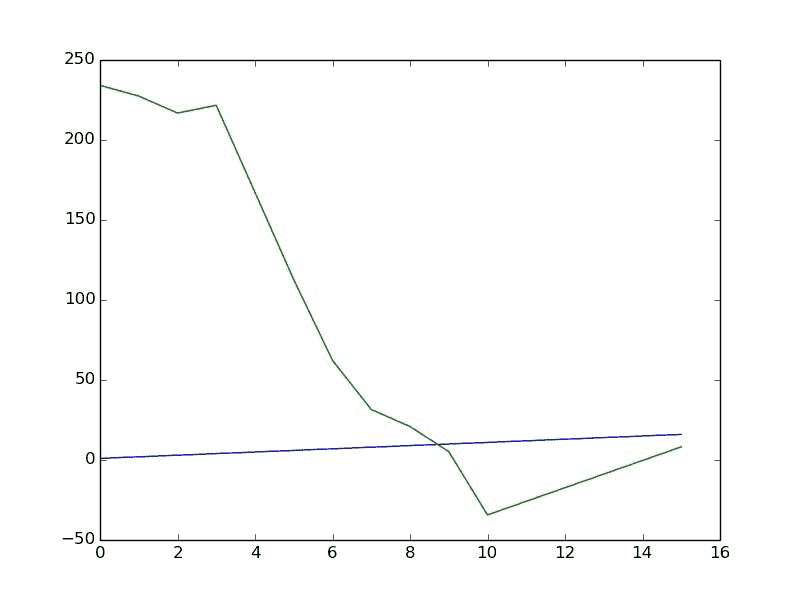

For example, this model has an optimal number of ten clusters, visible by the “elbow”.

接下来的问题是，**GMM 需要被告知使用多少个集群**，它不会自己识别它。这提出了一个很大的问题，尤其是考虑到每个人行走的次数变化很大。令人高兴的是，我能够利用[贝叶斯信息标准](https://en.wikipedia.org/wiki/Bayesian_information_criterion)，它根据模型的复杂性对模型进行量化评分。如果我通过 BIC 优化最小化模型大小，我可以确定一个最优的聚类数而不会过度拟合；这就是通常所说的*肘法。*

BIC 在开始时工作得相当好，但是会过度惩罚那些走了很多次的人，因为他们低估了可能的簇的数量。我将此与[轮廓评分](http://scikit-learn.org/stable/modules/generated/sklearn.metrics.silhouette_score.html)进行了比较，后者通过比较类内距离与到最近类的距离来对类进行评分。令人惊讶的是，这提供了一个更合理的方法来聚类时间序列数据，并避免了 BIC 遇到的许多陷阱。

我扩大了 DO droplet 的规模，让它运行了几天，并开发了一个快速的[脸书机器人](http://github.com/moinnadeem/ml_notification_system)在完成后通知我。解决了这个问题，我就可以继续预测下一步了。

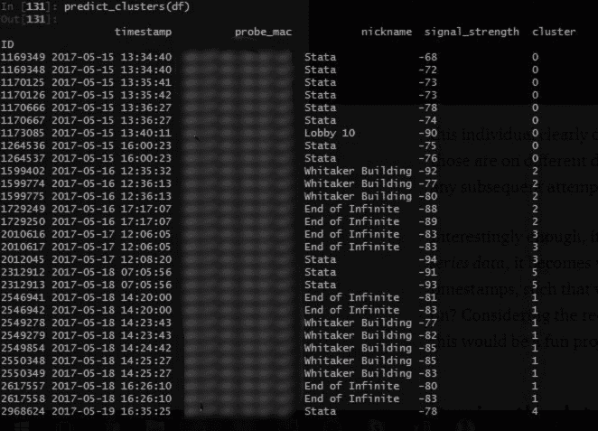

Results by clustering with Silhouette Scoring! MAC addresses blurred to preserve anonymity.

### 开发马尔可夫链

既然我们已经将一个巨大的探测请求串分割成单独的遍历，我们可以开发一个马尔可夫链。这使我们能够根据以前的事件预测下一个事件的状态。

我使用 Python 库 [Markovify](https://github.com/jsvine/markovify) 生成了一个 Markov 模型，给出了上一步中的一个语料库，这相对缩短了开发时间。

An auto-generated walk from our Markov Chain. Since each event represents an observation, increased events means that someone was at a location for an increased period of time.

我已经包含了上面生成的一个样本马尔可夫链；这实际上代表了从一个学生离开讲座(26–100 是一个演讲厅)到他的宿舍的步行路程！计算机能够捕捉到这一点并生成类似的行走，这真的很令人兴奋。有些位置是重复的，这是因为每个记录的位置实际上代表一个观察。因此，如果一个地点出现的次数比其他地点多，那仅仅意味着这个人在那里花了更多的时间。

虽然这很原始，但可能性是非常令人兴奋的。如果我们可以利用这项技术来创造更智能的城市，解决拥堵问题，并更好地了解我们如何能够减少平均步行时间，会怎么样？在这个项目中，数据科学的可能性是*无止境的*，我非常兴奋地去追求它们。

### 结论

这个项目是我大一最激动人心的亮点之一，我非常高兴我们做到了！我要感谢我不可思议的 6。S08 同辈，我们的导师乔·斯坦梅尔，以及所有 6 位。让这一切成为可能的员工。

在从事这个项目的过程中，我学到了很多东西，从如何对时间序列数据进行聚类，到跟踪校园内的探测请求所需的基础设施。我在下面附上了一些我们团队的冒险经历。

The Arealytics team!