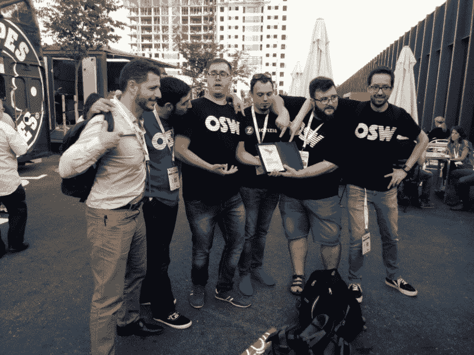
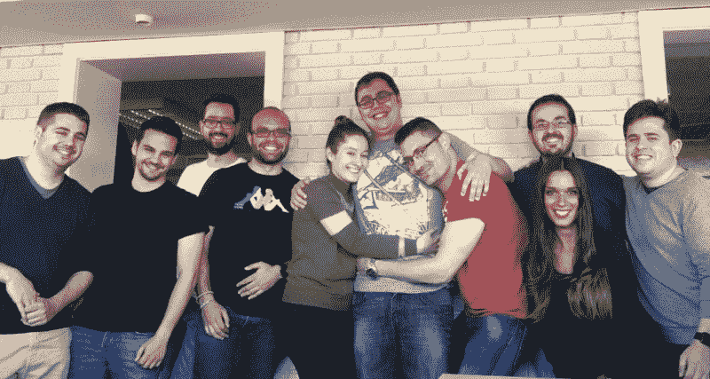

# 我从保安到后端开发者的曲折之路

> 原文：<https://www.freecodecamp.org/news/from-self-taught-coder-to-professional-backend-developer-my-long-winding-road-d8f7c428b637/>

何塞·曼努埃尔·加列戈

# 我从保安到后端开发者的曲折之路

The path can be long but you can enjoy the journey

当我还是个孩子的时候，我就爱上了电脑。但是我高考分数不够高，进不了计算机相关的领域。所以我学了采矿工程。

在经历了一个特别糟糕的学期，我的课程都不及格之后，我决定找一份暑期保安的工作来赚点钱。嗯，那份暑期工作后来成了我的职业。

在西班牙做保安不需要特别聪明的人。你生活中的人开始对你的期望很低，过了一段时间，你也开始对自己的期望很低。你停止努力提升自己。

但是不同事情注定会发生在这个特殊的保安身上。

我在马德里校园做保安，这是我的第 400 场比赛。一年前，我已经适应了这份工作，几个月前，我妻子生下了我们的儿子。

所以我在校园里，被这么多雄心勃勃的企业家包围着。我看到他们冒险行动。但我觉得自己被困在了一份没有前途的工作中，努力让不断增长的家庭收支平衡。

随着事件的进展，一位演讲者登上了舞台。我在附近站岗，听着他的话。就在那时，他说了一句最终永远改变了我一生的话:

> "任何人都可以学习编码并作为开发人员工作."

该事件与一个昂贵的编码训练营有关。因此，我对演讲者的说法持怀疑态度，并准备将这种说法视为营销。

但是如果他是对的呢？如果我也能学习编码——和计算机一起工作——而不是整天站在那里当保安，会怎么样？

在西班牙，知识工作者的工作是为拥有大学学位的人保留的。但是演讲者似乎在说——由于对软件开发人员难以置信的需求——雇主们正在破例。

他说，要想在软件开发领域找到一份高薪工作，你唯一需要做的就是擅长编码，能够通过一连串的编码挑战和面试。

我记得我完成研究他的主张的那个特别的时刻。这一发现表明，那个人所说的不仅仅是营销或炒作，它确实植根于当时的经济。那时我做了决定。我将成为一名开发人员。无论付出什么代价。

### 寻找课程

我没有时间浪费，所以我开始拼凑学习编码的最佳方法。

我开始询问我在校园里的开发者朋友，比如 [Gamify](http://www.gamify.es) (“接受挑战”应用)的首席执行官 Carlos Hernández 。他建议我从 Codecademy 这样的网站开始，然后使用他的应用程序来实现我的目标。

我不停地在网上搜索，从一个资源跳到另一个资源。每天我都尝试一点我发现的新课程。

然后我和丹尼尔·梅里(T1)聊了聊，他是当地哈斯克尔聚会(T3)的创始人。他相信我可以使用开源资源免费学习编码。我接受了他的建议。我尝试了[免费代码营](https://www.freecodecamp.org)，我完全爱上了它。

简而言之，freeCodeCamp 的魔力在于:

*   你有一个清晰的循序渐进的路径可以遵循。
*   编码挑战非常具有挑战性。freeCodeCamp 不像许多其他资源那样牵着你的手。他们给你犯错误的空间。
*   您可以联系全球社区，当您需要帮助时，他们会全天候为您提供支持。
*   你快速连续地制作真实的项目。
*   你可以编写代码来帮助现实世界中的非营利组织。

### 我的错误

我想说的是，从那时起，我做出了最明智的决定，并选择了最短的路径去做一名开发人员。但事实是，我犯了一些错误。最大的错误是:**我没有完成我开始的事情。**

当我开始学习代码时，我学得非常快。开始的蜜月是惊人的。我觉得自己像山中之王。

所以当我遇到一个我头上无法快速解决的问题时，我就懒得去尝试编码了。我想继续前进得更快，所以我只是继续前进，试图学到更多更多的东西。

结果，我有很多未解决的问题和未完成的项目。

我最终明白了一个严酷的事实:这些未解决的问题并没有消失——它们只是回来咬我。

在学会走路之前，我需要学会爬行。

现实是，有一个完成的项目比一千个未完成的项目好得多。

我犯的另一个错误是不断失去焦点。当我在寻找实际问题的解决方案时，我会偶然发现一些其他有趣的话题，然后是另一个，另一个…在我知道这一天会结束之前，我还没有解决我最初的问题。

一年后，我听到 Pablo Almunia 在他的“最终，异步/等待”研讨会上把这种现象描述为“狩猎松鼠”问题。

视频中可以看到，当一只松鼠出现时，狗失去了焦点，需要从头再来。每当你追赶一只松鼠，另一只松鼠出现时，记住这个场景。

### 采取下一步行动

我的关注点每天都在变化。我允许互联网用闪亮的新课程、闪亮的新语言和闪亮的新框架诱惑我。

我开始觉得好像我永远也不会达到我的目标，在编码方面足够优秀以获得一份开发人员的工作。可能编码对我来说太深奥了，我会淹死的。

但是我想到了我的儿子。我以为我希望他拥有的未来。我想为他树立不放弃的榜样。

就在那时，我遇到了一位名叫 [Ulises Gascón](https://www.freecodecamp.org/news/from-self-taught-coder-to-professional-backend-developer-my-long-winding-road-d8f7c428b637/undefined) 的开发者。他建议我完成我已经开始的项目。如果需要的话，他甚至主动提出帮助我。

所以我开始完成一些项目。我又回到了以前忽略的“容易”的事情上。在这样做的过程中，我开始提出新的问题，发现新的挑战。

在我学习的这一点上，很明显，我与卡洛斯·埃尔南德斯和 T2·尤利塞斯·加森的谈话对我继续编码的决定起了决定性的作用。如果没有这两个榜样，我可能早就辞职了。我将用我的余生来感谢他们。

所以我可以自信地说，我的下一步是**向朋友**寻求帮助。

### **加入社区**

我的学习在加速。我完成了更多的项目。我想建立一些新的项目，但是我不知道要建立什么。

有人建议我去参加社区活动，在那里寻找灵感。但是我在我的城市周围发现的大多数活动都是针对 rockstar 开发人员的讲座，并且专注于前沿技术。

相反，我想和各种层次的人一起制作东西。但是没有一个好的社区来做这件事。

那时候我才开始作为一个真正的程序员去思考。如果你没有你需要的工具，那就自己动手吧！

因此，我与尤利塞斯·加斯松、T2、卡洛斯·埃尔南德斯和 T4 的伊格纳西奥·维拉纽瓦进行了交谈。我们一起创立了[开源周末](http://osweekends.com/)。

经过许多艰苦的工作，赞助商在最后一刻退出，大量的时间和金钱付诸东流，我们终于成功举办了我们的第一次活动。

Pillars.js 团队也在那里，他们不仅激励了我，还成了我的朋友！

7 个月后，开源周末获得了最佳开放社区的 [Open Award 奖项。](http://www.openexpo.es/oe2017/open-awards/)

Pepe ,CodingCarlos ,Me, Ancoar (with the prize) , Ulises,Ignacio

最后，加入当地社区对我来说至关重要。它帮助我提高了社交技能，并使我不仅仅是一个学习编码的人。

### 找到工作

经过 11 个月的学习编码，失败，跌倒，站起来，建立一个开源社区…我通过我们的开源周末邮件列表收到了一封电子邮件。

一家名为 [Kubide](https://kubide.es) 的公司正在寻找后端开发人员。几个月前，我决定专注于后端。我真的不喜欢前端开发，但我发现自己能够花几个小时解决后端编码的挑战。

Kubide 给我发了一份带回家的作业:一个 Twitter 克隆 API。这很有挑战性，但并不过分。

然后首席执行官[Á·安吉尔·路易斯·奎萨达](https://www.freecodecamp.org/news/from-self-taught-coder-to-professional-backend-developer-my-long-winding-road-d8f7c428b637/undefined)采访了我。他对我的学习技能比对我实际的编码技能更感兴趣。他还想找一个通过《创业世界》认识的人，而我是通过《马德里校园》参与进来的(尽管我只是一名保安)。

三天后，我接到一个电话，提供了一份工作。

我无法表达我当时的感受。我生命中的每个人都为我感到高兴。最终，我在学习编码上投入的所有努力都得到了回报。

### 我的第一次工作经历

通常这种故事都是大团圆结局到此为止。但是我想告诉你当你找到第一份编码工作时的感觉。因为我确信如果你受到足够的鼓励，你一定会成功。

开始总是令人害怕。但是这个新的开始也令人兴奋。你经历了感情的过山车。

首先，你觉得自己像个骗子。就像你没有从头开始编写新代码的必要技能一样。但是你尽力了。

尝试，尝试，再尝试。当你尝试了一切，继续尝试。在那之后，你可以寻求帮助，某个前辈会出现，并有希望给你指出一条你可以遵循的道路。

此时，你感觉更好，因为你开始完成你的一些任务。

有一天，你会看到有人在几分钟内解决了一个问题——一个你花了一整天才解决的问题——你会再次觉得自己是个骗子。

然后，再过一天，你帮一个队友解决了一个问题，你又会觉得没事了。

最后，你会意识到——或者你的老板会告诉你——你不是因为你已经拥有的技能而被聘用的。你被雇佣是因为你有潜力拥有的技能。

因为最好的办法是雇佣那些知道如何学习并且渴望学习的人。

> “最危险的障碍是你自己。”安赫尔·路易斯·克萨达

一旦你明白了这一点，你就会开始感觉好起来。你会进步得更快。你会和你的伙伴一起成长。你会越来越热爱你的工作，你会幸福的。

Happy and loved by my partners

### 总之:

*   记住你为什么开始学习代码。
*   不要远离你的道路。
*   不要追松鼠。
*   完成你的项目。
*   坚持。

感谢阅读，我希望这篇文章对你有所帮助。如果是这样，请点击下面的绿色心脏让我知道，或者留下评论，我会尽量用英语写更多的文章。

> “和平、爱和开源”——开源周末的座右铭