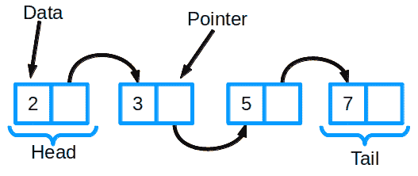
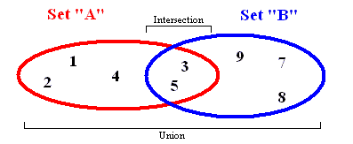
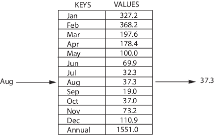
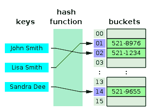
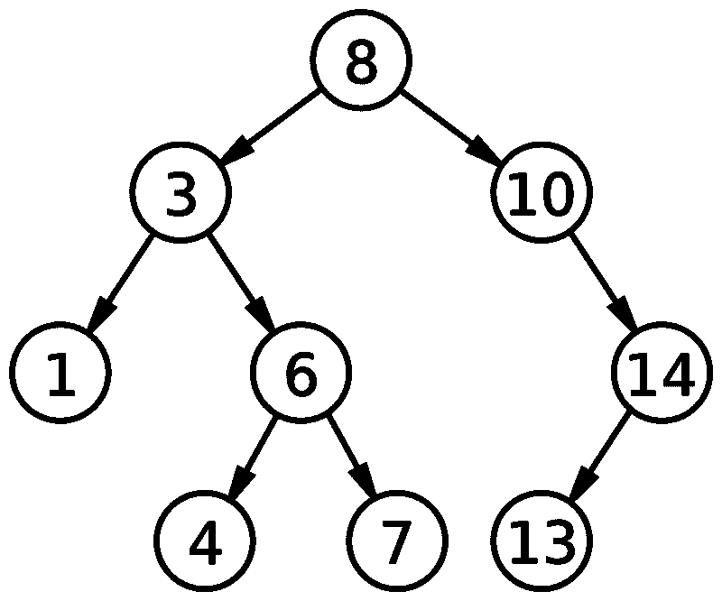
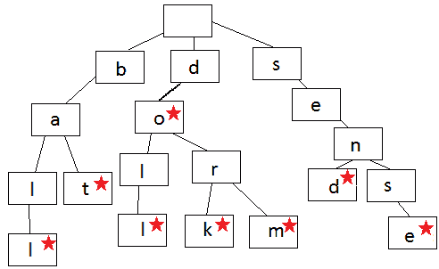
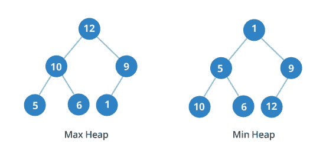
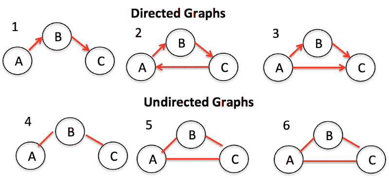
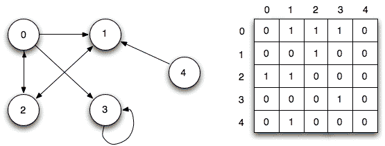

# 通过视频和练习解释 10 种常见的数据结构

> 原文：<https://www.freecodecamp.org/news/10-common-data-structures-explained-with-videos-exercises-aaff6c06fb2b/>

> “糟糕的程序员担心代码。优秀的程序员会担心数据结构和它们之间的关系。”Linux 的创始人莱纳斯·托瓦尔兹

> *** *更新**** *我关于算法的视频课程现在直播！查看曼宁出版物中的[运动算法。使用代码' **39carnes** '享受我的课程 39%的优惠！或者你可以用代码' **vlcarnes2** '获得我的](https://www.manning.com/livevideo/algorithms-in-motion?a_aid=algmotion&a_bid=9022d293)[深度学习 in Motion 课程](https://www.manning.com/livevideo/grokking-deep-learning-in-motion?a_aid=algmotion&a_bid=5d7bc0ba)的五折优惠。*

数据结构是软件开发的一个关键部分，也是开发人员面试问题中最常见的话题之一。

好消息是，它们基本上只是组织和存储数据的专用格式。

我将在这篇短文中教给你 10 种最常见的数据结构。

我已经嵌入了我为这些数据结构创建的视频。我还链接了它们各自的代码示例，展示了如何用 JavaScript 实现它们。

为了给你一些练习，我链接了来自[免费代码营课程](https://www.freecodecamp.org)的挑战。

注意，这些数据结构中的一些包含了大 O 符号的时间复杂度。并不是所有的都包括这一点，因为时间复杂度有时取决于它的实现方式。如果你想了解更多关于大 O 记谱法的知识，可以看看我的关于大 O 记谱法的[文章](https://medium.freecodecamp.org/big-o-notation-simply-explained-with-illustrations-and-video-87d5a71c0174)或者由 [Briana Marie](https://www.freecodecamp.org/news/10-common-data-structures-explained-with-videos-exercises-aaff6c06fb2b/undefined) 制作的[视频](https://www.youtube.com/watch?v=KSNx22U4uWE&index=39&list=PLWKjhJtqVAbmfoj2Th9fvxhHIeqFO7wOy)。

还要注意，尽管我展示了如何用 JavaScript 实现这些数据结构，但对于其中的大多数，您永远不需要自己实现它们，除非您使用的是 c 之类的低级语言。

JavaScript(像大多数高级语言一样)内置了这些数据结构的实现。

尽管如此，知道如何实现这些数据结构会让你在寻找开发人员的工作中获得巨大的优势，并且在你试图编写高性能代码时可能会派上用场。

### 链接列表

链表是最基本的数据结构之一。它经常被比作数组，因为许多其他数据结构可以用数组或链表来实现。它们各有利弊。

Linked list representation

链表由一组节点组成，它们共同代表一个序列。每个节点包含两件事:实际存储的数据(基本上可以是任何类型的数据)和指向序列中下一个节点的指针(或链接)。还有双向链表，其中每个节点都有一个指针指向列表中的下一项和上一项。

链表中最基本的操作是向列表中添加一个条目，从列表中删除一个条目，以及在列表中搜索一个条目。

点击此处查看 JavaScript 中的链表代码。

#### 链表时间复杂度

| 算法 | 平均的 | 最坏情况 |
| --- | --- | --- |
| 空间 | 0(n) | 0(n) |
| 搜索 | 0(n) | 0(n) |
| 插入 | 0(1) | 0(1) |
| 删除 | 0(1) | 0(1) |

#### 免费代码营挑战

*   [处理链表中的节点](https://learn.freecodecamp.org/coding-interview-prep/data-structures/work-with-nodes-in-a-linked-list)
*   [创建一个链表类](https://learn.freecodecamp.org/coding-interview-prep/data-structures/create-a-linked-list-class)
*   [从链表中移除元素](https://learn.freecodecamp.org/coding-interview-prep/data-structures/remove-elements-from-a-linked-list)
*   [在链表中搜索](https://learn.freecodecamp.org/coding-interview-prep/data-structures/search-within-a-linked-list)
*   [通过索引从链表中移除元素](https://learn.freecodecamp.org/coding-interview-prep/data-structures/remove-elements-from-a-linked-list-by-index)
*   [在链表中的特定索引处添加元素](https://learn.freecodecamp.org/coding-interview-prep/data-structures/add-elements-at-a-specific-index-in-a-linked-list)
*   [创建一个双向链表](https://learn.freecodecamp.org/coding-interview-prep/data-structures/create-a-doubly-linked-list)
*   [反转双向链表](https://learn.freecodecamp.org/coding-interview-prep/data-structures/reverse-a-doubly-linked-list)

### 大量

栈是一种基本的数据结构，在栈顶只能插入或删除条目。这有点类似于一堆书。如果你想看书架中间的一本书，你必须先把它上面的书都拿下来。

堆栈被认为是 LIFO(后进先出)，这意味着您放入堆栈的最后一个项目是从堆栈中出来的第一个项目

Stack representation

有三个主要的操作可以在堆栈上执行:将一个项目插入堆栈(称为“push”)，从堆栈中删除一个项目(称为“pop”)，以及显示堆栈的内容(有时称为“pip”)。

点击此处查看 JavaScript 中的堆栈代码。

#### 堆栈时间复杂度

| 算法 | 平均的 | 最坏情况 |
| --- | --- | --- |
| 空间 | 0(n) | 0(n) |
| 搜索 | 0(n) | 0(n) |
| 插入 | 0(1) | 0(1) |
| 删除 | 0(1) | 0(1) |

#### 免费代码营挑战

*   [了解堆栈的工作原理](https://learn.freecodecamp.org/coding-interview-prep/data-structures/learn-how-a-stack-works)
*   [创建一个堆栈类](https://learn.freecodecamp.org/coding-interview-prep/data-structures/create-a-stack-class)

### 行列

你可以把队列想象成杂货店里的一排人。队伍中的第一个是第一个被服务的。就像排队一样。

Queue representation

一个队列被认为是 FIFO(先进先出)来展示它访问数据的方式。这意味着，一旦添加了新元素，必须先删除之前添加的所有元素，然后才能删除新元素。

队列只有两个主要操作:入队和出队。入队意味着将一个项目插入到队列的后面，出队意味着删除前面的项目。

点击此处查看 JavaScript 中的队列代码。

#### 排队时间复杂度

| 算法 | 平均的 | 最坏情况 |
| --- | --- | --- |
| 空间 | 0(n) | 0(n) |
| 搜索 | 0(n) | 0(n) |
| 插入 | 0(1) | 0(1) |
| 删除 | 0(1) | 0(1) |

#### 免费代码营挑战

*   [创建一个队列类](https://learn.freecodecamp.org/coding-interview-prep/data-structures/create-a-queue-class)
*   [创建优先级队列类别](https://learn.freecodecamp.org/coding-interview-prep/data-structures/create-a-priority-queue-class)
*   [创建一个循环队列](https://learn.freecodecamp.org/coding-interview-prep/data-structures/create-a-circular-queue)

### 设置

Set representation

集合数据结构存储没有任何特定顺序和没有重复值的值。除了能够在集合中添加和删除元素之外，还有一些其他重要的集合函数可以同时处理两个集合。

*   Union —这将组合两个不同集合中的所有项目，并将其作为一个新集合返回(没有重复项)。
*   交集-给定两个集合，此函数返回另一个集合，该集合包含属于这两个集合的所有项目。
*   差异—这将返回一个项目列表，这些项目在一个集合中，但不在另一个集合中。
*   Subset 返回一个布尔值，表明一个集合中的所有元素是否都包含在另一个集合中。

[在此查看用 JavaScript 实现 set 的代码。](http://codepen.io/beaucarnes/pen/dvGeeq?editors=0012)

#### 免费代码营挑战

*   [创建一个集合类](https://learn.freecodecamp.org/coding-interview-prep/data-structures/create-a-set-class)
*   [从集合中移除](https://learn.freecodecamp.org/coding-interview-prep/data-structures/remove-from-a-set)
*   [集合的大小](https://learn.freecodecamp.org/coding-interview-prep/data-structures/size-of-the-set)
*   [对两个集合执行并集](https://learn.freecodecamp.org/coding-interview-prep/data-structures/perform-a-union-on-two-sets)
*   [对两组数据进行交集运算](https://learn.freecodecamp.org/coding-interview-prep/data-structures/perform-an-intersection-on-two-sets-of-data)
*   [对两组数据进行差分](https://learn.freecodecamp.org/coding-interview-prep/data-structures/perform-a-difference-on-two-sets-of-data)
*   [对两组数据进行子集检查](https://learn.freecodecamp.org/coding-interview-prep/data-structures/perform-a-subset-check-on-two-sets-of-data)
*   [在 ES6](https://learn.freecodecamp.org/coding-interview-prep/data-structures/create-and-add-to-sets-in-es6) 中创建并添加到器械包
*   [从 ES6](https://learn.freecodecamp.org/coding-interview-prep/data-structures/remove-items-from-a-set-in-es6) 中的器械包中移除物品
*   [使用。有和。ES6 集上的尺寸](https://learn.freecodecamp.org/coding-interview-prep/data-structures/use--has-and--size-on-an-es6-set)
*   [使用 Spread 和 Notes 进行 ES5 集合()整合](https://learn.freecodecamp.org/coding-interview-prep/data-structures/use-spread-and-notes-for-es5-set-integration)

### 地图

映射是一种以键/值对存储数据的数据结构，其中每个键都是唯一的。映射有时被称为关联数组或字典。它通常用于快速查找数据。地图支持以下功能:

Map representation

*   向系列中添加一对
*   从集合中移除一对
*   现有对的修改
*   查找与特定关键字相关联的值

在此查看用 JavaScript 实现地图的代码。

#### 免费代码营挑战

*   [创建地图数据结构](https://learn.freecodecamp.org/coding-interview-prep/data-structures/create-a-map-data-structure)
*   [创建一个 ES6 JavaScript 映射](https://learn.freecodecamp.org/coding-interview-prep/data-structures/create-an-es6-javascript-map)

### 散列表

Hash table and hash function representation

哈希表是包含键/值对的映射数据结构。它使用散列函数来计算桶或槽数组的索引，从中可以找到所需的值。

哈希函数通常接受一个字符串作为输入，并输出一个数值。散列函数应该总是为相同的输入给出相同的输出号。当两个输入散列到相同的数字输出时，这被称为冲突。目标是减少碰撞。

因此，当您将一个键/值对输入到哈希表中时，该键将通过哈希函数并转换为一个数字。然后，该数值被用作存储该值的实际键。当您再次尝试访问同一个密钥时，哈希函数将处理该密钥并返回相同的数字结果。然后，该数字将用于查找相关值。这平均提供了非常高效的 O(1)查找时间。

在这里查看哈希表的代码。

#### 哈希表时间复杂度

| 算法 | 平均的 | 最坏情况 |
| --- | --- | --- |
| 空间 | 0(n) | 0(n) |
| 搜索 | 0(1) | 0(n) |
| 插入 | 0(1) | 0(n) |
| 删除 | 0(1) | 0(n) |

#### 免费代码营挑战

*   [创建哈希表](https://learn.freecodecamp.org/coding-interview-prep/data-structures/create-a-hash-table)

### 二叉查找树

Binary search tree

树是由节点组成的数据结构，它具有以下特征:

1.  每棵树都有一个根节点(在顶部)。
2.  根节点有零个或多个子节点。
3.  每个子节点有零个或多个子节点，依此类推。

一棵*二进制* *搜索*树增加了这两个特征:

1.  每个节点最多有两个子节点。
2.  对于每个节点，其左后代小于当前节点，当前节点小于右后代。

二分搜索法树允许快速查找、添加和删除项目。它们的设置方式意味着，平均而言，每次比较允许操作跳过大约一半的树，因此每次查找、插入或删除所花费的时间与存储在树中的项目数的对数成比例。

[点击此处](https://codepen.io/beaucarnes/pen/ryKvEQ?editors=0011)查看二叉查找树的 JavaScript 代码。

#### 二分搜索法时间复杂度

| 算法 | 平均的 | 最坏情况 |
| --- | --- | --- |
| 空间 | 0(n) | 0(n) |
| 搜索 | 0(登录号) | 0(n) |
| 插入 | 0(登录号) | 0(n) |
| 删除 | 0(登录号) | 0(n) |

#### 免费代码营挑战

*   [找出二叉查找树中的最小值和最大值](https://learn.freecodecamp.org/coding-interview-prep/data-structures/find-the-minimum-and-maximum-value-in-a-binary-search-tree)
*   [向二叉查找树添加新元素](https://learn.freecodecamp.org/coding-interview-prep/data-structures/add-a-new-element-to-a-binary-search-tree)
*   [检查二叉查找树中是否存在元素](https://learn.freecodecamp.org/coding-interview-prep/data-structures/check-if-an-element-is-present-in-a-binary-search-tree)
*   [找出二叉查找树的最小和最大高度](https://learn.freecodecamp.org/coding-interview-prep/data-structures/find-the-minimum-and-maximum-height-of-a-binary-search-tree)
*   [在二叉查找树中使用深度优先搜索](https://learn.freecodecamp.org/coding-interview-prep/data-structures/use-depth-first-search-in-a-binary-search-tree)
*   [在二叉查找树中使用广度优先搜索](https://learn.freecodecamp.org/coding-interview-prep/data-structures/use-breadth-first-search-in-a-binary-search-tree)
*   [删除二叉查找树中的叶节点](https://learn.freecodecamp.org/coding-interview-prep/data-structures/delete-a-leaf-node-in-a-binary-search-tree)
*   [删除二叉查找树中有一个子节点的节点](https://learn.freecodecamp.org/coding-interview-prep/data-structures/delete-a-node-with-one-child-in-a-binary-search-tree)
*   [删除二叉查找树中有两个子节点的节点](https://learn.freecodecamp.org/coding-interview-prep/data-structures/delete-a-node-with-two-children-in-a-binary-search-tree)
*   [反转二叉树](https://learn.freecodecamp.org/coding-interview-prep/data-structures/invert-a-binary-tree)

### 特里

trie(读作“try”)或前缀树是一种搜索树。trie 按步骤存储数据，其中每一步都是 trie 中的一个节点。尝试通常用于存储单词以便快速查找，例如单词自动完成功能。

Trie representation

语言 trie 中的每个节点包含一个单词的一个字母。你沿着树枝拼写一个单词，一次一个字母。当字母的顺序与 trie 中的其他单词不同时，或者当一个单词结束时，这些步骤开始分支。每个节点包含一个字母(数据)和一个布尔值，该值指示该节点是否是单词中的最后一个节点。

看形象就能组词。总是从顶部的根节点开始向下工作。这里显示的 trie 包含单词 ball、bat、doll、do、dork、dorm、send、sense。

点击此处查看 JavaScript 中的 trie 代码。

#### 免费代码营挑战

*   [创建一个 Trie 搜索树](https://learn.freecodecamp.org/coding-interview-prep/data-structures/create-a-trie-search-tree)

### 二元堆

二进制堆是另一种类型的树数据结构。每个节点最多有两个子节点。而且，是一棵完整的树。这意味着所有级别都被完全填充，直到最后一级和最后一级从左到右被填充。

Min and max heap representations

二进制堆可以是最小堆，也可以是最大堆。在最大堆中，父节点的键总是大于或等于子节点的键。在最小堆中，父节点的键小于或等于子节点的键。

级别之间的顺序很重要，但同一级别上节点的顺序并不重要。在该图中，您可以看到第三级 min 堆的值为 10、6 和 12。那些数字没有按顺序排列。

在这里查看 JavaScript 堆的代码。

#### 二进制堆时间复杂度

| 算法 | 平均的 | 最坏情况 |
| --- | --- | --- |
| 空间 | 0(n) | 0(n) |
| 搜索 | 0(1) | 0(登录号) |
| 插入 | 0(登录号) | 0(登录号) |
| 删除 | 0(1) | 0(1) |

#### 免费代码营挑战

*   [在最大堆中插入一个元素](https://learn.freecodecamp.org/coding-interview-prep/data-structures/insert-an-element-into-a-max-heap)
*   [从最大堆中移除一个元素](https://learn.freecodecamp.org/coding-interview-prep/data-structures/remove-an-element-from-a-max-heap)
*   [用最小堆实现堆排序](https://learn.freecodecamp.org/coding-interview-prep/data-structures/implement-heap-sort-with-a-min-heap)

### 图表

图是节点(也称为顶点)和它们之间的连接(也称为边)的集合。图形也称为网络。

图的一个例子是社交网络。节点是人，边是友谊。

有两种主要类型的图:有向图和无向图。无向图是在节点之间的边上没有任何方向的图。相比之下，有向图是边上有方向的图。

表示图的两种常见方式是邻接表和邻接矩阵。

Adjacency matrix graph

邻接表可以表示为一个列表，其中左边是节点，右边列出了它所连接的所有其他节点。

邻接矩阵是一个数字网格，其中每一行或每一列代表图中的一个不同的节点。在行和列的交叉处有一个数字，表示这种关系。零表示没有边或关系。一表示有关系。大于 1 的数字可以用来表示不同的重量。

遍历算法是遍历或访问图中节点的算法。遍历算法的主要类型是广度优先搜索和深度优先搜索。用途之一是确定节点离根节点有多近。请看下面视频中如何用 JavaScript 实现广度优先搜索。

参见 JavaScript 中邻接矩阵图上广度优先搜索的代码。

#### 二分搜索法时间复杂度

| 算法 | 时间 |
| --- | --- |
| 储存；储备 | O(&#124;V&#124;+&#124;E&#124;) |
| 添加顶点 | O(1) |
| 添加边缘 | O(1) |
| 移除顶点 | O(&#124;V&#124;+&#124;E&#124;) |
| 移除边缘 | O(&#124;E&#124;) |
| 询问 | O(&#124;V&#124;) |

#### 免费代码营挑战

*   [邻接表](https://learn.freecodecamp.org/coding-interview-prep/data-structures/adjacency-list)
*   [邻接矩阵](https://learn.freecodecamp.org/coding-interview-prep/data-structures/adjacency-matrix)
*   [关联矩阵](https://learn.freecodecamp.org/coding-interview-prep/data-structures/incidence-matrix)
*   [广度优先搜索](https://learn.freecodecamp.org/coding-interview-prep/data-structures/breadth-first-search)
*   [深度优先搜索](https://learn.freecodecamp.org/coding-interview-prep/data-structures/depth-first-search)

### 更大的

如果你是数据结构/算法的新手，并且没有计算机科学背景，那么《搜索算法》这本书是关于这个主题的最好的书。它使用易于理解的解释和有趣的手绘插图(作者是 Etsy 的首席开发人员)来解释本文中的一些数据结构。

[**《搜索算法:程序员和其他好奇者的图解指南》**](https://www.amazon.com/gp/product/1617292230/ref=as_li_qf_sp_asin_il_tl?ie=UTF8&tag=bcar08-20&camp=1789&creative=9325&linkCode=as2&creativeASIN=1617292230&linkId=83471c93327ff24766dd812f9799f95a)
[*摘要《搜索算法》是一本图文并茂的友好指南，教你如何将常用算法应用于……*www.amazon.com](https://www.amazon.com/gp/product/1617292230/ref=as_li_qf_sp_asin_il_tl?ie=UTF8&tag=bcar08-20&camp=1789&creative=9325&linkCode=as2&creativeASIN=1617292230&linkId=83471c93327ff24766dd812f9799f95a)

或者你可以看看我基于那本书的视频课程:[Manning Publications](https://www.manning.com/livevideo/algorithms-in-motion?a_aid=algmotion&a_bid=9022d293)的《运动中的算法》。使用代码' **39carnes** '享受我的课程 39%的优惠！

