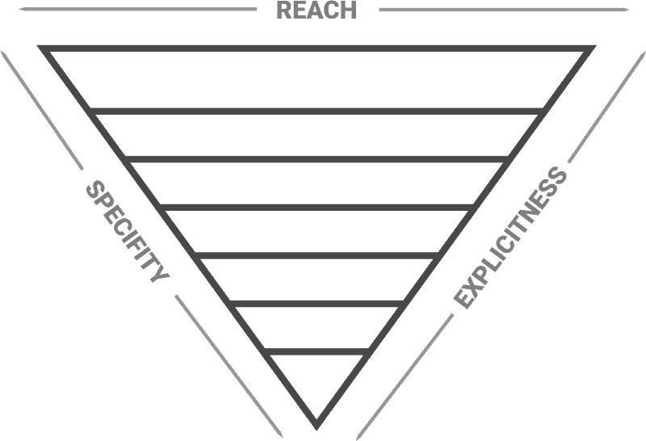

# 倒三角架构:如何管理大型 CSS 项目

> 原文：<https://www.freecodecamp.org/news/managing-large-s-css-projects-using-the-inverted-triangle-architecture-3c03e4b1e6df/>

去找格鲁斯卡

# 倒三角架构:如何管理大型 CSS 项目


Initial Photo by [Brady Bellini](http://unsplash.com/photos/_hpk_92Crhs?utm_source=unsplash&utm_medium=referral&utm_content=creditCopyText) on [Unsplash](https://unsplash.com/?utm_source=unsplash&utm_medium=referral&utm_content=creditCopyText)

你被分配了一个小任务来修复一些小的风格问题。您已经找到了正确的 CSS 规则来应用修复，所以您很快地将这些规则放在 CSS 文件的底部，推动您的更改，然后继续处理更重要的内容。

随着时间的推移，这种情况会发生几次，在你知道之前，你的 CSS 文件的“底部”由几百行代码组成，没有人理解，也没有人敢删除，因为这将不可避免地破坏东西。

你认识到这种情况是因为你自己做过或者你看到同事做过吗？好吧，继续读下去，并向自己保证你再也不会这样做了，因为这里有一个更简单的方法来管理你的 CSS 文件。

### 介绍倒三角形架构

倒三角形架构，也称为 ITCSS，是一种以最有效和最少浪费的方式构建 CSS 的方法。

ITCSS 是由 Harry Roberts 首先提出的，它可以通过一个上下颠倒的分层三角形得到最好的可视化。ITCSS 以一种合理的方式定义了项目的共享 CSS 规则，同时也提供了一个可靠的封装和解耦级别，防止非共享的 CSS 规则相互干扰。

ITCSS 非常灵活，因为它不强迫您使用任何特定的命名约定方法，如 SMACCS、OOCSS 或 BEM。



### 原则

ITCSS 的工作原理是根据以下三个原则构建整个 CSS 项目:

1.  **通用到显式**
    我们从最通用、最低级、包罗万象的风格开始。这可能是字体设置，或者，举例来说，如果你使用 SCSS 的颜色变量。
2.  **低到高特异性**
    最低特异性选择器出现在项目的开始。特异性稳步增加。通过这种方式，我们使用`!important`避免了特异性冲突和特异性覆盖。
3.  在我们项目的开始，深远的本地化
    选择器影响了很多 DOM 元素，例如你的浏览器重置样式，而在我们项目的后期，选择器变得非常本地化，例如一个组件的特定样式。

### 三角形层

坚持上述原则意味着我们必须将 CSS 分成不同的层次。每一层都必须在符合每一个标准的位置引入。

经常发生的情况是，CSS 按例如印刷样式、表单样式和特定组件的样式进行分组。这些组通常不是以最有效的顺序导入的，这就产生了一些继承或特性问题。

在 ITCSS 中，每一层都是上一层的逻辑发展。它增加了特异性，缩小了范围，变得更加明确。这意味着我们的 CSS 更容易扩展，因为我们只是添加已经存在的内容，而不是覆盖以前编写的内容。

遵循这种结构的另一个很大的好处是，每个人都知道在哪里可以找到特定的 CSS 规则，因为它们被逻辑地放置。这避免了人们将 CSS 规则放在文件底部的问题。

ITCSS 的创造者哈里·罗伯茨(Harry Roberts)布置了七层。他命令他们如下:

1.  如果你正在使用 SCSS 这样的预处理器，这是你的起点。在这一层你定义你的变量。
2.  **工具**
    这一层可以用于你的工装。想想需要全球可用的 mixins 和函数。如果不需要，就把它们放在需要它们的层上。
3.  **通用**
    在这一层，我们的房子都是非常高级的、影响深远的风格。这一层在所有项目中通常是相同的，因为它包含 Normalize.css、css 重置和盒子大小规则等内容。
4.  元素
    在这一层，我们为裸露的、未分类的 HTML 元素设置样式。例如，你可以考虑光标悬停时的下划线或者不同标题的字体大小。
5.  **对象**
    在对象层我们对第一个有类的元素进行样式化。想想你的容器、包装或行。您也可以在这里定义您的网格。
6.  组件层是大部分设计魔术发生的地方，因为你将在这里设计你的 UI 元素。在 Angular、Vue 或 React 等基于组件的框架中，如果您没有将它们直接包含在您的组件中，这是您为每个组件导入样式的层。
7.  **王牌**王牌层就是脏层。例如，即使在根据 ITCSS 原则构建了您的样式之后，您也可能不得不使用`!important`来覆盖一些第三方样式。在这一层这样做，因为这是最具体，局部和明确的层。

### 最终结果

既然我已经解释了这些层，是时候看看一个简单的最终结果可能是什么样子了。

```
// settings@import "globals";@import "branding";
```

```
// tools@import "mixins";
```

```
// generic@import "normalize";
```

```
// elements@import "fonts";@import "form";
```

```
// objects@import "grid";@import "wrappers";
```

```
// components@import "header";@import "sidebar";@import "carousel";@import "card";
```

```
// trumps@import "overrides";
```

### 结论

就像 ITCSS 不会强迫你使用某种命名约定一样，它也不会强迫你使用所有的层。使用最适合您的层结构，同时保持通用到显式、低到高特异性和深远到本地化的 ITCSS 原则。

如果您注意到您必须覆盖样式，这几乎总是意味着您的结构是低效的。如果你想了解更多，我推荐你看这个视频:

### 在阿姆斯特丹找工作？

我在 Sytac 工作，是一名高级前端开发人员，我们正在寻找精通 Angular、React、Java 或 Scala 的中级/高级开发人员。Sytac 是荷兰一家雄心勃勃的咨询公司，为银行、航空、政府和零售部门的许多知名公司工作。

如果你认为自己具备与最优秀的人共事的条件，请给我发电子邮件，地址是:luuk[dot]gru ijs[at]sytac[dot]io，我很乐意告诉你更多。