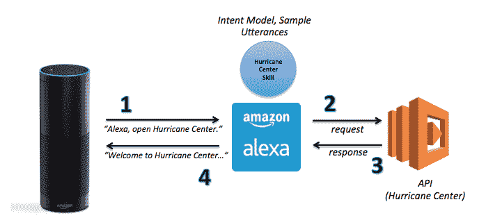
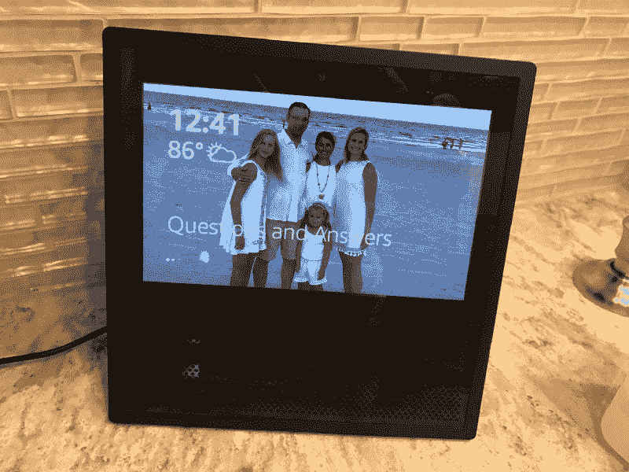
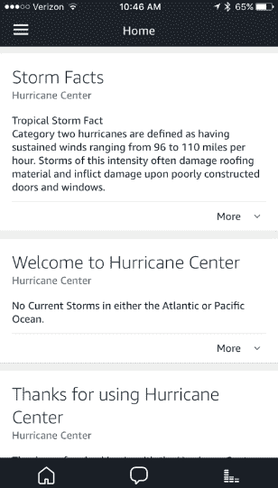
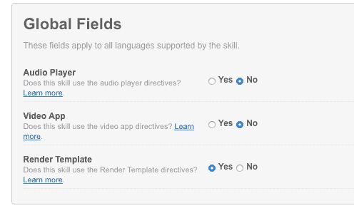

# 如何为亚马逊的 Echo Show 设计和编码 Alexa 技能

> 原文：<https://www.freecodecamp.org/news/how-to-design-and-code-alexa-skills-for-amazons-echo-show-c5716da8fee5/>

特伦·彼得森

# 如何为亚马逊的 Echo Show 设计和编码 Alexa 技能


Photo by [Scott Webb](http://unsplash.com/photos/DJ_kOgH5u0o?utm_source=unsplash&utm_medium=referral&utm_content=creditCopyText) on [Unsplash](https://unsplash.com/?utm_source=unsplash&utm_medium=referral&utm_content=creditCopyText)

我是一个[亚马逊 Alexa 开发者冠军](https://developer.amazon.com/alexa/champions/terren-peterson)，在 Alexa 平台上发表过十几个技巧。这包括获奖技能，如[飓风中心](https://read.acloud.guru/amazon-alexa-analytics-2355c359933b)、[寻宝游戏](https://devpost.com/software/scavenger-hunt-ebvrck)和[机器人萝茜](https://www.hackster.io/contests/alexa-raspberry-pi)。

加入亚马逊 Echo 家族的最新设备具有一个补充其音频体验的屏幕。叫做 Echo Show，[这里是硬件规格](https://www.amazon.com/dp/B01J24C0TI#tech)。它配有 7 英寸触摸屏显示器、500 万像素摄像头和两个 2 英寸立体声扬声器。

在这篇文章中，我将向您展示如何设计和编码一个新的 Alexa 技能，利用这个新的硬件。

### 软件平台的重大升级

这些硬件改进需要升级运行平台的底层软件。Alexa Skills Kit (ASK)推出了一个主要版本来增强新增的屏幕功能。这是自该平台推出以来对 ASK 最大的一次改进。

#### 技能培养的背景

如果你不熟悉开发 Alexa 应用程序——称为“技能”——这里有一个简单的概述。



*   自定义语音应用程序与自然语言处理引擎进行交互。它解释用户提供的音频命令。每个应用程序都包括一个定制的意图模型来指导技能信息。一组样本话语训练语音识别模型，该模型意图使用这些样本话语。
*   一个独特的 API 接收定制技能的所有消息。Alexa 要求在自定义语音应用程序中指定 RESTful 界面。技能作者写 API，选择托管平台。首选的托管平台是 AWS 服务 Lambda。这是因为亚马逊的安全模型非常兼容，而且托管成本很低。API 调用包含与设备进行的调用相关的一组标准属性。这包含当前技能调用的数据。

下面是一个请求飓风中心技能 API 的示例:

```
{  "session": {    "sessionId": "SessionId.5725be2d-99f8-4afd-909f-1f1d3882067a",    "application": {      "applicationId": "amzn1.echo-sdk-ams.app.709xxx"    },    "attributes": {},    "user": {      "userId": "amzn1.ask.account.AFP3xxx"    },    "new": true  },  "request": {    "type": "LaunchRequest",    "requestId": "EdwRequestId.260fd856-668f-4dd2-af9d-60d80e4cc8e0",    "locale": "en-US",    "timestamp": "2017-07-02T00:54:57Z"  },  "version": "1.0"}
```

自定义技能的 API 处理请求，并用 Alexa 设备的值进行响应。返回的消息模型是一组标准的属性，用 JSON 编写。设备上的 Alexa 语音读取 outputSpeech 属性。

下面是一个对应于上述呼叫飓风中心技能的示例:

```
{ “version”: “1.0”, “sessionAttributes”: {} “response”: {     “outputSpeech”: {         “type”: “PlainText”,         “text”: “Welcome to the Hurricane Center, the best source for information related to tropical storms, past or present. There are no active tropical storms right now, but if you would like to learn more about storms, please say something like tell me a storm fact.”     },     “card”: {         “content”: “No Current Storms in either the Atlantic or Pacific Ocean.”,         “title”: “Welcome to Hurricane Center”,         “type”: “Simple”     },     “reprompt”: {         “outputSpeech”: {             “type”: “PlainText”,             “text”: “Please tell me how I can help you by saying phrases like, list storm names or storm history for 2013.”         }     }, }, “shouldEndSession”: false }}
```

### 回声秀有什么变化？

为了利用该节目的新的视觉特征，用于响应的模型被扩展。该型号现在包括新的属性，以使用新的硬件功能。为该技能定制的 API 在其响应中包含这些属性。

支持屏幕不同用例的新模板是它的核心。这些模板使节目能够增强声音体验。关于这些变化的全部细节可以在亚马逊开发者网站上找到。



#### 六个可视模板可供选择

新 ASK 首次发布时提供了六个模板。每个模板都提供了在 Echo Show 上利用触摸屏的能力。有两种类型的模板。其中四个模板提供了屏幕的基本用法，另外两个模板增加了管理数据列表的能力。技能开发人员为每个用例选择最适用的模板。

#### 回声显示支持基本的 HTML 标记

在这些变化之前，Alexa 平台已经有了一个可视化选项。这是与配对的设备上的移动应用程序中的一个应用程序，名为配套应用程序。这通过与设备配对来执行初始设置和配置。一些技能使用它来补充语音优先用户体验。这是飓风中心的样子。



配套应用程序在呈现信息的方式上有局限性。屏幕上的所有文字都是纯文本。它不支持 HTML，包括改变字体类型，字体大小，下划线等。

一个可选的小图像显示在屏幕上，随着每个语音响应而变化。由于明文限制，当渲染大量数据时，应用程序的可用性很差。当呈现对技能叙述很重要的数据列表时，可用性也很差。

在新 ASK 的模板中，现在支持简单文本和基本 HTML 语法。将它与列表模板结合起来，可以提供全新级别的用户体验。

#### 处理触摸事件的新意图

Echo Show 上的屏幕不仅仅充当显示器，它还具有触摸传感器。与屏幕的互动产生了带有声音的事件。这些按钮包括后退按钮、右按钮、左按钮等。因为用户可以对屏幕上的文本和列表做手势。

该设备处理大多数新的标准意图。在绘制列表时，它们可以融入你的技能中。

### 现有技能在新设备上发挥作用

平台上的所有 15，000 个现有技能都与 Echo Show 一起工作。他们将使用当前在配套应用程序上呈现的信息。这是一个飓风中心技能的例子。

这种技术是可行的，但是由于字体太大，屏幕的可用性很差。屏幕显示与配套应用程序共享的相同信息。如果没有修改，它就不会使用模板，所以如果用户想要阅读全文，就不会启用滚动。

作为参考，这里是 GitHub repo，它包含了这项技能的全部源代码。

[**特伦彼得森/飓风**](https://github.com/terrenjpeterson/hurricane)
[*Alexa 提供飓风更新的技能*github.com](https://github.com/terrenjpeterson/hurricane)

### 极致改头换面——回声秀版

下面是利用 ASK 中的新功能所需的步骤。这些变化将利用回声显示用户的硬件能力。

#### 步骤 1 —激活技能的模板功能

激活某项技能需要选择新技能或现有技能上的单选按钮。有一个新的指标“渲染模板”。一旦它被设置，技能现在可以利用回声表演的额外能力。



#### 步骤 2 —选择一个模板，然后向 API 响应添加属性

ASK 现在包含概述 Echo Show 支持的视觉模式的模板。这些映射到不同的 UI 模式，包括显示图像和列表。亚马逊开发者网站上有很好的参考文档。

对于我的飓风中心技能，我选择将“BodyTemplate1”用于主显示。这利用了在节目中显示背景图像的能力。它还为文本响应提供了改进的用户体验。下面是现有 JSON 响应中包含的新属性。

```
directives: [ {   type: “Display.RenderTemplate”,   template: {       type: “BodyTemplate1”,       token: “T123”,       backButton: “HIDDEN”,       backgroundImage: {           contentDescription: “StormPhoto”,           sources: [               {                  url: “https://s3.amazonaws.com/hurricane-data/hurricaneBackground.png”               }           ]      },      title: “Hurricane Center”,      textContent: {          primaryText: {              text: cardInfo,              type: “PlainText”          }      }  }}],
```

使用的背景图像与 Echo Show 的尺寸相匹配——1024 x 600 像素。托管图像遵循与配套应用程序相同的模式。图像对象需要无需任何身份验证即可从互联网上访问。

#### 步骤 3-发布技能的新版本

渲染模板改变了技能，需要再次通过认证过程。它不需要为新设备发布单独的技能。这意味着所有以前的评级和用户已启用其帐户将结转。在其他设备上测试技能，以确保没有任何问题。

### 技能的新版本

下面是飓风技能完成上述工作后的样子。

照片现在显示为背景图像，而不是默认画布。用于配套应用程序的文本呈现在回显屏幕上。字体大小合适，格式可读。这是可用性方面的一个重大改进，无需在编码方面做太多努力。

### 向后兼容所有设备

鉴于 Echo Show 是新的，我们希望该技术继续为现有设备工作。在 API 中格式化响应时，这需要一点额外的逻辑。接口契约要求 API 只提供设备可读的属性。这意味着用于 Echo Show 的额外属性在发送到早期的 Echo 时会产生错误。

停止此错误需要解释本机请求对象的上下文部分。本节提供有关设备的信息，包括设备是否包含显示器。该属性仅在回声显示中出现。如果该属性不存在，API 将排除指令属性。下面是一个回声节目生成的飓风中心技能请求的示例。

```
“context”: {     “AudioPlayer”: {         “playerActivity”: “STOPPED”     },     “Display”: {         “token”: “T123”     },     “System”: {         “application”: {             “applicationId”: “amzn1.echo-sdk-ams.app.709xxx”         },         “user”: { “userId”: “amzn1.ask.account.AFP3xxx” },         “device”: {             “deviceId”: “amzn1.ask.device.AFAQxxx”,            “supportedInterfaces”: {                 “AudioPlayer”: {},                 “Display”: {                     “templateVersion”: “1.0”,                     “markupVersion”: “1.0”                 },             “VideoApp”: {}         }     },}
```

在上面的示例中，system . device . supported interfaces . display 属性存在，表明请求是由 Echo Show 发起的。这是由回声点产生的相同技能的请求。

```
“context”: {     “AudioPlayer”: {        “playerActivity”: “IDLE”     },     “System”: {         “application”: {            “applicationId”: “amzn1.echo-sdk-ams.app.709xxx”         },         “user”: { “userId”: “amzn1.ask.account.AFP3xxx” },         “device”: {             “deviceId”: “amzn1.ask.device.AFAQxxx”,             “supportedInterfaces”: {                 “AudioPlayer”: {}             }         },         “apiEndpoint”: “https://api.amazonalexa.com”     } }
```

在第二个示例中，没有显示属性。这很容易识别，现在也反映在我的技能上。

### 下一步是什么？

平台成长的速度令人惊叹。现在有 15，000 种自定义技能可供用户试用。硬件选项支持更深入的用户体验。我将在接下来的几个月里把我的技能移植到新的平台上。希望这有助于更新你的！