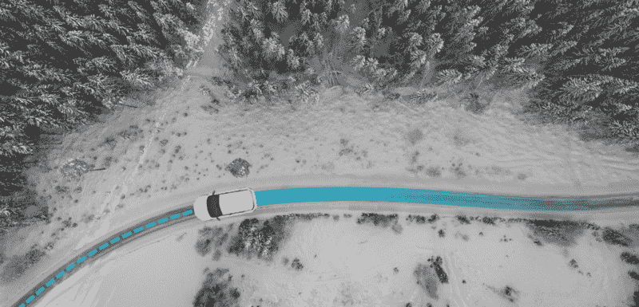
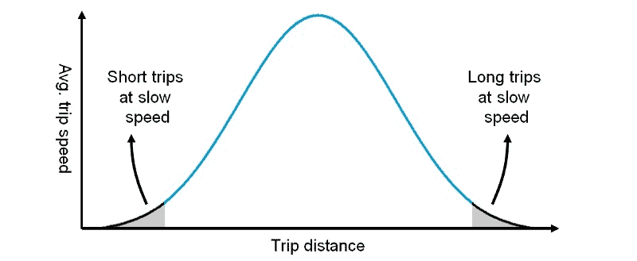
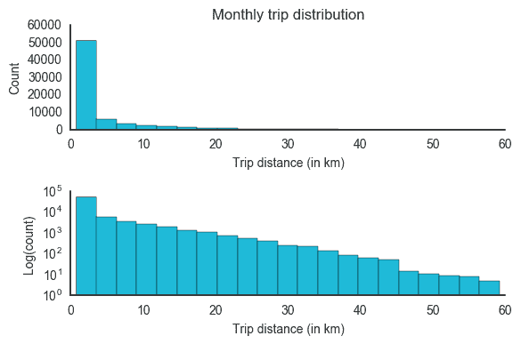
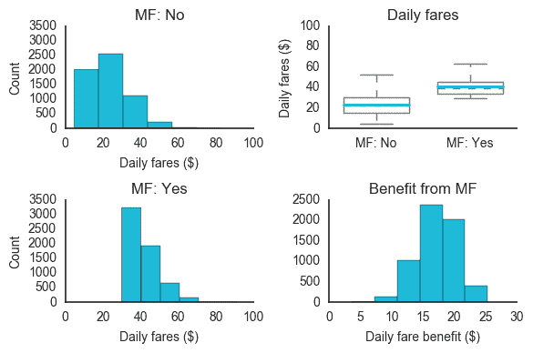
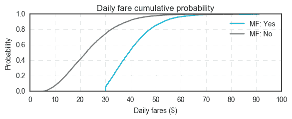
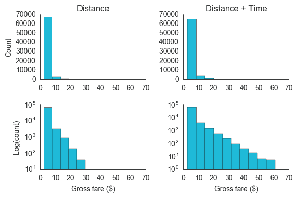
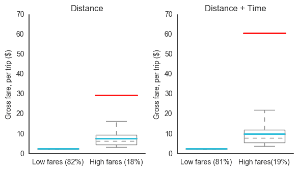
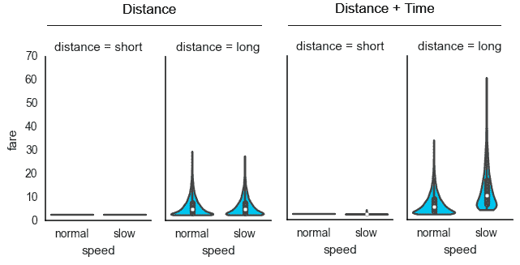
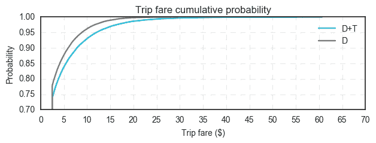

# 优步最低票价和计时收费的目的

> 原文：<https://www.freecodecamp.org/news/hedging-both-ends-of-the-rideshare-trip-curve-with-minimum-fares-and-time-charges-8adec25a614d/>

伊格纳西奥·沙巴里亚

# 优步最低票价和计时收费的目的

拉丁美洲领先的非出租车拼车公司优步和 Cabify 都收取最低票价。只有优步实行了计时收费。

在运行了 72，000 次旅行的模拟后，我们能够观察选择加入或退出功能的财务影响，我们将这些功能视为对冲*合作伙伴-驱动程序风险曲线*两端的有价值工具。

#### 合作伙伴-驱动因素风险曲线

让我们假设 XYZ 公司只按公里和基本票价收费，在哥伦比亚称为 *banderazo* ，在巴西称为 *bandeirada* 。顺便说一下，*、*、**基本票价是[不是最低票价的](https://www.quora.com/What-is-the-difference-between-Ubers-base-and-minimum-fare)。**

对于使用 XYZ 公司应用程序的司机来说，所有的行程并不平等。下图显示了当只按距离收费时，司机的风险在不同的行程长度和速度下是如何变化的。该图假设旅行的所有其他因素都是相同的。

As you move right across the X-axis, the distance of trips gets longer. Moving up the Y-axis means that cars are moving at higher average speeds. Drivers’ risk for Company XYZ increases in the opposite direction relative to average trip speed. This is because drivers spend more time on trips without charging for it. This graph is not meant to imply that trips follow a Gaussian distribution. Trips likely follow a right-skewed, Pareto-like distribution, as shown in the simulation below.

如上所示，XYZ 公司的司机可能不喜欢以低速行驶的短途旅行(由于交通拥挤、客户停车或其他原因)，尤其是以低速行驶的长途旅行(尤其是 T2)。低速长途旅行给 XYZ 公司的司机带来了更高的风险，迫使他们承担交通时间的机会成本(和汽油费用)。**司机不计时收费的时候，这个*尾部风险*直接放在他们身上。**

#### 模拟 kaneville 的拼车旅行

在本研究的剩余部分，我们将使用在一个月内从一个名为 Kanyeville(是的，以 Yeezy 命名)的虚拟市场运行的模拟中获得的数据。

模拟在以下假设下运行:

*   出行距离服从右偏分布
*   平均行程距离等于 4 公里
*   20%的出行平均速度为 5 公里/小时，而 80%的出行平均速度为 40 公里/小时
*   克维尔的每家拼车公司(当地人如何称呼它)平均每天有 200 名活跃司机。每家公司的每位司机平均每天出行 12 次，每月共计 72，000 次。

Data generated using [SciPy](https://www.scipy.org/)

第一张图以正常比例显示了按距离划分的出行分布。第二个使用对数刻度来增加曲线尾部的可见性。在对数图中，尾部的高方差表明**长途旅行，即那些高于平均旅行距离(MTD)的旅行，可能变化很大。**在这个样本中，驾驶员的行程长达 60 公里。

在这项研究中，我们分析了影响曲线不同端点的两个定价特征。**最低票价增加了曲线前端的货币化**(发现短途旅行的地方，这意味着 MTD 下的旅行占总旅行的大约 80%)。**时间费用对曲线的尾部**有最大的正面影响，在那里发现了更长的行程。

当然，计时收费会影响所有的旅行。任何坐过车的人都知道开车过几个街区遇到交通堵塞和在高速公路上遇到交通堵塞的区别。现在想象一下，你是一名拼车司机，只按路程付费。我们还将衡量这种差异对司机的经济意义。

### 最低票价的影响

为了衡量最低票价的影响，以下脚本模拟了司机在一个月内的票价值，包括最低票价(MF)和不包括最低票价:

模拟结果如下图所示。从不同角度比较每日总票价。每种情况假设费用为 0.50 美元/公里，最低票价为 2.50 美元:

左边的图比较了每日票价的频率分布。最低票价从曲线的前端向更高的值移动。右上方图表中的缺口显示了**的平均每日费用是**的近两倍，因为收取了最低费用。最后，右下角的图显示了最低票价带来的每日收益，以美元计。它显示了**平均每位驾驶员的日收益约为 17 美元**。需要说明的是，这些都是每日总票价的数值，并没有根据公司佣金进行调整。

就累积概率而言，下图比较了有最低票价和无最低票价情况下的每日票价值曲线:

最低票价的好处再一次非常明显。近 50%的 Kanyeville 司机在收取最低票价时，总票价超过 40 美元/天。不收取最低票价的司机中，只有 10%的人每天收入超过 40 美元。

这些结果为最低票价提供了很好的论据。这可能是最低票价如此普遍的原因。但是按分钟收费的影响呢？我们将在下一节中讨论这一点。

#### 时间收费的影响

为了衡量按秒计费的影响，下面的脚本运行来模拟每位司机一个月的个人行程费用，包括和不包括时间计费:

*注意:在本节中，我们假设在 Kanyeville 有两家 rideshare 公司:公司 U 和公司 c。它们定价结构的唯一区别是前者的时间费用为 0.05 美元/分钟。*

模拟结果如下图所示。这两家公司对个人旅行费用进行了比较。一家公司只按距离收费(0.50 美元/公里)，另一家公司按距离和时间收费(0.50 美元/公里和 0.05 美元/分钟):

Top left: Shows trip-fare frequency distribution when companies charge by distance only. Top right: Shows the trip-fare frequency distribution when companies charge by both distance and time. Bottom left: Same as top left graph, but on a log scale. Bottom right: Same as top right graph, but on a log scale.

在上图中，第一行比较了两家公司的出行费用频率分布。一家公司只对旅程的距离收费(左上)。另一家公司对距离和时间都收费(右上)。第二行使用对数刻度来增加两条曲线尾部的可见性。

为什么要记录结果？因为在正常比例下，两种分布看起来相似(大多数票价出现在曲线的前面)。在对数尺度上，时间电荷的影响要明显得多。越长的尾巴表明越多的高票价旅行。值得注意的是**对于该图中所示的公司，平均票价值分别为 3.50 美元和 4.00 美元。这表明平均票价增加了 14%。**

下图将两种定价模型中的低票价出行和高票价出行分开，以考察平均和最高票价的变化。

**时间收费**对低票价旅行(低于平均水平的旅行)几乎没有影响，平均票价只增加了大约 1%。然而，时间收费**在高票价旅行中发挥了至关重要的作用，它将平均票价提高了 31%，最高票价翻了一番。**

此外，以下 violin 图按照价格结构、行程距离和行程速度对数据进行了划分:

不出所料，平均速度较慢的长途旅行在增加时间费用后，票价涨幅最大——超过一倍。在这个模拟中，每月 41，000 美元的总费用中，**有 66%来自漫长而缓慢的旅行。这些只发生在 5%的时间里。**

票价增加的频率可以简单概括如下:

*   60%的时间里没有加价
*   有 15%的时间平均票价上涨 4%
*   有 20%的时间平均票价上涨 14%
*   有 5%的时间平均票价上涨 119%

在下面的累积概率图中可以更好地观察到票价上涨的可能性:

骑手体验基本保持不变。只有极少数情况下(5%的情况下)价格会大幅上涨。**然而，对于司机来说，当提价开始生效时，它就成了一种对冲。**提价有效降低了交通拥堵和/或乘客停车对司机日常收入的影响。

本质上，当拼车公司在其定价模型中加入时间费用时，它就包含了长尾事件。这包括在交通繁忙时的长途旅行，这通常对司机有利(他们在车费中占更大比例)**。**只按距离收费的公司在这些事件面前仍然很脆弱。长尾事件风险完全转移到了司机身上，他们不得不承担额外的成本——如汽油、时间的机会成本以及汽车的磨损——而没有任何额外的收入。

当然，第二家公司可能会辩称，他们故意偏袒骑手，让司机承担尾部风险。但人们必须怀疑这是否真的是可持续的。毕竟**骑手和司机对其公司**运营的影响是不对称的。

量化这种不对称的一个好方法是观察拼车公司将为新乘客和司机支付的明显差异。例如，一些公司会*向竞争对手的司机砸*现金，让他们试用他们的应用程序——我见过出价高达 500 美元/司机的——但是，**有人给过一个骑手这么高的价格吗？**

我从未见过新骑手出价超过 25 美元。但假设出价 50 美元。这个数字仍然是车手的 10 倍。考虑到这一点，**对于拼车公司来说，通过将尾部风险转移给乘客来保护他们的高价值用户——司机——是有意义的。**

感谢阅读！如果你喜欢这篇文章，按住？按钮，以帮助传播这个词。

你可以在我的 [Github](https://github.com/ignaciochr/rideshare-pricing/blob/master/trip-simulations.ipynb) 上找到代码库。使用它来运行您自己的定价模拟！

如果你对自己的分析有任何疑问，或者想在未来的文章中合作，或者只是想说声“嗨”，请在 [Twitter](https://twitter.com/ignacio_chr) 和/或 [LinkedIn](https://www.linkedin.com/in/ignacio-chavarria-19a3a420/) 上联系我。