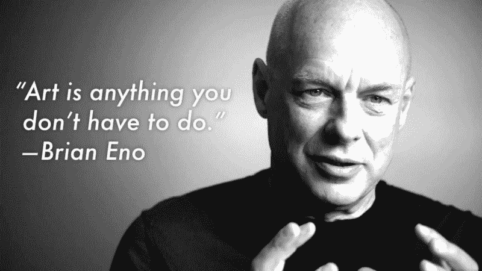

# 情感设计的必要崛起

> 原文：<https://www.freecodecamp.org/news/the-necessary-rise-of-emotional-design-ada82f247725/>

乔丹·哈珀

Airpods: Apple’s best product since the iPad? (credit: Apple.com)

# 情感设计的必要崛起

在过去的六个月里，我读过的关于未来展望的最好的文章之一是杰森·卡拉卡尼斯的提议，他认为 Airpods 是苹果自 iPad 以来最好的产品。你应该读读它(显然，一旦你读完了这篇文章)，但要注意:在一个人工智能和对话界面可以像我们目前用短粗的小手指和触摸屏一样有效和无缝地执行任务的世界里，那么 Airpod(或类似的东西)就是我们今天使用屏幕执行大多数功能任务所需要的全部。

那个世界并不遥远。

谷歌的 Hector Ouilhet 发表了我在 SXSW Interactive 2017 上看到的最有趣的演讲之一，[对话式 UI 的未来](http://schedule.sxsw.com/2017/events/PP63102)。他设想在不久的将来，我们的语音助手——无论是由谷歌、亚马逊、苹果还是三星提供支持——都将足够聪明，能够从过去学习，凭直觉了解我们的需求，并开始定期为我们做事情，而不仅仅是为我们提供信息。

“好吧，谷歌，我被邀请明年在 SXSW 演讲。”

太好了，我要不要订和去年一样的机票和酒店

“那太好了。”

太好了，我马上就把登机牌和您的预订信息发给您。当你到达时，我还会为你叫一辆出租车，并在你去年喜欢的那个烧烤店订一张桌子。好听吗？”

对我来说听起来很棒。如果这对于这些服务的发展速度来说似乎是一个遥远或牵强的预测，请记住 [Dator 的第二定律](http://www.futures.hawaii.edu/publications/futures-studies/WhatFSis1995.pdf):

> 任何关于未来的有用想法都应该显得可笑。

#### 为人类而设计

因此，让*功能性*设计变得智能、无缝和无屏幕是一件大事，它可能会改变我们与技术互动的方式——功能性设计的执行将在很大程度上远离屏幕以及语言和对话之外的任何形式的人类互动。

在天平的另一端，我们的设计需要人类的关注和参与来传递快乐和满足，通常没有强制的目的或最终结果。或者给它起个俗名:游戏设计。

行为设计专家周玉凯在 SXSW 2017 上做了另一个我最喜欢的演讲，解释了他的[可操作游戏化](http://yukaichou.com/gamification-book-3/)理论:一个详细的框架，可以用来分析我们人类互动的任何东西所使用的游戏化技术，无论是应用程序、社交网络、游戏，甚至是营销活动。

游戏设计师是周所说的“以人为本的设计”的大师，也就是说，设计体验来满足人脑。虽然游戏化经常被用作一种机制，试图让枯燥的体验变得更有粘性，但成功的游戏设计始于让我们的神经元兴奋的游戏机制，而不是对特别有形的最终结果的承诺。

#### 功能与情感设计

因此，在不久的将来，我们很可能会看到“数字设计”学科被一分为二:一方面，[计算设计师](https://www.wired.com/2017/03/john-maeda-want-survive-design-better-learn-code/)创造个性化的、对话式的和适应性强的功能设计框架，通过利用对话式用户界面和人工智能的发展，让我们的生活变得更轻松、更轻松。

另一方面:我们在屏幕上互动的任何东西，或者旨在吸引注意力和参与的东西，都需要设计得更像一个游戏或艺术装置，而不是功能性的用户体验。

#### 艺术与设计

就在我写完这篇文章的时候，我碰巧听到了亚当·巴克斯顿精彩播客中的一集，其中他采访了布赖恩·伊诺。

对话向一个迷人的方向漂移，我们发现我们的英雄在谈论为什么艺术是重要的(相对于科学或更经典的“生产性”活动)。

*Photograph by [Alfred Dunhill](https://www.youtube.com/watch?v=5mqtc2Z3K8o)*

Eno 告诉我们，他已经开始将艺术定义为任何你不需要做的事情，艺术可以被认为是我们生活中从事非功能性风格化的任何领域——从交响乐和塞尚，到蛋糕装饰和有趣的行走方式。他还认为，艺术和这些“非功能性”活动为我们作为一个物种的有价值的目的服务:我们知道儿童主要通过玩耍学习，这是他们理解世界的方式，随着我们长大，我们通过艺术玩耍。

无论你称之为艺术、应用创意、游戏还是情感设计，创造满足和刺激人类大脑的体验是最有效的学习、教学方式，借用玛丽·近藤的一句话，激发我们生活中的快乐。

随着对话界面、越来越多的自动化和人工智能结合起来，帮助我们比以往任何时候都更无缝、更高效地满足功能需求，为人类设计将越来越像艺术。

有趣的是，在十年或更长时间的交互设计转向可用性、功能性用户体验和优化速度和简单性的旅程后，这可能是艺术家创造情感共鸣、有趣和游戏般体验的天赋，这可能是不久的将来为屏幕设计的最重要的东西。

谢谢你花时间阅读我的随想。如果你喜欢，请推荐、分享、在 twitter 上给我打电话[,或者如果你想让对话继续下去，请回复！](https://twitter.com/jordanharper)