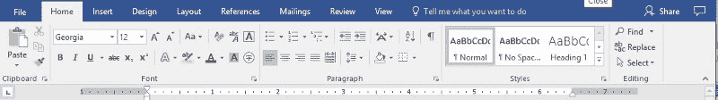
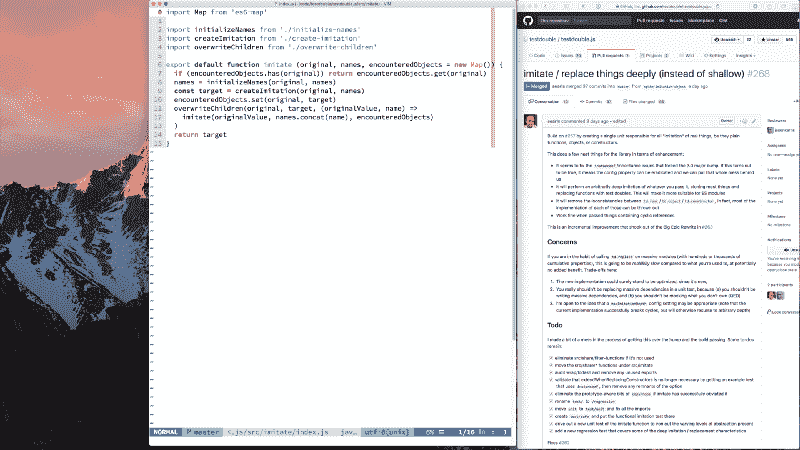
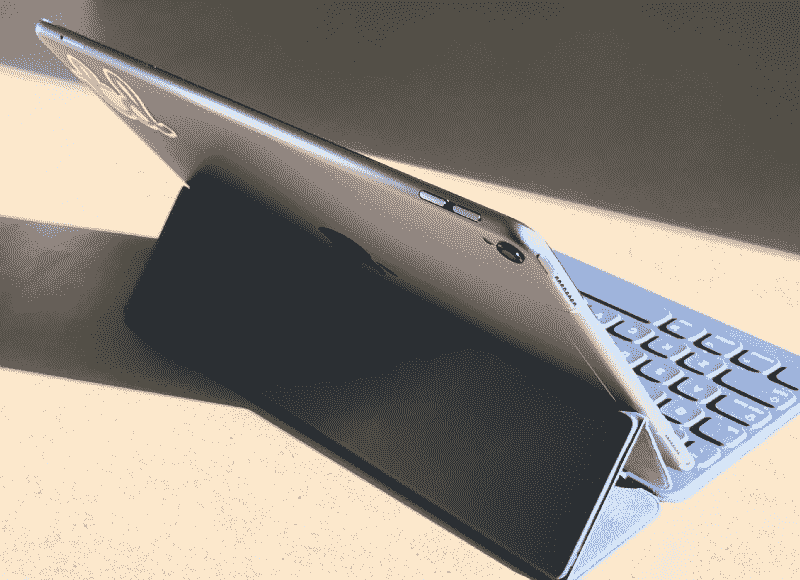
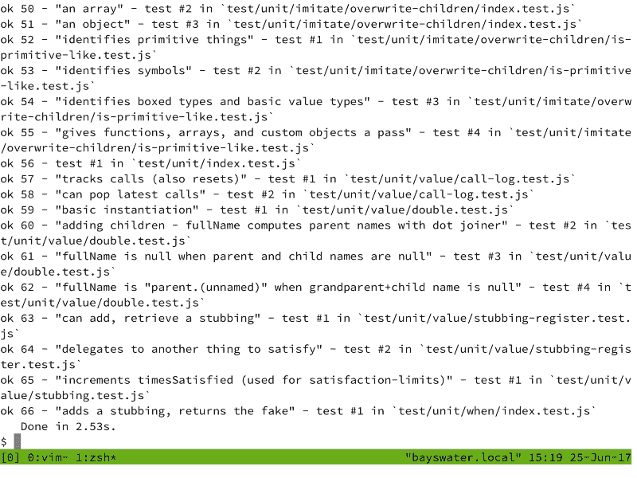
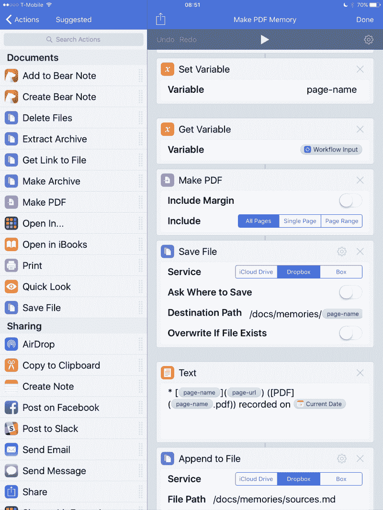

# 给 iPad 一份全职工作

> 原文：<https://www.freecodecamp.org/news/giving-the-ipad-a-full-time-job-3ae2440e1810/>

贾斯汀·瑟尔斯

# 给 iPad 一份全职工作

*【中文*有这篇文章的翻译

程序员经常用“强大”、“功能丰富”和“高度可配置”这样的形容词来描述他们的理想工具。很少有用户比程序员更希望从他们的电脑中得到更多。

这种流行的观点与我们的直觉一致，即更多的能力必然会产生更高的生产力。然而，我的生活经验表明，虽然能力是生产力的先决条件，但两者几乎没有线性关系。十几种方法做同样的事情只会导致浪费时间[分析瘫痪](https://en.m.wikipedia.org/wiki/Analysis_paralysis)。包含各种功能以满足所有可能需求的应用程序将慢慢挤掉该工具的主要用途。我喜欢调整的每一个额外的配置选项都是系统中的另一个 if-else 分支，要求其开发人员多测试少更改，减缓了创新的步伐。

Mistakenly conflating capability and productivity is the reason why Microsoft started calling itself a “productivity” company

因此，我对生产率有了更微妙的看法:摩擦和专注之间的微妙平衡。“摩擦”是为了工作而必须转动工具上的旋钮。“专注”是有意地忽略工具上的旋钮，以培养清晰的思维。任何知识工作者都必须用深思熟虑的注意力来平衡他们自己的创造性行为，每一个软件界面都是试图达到这种平衡的结晶。

除了一款型号的 iPhone，我几乎都拥有了，但我没有做什么来庆祝我们的 10 周年纪念日。iPhone 在无数方面改变了我的生活，但它最大的长期影响是让我的自省和创造力变得迟钝。我已经厌倦了无聊，一有空闲就看新闻。我为自己安排了一个拉刷新斯金纳盒动物园，这严重影响了我的大脑如何调节多巴胺。偶尔我会努力集中注意力，一个通知不可避免地会通过仅仅 10 秒钟的上下文切换偷走我几分钟的注意力。如果不承认自 2007 年以来我们的工具和大脑发生了多大的变化，就很难严肃地讨论生产力。

有一段时间，我认为在台式电脑上工作将继续为这个分散注意力的时代提供庇护，但后来苹果将所有的乐趣带回了 Mac。虽然有可能选择退出许多让 Mac 变得不那么高效的东西，但我不能否认，根本问题是我无论去哪里都带着 iPhone 的经历已经深刻地改变了*我*。

这里有一个令人沮丧的例子。桌面操作系统的窗口特性曾经代表着净生产力的提升——我可以一次看到两件事情，在它们之间拖动，用更少的时间做更多的事情。但在后 iPhone 时代的某个时候，这种情况不复存在了。原因如下:仅仅是屏幕角落没有任何窗口*就会促使我的大脑思考*如果我输入`⌘-Space "tw"`，我可以让 Tweetbot 填充我桌面/灵魂左侧的空白*。每一次，就好像我进入了某种神游状态，30 分钟过去了，我什么也没做，留下一堆打开的浏览器标签，由于感觉被 Twitter 上不友善的 rando 敌视，我的心率加快。*

*

2007 Justin would see an editor and a browser, but 2017 Justin can only see unutilized space that could be occupied by Twitter, Mail, or Slack* 

*像许多人一样，这些年来，我满怀希望地购买了几台 iPads，心想“也许这次会有所不同。”每一次，它都不能让我做真正的工作。我很高兴地报告，最近的这一尝试终于成功了。*

*我已经用了 4 周的工作专用 iPad(10.5 英寸 iPad Pro 一上市就换成了)，我完成了比平时多得多的有意义的工作——包括编码。我最担心的是，我那些更贵的苹果电脑开始积灰了。*

*这是一篇很长的文章，但那是因为我不仅用 iPad 解决了一个简单的工具问题，我还用它解决了一个心理问题。我发现没有办法有效地区分我们的软件工具和我们的思维过程:两者相互影响。所以，是的，对我来说，列出我正在使用的工具以及它们为什么如此伟大是很容易的(我们一会儿就把它们去掉)。但是我也希望通过思考我更广泛的动机，你也可以质疑你自己的一些先入之见。*

### *快速概览*

*如果你正在阅读这篇文章，你可能正在寻找一些关于我使用哪些应用程序做什么以及它是否有效的概要。以下是我一整天都在用 iPad 工作的简要总结:*

#### *我在做什么*

*   *我目前正在使用苹果的全套设备:10.5 英寸 iPad Pro、AirPods、Apple Pencil 和智能键盘*
*   *10.5 英寸的 iPad 是一款令人惊叹的硬件。即使在阳光直射下，这种展示也令人难以置信。UI 的性能一般与高端 MacBook Pro 一样好，甚至更好。它轻得惊人。任何其他高端平板电脑在这个东西旁边都是一个字面上的笑话*
*   *我每天在 iPad 上写几个小时的代码，现在比在 Mac 上快多了*
*   *我发现，几乎任何难以完成的任务都可以通过优秀的(最近被苹果收购的) [Workflow](https://workflow.is) 应用程序在某种程度上实现自动化，所以一旦我意识到某个动作比必要的更笨拙，我就会非常积极地创建自动化的工作流程*
*   *当我需要阅读一篇文章或思考我的方法时，我会卸下键盘，拿着铅笔向后靠。每一次，它都给我极大的精神能量提升，尤其是与整天弓着身子盯着屏幕相比*
*   *我非常虔诚地坚持使用苹果所谓的“股票”应用程序，并发现保持日历、邮件、提醒、笔记等的统一战线往往会润滑我的设备、Siri、iCloud 和应用程序本身之间的交互。它们绝不是完美的，但第三方替代应用程序需要非常出色，才能弥补协同效应的损失。关于这一点，Seth Clifford 概述了与我自己想法相似的推理*
*   *我也做很多管理类的事情，所以除了花很多时间在上面提到的股票和 iWork 应用程序上，我还经常使用 [Zoom](https://zoom.us) 、 [Expensify](https://www.expensify.com) 、 [Pipedrive](https://www.pipedrive.com/en/welcomeback) 、 [MindNode](https://mindnode.com) 、 [Nebo](https://www.google.com/url?sa=t&rct=j&q=&esrc=s&source=web&cd=1&ved=0ahUKEwjJ68Lc6dnUAhUh6YMKHZn7CrUQFggoMAA&url=http%3A%2F%2Fwww.myscript.com%2Fnebo%2F&usg=AFQjCNETyEMNhR3cftXSqVuFmH3YBMANDA) 、 [Paper](https://www.google.com/url?sa=t&rct=j&q=&esrc=s&source=web&cd=3&ved=0ahUKEwjzpO3l6dnUAhUL1oMKHeG2D4kQFgg4MAI&url=https%3A%2F%2Fitunes.apple.com%2Fus%2Fapp%2Fpaper-by-fiftythree-sketch-diagram-take-notes%2Fid506003812%3Fmt%3D8&usg=AFQjCNHBHi0t4_Df93TZlQfGofhEFbEyyA) 和(叹气) [Slack](https://slack.com)*

#### *我为什么这么做*

*   *正如我上面提到的，当我拥有一个成熟的窗口系统时，我不再相信自己不会陷入分心的状态。我已经发现，默认全屏应用和勿扰模式的结合帮助我抑制了不断查看 Slack、Mail 和 Twitter 的冲动*
*   *我的旅行很轻便(我会带着一个 19 升的包和不到 10 磅重的东西(T2)旅行几个星期)，所以一个 1lb 的 iPad 比一个 2lb 的 MacBook 有两倍的吸引力(更不用说我的 4lb 15" MacBook Pro 了)*
*   *许多我最不喜欢的[单页网页应用](https://en.m.wikipedia.org/wiki/Single-page_application)都有相当不错的 iPad 应用，所以我没有发微博抱怨它们蹩脚的 JavaScript 有多糟糕，而是通过使用它们 iOS 应用更易访问的原生 UI 控件来减少摩擦*
*   *我已经“使用”Unix 十五年了，但从未认真过。当情况变得困难时——也许我不知道搜索某样东西的特定方法，或者也许我需要移动大块的代码——我会立即求助于熟悉的图形应用程序。使用 command-tab 切换到 Atom 或 Gitx 的能力使我能够推迟解决如何有效地使用 Unix 工具链的问题。在 iPad 上，我被迫 100%地从命令行完成工作，因此我终于花时间找出或定制了提高工作效率所需的东西*

#### *怎么样了*

*   *我真的很高兴 iOS 的绝大多数都可以只用键盘导航(从 iOS 9 开始就是这样，但 10 对它进行了细化，11 会走得更远)。当我需要触摸屏幕时，它实际上有点特殊，这有点傻*
*   *我没有预料到这一点，但当我在 iPad 和 iPhone 之间切换时，macOS 和 iOS 之间的任何摩擦都消失了。这是一个定性的观察，但应用程序几乎完全相同的事实意味着我在两个设备之间的上下文切换上浪费的时间很少*
*   *最新的 iPad Pro 是第一个支持通过 USB-C 快速充电的产品。我最初的(2015 年)iPad Pro 在连接到 80W USB-C 电源插头时几乎不会沾水，但最新型号的电池通过 USB-C 在 90 分钟内从 7%充电到 57%，即使在大量使用的情况下*

#### *我希望有人告诉我*

*   *我买了 LTE 型号，发现 T-Mobile 目前提供令人震惊的低价格**每月 10 美元**无限制数据计划，在后付费订阅中添加平板电脑线路(它还包括 2GB 的网络共享和无限制的 256kbps 国际数据)。这是一个很好的交易，不能错过，当我旅行时不用担心寻找 wi-fi 的解放是一个巨大的压力缓解*
*   *我建议使用 [1Blocker](https://1blocker.com) 来屏蔽广告、跟踪脚本和你容易分心的整个网站。我每天会尝试在 iPad 上访问 twitter-dot-com 十几次，结果都被 1Blocker 阻止了*
*   *我禁止几乎所有应用程序的通知(目前 Messages 和 FaceTime 除外)。我甚至不让 Mail & Slack 之类的应用程序显示徽章图标，因为当我用`⌘-Tab`切换应用程序时，红色徽章的出现会让我停下脚步，让我在查看它时无法做任何事情*
*   *一些单一用途的工具和扩展对我来说是必不可少的，包括 [Mail to Self](http://www.mailtoself.com/info) 、 [PiPifier](https://itunes.apple.com/us/app/pipifier-pip-for-every-web-video/id1234771095?mt=8) 、 [AnyFont](https://itunes.apple.com/us/app/anyfont/id821560738?mt=8) 和 [Deliveries](https://itunes.apple.com/us/app/deliveries-a-package-tracker/id290986013?mt=8)*
*   *有许多称职的散文编辑，但[熊](http://www.bear-writer.com)、[绰号](https://bywordapp.com)和[社论](http://omz-software.com/editorial/)是我的最爱*
*   *除了自动化 iOS 应用程序之外， [Workflow](https://workflow.is) 还可以通过 SSH 调用任意脚本，然后解析结果并处理它们。在抱怨了多年之后，我现在第一次有了一个[几乎全自动的 CRM 跟进系统](https://github.com/searls/icloud-dotfiles/commit/8d97def58b17d390e25b496a4a5765ad863e6cd3)*
*   *iOS 11 将会很棒，但如果你打算做点什么，我建议等到它更稳定的时候。虽然它增加了许多令人惊叹的“实际工作”功能，但很多讨论都是围绕着触摸手势进行的，如果你主要使用硬件键盘工作，这些都无关紧要*

*

iPad Pro so clearly *needs a Keyboard accessory, Apple should consider rotating its logo 90º** 

### *代码！在 iPad 上！？*

*不，iPad 仍然没有为用户提供任何与 UNIX-ey 接口的方式，任何试图创建这样一个外壳的应用程序都将被苹果拒绝。iPad Pro 能够运行基于 ARM 的虚拟机，但仍然没有任何虚拟化软件可用。也许它的 4GB 内存代表太低的上限。*

*所以，从这个角度来看，不，你不能在 iPad 上编码。*

*你*可以*做的是人们[已经](http://yieldthought.com/post/12239282034/swapped-my-macbook-for-an-ipad)[尝试](http://yieldthought.com/post/31857050698/ipad-linode-1-year-later)好几年的事情，那就是使用终端应用连接到远程设备。虽然我可以使用全云并启动一个 [Linode](https://www.linode.com/) 或 [Droplet](https://www.digitalocean.com/) ，但我很幸运在家里有一台永远在线的 iMac，我可以远程控制它，既可以在我的局域网上，也可以(在我的家用路由器上设置端口转发后)通过互联网。随着世界各地无限的移动数据，[甚至在飞机上](https://www.t-mobile.com/offer/free-in-flight-wifi-texting-uncarrier.html)，这种限制越来越少。*

*过去我曾试图用 [Panic 的提示](https://panic.com/prompt/)来完成这个工作流程，但我发现它不适合“真正的”工作。首先，它只支持 SSH，不提供非常持久的连接——一旦 iOS 将提示符实例挂起到后台，它的套接字就会关闭，SSH 需要重新连接。此外，Prompt 没有提供从各种无 escape 键的 MFi 硬件键盘盒或蛤壳中重新绑定 Escape 键的方法；这使得像 Vim 这样的终端编辑器无法使用。*

*然后是 [mosh](https://mosh.org) 。对于这类事情，Mosh 已经成为 SSH 的有力替代者，它的连接更加持久。它通过 UDP 进行通信，并且在实践中表现出难以置信的低延迟。我用 [Blink](http://www.blink.sh) 终端连接到我的 iMac，它比 Prompt 好用多了。Blink 允许用户重新绑定 caps-lock 以退出，当 iOS 在后台杀死该应用程序时，这不再是一个问题。*

*

Running a [testdouble.js](https://github.com/testdouble/testdouble.js)’s unit test suite in a long-lived tmux session via Blink over mosh* 

*Blink 并不完美，但由于 mosh 是在 [GPL](https://en.wikipedia.org/wiki/GNU_General_Public_License) 下发布的，所以它本身就是[开源的](https://github.com/blinksh/blink)。在一天结束时，我所关心的是它可以保持连接，发送正确的按键，然后离开我的方式，而 Blink & mosh 的组合正是这样做的。*

*这就是我整天使用 iPad 工作的全部情况。这是 iOS 专注的简单性与命令行 Unix 的强大复杂性的惊人互补结合。*

#### *不太方便，但效率更高*

*好了，现在是更内省的时候了，就像上面承诺的那样。*

*回想这次经历，我意识到我并不介意在我的 Mac 上自动化太多，因为我知道我可以强力完成大多数活动，而不会遇到太多的痛苦。如果我可以通过搅拌`⌘-C ⌘-Tab ⌘-L ⌘-V`复制一个网址并在我的浏览器中打开它，在 5 秒钟内完成一项任务，我(显然)会很乐意在 14 年里每天重复数十次，而不会考虑停下来，找到一种方法来进一步减少摩擦。*

*我尝试在 iPad 上工作的经历有很大不同。如果我试图做一些普通的事情(比如打开一个网址)，iOS 往往比 macOS 的开箱即用更低摩擦，我很欣赏这一点。但具有讽刺意味的是，在 iPad 上工作的真正亮点在于，执行与众不同的动作是多么的痛苦。*

*例如，假设我需要一些不寻常的东西，比如将网站作为 pdf 文件保存到特定的文件夹中，并在 Markdown 文件中对它们进行注释。这样一个任务需要几十次敲击，这带来了太多的摩擦，以至于我不得不自动完成它。我很少想到要在 macOS 中实现自动化，一方面是因为 AppleScript/Automator 与工作流相比相形见绌，另一方面是因为 macOS 的界面*足够好*，以至于没有一个操作实例值得投入时间来实现整个过程的自动化。*

*

The aforementioned web-to-PDF action, implemented in [Workflow](http://workflow.is)* 

*我花了很多时间思考这是为什么。不管这种现象是否是有意为之，它肯定符合苹果的营销理念，即所有问题的答案都是“更多应用”。如果你试图做一些事情，而你唯一可用的选项是高摩擦，这就好像 iOS 在向你尖叫，“去找到或创建一个做你想做的事情的应用程序！”*

*问题是，iOS 前七年发布的封闭、沙盒化的特性让大多数开发者都很不爽。从 2008 年到 2013 年，围绕应用的所有宣传，在操作系统施加的限制下，高级用户需要的许多东西都是不可能的。在 iOS 中，当一些活动无法优雅地完成时，苹果表现出完全忽略它的偏好，而不是冒险半推半就。这比传统的台式电脑更好地服务了大多数用户，但他们排除了那些在上述限制下需求还不能得到满足的人。*

*苹果愿意说“不”，即使它将高级用户拒之门外，这与微软对 Windows 的后 iPhone 时代战略有着天壤之别，这一战略——至少在他们消灭了同样起初无用但[勇敢的](https://daringfireball.net/linked/2017/06/12/sinofsky-wwdc-2017) [Windows RT](https://en.m.wikipedia.org/wiki/Windows_RT) 之后——一直告诉用户他们可以[鱼与熊掌兼得](https://daringfireball.net/2013/02/the_c_word)。但是我花了一个月的时间试图爱上 Surface Pro 4 的经历告诉我，Windows 已经有了无数的摩擦点，占据了传统桌面和现代用户界面之间的一个不可思议的山谷。*

*直到今天，大多数开发者仍然认为 iPad 是一个玩具电脑。普遍的看法仍然是，在 iPad 上“工作”的人只有那些在电子邮件和电子表格中消磨时光的商务人士。苹果花了八年时间在 iOS 上迭代，然后发布了必要的扩展点，以完成高级用户要求的操作。见鬼，真正的硬件键盘支持需要九个主要版本才能实现。iPad 可能是旧闻，但它作为电脑的实用性仍然是最近才发展起来的。*

*从 iOS 8 开始，iOS 中经过深思熟虑的安全应用程序间扩展点的数量为定制、减少摩擦的集成和自动化创造了大量尚未开发的机会。如果你没有记下分数，那么通过动作、自定义 URL 方案、文档提供者和(在 iOS 11 中)拖放的组合，几乎没有什么是不能完成的。*

*我们认为这些功能是苹果如何在 iOS 中追赶的平凡例子，因为“真正的电脑一直都有它们”，但这种比较只是表面现象。例如，考虑桌面浏览器扩展:浏览器给了开发人员一些特权实用方法，但除此之外的交易是，“写你想写的任何 JavaScript，用你喜欢的任何方式摆弄 DOM，请不要窃取别人的密码。”相比之下，苹果肯定会严格指定在[动作扩展](https://www.imore.com/action-extensions-ios-8-explained)中找到的应用程序之间的数据和行为契约。*

*这项工作是基础性的，因为当扩展和应用被迫产生元数据，如它们支持的输入和输出，操作系统可以在以后影响用户如何更智能地与它们交互。我发现这令人兴奋的原因是因为像数据类型契约这样的东西所施加的约束——有些人合理地认为这是繁重的——可以促进其他地方的创造性自动化。这类似于 macOS 应用程序所熟悉的二分法，其中开发人员可以使用原生 UI 控件(受益于更大的操作系统集成，如 VoiceOver 和键盘快捷键)，也可以选择使用基于网络的工具，如 [Electron](https://electron.atom.io) ，这些工具相对不受限制，但至少从操作系统的角度来看，是无法穿透的黑盒。*

*iOS 11 代表了多年基本基础工作的高潮，以及以正式、彻底推理的方式实现与桌面同等功能的渐进方法。虽然我个人不太关心新的 iPad“dock ”,但我绝对希望它所产生的兴奋将刺激销售，并让开发者重新审视这个平台。毕竟，如果那些精心设计的扩展点没有被使用，那将是一种耻辱。*

#### *还有一点*

*除了生产力下降和注意力分散，自 2007 年 iPhone 发布以来，我还有另一个变化。我对别人没有以前那么仁慈和耐心了。我通常也更加消极和愤世嫉俗。每个工作日结束时，我往往会筋疲力尽，以至于要花几个小时才能放松下来。我没有预料到从 Mac 转向 iPad 会在这些方面带来显著的改善。*

*但它确实似乎有所帮助。*

*在我最近的记忆中，这个月我比以往任何时候都更善良、更快乐、压力更小。当然，我需要更多的数据来奖励一台愚蠢的电脑。最近，Test Double 也做得很好，我仍然为刚刚给了[我职业生涯中最好的展示](http://blog.testdouble.com/posts/2017-05-11-how-to-program)而感到宽慰，所以也许我只是在乘风破浪。*

*然而，我不禁认为这里有更深层次的东西。很明显，苹果已经花了数年时间为 iPad 打基础，最终成为桌面操作系统的有力替代品，即使对像我这样的开发者来说也是如此。直到现在还不清楚的是，iPad 可能会突然超越“刚刚好”，开始从根本上改善工作本身的生活体验。*

*对于一个超大的 iPod Touch 来说还不错。*